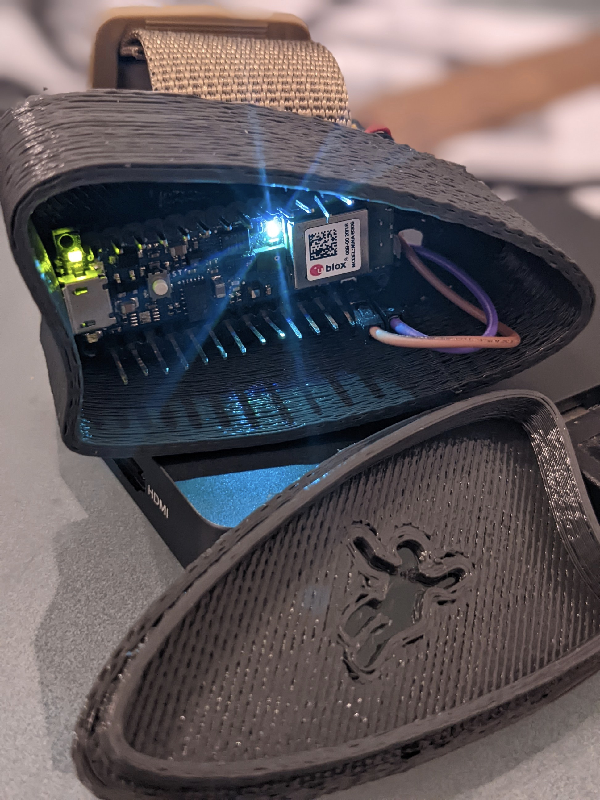
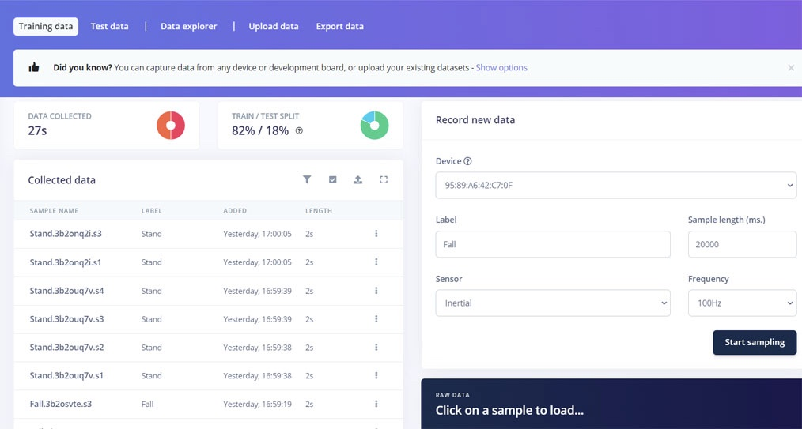
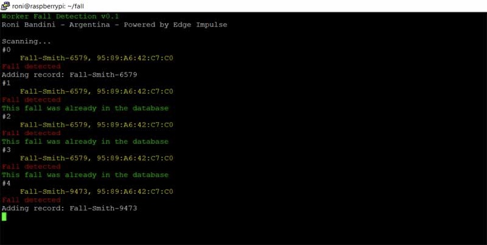
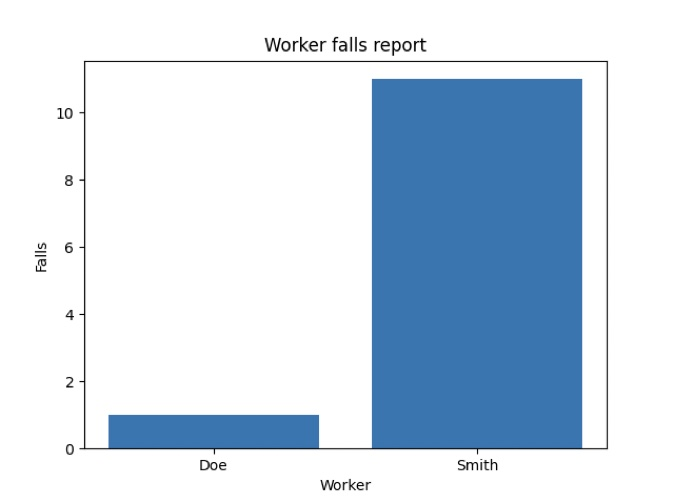

# Bluetooth Fall Detection

Created By: Roni Bandini

Public Project Link: [https://studio.edgeimpulse.com/public/130968/latest](https://studio.edgeimpulse.com/public/130968/latest)

## Project Demo



## Intro

A fall could be dangerous in any situation, but for certain working scenarios, consequences can be very harmful. Therefore, the idea of developing a Machine Learning fall detection and reporting system could be quite useful in some industries.

## How Does it Work?

Each worker has a small TinyML device in charge of detecting falls via the onboard accelerometer data, and reporting to a server through Bluetooth. The server is a Raspberry Pi running a Python script that scans specific BT announcements, parses the fall alert information, and stores it into a SQL Lite database for reports and alerts.

## Client Devices

The electronics part of the client build is easy: just a battery, a TP4056 and the Arduino Nano BLE 33 Sense. The board has an onboard accelerometer, onboard RGB led, and enough processing power to run an Edge Impulse library for inferencing locally.

To add install Edge Impulse Firmware on the Nano 33, simply download the firmware from this link [https://cdn.edgeimpulse.com/firmware/arduino-nano-33-ble-sense.zip](https://cdn.edgeimpulse.com/firmware/arduino-nano-33-ble-sense.zip). Unzip the contents, connect the Arduino to your computer with a microUSB cable, double-click the Reset button on the Arduino, and run `flash_window.bat` from inside the folder (or the Mac or Linux commands if you are on one of those platforms).

If you want to train your own fall model, go to the Edge Impulse Studio and log in, click on Data Acquisition, WebUSB, and choose the Inertial sensor. Obtain 5 minutes of data; Standing normally and Falling Down samples.

Design an Impulse with a 1500ms window size, 150ms window increase, and 100HZ frequency. Add Spectral Analysis with just 3 axis: accx, accy, accz. Choose Keras classification and 2 output features: Stand and Fall. For the Neural Network training, 50 training cycles with a 0.0005 learning rate, Autobalance the dataset, and 20% validation worked fine.

After model testing, go to the Deployment page and export an Arduino Library (which will contain your Machine Learning Model). Then import this library (Zip file) inside the Arduino IDE Sketch by selecting Include, Add Zip.

Once running, every fall is advertised with this format:

`advertiseFall("Fall-"+worker+"-"+String(myCounter));`

For example: **Fall-Smith-1922**

The device will change it's RGB LED from green to red, whenever a fall is detected.

All of the code for this project, including both the Client script file and the Python server files can be downloaded from [this Github link](https://github.com/ronibandini/BTFall).

## Client 3D Printed Case

The device will work without a case of course, but, to make it more convenient to wear and to hold all the pieces in place, two parts should be 3D printed and a strap should be attached. The Gcode files for this particular design can be [downloaded here](https://www.thingiverse.com/thing:5478745).

## Server Setup

The other component we need to build next is the Python and database server, listening for bluetooth data coming from the Arduino. A Raspberry Pi will run the code fine, so, simply install Raspberry Pi OS Lite on an SD Card, boot up, and upload the Python files linked above from the GitHub repo.

Next, create a database structure with:

`$ sudo python3 databaseSetup.py`

Start scanning for bluetooth packets from the Arduino with:

`$ sudo python3 scan.py`

Other scripts included are: `clearDatabase.py` (removes all database records), and `chart.py` (creates a chart rendered from all of the database records).

## Conclusion

In this project, we have demonstrated a simple method for Fall Detection using a client / server system running on an Arduino Nano 33 BLE Sense turned into a wearable device, along with a listening server running on a Raspberry Pi.
