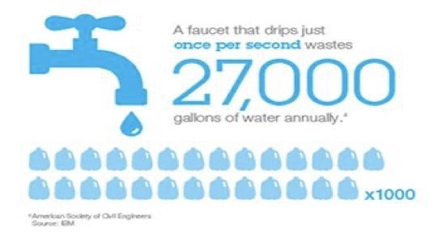
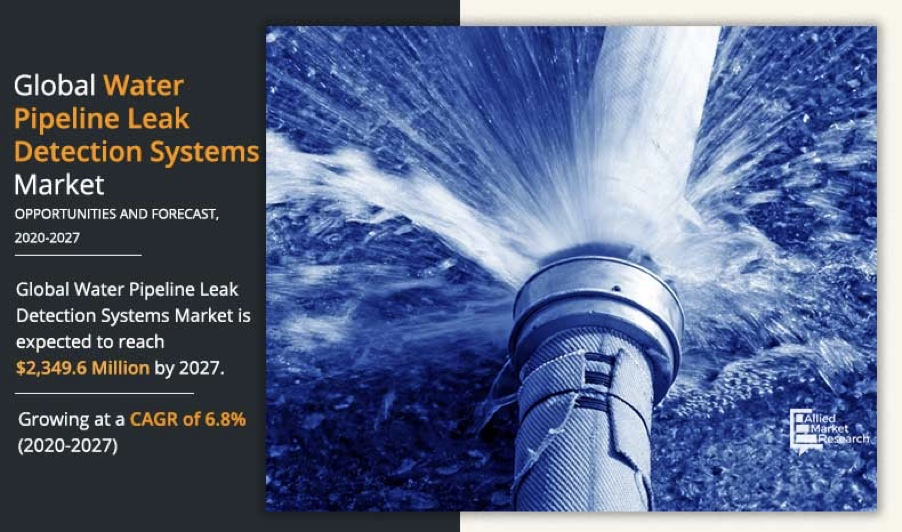
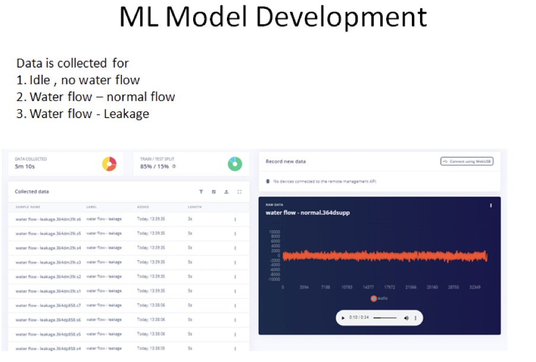
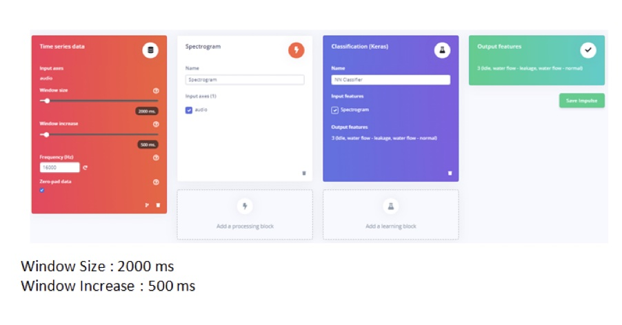
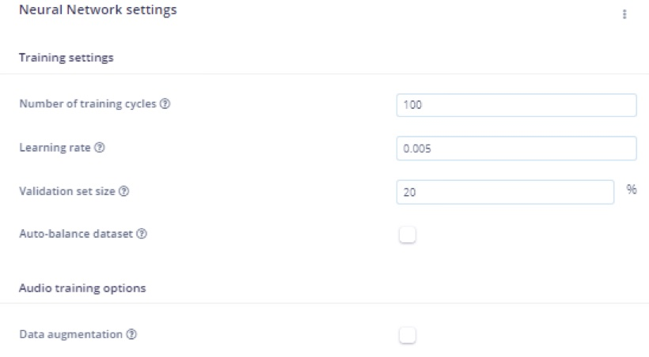
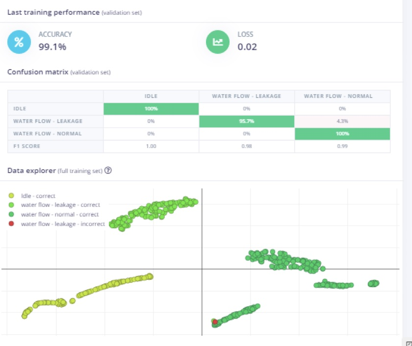
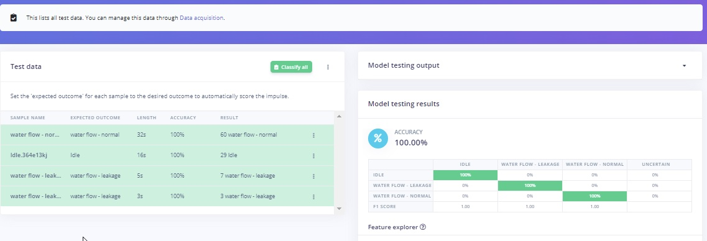
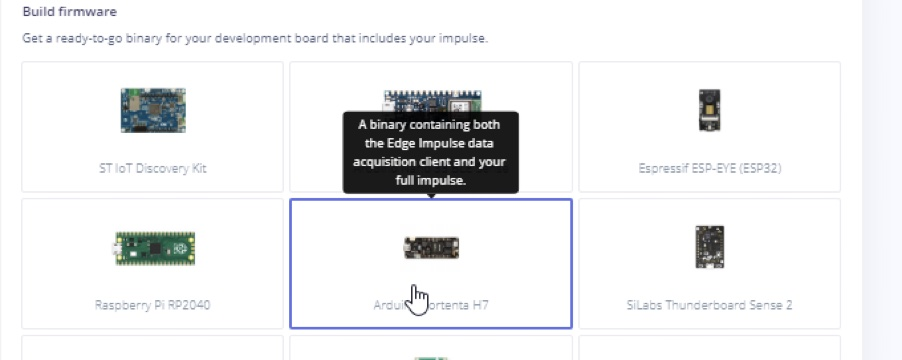
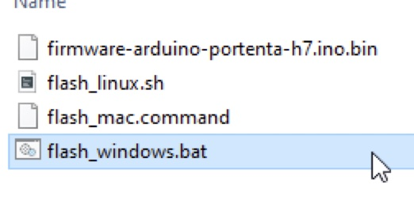

# Acoustic Pipe Leakage Detection - Arduino Portenta H7

Created By: Manivannan Sivan

Public Project Link: [https://studio.edgeimpulse.com/public/111978/latest](https://studio.edgeimpulse.com/public/111978/latest)

## Project Demo



## Impact of Leakages in Pipes

Water is the world's most precious resource, yet it is also the one which is almost universally mismanaged. As a result, water shortages are becoming ever more common. In the case of water supply and distribution networks, these manifest themselves in the intermittent operation of the system. Not only is this detrimental to the structural condition of the pipes, but can also adversely affect the quality of the water delivered to the customer's taps. Further, leakage often exceeds 50% of the production. Not only does this have a significant economic impact, but an environmental one too. But to recover leakage has a cost to undertake a hydraulic study of the network, create a permanent monitoring system, and eliminate the leaks. So how low should leakage go and how can a lower leakage level be maintained over time? This is the objective of the very innovative EU funded PALM project recently completed in central Italy.

### Increase in Carbon Level Due to Water Leakage

There is an increased carbon footprint of having pumps constantly running to make up for the water lost due to leakage. It is the increased pump use, and pump maintenance/replacement costs that increase CO2 in the air from the fossil fuels being burned to support it. According to a study done by Von Sacken in 2001, water utilities are the largest user of electricity accounting for 3% of the total electricity consumption in the US. In addition, it is estimated that 2-3 billion kW/h of electricity is expended pumping water due to leakage.

_Costs, health, the environment, and infrastructure are just a few things that can come into play when water system leakage goes uncorrected._&#x20;

More than 2 billion people globally live in countries with high water stress, per the 2018 statistics provided by the United Nations (UN). In order to tackle this problem, it is necessary to conserve and utilize water safely. Installation of proper water pipeline leak detection systems assist in specifying the leakages in installed water pipes, which ultimately avoids wasting water through cracks and holes. Therefore, the increasing scarcity of water is propelling the demand for water leak solutions, which in turn drives the market.

### Global Market for Pipe Leakage Detection Systems

The global water pipeline leak detection systems market size is expected to reach $2,349.6 million in 2027, from $1,748.6 million in 2019, growing at a CAGR of 6.8% from 2020 to 2027. Water pipeline leak detection systems are utilized to determine the location of the leak in water transmission pipelines. Around 30% to 50% of water is lost through aging pipelines, which also contributes toward loss of revenue. Water pipeline leak detection systems are available for both underground and overground water pipelines to precisely locate and check the severity of pipeline leaks.

On the contrary, in recent years, pipeline leak detection systems have undergone various technological advancements by adoption of computerized systems and digital survey systems. The traditional acoustic detection sensors are upgraded with more efficient sound detection functions which has increased their efficiency. Introduction and implementation of such advanced technologies are likely to create lucrative opportunities for the growth of the water pipeline leak detection systems market during the forecast period.

In recent years, the increase in acoustic-based pipe leakage detection has started increasing due to investment in R\&D.

## A TinyML-based Solution for Pipe Leakage Detection:

In this fast growing sector, TinyML-based systems will play a major role due to low power consumption and developing EdgeML models with more accuracy in predicting leakage detection.

My prototype is based on acoustic data collected on an Arduino Portenta H7 and a model is trained using Edge Impulse. In my prototype, The Arduino Portenta Vision Shield is used because it contains two microphones (MP34DT05) which runs on 16 MHz. The Vision Shield is placed on top of the pipe for data acquisition as the microphone faces the pipe. This will help to collect the noise of the water flowing.

In the data acquisition stage, the pipe is simulated with "Idle" mode, where the tap is fully closed so no water flows, and then slightly opened to simulate "leakage mode". Finally, is it fully opened to simulate "water flow" mode.

## Pre-Processing

In a pre processing stage, the Window size is set as 2000ms and Window increase is set as 500ms.

For Neural Network configuration, I have used couple of 1D-Conv layers followed by DNN layers.

The number of Training cycles is set to 100 and Learning rate is set to 0.005. The accuracy obtained was 99.1 % with loss of 0.02 only. As the model is performing well at classifying the data, we can move on.

## Model Testing

In Model testing, the trained model is tested with data and it is able to predict all 3 conditions we trained on with 100% accuracy.

## Deployment


For initial setup of the Portenta, follow the steps outlined here: [https://docs.edgeimpulse.com/docs/development-platforms/officially-supported-mcu-targets/arduino-portenta-h7](https://docs.edgeimpulse.com/docs/development-platforms/officially-supported-mcu-targets/arduino-portenta-h7)


Then in Deployment section, select Arduino Portenta H7 and download the firmware files to your computer.

Press the Reset button twice on the Portenta to change it to Flash mode. Then run the .bat file if you are on Windows, or the Mac or Linux commands if you are on those platforms.

## Summary

The prototype demonstrated an acoustic method to predict leakage in a pipe. The model was able to determine whether the pipe is in Idle (no water flowing), flowing normally, or if there is a small flow, representing leakage in this case. The use case is simple enough to apply to any industry to monitor the leakages in pipe, though this is of course only a prototype project.

By integrating well-designed enclosures with higher quality microphones, the Arduino Portenta H7 will be ideal for industrial use-cases for pipe leakage detection.

