# Adaptable Vision Counters for Smart Industries 

Created By:
Nekhil R. 

Public Project Link:
[https://studio.edgeimpulse.com/public/126292/latest](https://studio.edgeimpulse.com/public/126292/latest)

## Project Demo




Automatic counting machines are very essential for correct packing in manufacturing industries. Currently, industries count either mechanically or through weight. Mechanical counting is restricted by size and shape of the product and it is often time-consuming.

Weight based counting assumes that each part has the exact same weight and uses a weight average to count. Even the most sophesticated manufacturing systems produce parts with slight variations in size and shape. These are even more pronounced for materials like wood and rubber where density changes up to 50%. In addition to correct packing, these vision based counters will be used to estimate the defective parts in a certain batches of production.

Consider if there are more number of defective parts, we can assume that something might be wrong going in the production units.  These data can also be used to improve the quality of production and thus industry can make more products in less time.  So our adaptable counter are evolving as a solution to the world's accurate and flexible counting needs.

Adaptable counter is a device consisting of RapsberryPi 4 and camera module and the counting process is fully powered by FOMO. So it can count faster and more accurately than any other method. Adaptable counters are integrated with a cool looking website.

## Use cases    

These cases can be applied to anywhere in the industry.

### 1. Counting from the top     

In this case, we are counting the defective and non-defective washers.

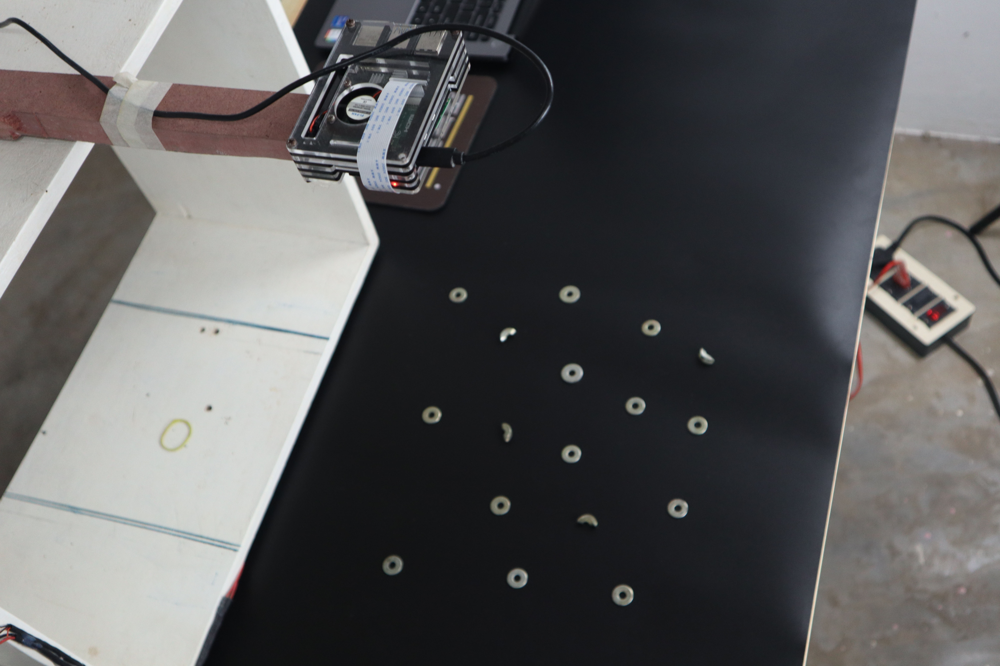

### 2. Counting in Motion    

In this case, we are counting bolts and washers and faulty washers passing through the conveyer belt

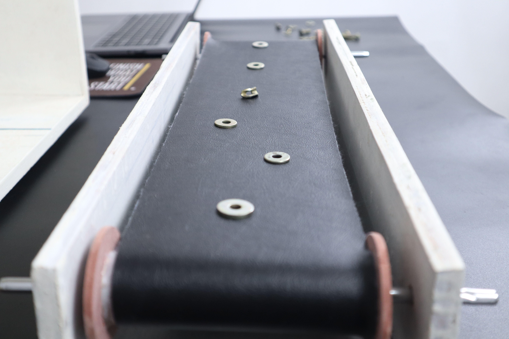

### 3. Counting in a Bunch     

In this case, we are counting the Bunch Lollipop

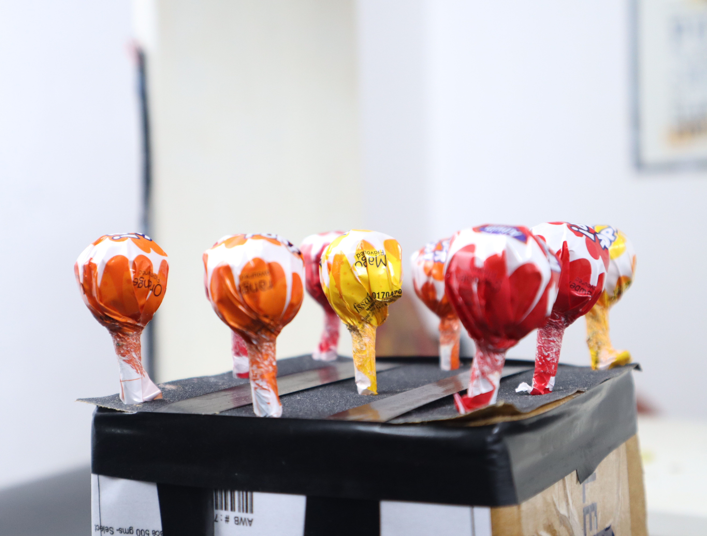

### 4. Multiple Parts Counting

In this case, we are counting the multiple parts such as Washers and Bolts

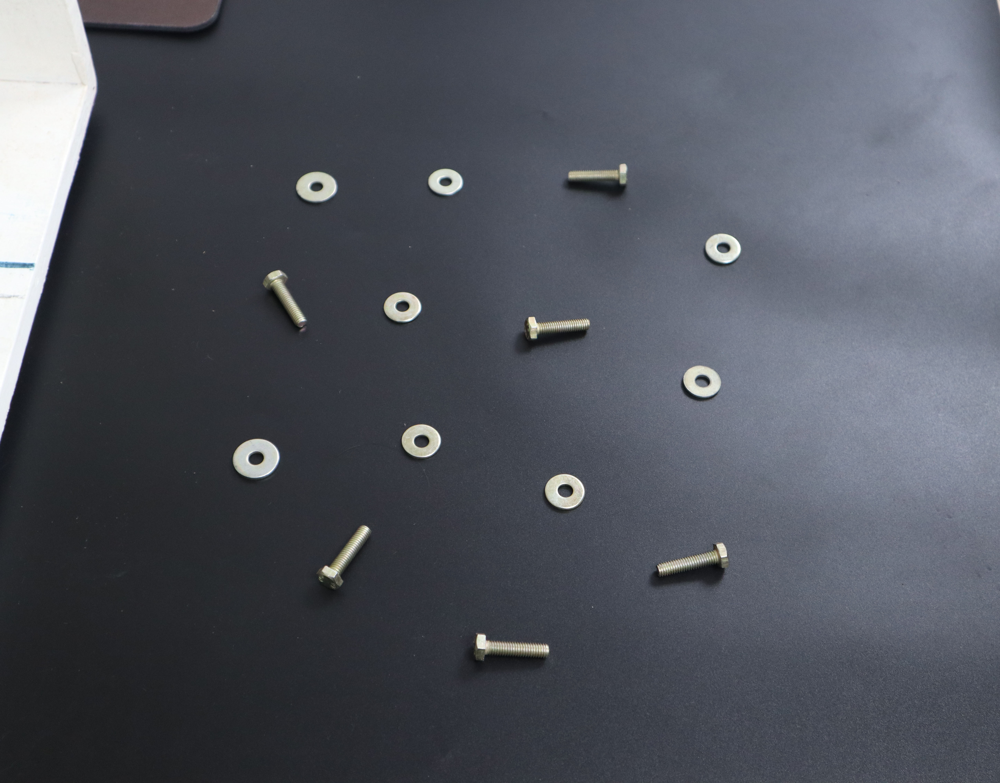

## Software  

## Object Detection Model Training


Edge Impulse is one of the leading development platforms for machine learning on edge devices, free for developers and trusted by enterprises. Here we are using FOMO to build a machine learning model that can recognize the products. Then we deploy the system on the Raspberry Pi 4B.

## Data acquisition

Every machine learining project starts with data collection. A goood collection of data is one of the major factors that influences the performance of the model. Make sure you have a wide range of perspectives and zoom levels of the items that are offered in the stores. You may take data from any device or development board, or upload your own datasets, for data acquisition. As we have our own dataset, we are uploading them using the Data Acquisition tab.

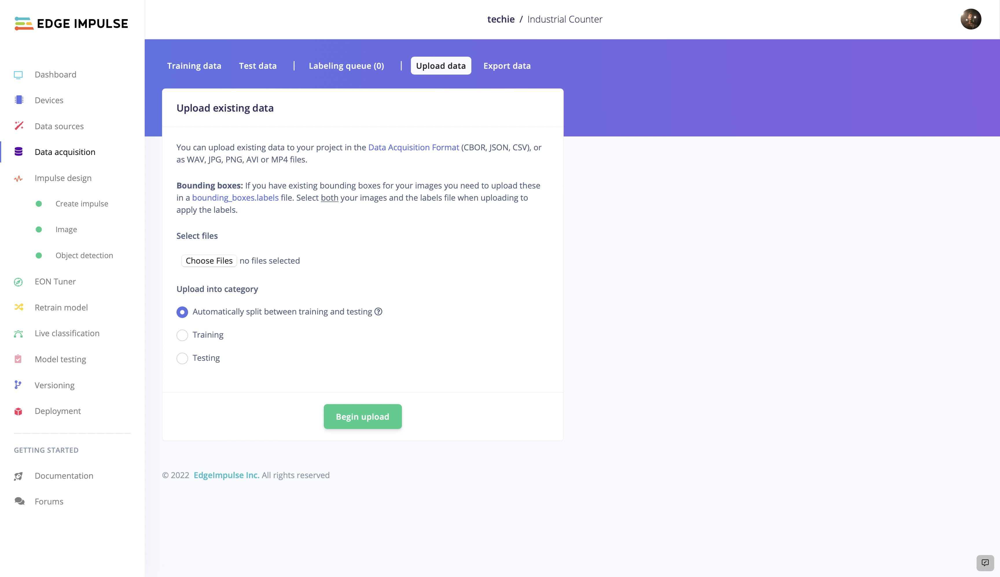

Simply navigate to the Data acquisition tab and select a file to upload. After that, give it a label and upload it to the training area. The Edge Impulse will only accept JPG or PNG image files. Convert it to JPG or PNG format using the internet converters if you have any other formats.

In our case we have four labels - *Washer, Faulty Washer, Lollipop, Bolt*. We have uploaded all the collected data for these four different classes. Therefore, the computer will only recognize these items while counting. You must upload the dataset of other objects if you wish to recognize any more objects except these. The more data that neural networks have access to, the better their ability to recognize the object.

This is our counting setup (Just attached the Adaptable counter on the top of a small wooden plank)


## Labeling Data

You may view all of your dataset's unlabeled data in the labeling queue. Adding a label to an object is as simple as dragging a box around it. We attempt to automate this procedure by running an object tracking algorithm in the background in order to make life a little easier. If you have the same object in multiple photos we thus can move the boxes for you and you just need to confirm the new box. Drag the boxes, then click Save labels. Continue doing this until your entire dataset has been labeled.

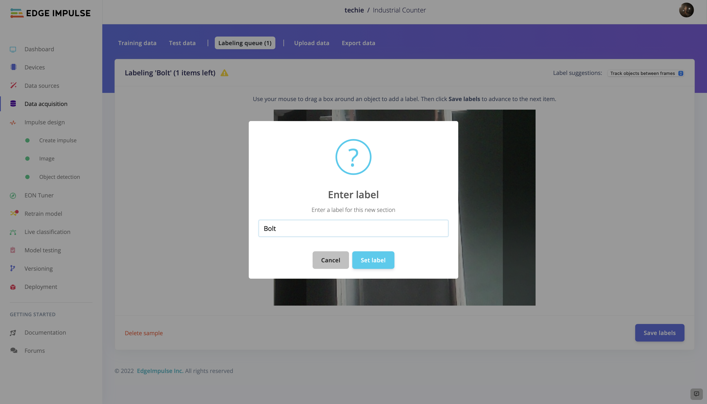

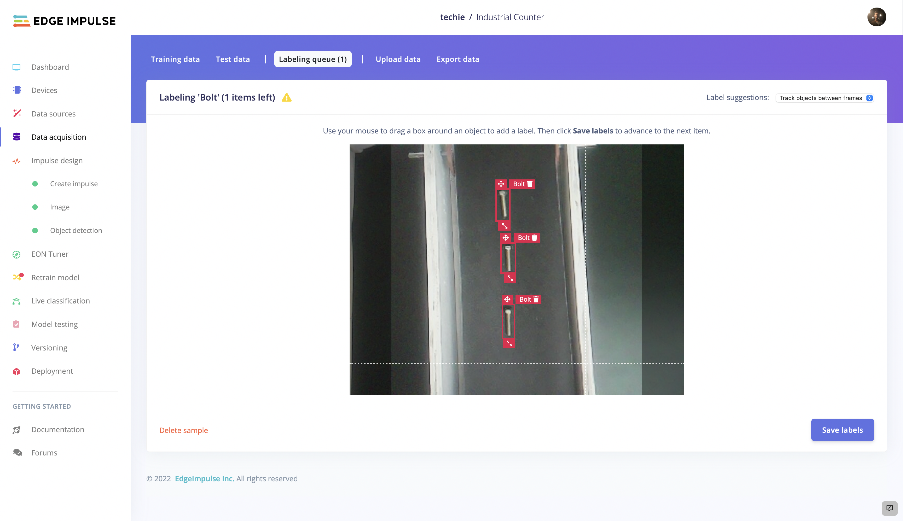

## Designing an Impulse

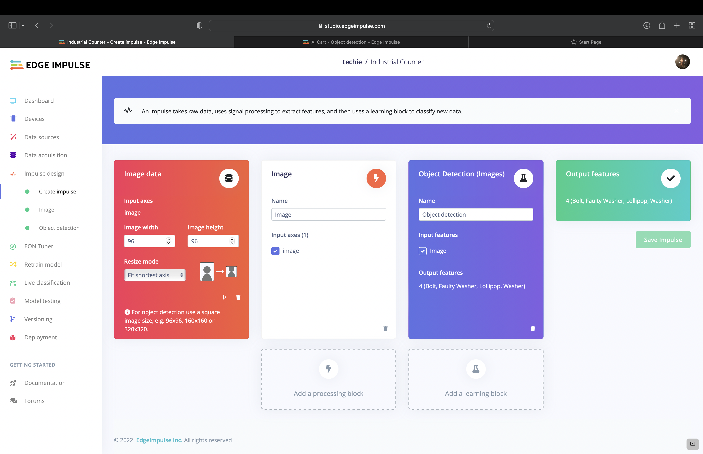

With the training set in place, you can design an impulse. An impulse takes the raw data, adjusts the image size, uses a preprocessing block to manipulate the image, and then uses a learning block to classify new data. Preprocessing blocks always return the same values for the same input (e.g. convert a color image into a grayscale one), while learning blocks learn from past experiences.

For this system, we'll use the 'Images' preprocessing block. This block takes in the color image, optionally makes the image grayscale, and then turns the data into a features array. Then we'll use a 'Transfer Learning' learning block, which takes all the images in and learns to distinguish between the two ('Washer', 'Bolt') classes.

In the studio go to Create impulse, set the image width and image height to **96px**, the **resize mode** to **Fit the shortest axis**, and add the **Images** and **Object Detection (Images)** blocks. Then click Save impulse.

Then in the image tab, you can see the raw and processed features of every image. You can use the options to switch between 'RGB' and 'Grayscale' mode. As we are using **FOMO** change the color depth to **Grayscale** and click Save parameters.

This will send you to the Feature generation screen. Here you'll:
* Resize all the data
* Apply the processing block on all this data.
* Create a visualization of your complete dataset.
* Click Generate features to start the process.

Afterward the **Feature explorer** will load. This is a plot of all the data in your dataset. Because images have a lot of dimensions we run a process called 'dimensionality reduction on the dataset before visualizing this. Here the 307200 features are compressed down to just 3 and then clustered based on similarity. Even though we have little data you can already see the clusters forming and can click on the dots to see which image belongs to which dot.

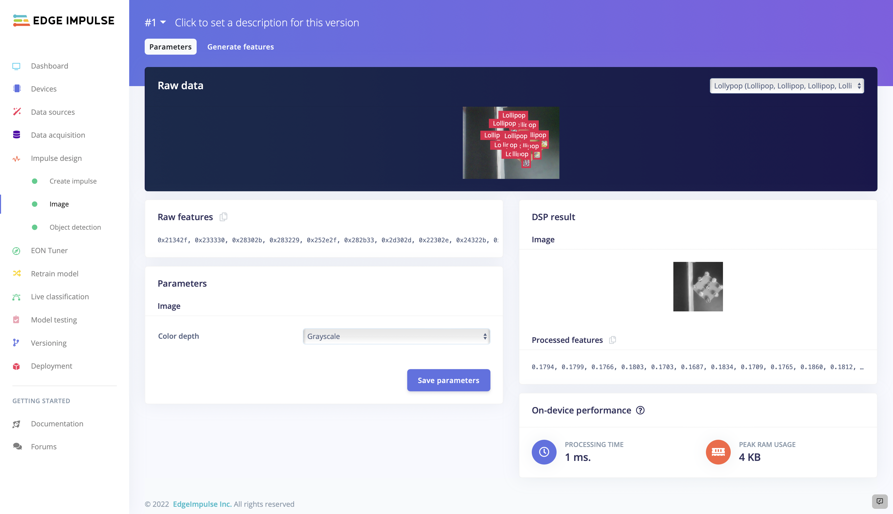

With all data processed it's time to start training a neural network. Neural networks are a set of algorithms, modeled loosely after the human brain, that is designed to recognize patterns. The network that we're training here will take the image data as an input, and try to map this to one of the three classes.

It's very hard to build a good working computer vision model from scratch, as you need a wide variety of input data to make the model generalize well, and training such models can take days on a GPU. To make this easier and faster we are using transfer learning. This lets you piggyback on a well-trained model, only retraining the upper layers of a neural network, leading to much more reliable models that train in a fraction of the time and work with substantially smaller datasets.

To configure the transfer learning model, click Object detection in the menu on the left. Here you can select the base model (the one selected by default will work, but you can change this based on your size requirements), and set the rate at which the network learns.

In this case we are using FOMO algorithm to train the model. So change the object detection model to **FOMO (Faster Objects, More Objects) MobileNetV2 0.35** and change the neural network settings as shown in the image. Now Start training. After the model is done you'll see accuracy numbers below the training output. We have now trained our model with a training accuracy of 96.7%, pretty good.


With the model trained let's try it out on some test data. When collecting the data we split the data up between training and a testing dataset. The model was trained only on the training data, and thus we can use the data in the testing dataset to validate how well the model will work in the real world. This will help us ensure the model has not learned to overfit the training data, which is a common occurrence.

To validate your model, go to **Model testing** and select **Classify all**. Here we hit 87.5% accuracy, which is great for a model with so little data.

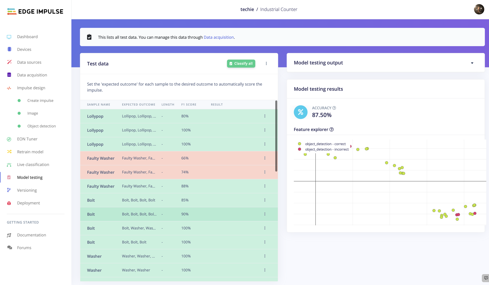

To see classification in detail, click the three dots next to an item, and select Show classification. This brings you to the Live classification screen with much more details on the file (you can also capture new data directly from your development board from here). This screen can help you determine why items were misclassified.

With the impulse designed, trained, and verified you can deploy this model back to your device. This makes the model run without an internet connection, minimizes latency, and runs with minimum power consumption. Edge Impulse can package up the complete impulse - including the preprocessing steps, neural network weights, and classification code - in a single C++ library or model file that you can include in your embedded software. 


### Firebase (set-up)       

Firebase is a mobile and web application development platform. Firebase frees developers to focus on crafting fantastic user experiences. You don’t need to manage servers. You don’t need to write APIs. Firebase is your server, your API, and your data store, all written so generically that you can modify it to suit most needs. In our project, we use Firebase real-time database to instantly post and retrieve data so that there is no time delay.

For installing the pyrebase, run the following command:
`pip install pyrebase`
    
Pyrebase is written for Python 3 and may not work correctly with Python 2.

First we created a project in the database

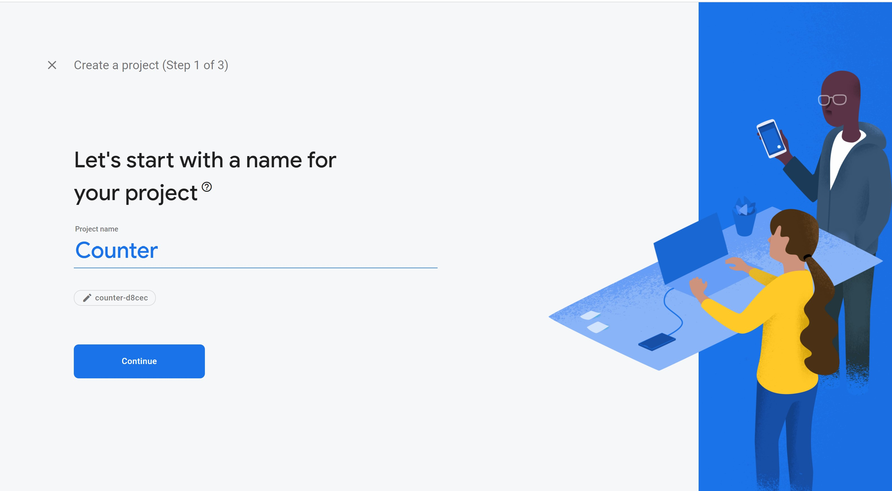

Then head over to the Build section and create a realtime database

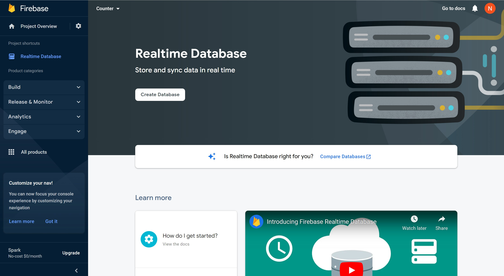

Then select the test mode, so we can update the data without any authentication

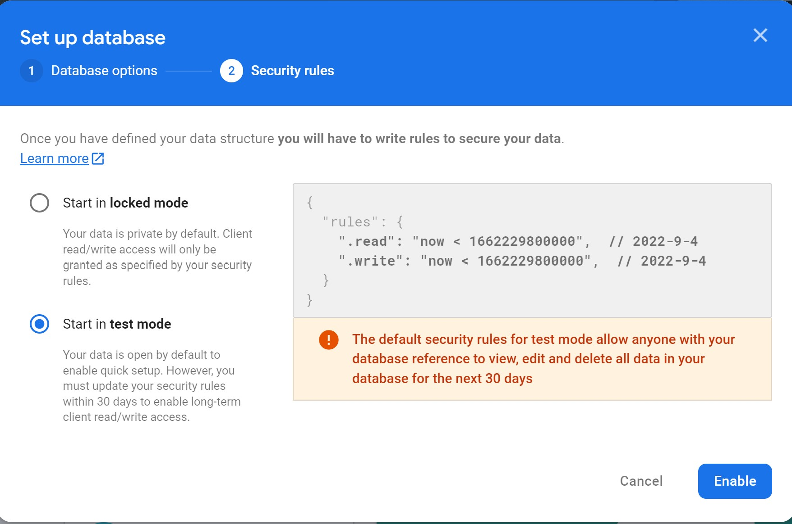

This is our realtime database:

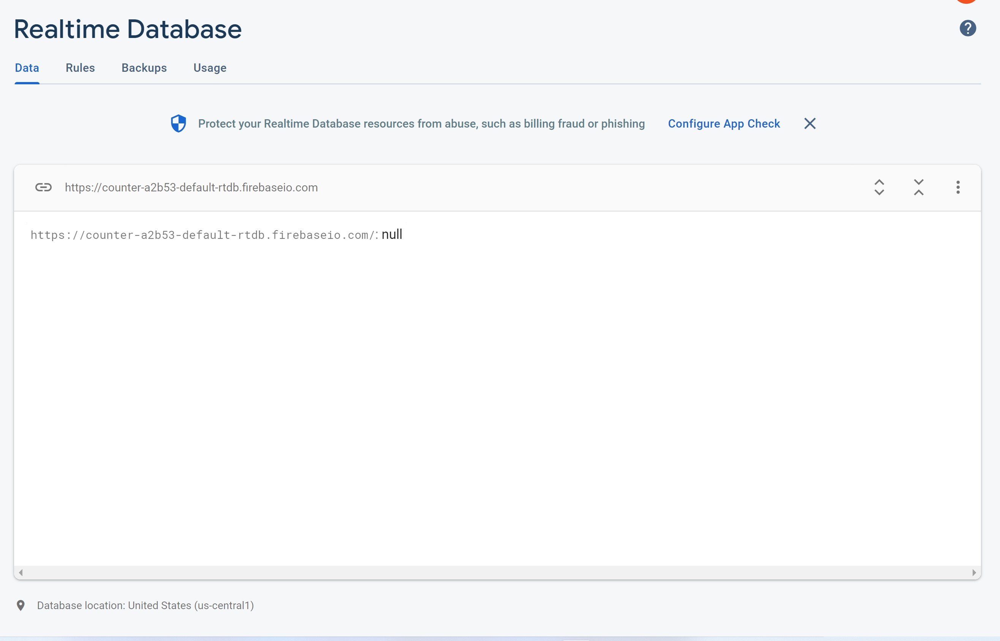

For use with only user based authentication we can create the following configuration and that should be added in our Python code

```json
import pyrebase
config = {
  "apiKey": "apiKey",
  "authDomain": "projectId.firebaseapp.com",
  "databaseURL": "https://databaseName.firebaseio.com",
  "storageBucket": "projectId.appspot.com"
  }
firebase = pyrebase.initialize_app(config)
```

Then add the apikey, authDomain and databaseURL (You can find all these in project settings). Then we can store the values in the realtime database.

### Website

A webpage is created using HTML, CSS and JS to display the count in realtime. The data updated in the Firebase is reflected in the webpage in realtime. The webpage displays **Recent Count** when the counting process is halted and displays **Current Count** whenever the counting process is going on.

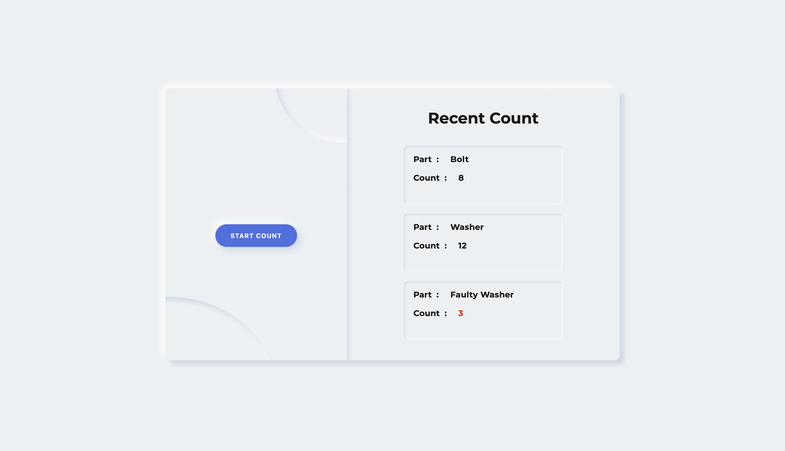


## Code  

The entire code and assets are given in the [GitHub repository](https://github.com/CodersCafeTech/Adaptable-Industrial-Counter.git).

## Hardware   

### Raspberry Pi 4B

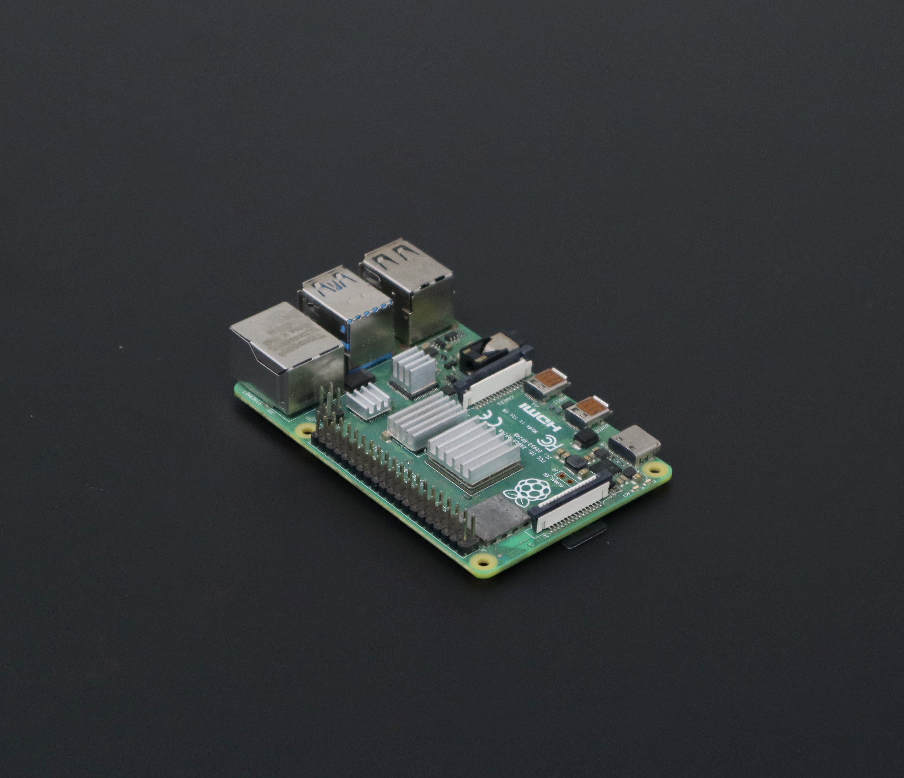

The Raspberry Pi4 B is the brain of the system.This Raspberry Pi 4 is integrated with a 64 bit quad-core Cortex-A72 ARMv8, Broadcom BCM2711 and runs at a speed of 1.5GHz. So the counting can be done in an efficient way.

This tiny computer is fully supported by Edge Impulse.  For setting up the Raspberry Pi with the Edge Impulse please have a look [here](https://docs.edgeimpulse.com/docs/development-platforms/officially-supported-cpu-gpu-targets/raspberry-pi-4).

### Camera Module

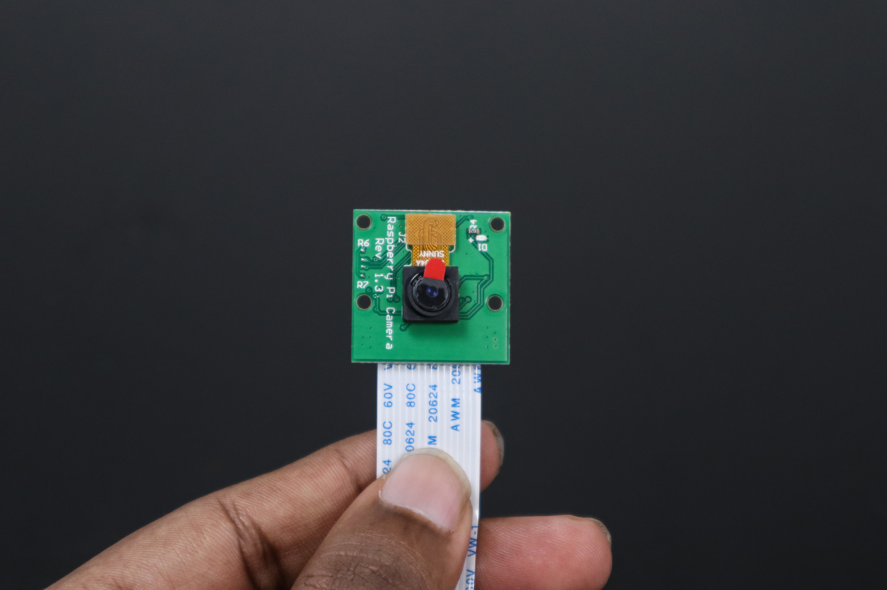

This Raspberry Pi Camera Module is a custom-designed add-on for Raspberry Pi. It attaches to Raspberry Pi by way of one of the two small sockets on the board's upper surface. This interface uses the dedicated CSI interface, which was designed especially for interfacing with cameras. The CSI bus is capable of extremely high data rates, and it exclusively carries pixel data.

The board itself is tiny, at around 25mm x 23mm x 8mm. It also weighs just over 3g, making it perfect for mobile or other applications where size and weight are important. It connects to Raspberry Pi by way of a short flexible ribbon cable. The camera connects to the BCM2835 processor on the Pi via the CSI bus, a higher bandwidth link that carries pixel data from the camera back to the processor. This bus travels along the ribbon cable that attaches the camera board to the Pi.

The sensor itself has a native resolution of 5 megapixels and has a fixed focus lens onboard. In terms of still images, the camera is capable of 2592 x 1944 pixel static images, and also supports 1080p30, 720p60 and 640x480p60/90 video.  This is well enough for our application.

### Power adapter 


For powering up the system we used 5V 2A adapter. In this case we don't have any power hungry peripherals, so 2A current is enough. If you have 3A supply, please go for that.

For the sake of convienence we also used a acrylic case for setting up all the hardware.
