---
description: Using a RISC-V powered Sipeed Longan Nano to monitor air quality and alert the presence of harmful gases.
---

# Air Quality Monitoring with Sipeed Longan Nano - RISC-V Gigadevice 

Created By:
[Zalmotek](https://zalmotek.com) 

Public Project Link:

[https://studio.edgeimpulse.com/public/110000/latest](https://studio.edgeimpulse.com/public/110000/latest)

GitHub Repository:

[https://github.com/Zalmotek/EdgeImpulse_air_quality_monitoring_with_SIPEED_LONGAN_NANO_RISC-V_Gigadevice](https://github.com/Zalmotek/EdgeImpulse_air_quality_monitoring_with_SIPEED_LONGAN_NANO_RISC-V_Gigadevice)



## Introduction

Poor air quality in industrial environments can reduce productivity and raise the risk of accidents. That's why it's critical for industrial facilities to regularly evaluate air quality, guaranteeing that their staff is healthy and productive by doing so. Typical Air Quality dimensions that must be monitored include CO, CO2, H2, volatile organic compounds (VOC), and volatile sulphuric compounds, depending on the specific activity that is taking place within the facility.

Moreover, managers may ensure that workers stay healthy at work by establishing suitable ventilation systems that reduce outside pollution to levels that are not harmful to employees while still keeping interior settings clean. When stated concentrations surpass a specific level, a traditional Air Quality monitoring system will sound an alarm. The downside of such a system is that it will only react **after** the threshold is surpassed, warning employees that they **have been** exposed to the harmful substance for a period of time.

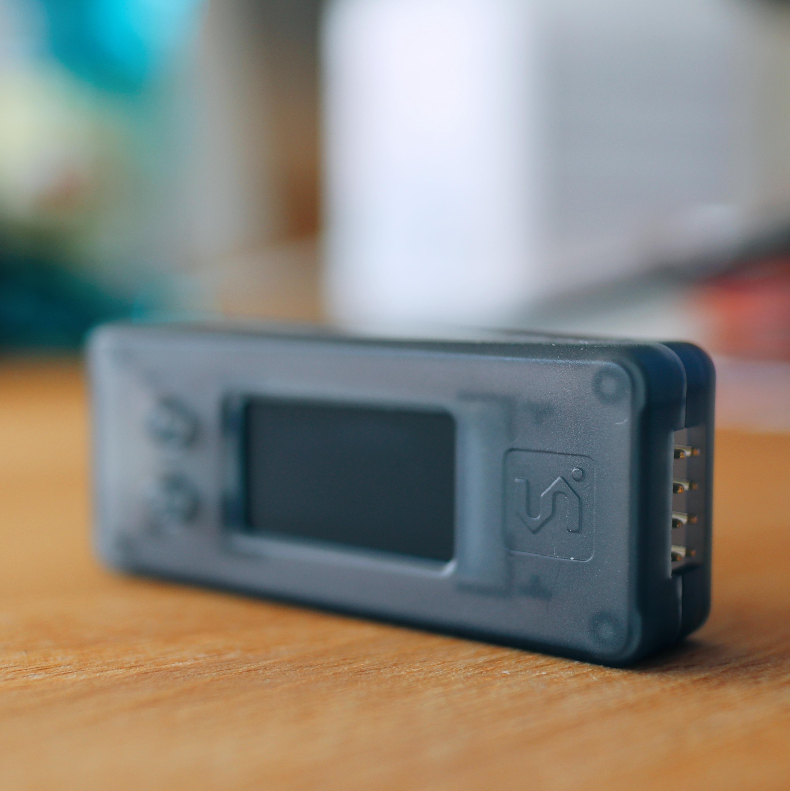

## Our Solution

We have developed a prototype that uses a Sipeed Longan Nano V1.1 with a RISC-V Gigadevice microprocessor and gas sensors to detect trends in the variation of air quality dimensions by creating a Machine Learning model in Edge Impulse and deploying it on the device to trigger an alarm if they are headed towards a critical level. This will allow for swift intervention to prevent the air quality from reaching hazardous levels.

## Hardware Requirements

- [SIPEED LONGAN NANO V1.1 - RISC-V](https://www.digikey.com/en/products/detail/seeed-technology-co-ltd/102991574/15277447)
- [Adafruit MiCS5524 CO, Alcohol and VOC Gas Sensor Breakout](https://www.adafruit.com/product/3199)
- [MQ-3 - Alcohol Sensor](https://components101.com/sensors/mq-3-alcohol-gas-sensor)
- [MQ-5 METHANE GAS SENSOR MODULE](https://www.smart-prototyping.com/MQ-5-Methane-Gas-Sensor-Module.html)
- [MQ-7 Gas Sensor - Carbon Monoxide](https://www.waveshare.com/mq-7-gas-sensor.htm)
- [USB to TTL Serial Cable](https://www.sparkfun.com/products/12977)

## Software Requirements

- Edge Impulse account
- Virtual Studio Code with PlatformIO addon
- Edge Impulse CLI
- Udev rule ( for Linux Users)

## Hardware Setup

The Sipeed Longan Nano v1.1 is an updated development board based on the Gigadevices GD32VF103CBT6 MCU chip. The board has a built-in 128KB Flash and 32KB SRAM, providing ample space for students, engineers, and geek enthusiasts to tinker with the new-generation RISC-V processors. The board also features a micro USB port, allowing users to easily connect the board to their computer for programming and debugging. In addition, the board has an on-board JTAG interface, making it easy to work with various development tools. Overall, the Sipeed Longan Nano v1.1 is a convenient and affordable option for those who want to explore the world of RISC-V processors. Besides the programming ports and IOs, the development board includes two user-customizable buttons and a small screen making debugging and real-time information really easy to show locally. 

The GD32VF103 is a 32-bit general-purpose microcontroller based on a RISC-V core that offers an excellent blend of processing power, low power consumption, and peripheral set. This device operates at 108 MHz with zero wait states for Flash accesses to achieve optimum efficiency. It has 128 KB of on-chip Flash memory and 32 KB of SRAM memory. Two APB buses link a wide range of improved I/Os and peripherals. The device has up to two 12-bit ADCs, two 12-bit DACs, four general 16-bit timers, two basic timers, as well as standard and advanced communication interfaces: up to three SPIs, two I2Cs, three USARTs, two UARTs, two I2Ss, two CANs, and a USBFS. An Enhancement Core-Local Interrupt Controller (ECLIC), SysTick timer, and additional debug features are also intimately tied with the RISC-V processor core.

The gadgets require a 2.6V to 3.6V power source and can function in temperatures ranging from –40°C to +85 °C. Several power-saving modes allow for the optimization of wakeup latency and power consumption, which is an important factor when creating low-power applications.

The GD32VF103 devices are well-suited for a broad range of linked applications, particularly in industrial control, motor drives, power monitor and alarm systems, consumer and portable equipment, POS, vehicle GPS, LED display, and so on.

**Features**

- Memory configurations are flexible, with up to 128KB on-chip Flash memory and up to 32KB SRAM memory.
- A wide range of improved I/Os and peripherals are linked to two APB buses.
- SPI, I2C, USART, and I2S are among the many conventional and sophisticated communication interfaces available.
- Two 12-bit 1Msps ADCs with 16 channels, four general-purpose 16-bit timers, and one PWM advanced timer are included.
- Three power-saving modes optimize wakeup latency and energy usage for low-power applications.

More information about this and other GD32 RISC-V Microcontrollers can be found on the [official product page](https://www.gigadevice.com/products/microcontrollers/gd32/risc-v). 

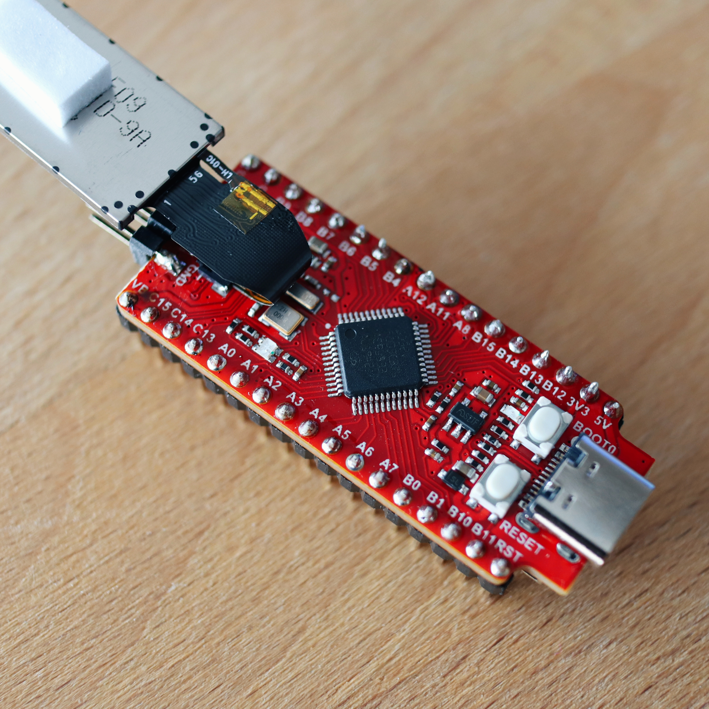

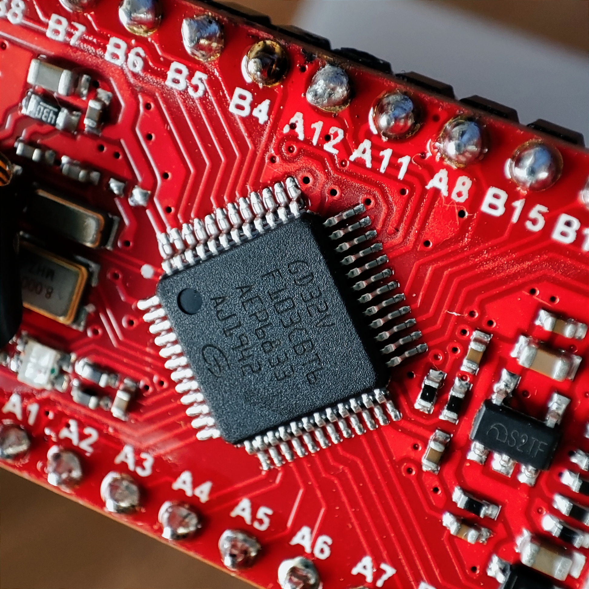

To keep everything tidy, we have designed and 3D printed support for the development board and the sensor combo. If you have a 3D printer, you can [download the files](https://www.myminifactory.com/object/3d-print-edge-impulse-longan-nano-support-228922) and print it without supports.



### Sensors

Gas sensors are electronic devices that detect and identify different types of gasses. There are a few different ways that gas sensors work but the most common type of gas sensor uses electrochemical cells. This type of sensor creates a small voltage when it comes into contact with certain gasses which is then used to identify the presence and concentration of the gas.

The MQ gas sensor series are based on the Metal Oxide Semiconductor (MOS) technology, and they function by measuring the change in electrical resistance of a metal oxide film when it is exposed to certain gasses. They have been used by makers for quite a while now, and that is advantageous because they are easy to read (most of the time just an analog pin will suffice) and the options of tracked gasses are quite diverse.

Here are the variants we found so far, so you can mix and match them for your own use case:

```
MQ-2 - Methane, Butane, LPG, smoke
MQ-3 - Alcohol, Ethanol, smoke
MQ-4 - Methane, CNG Gas
MQ-5 - Natural gas, LPG
MQ-6 - LPG, butane gas
MQ-7 - Carbon Monoxide
MQ-8 - Hydrogen Gas
MQ-9 - Carbon Monoxide, flammable gasses
MQ131 - Ozone
MQ135 - Air Quality (CO, Ammonia, Benzene, Alcohol, smoke)
MQ136 - Hydrogen Sulfide gas
MQ137 - Ammonia
MQ138 - Benzene, Toluene, Alcohol, Acetone, Propane, Formaldehyde gas, Hydrogen
MQ214 - Methane, Natural gas
```

For our proof of concept we decided to go with a few MQ sensors, and another one from Adafruit that is actually covering a broader range of gasses with just one sensor.

#### Adafruit MiCS5524 CO, Alcohol, and VOC Gas Sensor

The MiCS-5524 SGX Sensortech is a robust MEMS sensor for detecting indoor carbon monoxide and natural gas leaks, as well as indoor air quality monitoring, breath checker, and early fire detection. This sensor detects CO (1-1000 ppm), Ammonia (1-500 ppm), Ethanol (10-500 ppm), H2 (1-1000 ppm), and Methane/Propane/Iso-Butane (1,000++ ppm), but it cannot tell which gas it has identified. When gasses are identified, the analog voltage rises in accordance with the amount of gas detected. When turned on, the heater consumes around 25-35mA. To save energy, use the EN pin to turn it off (bring it high to 5V to switch off). Simply wait for a second after turning on the heater to ensure that it is fully heated before obtaining readings.

#### MQ-3 Alcohol Sensor

This sensor can detect Alcohol, Benzine, Methane (CH4), Hexane (C₆H₁₄), Liquefied Petroleum Gas (LPG), and Carbon Monoxide (CO), but it has a much higher sensitivity to alcohol than to Benzine.

#### MQ-5 Methane Gas Sensor Module

This sensor can detect Hydrogen (H2), Liquefied Petroleum Gas (LPG), Methane (CH4), Carbon Monoxide (CO), and Alcohol.

#### MQ-7 Carbon Monoxide Sensor

This sensor can detect Carbon Monoxide (CO).

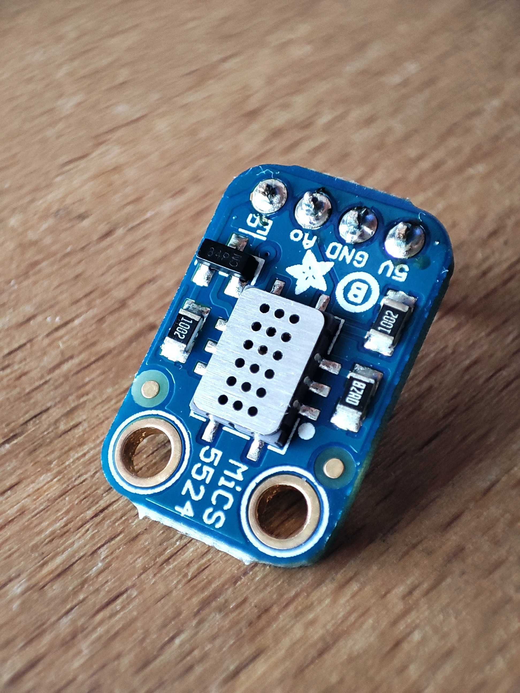

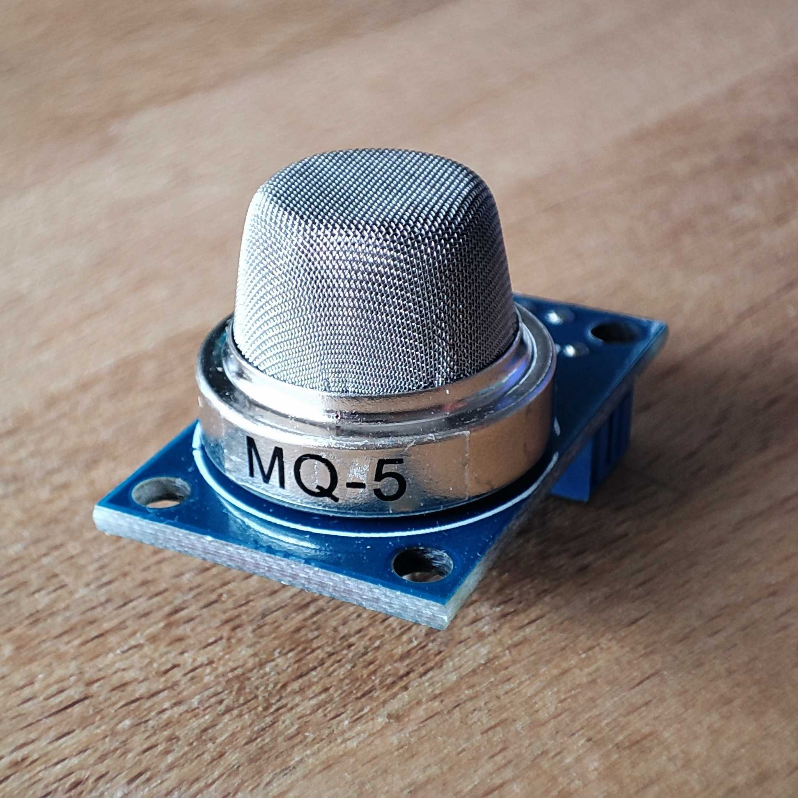

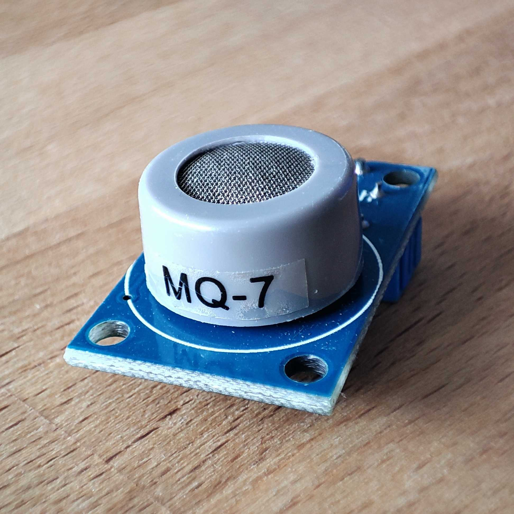

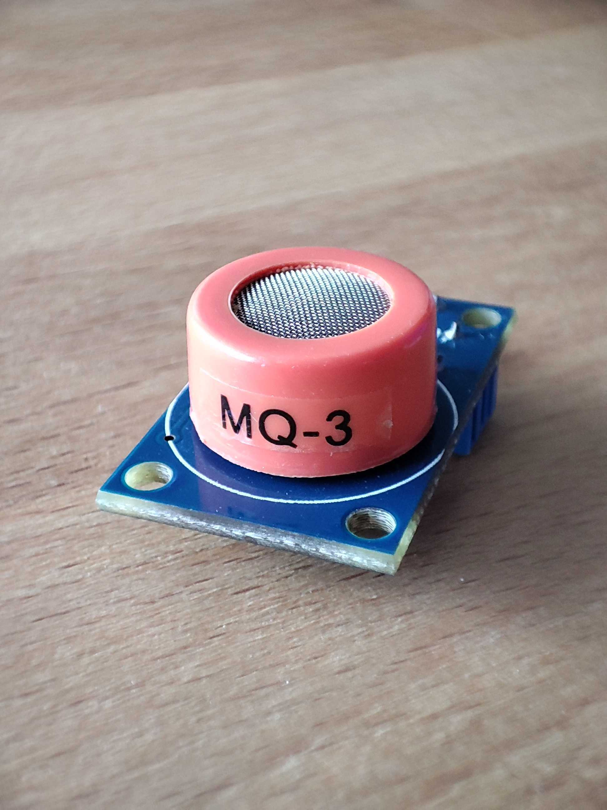

### Wiring

All of the sensors map the concentration of the measured gasses to an analog voltage and have to be powered from 3.3 VDC. The following table presents the wiring connections and the schematic depicts the pinout of the Sipeed Longan Nano V1.1.

Sensors --> Board
GND (all sensors) --> GND
VCC (all sensors) --> 3.3V
AO (MQ-3) --> PB1
AO (MQ-5) --> PA7
AO (MQ-8) --> PB0
AO (MiCS 5524) --> PA6



To debug the Longan Nano, we must use a USB to TTL adapter. This will allow us to establish serial communication with the development board and forward the incoming messages to the Edge Impulse platform. You’ll have to wire the board to the adapter as described in the following table.

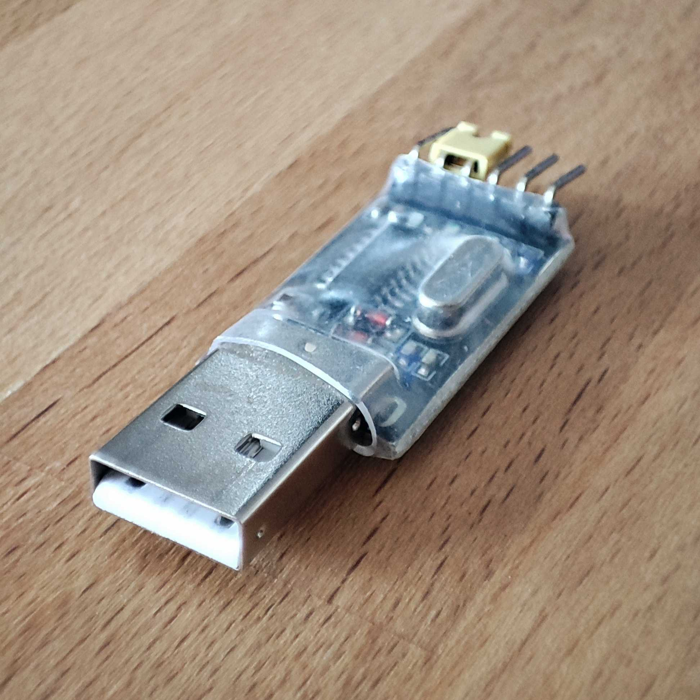

TTL to USB Converter --> Longan Nano
GND --> GND
TX --> RX
RX --> TX

## Software Setup

### Edge Impulse CLI Installation

The Edge Impulse CLI is a suite of tools that enables you to control local devices, synchronize data for devices without an internet connection, and most importantly, collect data from a device over a serial connection and forward it to the Edge Impulse Platform.

Edge Impulse provides comprehensive official documentation regarding the [installation process](https://docs.edgeimpulse.com/docs/edge-impulse-cli/cli-installation) of the Edge Impulse CLI tools.

Let's move on to setting up our development environment.

### PlatformIO Configuration

To program the Sipeed Longan Nano development board we will employ the PlatformIO addon for VS Code, an open-source ecosystem for IoT development. It includes a cross-platform build system, a package manager, and a library manager. It is used to develop applications for various microcontrollers, including the Arduino, ESP8266, Raspberry Pi, and, relevant for our use case, Gigadevice. PlatformIO is released under the permissive Apache 2.0 license, and it is available for a variety of operating systems, including Windows, macOS, and Linux. 

1. Install Visual Studio Code: [https://code.visualstudio.com](https://code.visualstudio.com)

2. Open VSCode, go to Extensions (on the left menu), search for PlatformIO IDE, and install the plugin. Wait for the installation to complete and restart VSCode.

3. Install the GD32V platform definition - click on the PlatformIO logo on the left, click on New Terminal at the bottom left, and execute the following installation command in the terminal window: 

```
platformio platform install gd32v
```

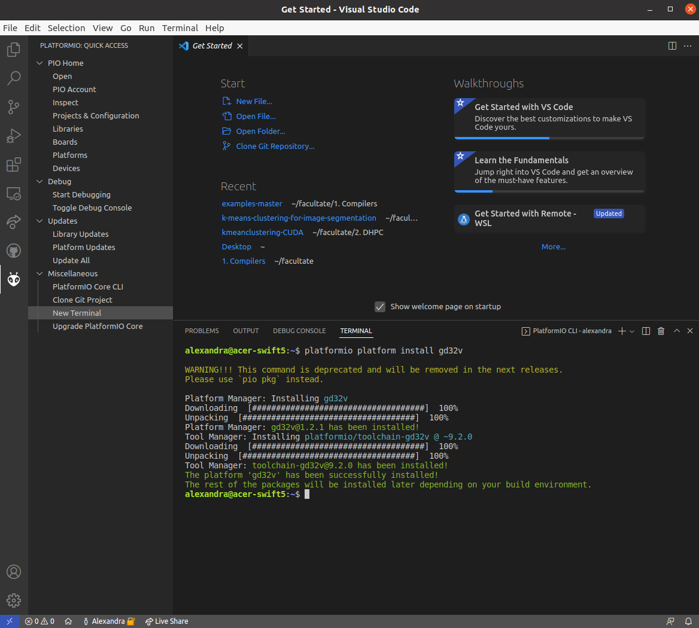

If you are a Linux user, you must also install `udev` rules for PlatformIO supported boards/devices. You can find a comprehensive guide about how to do that in the [official PlatformIO documentation](https://docs.platformio.org/en/latest//core/installation/udev-rules.html#platformio-udev-rules). 

### Data Acquisition Firmware

With PlatformIO set up, clone the following [GitHub repository](https://github.com/Zalmotek/EdgeImpulse_air_quality_monitoring_with_SIPEED_LONGAN_NANO_RISC-V_Gigadevice) in your default projects folder.

Click on Files, Open folder, select [LonganAnalogRead](https://github.com/Zalmotek/EdgeImpulse_air_quality_monitoring_with_SIPEED_LONGAN_NANO_RISC-V_Gigadevice/tree/main/LonganAnalogRead) and open it. 

To program the Longan Nano, we have used an [Arduino Framework](https://github.com/scpcom/Longduino) branched off from the official Sipeed documentation, developed and maintained by **scpcom**, available on GitHub. 

```
#include <Arduino.h>

int MiCs = PA6; 
int MQ5 = PA7; 
int MQ7 = PB0; 
int MQ3 = PB1; 

int valMiCs = 0; 
int valMQ5 = 0;
int valMQ7 = 0; 
int valMQ3 = 0; 

void setup() {
  Serial.begin(115200);          
}

void loop() {
  valMiCs = analogRead(MiCs);  
  valMQ5 = analogRead(MQ5);
  valMQ7 = analogRead(MQ7); 
  valMQ3 = analogRead(MQ3); 
  Serial.print(valMiCs);
  Serial.print(",");
  Serial.print(valMQ5);
  Serial.print(","); 
  Serial.print(valMQ7);
  Serial.print(",");  
  Serial.println(valMQ3);          
}
```

Fundamentally, what this firmware does is read the gas sensors wired up to analog pins PA6, PA7, PB0, and PB1 and prints them on a 115200 baud rate serial, separated by comma.

To read the serial output, we have used Picocom, a terminal emulation program.  To open up the serial console, run the following command in terminal:

`picocom -b 115200 -r -l /dev/ttyUSB0`

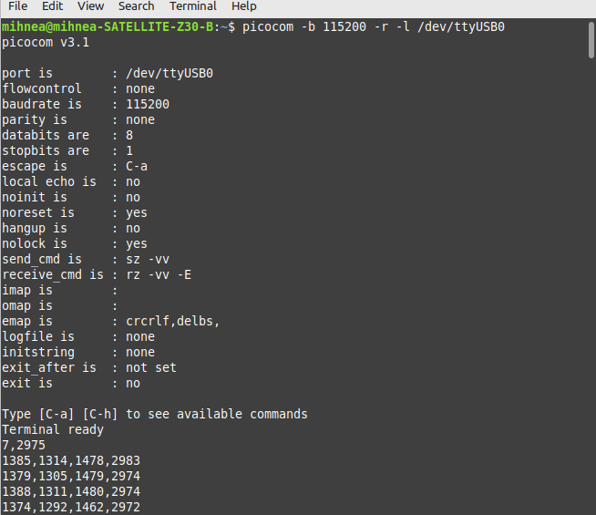

To exit Picocom, press **CTRL+a** followed by **CTRL+q**.

The serial port might not be the same for you but by running the following command, you can find out the correct serial port:

`dmesg | grep tty`

After we see a properly formatted output in the serial terminal, we must forward it to the Edge Impulse platform.

### Creating an Edge Impulse Project

The first step towards building your TinyML Model is creating a new Edge Impulse Project. Be sure to give it a recognizable name, select Developer as your project type, and click on Create new project.

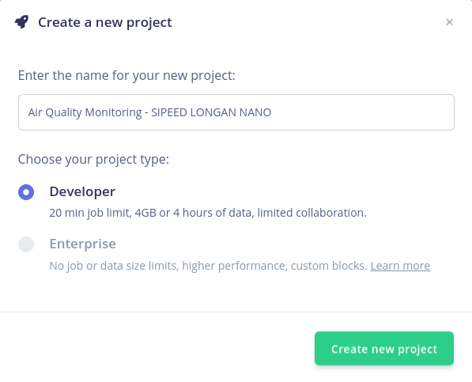

### Forwarding Data via Serial Communication

To assign the device to the newly created Edge Impulse project, run the following command: 

`edge-impulse-data-forwarder -clean`

You will be prompted to fill in the email address and password used to access your Edge Impulse account. The CLI will auto-detect the data frequency and then prompt you to name the sensor axes, corresponding to each measurement and then give a fitting name to the device.

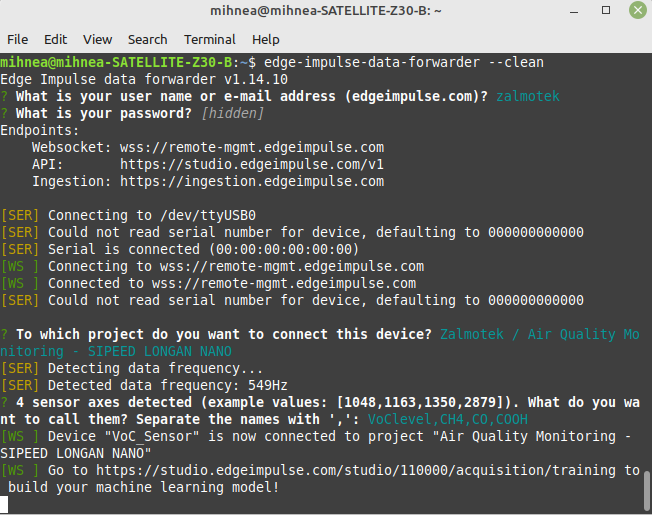

If you navigate to the **Devices** tab, you will see your newly defined device with a green marker next to it, indicating that it is online and ready for data acquisition.



### Acquiring Training Data

For this particular use case, we will be training a model to detect 2 dangerous situations that may occur in an automobile painting facility: an alcohol leakage and a methane gas leakage. Both of those can be dangerous and hazardous to employees' health.

Navigate to the **Data Acquisition** screen. Notice that on the right side of the screen the device is present, with the 4 axes we have previously defined in the terminal and the auto-detected data acquisition frequency. Select a sample length of 10 seconds, give the label a name, and **Start sampling**. 

When building the dataset, keep in mind that machine learning leverages data, so when creating a new class (defined by a label), try to record at least 2-3 minutes of data.

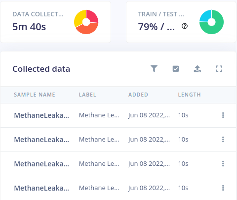

After a sample is collected successfully, it will be displayed in the raw data tab.

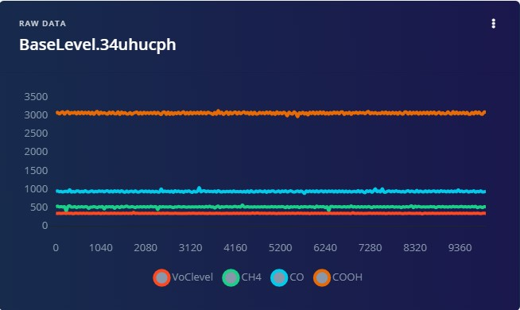

Also, remember to collect some samples for the **Testing** data set in order to ensure a distribution of at least 85%-15% distribution between the Training and Testing set sizes.

### Designing an Impulse

After the data collection phase is over, the next step is to create an Impulse. An Impulse takes raw data from your dataset, divides it into digestible chunks called "windows," extracts features using signal processing blocks, and then uses the learning block to classify new data.

For this application, we are going to use a 1 second window, at a data acquisition frequency of 10 Hz and with the Zero-pad data option checked. We will be using a Flatten processing block, that is fitting for slow-moving averages and a Classification (Keras) as a learning block.

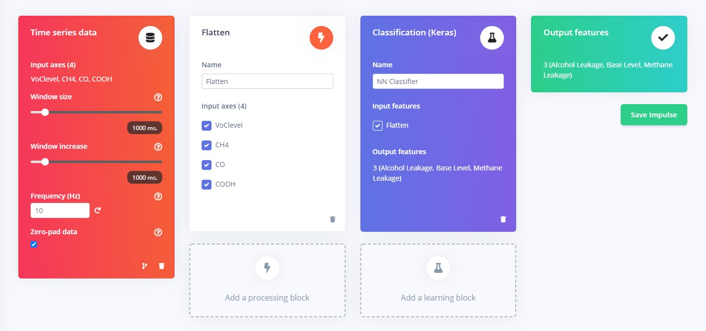

### Configuring the Flatten DSP Block

Configuring the Flatten block is a straightforward procedure. Leave all the methods checked and the scale axes to default 1 and click on **Save Parameters**. 

Fundamentally, what the Flatten block does is, if the value of Scale Axes is less than 1, the Flatten block rescales the signal's axes first. Then, depending on the number of methods chosen, statistical analysis is done on each window, computing between 1 and 7 characteristics for each axis.

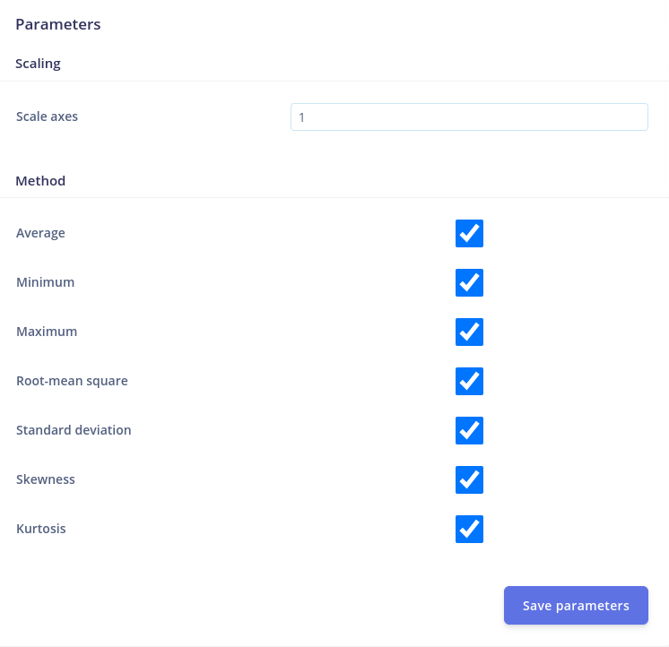

### Configure the NN Classifier Learning Block

Under the **Impulse Design** menu, the **NN Classifier** tab allows us to define several parameters that influence the neural network's training process. For the time being, the Training setting can be left at its default value. Click on the **Start Training** button and notice how the training process is assigned to a processing cluster.

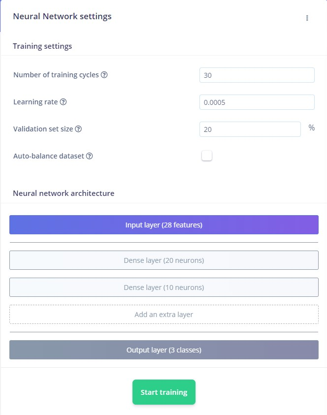

The training output will be displayed to you once the program is completed. Our goal is to achieve a level of accuracy of over 95%. The Confusion matrix directly beneath it depicts the accurate and wrong responses provided by our model after it was fed the previously acquired data set, in a tabulated form. In our example, if a methane leak happens, there is a 28.6 percent probability that it will be mistaken for an alcohol leak. Due to the fact that such phenomena are hard to simulate in an electronics lab, our accuracy is under 90%, but good enough to illustrate this PoC.

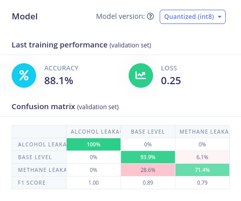

The Data Explorer provides a visual representation of the dataset and it helps in visualizing the misclassified Methane leakage points that are being placed in close proximity to the Alcohol Leakage points.

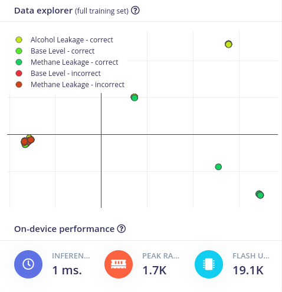

### Model Testing

A great way of going about testing our model is to navigate to the **Model Testing** tab. You will be presented with the samples stored in the Testing data pool. Click on **Classify all** to run all this data through your Impulse.

The Model testing tab provides the user the ability to test out and optimize the model before going through the effort of deploying it back on the edge. The possibility of going back and adding Training data, tweaking the DSP and Learning block, and fine-tuning the model shaves off an enormous amount of development time when creating an edge computing application.

## Deploying the Model as Arduino Library

Once you are happy with the performance of the TinyML model, it’s time to deploy it back on the edge. 
Navigate to the **Deployment** tab, select **Arduino library**, and click **Build**.

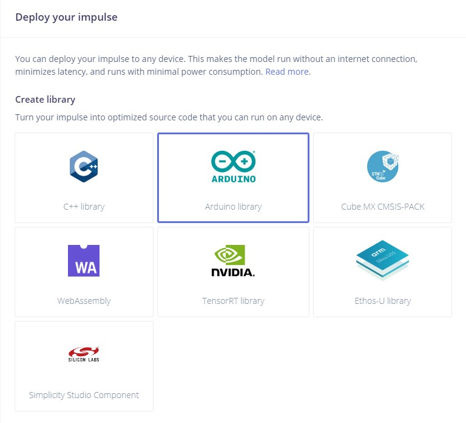

This will create an Arduino library that encapsulates all the DSP blocks, their configuration and learning blocks.  Download and extract the library in the `libs` folder of your PlatformIO project.

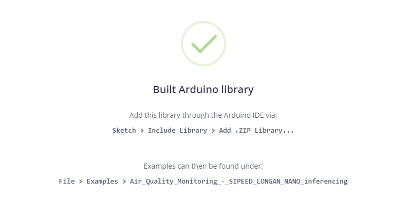

Next up, let’s build an application that lights up the on-board LED if the system detects with a certainty of over 90% that an Alcohol Leakage has occurred. In a real world situation, instead of lighting up the LED, the system can switch a relay to start an exhaust system or sound an alarm.

```
#include <Arduino.h>
#include <Air_Quality_Monitoring_-_SIPEED_LONGAN_NANO_inferencing.h>
#define FREQUENCY_HZ        EI_CLASSIFIER_FREQUENCY
#define INTERVAL_MS         (1000 / (FREQUENCY_HZ + 1))

static unsigned long last_interval_ms = 0;
// to classify 1 frame of data you need EI_CLASSIFIER_DSP_INPUT_FRAME_SIZE values
static float features[EI_CLASSIFIER_DSP_INPUT_FRAME_SIZE] = {};
// keep track of where we are in the feature array
size_t feature_ix = 0;

int MiCs = PA6;
int MQ5 = PA7;
int MQ7 = PB0;
int MQ3 = PB1; 
static float valMiCs = 0; 
static float valMQ5 = 0;
static float valMQ7 = 0; 
static float valMQ3 = 0; 
int InfValue = 0;

void setup() {
    pinMode(LED_BUILTIN,OUTPUT);
    Serial.begin(115200);
    Serial.println("Started");
}

void loop() {

    if (millis() > last_interval_ms + INTERVAL_MS) {
        last_interval_ms = millis();
        // read sensor data in exactly the same way as in the Data Forwarder example
        valMiCs = analogRead(MiCs);  
        valMQ5 = analogRead(MQ5);
        valMQ7 = analogRead(MQ7); 
        valMQ3 = analogRead(MQ3); 
        Serial.print(valMiCs);
        Serial.print(",");
        Serial.print(valMQ5);
        Serial.print(","); 
        Serial.print(valMQ7);
        Serial.print(",");  
        Serial.println(valMQ3);   
        Serial.print("\n");
        // fill the features buffer
        features[feature_ix++] = MiCs;
        features[feature_ix++] = MQ5;
        features[feature_ix++] = MQ7;
        features[feature_ix++] = MQ3;

        // features buffer full? then classify!
        if (feature_ix == EI_CLASSIFIER_DSP_INPUT_FRAME_SIZE) {
            ei_impulse_result_t result = { 0 };
    
            // create signal from features frame
            signal_t signal;
            numpy::signal_from_buffer(features, EI_CLASSIFIER_DSP_INPUT_FRAME_SIZE, &signal);

            // run classifier
            EI_IMPULSE_ERROR res = run_classifier(&signal, &result, false);
            ei_printf("run_classifier returned: %d\n", res);
            if (res != 0) return;

            // print predictions
            ei_printf("Predictions (DSP: %d ms., Classification: %d ms., Anomaly: %d ms.): \n",
                result.timing.dsp, result.timing.classification, result.timing.anomaly);

            // print the predictions
            for (size_t ix = 0; ix < EI_CLASSIFIER_LABEL_COUNT; ix++) {
                ei_printf("%s", result.classification[ix].label);
                InfValue = static_cast<int>(result.classification[ix].value*100);
                Serial.print(InfValue);
                Serial.print("\n");
                if(result.classification[ix].label == "Alcohol Leakage" && InfValue > 90){
                    digitalWrite(LED_BUILTIN,HIGH);
                    delay(2000);
                    digitalWrite(LED_BUILTIN,LOW);
                    delay(2000);
                };
            }
            // reset features frame
            feature_ix = 0;
        }
    }   
}

void ei_printf(const char *format, ...) {
    static char print_buf[1024] = { 0 };

    va_list args;
    va_start(args, format);
    int r = vsnprintf(print_buf, sizeof(print_buf), format, args);
    va_end(args);

    if (r > 0) {
        Serial.write(print_buf);
    }
}
```

## Conclusion

By selecting the proper sensors for your use case and training the model accordingly, you may develop an accurate bespoke gas tracker using the methods mentioned above. The Gigadevice processor is a powerhouse, and we believe it is underutilized in this application. However, given the price and capabilities of the development board, it is a good buy, with room to grow for other applications as RISC-V processors gain popularity in industry, academia, and among hobbyists.

While gas sensors are important for ensuring safety in confined spaces and for reducing environmental pollution they have many other places where they can be used besides industry. In the home, gas sensors can be used to detect leaks and to improve energy efficiency. In transportation, gas sensors can be used to monitor engine performance and to reduce emissions. In the wild they can be used to prevent wildfires as a part of an early detection system. The sensors are placed in an area and monitor the air for combustible gasses.



Due to the fact that simple "if" based conditions that trigger when gas concentration pass an arbitrary defined threshold, using an Edge Impulse model may prove beneficial by reducing the reaction time and implicitly, the exposure time of employees in these situations.

If you need assistance in deploying your own solutions or more information about the tutorial above please reach out to us!


