# Analog Meter Reading with the Arduino Nicla Vision

Created By:
[Zalmotek](https://zalmotek.com)

Public Project Link:
[https://studio.edgeimpulse.com/public/96469/latest](https://studio.edgeimpulse.com/public/96469/latest)

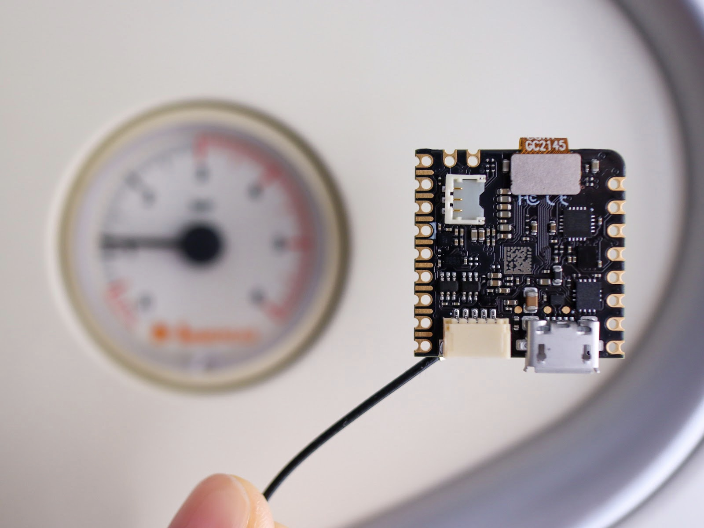

## Intro

Analog gauges are often used in industrial settings to measure various process variables such as pressure, temperature, and flow. In many cases, analog gauges are preferred over digital gauges because most analog gauges mounted on old machinery cannot be easily replaced or it would be too costly to do so. However, they have several disadvantages, such as requiring visual inspection by a human operator for reading them and the difficulty of integrating them into digital systems to automate tasks.

Computer Vision and Machine Learning can be used to overcome these disadvantages by retrofitting analog gauges with digital readouts. Computer Vision systems can automatically take readings from analog meters and displays, eliminating the need for manual reading and recording. In addition, this method provides real-time continuous monitoring of analog values, allowing for more accurate trending and analysis, reducing maintenance times, and enabling defining alerts to prevent failures.

## Our Solution

In this tutorial we'll show you how you can use Computer Vision and Machine Learning to read the boiler pressure gauge on a heating system.  We’ll use the Arduino Nicla Vision camera to capture the training data and run the ML model, and the Edge Impulse platform to build, train and deploy an image classification model. 

Nicla Vision is the perfect match for this use case, as it has a powerful processor with a 2MP color camera that supports TinyML and can easily be integrated into Edge Impulse. It also offers WiFi and Bluetooth Low Energy connectivity so you can send your data to the cloud without having to use another development board. And all of these features are packed on a really tiny board!

### Hardware requirements

 - [Arduino Nicla Vision](https://store.arduino.cc/products/nicla-vision)
 - Micro USB Cable

### Software requirements
 - Edge Impulse account
 - [OpenMV IDE](https://openmv.io/pages/download)

## Hardware Setup

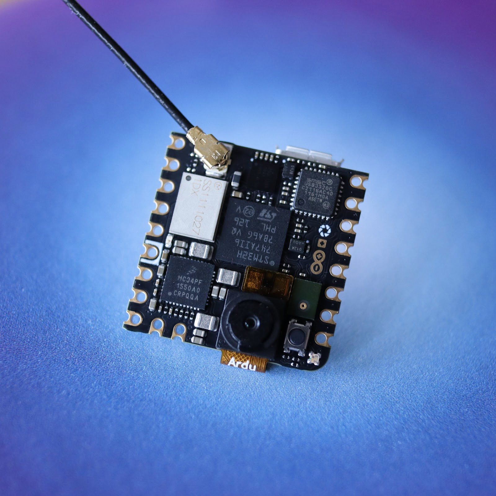

We went ahead and 3D printed a neat enclosure for the Nicla Vision board, mounted it on the boiler using an aluminum rod and pointed it at the Analog Gauge. Even though the boiler is situated indoors where there are no risks of water damage and the dust particle levels are low, the case provides an extra layer of protection against environmental factors. 

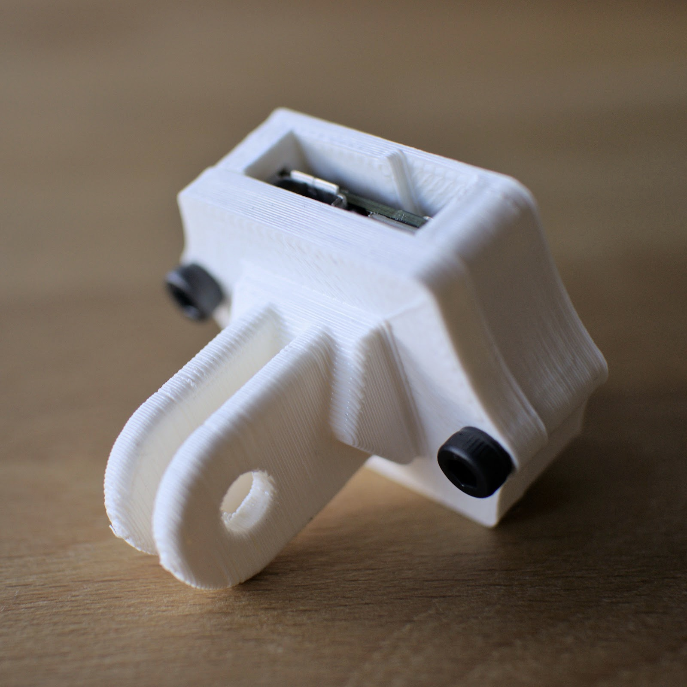


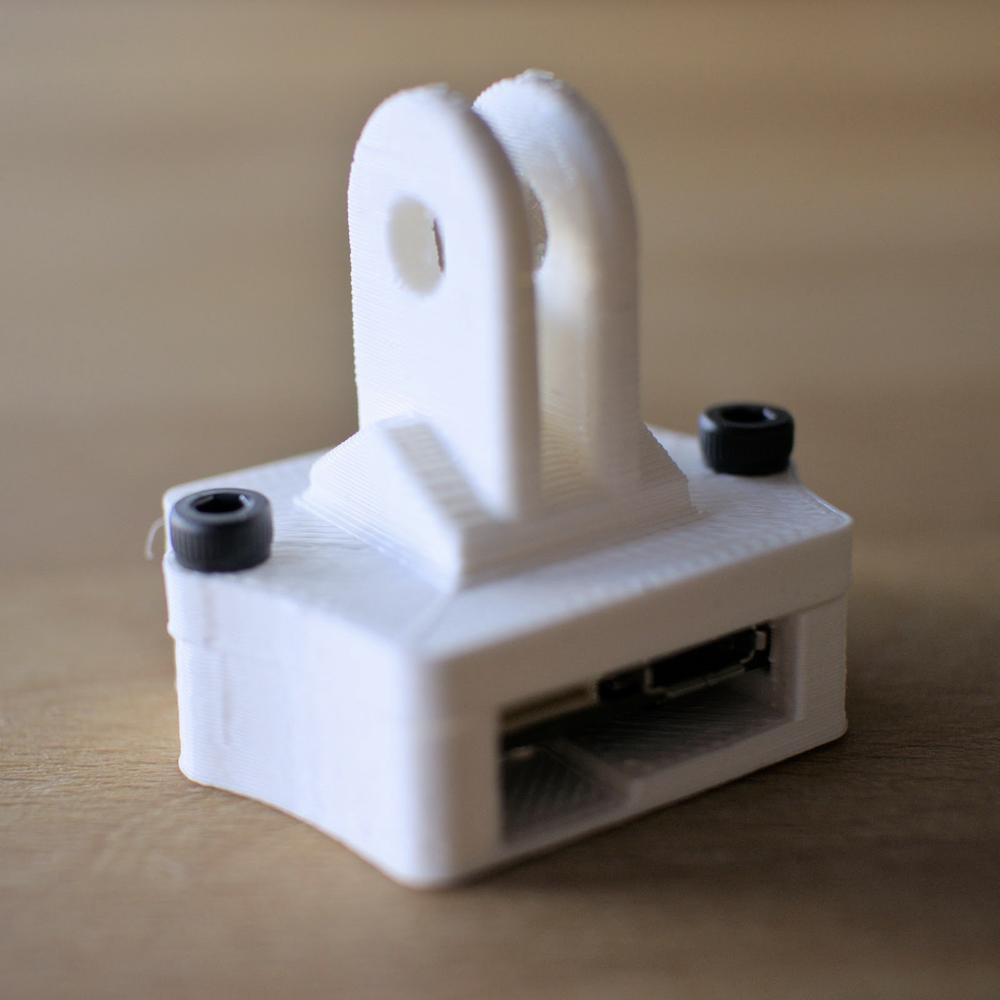

The lid is secured by using M3 bolts and threaded inserts that were placed inside the base piece using a heating iron. This ensures a good fit of the lid over the base piece and allows the case to be opened and closed repeatedly without having to worry about damaging a 3D printed thread. Moreover, we have opted to use a go-pro compatible mount on the lid, a common pick in the open-source hardware community, that makes this design compatible with numerous other mounts available online that will fit your application.

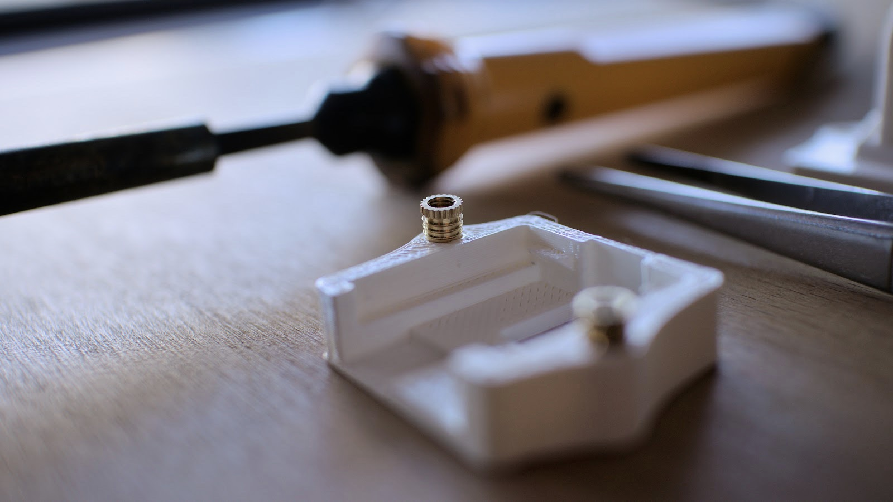


Depending on your setup, lighting may vary throughout the day so you can also add a light source to ensure constant illumination. This is a crucial aspect to ensure the performance of the ML model, as it can heavily influence the detected features.

## Software Setup

Start by installing the [OpenMV IDE](https://openmv.io/pages/download) and creating an [Edge Impulse account](https://studio.edgeimpulse.com/login) if you haven’t already. 

### Data Collection

In order to train the model to detect when the pressure is abnormal, we’ll define three possible categories: low, normal, and high, as seen in the picture below. Since we cannot take pictures of the gauge with the needle in all possible positions, we’ll generate the images dataset using Python. OCI Labs provides some great [code](https://github.com/oci-labs/deep-gauge/blob/master/1.%20Synthetic%20gauge%20image%20generation.ipynb) for this and we’ve adapted it for our use case. 

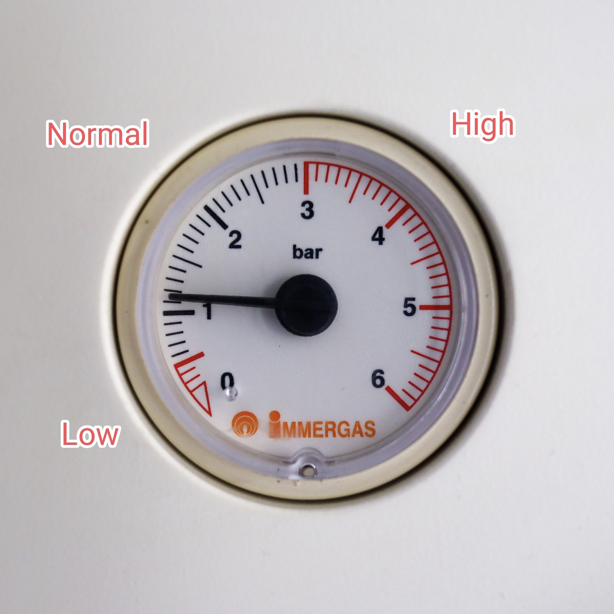

First of all, connect the Nicla Vision board to your laptop, go to OpenMV and click on the **Connect** button in the bottom left corner. If you cannot connect the board from the first try, double click the button on the Nicla Vision to put the board into bootloader mode (the green LED should be blinking). Then go to **Tools -> Dataset Editor -> New Dataset** and choose a folder where you want to save the images. Click on **New Class Folder** and give it a name. Take a few pictures and choose the one you consider the best. We’ll use it as a starting point to generate the rest of the dataset. 

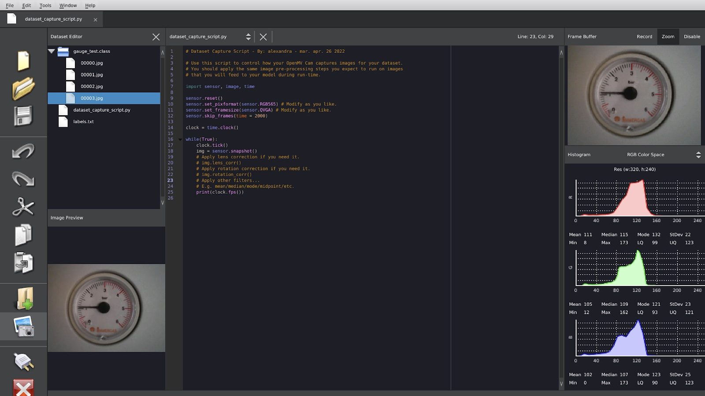

For the next part, you’ll need some image processing skills. Separate the needle from this image using any image processing tool you like, and also create an image with the needle removed from the gauge.

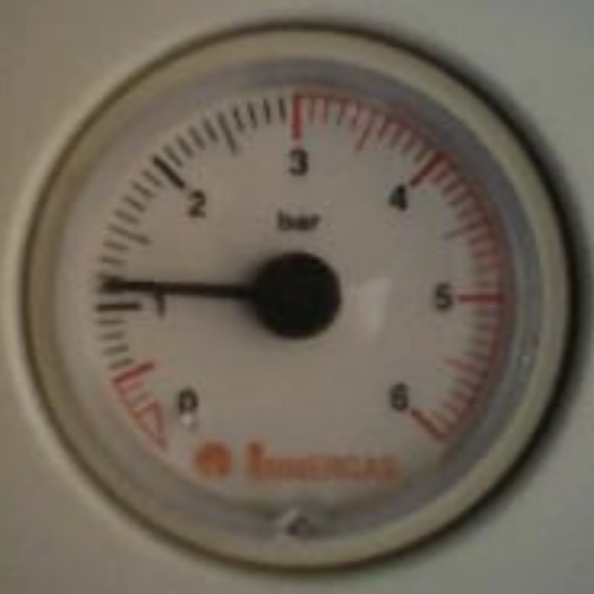


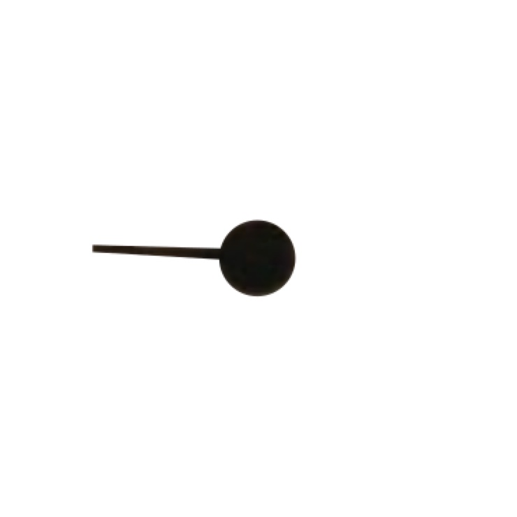

To generate images for each value corresponding to gauge reading, the needle image is rotated to each of the appropriate angles and superposed to the background. You can find the code to do this in the [Synthetic gauge image generation.ipynb](https://github.com/Zalmotek/EdgeImpulse_meter_reading_nicla_vision) Jupyter notebook, and after running the code you should obtain something like this:

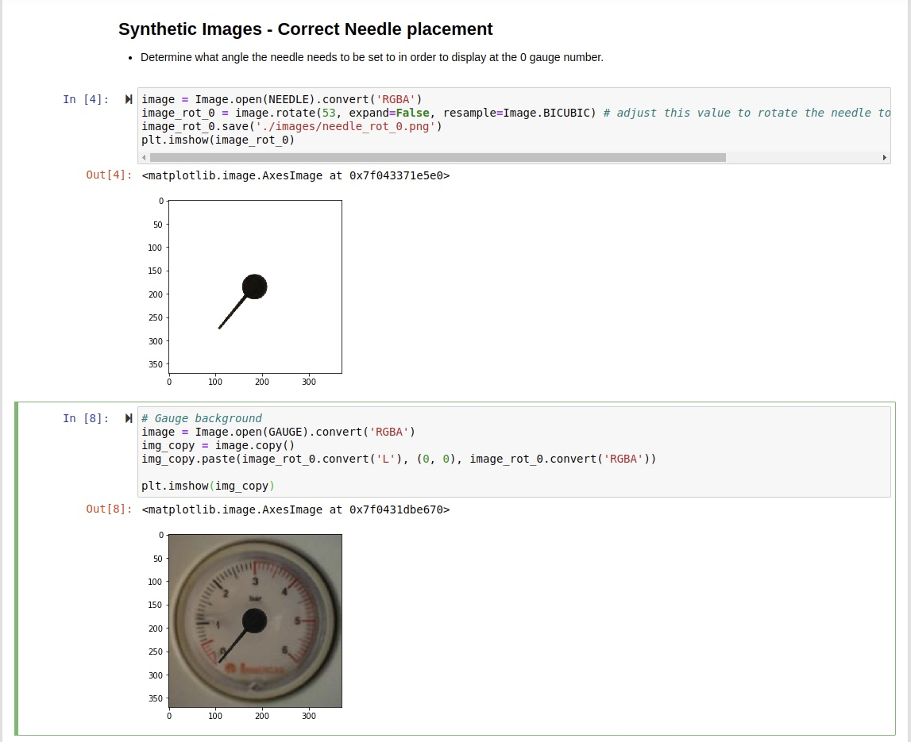

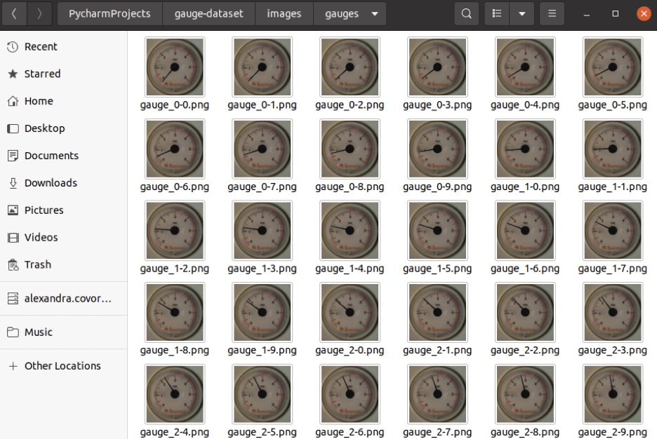

Now that we have a proper dataset, we can create a new Edge Impulse Project. Once logged in to your Edge Impulse account, you will be greeted by the Project Creation screen. Click on **Create new project**, give it a meaningful name and select **Developer** as your desired project type. Afterward, select **Images** as the type of data you wish to use. Next, choose **Image Classification** and go to the **Data acquisition** menu. Click on **Upload existing data** and, from the images you’ve just generated, upload the ones showing the needle in the normal position, making sure to label them accordingly. Next, repeat this for the other two categories.

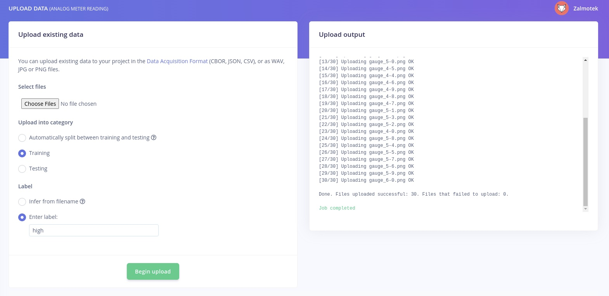

### Creating the impulse

Now we can create the Impulse. Go to **Impulse Design** and set the image size to 96x96px, add an **Image** processing block, and a **Transfer Learning** block. We won’t train a model built from scratch, but rather make use of the capabilities of a pre-trained model and retrain its final layers on our dataset, saving a lot of precious time and resources, this process being called transfer learning. The only constraint of using this method is that we have to resize the images from our dataset to the size of the images the model was initially trained on, so either 96x96px or 160x160px. We chose to use 96x96px images because the Nicla Vision board only has available 1MB RAM and 2MB Flash memory.

The output features will be our categories, meaning the labels we’ve previously defined (high, low, and normal).

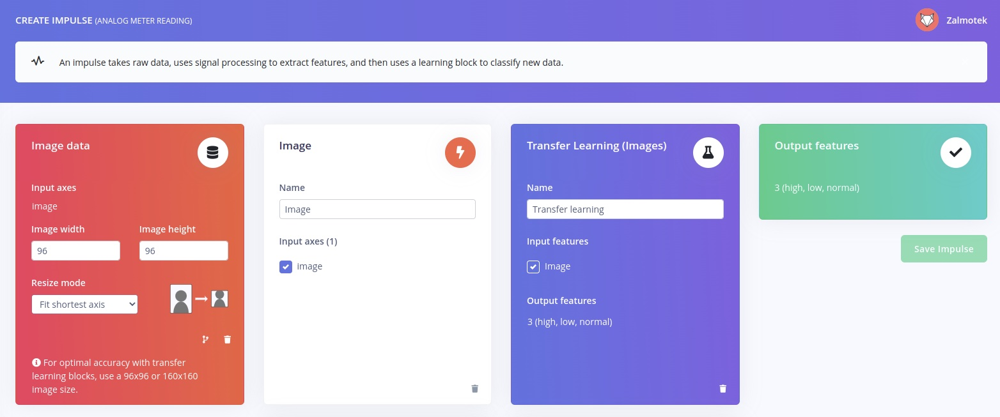

### Generating features

Now go to the **Image** menu in the **Impulse Design** menu and click on **Save Parameters** and **Generate Features**. This will resize all the images to 96x96px and optionally change the color depth to either RGB or Grayscale. We chose the default mode, RGB. You’ll also be able to visualize the generated features in the **Feature explorer**, clustered based on similarity. A good rule of thumb is that clusters that are well separated in the feature explorer will be easier to learn for the machine learning model.


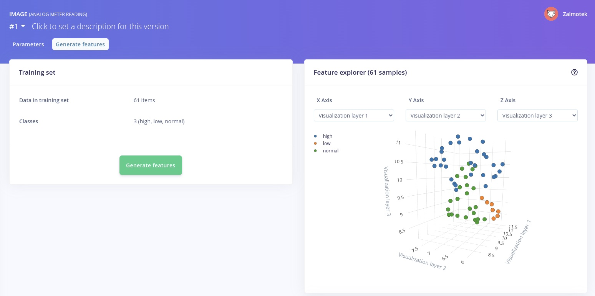


### Training the model

Now that we have the features we can start training the neural network in the **Transfer Learning** menu. When choosing the model we have to consider the memory constraints of the Nicla Vision board (1MB RAM and 2MB Flash memory), so we chose the **MobileNetV2 96x96 0.05** model, which is a pretty light model. You can select the model and check out its memory requirements by clicking on **Choose a different model**.

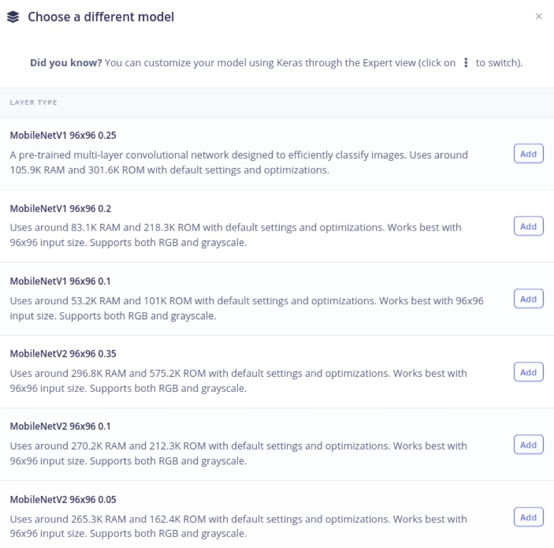

For now, you can use the default Neural Network settings and after training the model you can come back and tweak them to obtain a better accuracy. There is no certain answer to what are the best settings for the model, as it depends from case to case, but you can experiment with different values, making sure to avoid underfitting and overfitting. As an example, this is what worked for us:

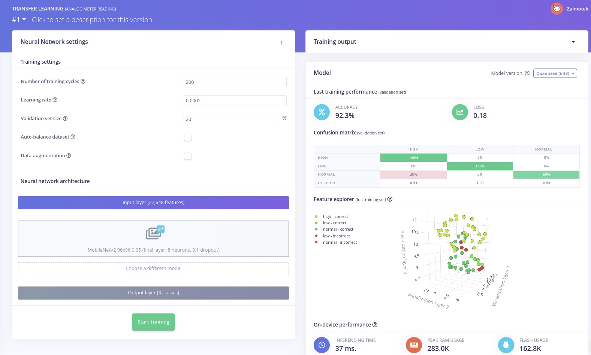

### Deploying the model on the edge

We’ve created, trained, and validated our model, so now it’s time to deploy it to the Nicla Vision Board. Go to **Deployment** in the Edge Impulse menu, select **OpenMV Firmware** and click on the **Build** button on the bottom of the page. This will generate an OpenMV firmware and download it as a zip file. Unzip it and you’ll find inside several files including **edge_impulse_firmware_arduino_nicla_vision.bin** and **ei_image_classification.py**, which we are interested in.

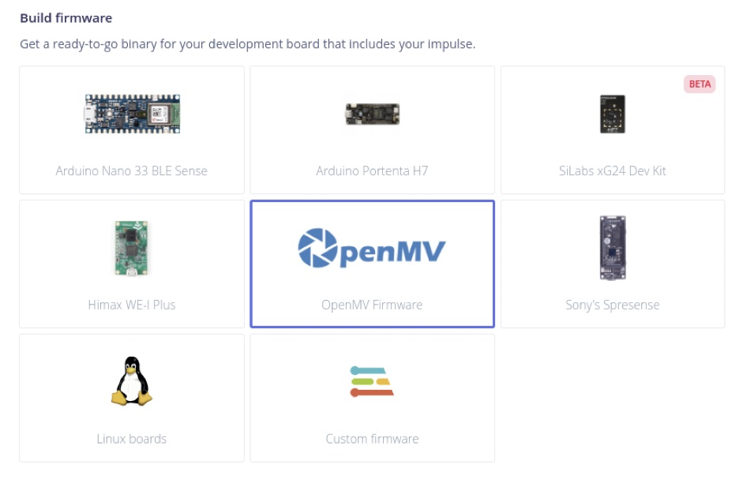

The next step is loading the downloaded firmware containing the ML model to the Nicla Vision board. So go back to OpenMV and go to **Tools ->  Run Bootloader (Load Firmware)**, select the .bin file and click **Run**. Now go to **File -> Open File** and select the Python file from the archive.

To save up some memory, adjust the following lines of code in your file:

```
sensor.set_framesize(sensor.QQVGA)     # Set frame size to QQVGA (160x120)
sensor.set_windowing((96, 96))                # Set 96x96 window.
```

Since the model was trained on 96x96px images, there’s no point in using larger images, as they will occupy more space in the memory. Also, set the frame size of the camera accordingly, to fit your images. If you hover over **set_framesize** you’ll find all the available options. In our case, QQVGA, which is 160x120px, works well.

Finally, click **Connect** and **Run** and you can test the model!

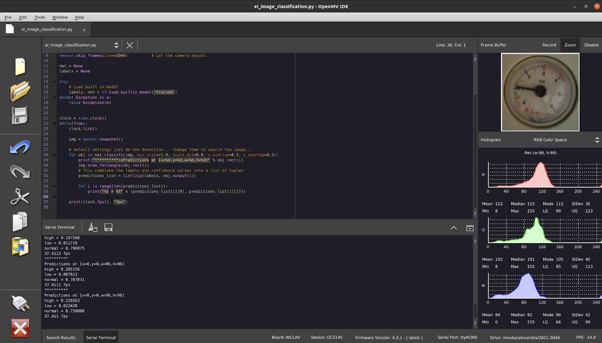

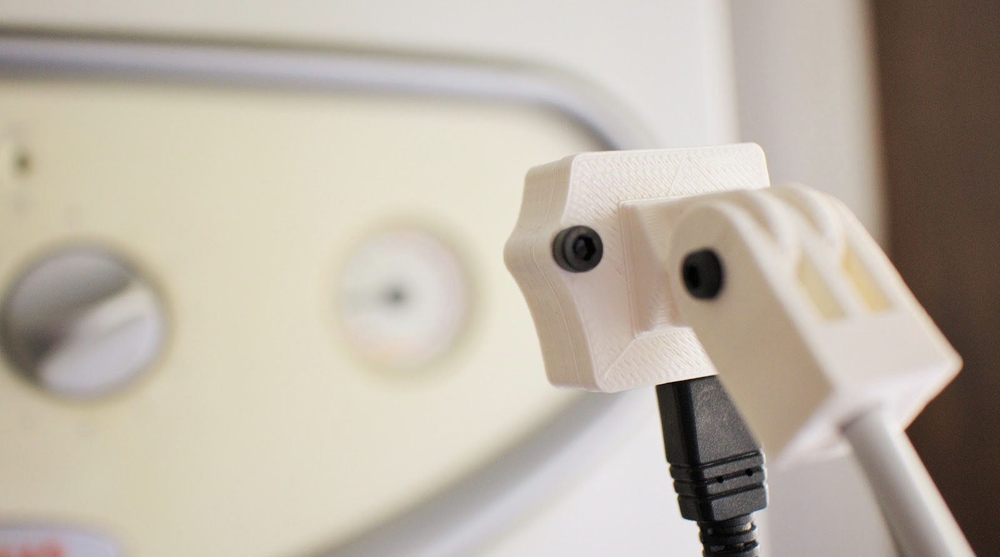

## Conclusion

The use of analog meter reading is critical for monitoring energy consumption in a variety of settings. One key reason for this is that computer vision techniques can be used to quickly and easily analyze hundreds or even thousands of readings in order to detect patterns and trends for various types of data, such as time of day, consumption level, and changes over time. Additionally, analog meter reading allows for more precision in terms of tracking energy, gas, and water usage, as it provides real-time data that is not subject to the same inaccuracies that can arise with smart meters. This makes analog meter reading an important tool for businesses and utilities alike in their efforts to improve efficiency and reduce costs. Ultimately, by investing in analog meter reading technology, organizations can help to ensure a sustainable future by better managing the resources at their disposal.

Arduino Nicla is an innovative computer vision system that is ideal for a variety of uses, and it can detect and track objects in real time, even under challenging conditions. Furthermore, it is highly customizable, making it possible to tailor it to suit any specific application. Whether you need to monitor traffic flows or simply monitor a gauge like in our example, Arduino Nicla is the perfect choice. Combining it with the new [FOMO](https://www.edgeimpulse.com/blog/announcing-fomo-faster-objects-more-objects) feature from Edge Impulse you can run a slim but powerful Computer Vision system at the edge.

If you need assistance in deploying your own solutions or more information about the tutorial above please [reach out to us](https://edgeimpulse.com/contact)!

