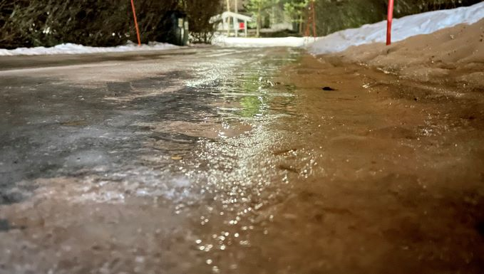
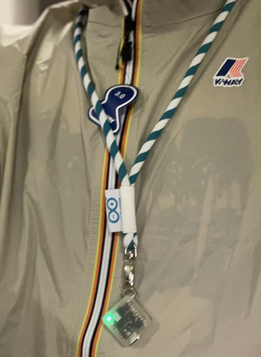
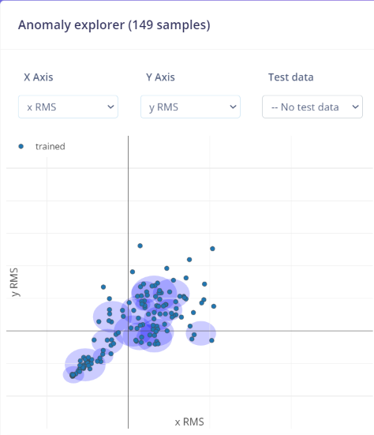
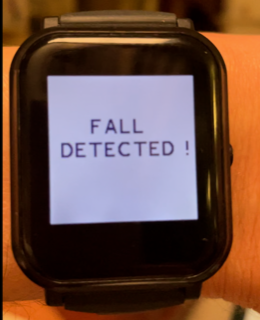
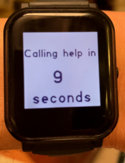
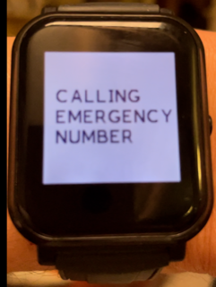

# Arduino x K-Way - TinyML Fall Detection

Created By:
Thomas Vikstrom 

Public Project Link:

[https://studio.edgeimpulse.com/public/183564/latest](https://studio.edgeimpulse.com/public/183564/latest)

GitHub Repo:

[https://github.com/baljo/fall_detection](https://github.com/baljo/fall_detection)

This project will showcase how the K-Way jacket & Arduino Nicla Sense ME device, together with a smartwatch, can be used to detect falls and call for assistance in case needed.

[Video showing a simulated emergency call due to a sudden fall](https://youtube.com/shorts/9HECGjsQs8I)

## Background and Needs Analysis

In Finland, with a population of 5.5 million, the yearly mortality rate due to accidental falls is around 1,200 people. Approximately 50% of the mortal falls take place indoors, and 50% outdoor. The reasons for the falls are varying, but what is clear is that the older a person gets, the higher the risk is that she/he will fall, and secondly that the fall might be fatal. Falling is the most common accidental cause of death for people over 65 years in Finland *(source ukkinstituutti.fi)*. In addition to the deaths, the total amount of 390,000 yearly falls *(source Red Cross)* are leading to human suffering and health care costs for the society.

 

As the population overall gets older and older, it is thus of increasing importance to be able to reduce the risk of falling and getting hurt. But in those cases where the accident anyhow happens, and the person is severely hurt or in worst case unconscious, it is crucial to get assistance as quickly as possible. For people living with family members or in a home for elderly, a shout for help might be enough, but when living alone it might take hours, or even days, until someone notices something is amiss. While a fall indoors can certainly be fatal, a fall outdoors during the darkest winter, or in the sparsely populated countryside, significantly increases the risk of a fatal outcome.

Finns in general, and elderly people in particular, are made of a tough and hard material (quite a few are also stubborn), which leads to that many try to live an active outdoors lifestyle, regardless of the weather conditions. This is all well and good as long as precautions are taken (e.g., using shoes with studs or spikes in the winter, or hike boots for hiking in the terrain). Nowadays also most people have a mobile phone and an increasingly number of people have some type of smartwatch.

## Fall Detection Technology

Many existing fall detection systems use signals from **accelerometers**, sometimes together with gyroscope sensors, to detect falls. Accelerometers are very sensitively monitoring the acceleration in x, y, and z directions, and are as such very suitable for the purpose. The challenge with developing a fall detection system with the help of accelerometers, is that the data frequency typically needs to be quite high (> 100 Hz) and that the signals need to be filtered and processed further to be of use.

Apart from accelerometers, it is also possible to use e.g. **barometers** to sense if a person suddenly has dropped a meter or more. Barometers sense the air pressure, and as the air pressure is higher closer to the ground, one only needs grade school mathematics to create a bare bones fall detection system this way. Easiest is to first convert air pressure to altitude in **meters**, and then use e.g. this formula `previous altitude in meters - current altitude in meters`, and if the difference is higher than e.g. 1.2 meters within 1-2 seconds, a fall might have happened. With barometers the data frequency does often not need to be as high as with accelerometers, and only one parameter (air pressure=altitude) is recorded. One major drawback is the rate of false positives (a fall detected where no fall occured). These might happen because of quick changes in air pressure, e.g. someone opening or closing a door in a confined space like a car, someone shouting, sneezing, coughing close to the sensor etc.

Some modern and more expensive smartwatches, e.g. Apple Watch, already have in-built fall detection systems, that can automatically call for help in case a fall has been detected, and the person has been immobile for a minute or so. In case the watch has cellular connectivity, it does not even neeed to be paired to a smart phone.

# Project Introduction

In this TinyML project I showcase how the K-Way jacket and Arduino Nicla Sense ME device are, together with the Bangle.js smartwatch, used to detect falls and simulate a call for assistance in case needed. K-Way is an iconic brand, known by many for their waterproof clothes. Nicla Sense ME is a tiny low-power device suitable for indoor or outdoor activities. Sensors included are accelerometer, magnetometer, air quality sensor, temperature sensor, humidity sensor, air pressure sensor, Bluetooth connectivity etc. All this on a stamp-sized PCB!

To demonstrate how a detected fall could result in an emergency call, I connected the Nicla via Bluetooth to my Bangle.js 2 smartwatch. Bangle is an affordable open-source based smartwatch aimed for users with a low budget or who want to develop software themselves using Espruino, a Javascript-based language. In a real scenario, Nicla would be connected directly either to a smartphone or smartwatch with cellular connectivity, but as that was out of scope for this project, I instead simulate an emergency call being made from the Bangle watch.

## Data Gathering

Initially I intended to collect data for normal behaviour and activities like e.g., sitting, walking, running, driving, cycling etc. as well as from trying to replicate real falls on slippery ice outside. Due to the risk of injury when replicating real falls - or from "falling" asleep when sitting :-) - I instead decided to try the anomaly detection in Edge Impulse for the first time. Once again I was amazed how easy it is to use Edge Impulse to collect data and train a ML model with it!

To be able to use anomaly detection, you just need to collect data for what is considered normal behaviour. Later, when the resulting ML model is deployed to an edge device, it will calculate anomaly scores from the sensor data used. When this score is low it indicates normal behaviour, and when it's high it means an anomaly has been detected.

I followed [this tutorial](https://docs.edgeimpulse.com/docs/development-platforms/officially-supported-mcu-targets/arduino-nicla-sense-me) on the Nicla to get up and running. The Edge Impulse-provided `nicla_sense_ingestion.ino` sketch was used to collect accelometer data.

I started to collect 8-second samples when walking, running, etc. For the sake of simplicity, I had the Nicla device tethered through USB to a laptop as the alternative would have been to use a more complex data gathering program using BLE. 
I thus held Nicla in one hand and my laptop in the other and started walking and jogging indoors. To get a feeling for how the anomaly detection model works, I only collected 1m 17s of data, with the intention of collecting at least 10 times more data later on. Astonishingly, I soon found out that this tiny data amount was enough for this proof of concept! Obviously, in a real scenario you would need to secure you have covered all the expected different types of activities a person might get involved in.

## Impulse

Through a heuristical approach I found out that the optimal window size and increase is 500 ms when the frequency is 100 Hz. I also found the spectral analysis to be working well with anomaly detection

 

## Anomaly Detection in Edge Impulse

As this ML model was new to me, it was easiest to train it using the default settings. While I'm quite sure the model might be further tuned and optimized, especially after collecting more data and from different activities, the trained model was again of surprisingly good quality considering the few minutes I'd spent on it.

 

## Deployment to Nicla

The deployment part consisted of creating an Arduino library that can be used with the example program provided by Edge Impulse. Initially I struggled to find the correct program from the library, but found out that I just needed to restart the Arduino IDE to be able to find the file, duh!

Next in line was to find a suitable threshold for when I consider an anomaly (= fall) detected. Again, with a heuristical approach I found an anomaly score of 50 to be a good threshold. To be able to walk around without Nicla being tethered to a computer, I adapted the program so the LED light blinks in red when I simulated a fall by shaking the device.

Until now, most steps in the process had been pretty straightforward with only some basic research and trial & error needed. Luckily, I had been prewarned by another [Nicla Expert](https://docs.edgeimpulse.com/experts/featured-machine-learning-projects/arduino-kway-gesture-recognition-weather) that running inference and Bluetooth simultaneously might cause memory issues on this 64kB SRAM device. This I experienced myself, but with the help of this [Forum post](https://forum.edgeimpulse.com/t/nicla-sense-me-running-out-of-memory/6344/11), this challenge was overcome.

## Software on the Bangle Smartwatch and Demonstration

To be able to simulate an emergency call being made, I created a simple Javascript program on the smartwatch. This program connects through BLE to Nicla and receives the anomaly score. Once the score is over 50, the watch will react by turning on the LCD and displaying `FALL DETECTED!`. After a few seconds a counter will decrease from 10 to 0, and if the wearer has not touched the display when the counter turns to zero, the watch is simulating an emergency call to a predefined number chosen by the user.

The following pictures show the fall detection process:
- A fall is registered (= an anomaly detected) - in this case due to shaking the Nicla device, the LED blinks in red colour
- Nicla sends the anomaly score to the Bangle watch through BLE
- The Bangle watch also shows a fall is detected, starts counting down to zero
- If the screen has not been touched - indicating the user is immobile, an emergency call is made

## Conclusions

While this was only a proof of concept, it demonstrates how tiny low-powered TinyML devices can be used to detect falls, and together with cellular network devices call for assistance in case the user is immobile. To move from the prototype stage to a real-world solution, more activity data needs to be gathered. In addition, Nicla should be connected to a phone to enable emergency calls. For this a smartphone app should be developed, e.g. with [MIT App Inventor](https://appinventor.mit.edu/).
