# Build a Path-Following, Self-Driving Vehicle Using an Arduino Portenta H7 and Computer Vision

Created By:
Jeremy Ellis 

Public Project Link:
[Coming Soon]()

## Introduction

As a teacher, I wanted a long-term project for students who were willing to do extra work and who showed an interest in both Arduino microcontrollers and Computer Vision Machine Learning. We took an off-the-shelf RC car, and converted it to be controlled by an Arduino Portenta H7, and then trained an Edge Impulse FOMO Vision model to create a self-driving RoboCar that can follow a path of target objects. This high-level, long-term project is great for students who want a harder-than-normal challenge.

We picked a specific RC car, the "[RC Pro Shredder](https://bchobbies.com/products/shredder112scale4wdbrushedmonstertruck)", as it did not use a brushless motor (the programming of brushless motors has extra complexity). We also needed a big motor driver, a servo motor (the Shredder steering motor is a DC motor with a potentiometer), connectors, USB cable and USB battery pack, as well as the ability to 3D Print large objects.  See the BOM and price list at the bottom of this post.

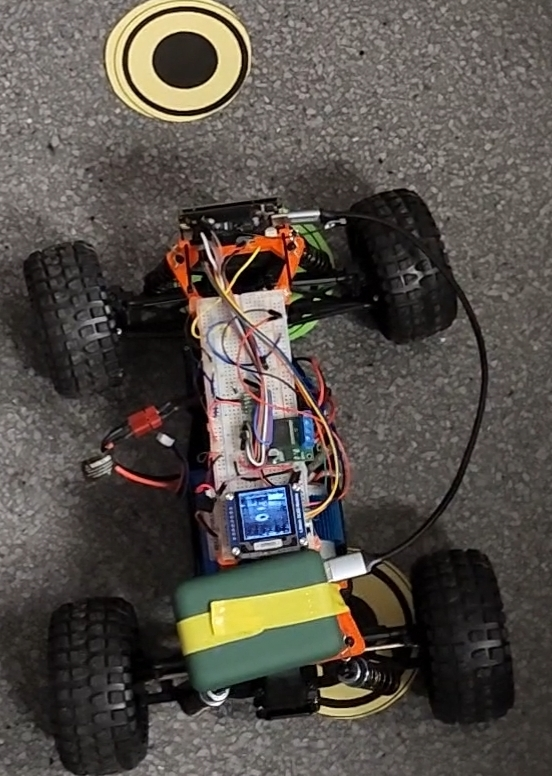

This is a difficult build and may need some adaptations for your project: For example, we used a large print-bed 3D printer to make the 10.5 inch long frame (26.7 cm). You may choose to split that frame up or put the hardware somewhere else on the car.

The software to use is online as part of my Arduino IDE-ready library called the "[Portenta Pro Community Solutions](https://github.com/hpssjellis/portenta-pro-community-solutions)" in the [dot55 area](https://github.com/hpssjellis/portenta-pro-community-solutions/tree/main/examples/dot5-portenta-machine-learning/dot55-robocar/dot551-robocar-v1). This is a huge library of ready-made examples to use with the Arduino Portenta H7, and other Arduino MBED boards.

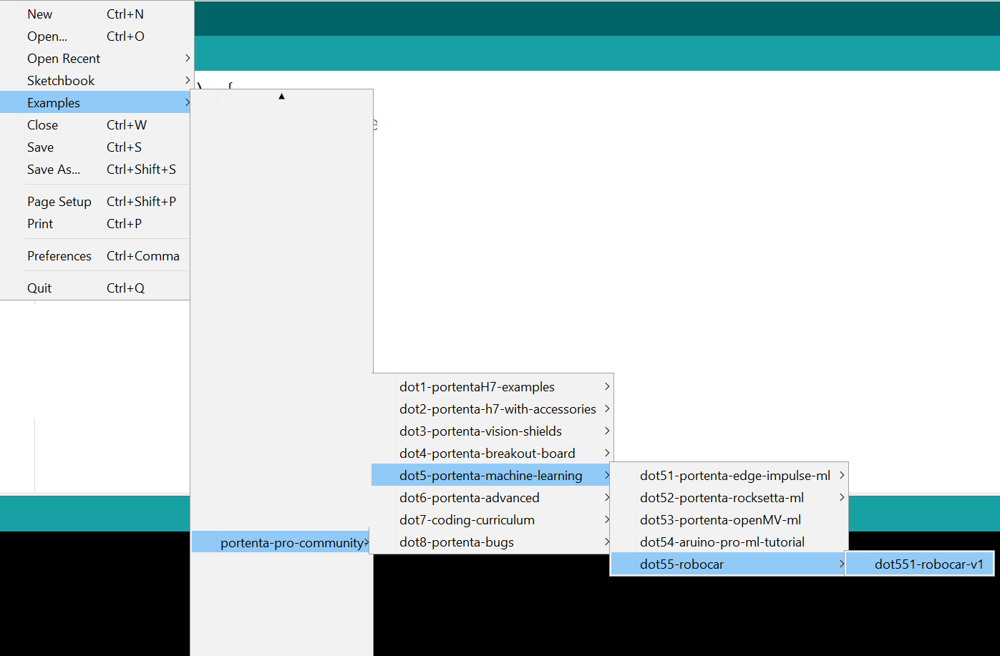

## Main Build Steps

### 1. Purchase Parts 

First, you need to purchase the parts required to build the car. Check out the BOM provided below, and make sure to purchase all the required parts without exceeding your budget.

#### List of suggested first-time purchases:

      1. [RC-Pro Shredder](https://www.rcpro.ca/collections/shredder/products/shredder) $189.99 CDN
      2. [WSD1302 Plug Set](https://www.rcsuperstore.com/ws-deans-2-pin-ultra-plug-set-one-male-one-female-included/) 2 sets  $2.99 USD
      3. [Bullet Connectors](https://www.amazon.com/AIRIC-Bullet-Connectors-Insulated-Terminals/dp/B08ZSQZCCR?th=1) only need 2 female bullet connectors this is a set of 50 for  $11.99 USD
      4. [Big VNH5019 Motor Driver Carrier](https://www.pololu.com/product/1451) $44.95 USD 
      5. [3 Wire Servo ](https://www.rcpro.ca/collections/shredder/products/shredder-3-wires-19gram-metal-gear-servo)  $24.99 CDN
      6. [Arduino Portenta H7](https://store-usa.arduino.cc/products/portenta-h7)  $103.40 USD 
      7. [Arduino LoRa Vision Shield](https://store-usa.arduino.cc/products/arduino-portenta-vision-shield-lora%C2%AE) $63.25 USD
      8. [Waveshare 1.5inch OLED Module](https://www.waveshare.com/1.5inch-oled-module.htm) $12.99 USD
      9. USB-C cable, USB battery pack, microSD card. A 3D printer would be useful.

### 2. Test Vehicle

Have fun with the RC car: Without breaking it, charge the battery and drive it around to test the tight turning circle diameter and slowest speeds that it still moves.

### 3. Find Objects to Track

To train your model, you need to find objects to track. You can use double-sided black circles on photocopy paper and cut them out. Here is a [printable version you can use](../media/eyes-pdf.pdf)

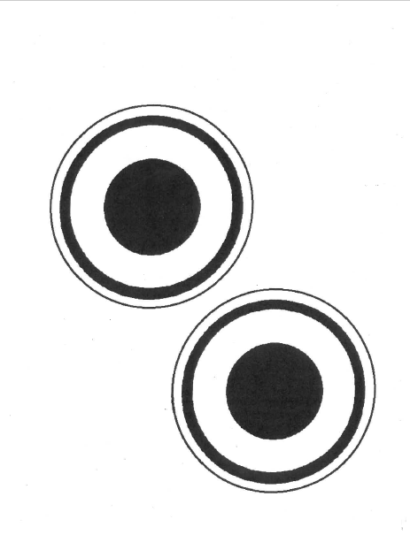

### 4. Build the Frame

3D print the car frame [using the provided STL file](../media/rc-Car-frame28-22degrees-V28-22-degrees.stl) or these smaller prints [Frame Front](../media/rc-Car-frame27-bread-front.stl) and [Frame Back](../media/rc-Car-frame27-bread-back.stl), or make your own with wood or cardboard. Make sure to attach the Portenta H7 with LoRa vision shield on the car (check the image to see which way the Portenta is oriented with the USB cable. The USB cable should protrude to the right of the car) along with a USB-C cable with a battery pack, and attach it to the car while it still has the RC components working. This allows you to drive the car while taking lots of images on the SD card. You will need [this Arduino program](https://github.com/hpssjellis/portenta-pro-community-solutions/blob/main/examples/dot3-portenta-vision-shields/dot36-camera-png-to-web/dot362-png-to-sd-card/dot362-png-to-sd-card.ino) flashed to the board for data collection. Note line 75 `int myDelay = 10000;` sets a variable to take an image every 10 seconds. Change that number to about 500 to take lots of .PNG pictures. Depending on how well the Portenta SD Card fits you might get several bad photos. An easy solution is to just take many more photos. You might want to attach sunglasses in front of the camera if reflections are a problem when using the car inside.

### 5. Train the Model

Upload the images to Edgeimpulse.com and train a FOMO model on EdgeImpulse.com, or grab the main one I use here: [ei-ei-v25-fomo-eyes-shades-arduino-1.0.2.zip](https://github.com/hpssjellis/portenta-pro-community-solutions/blob/main/zipped-libraries/edge-Impulse/arduino-exported/Portenta-Camera/ei-ei-v25-fomo-eyes-shades-arduino-1.0.2.zip). 

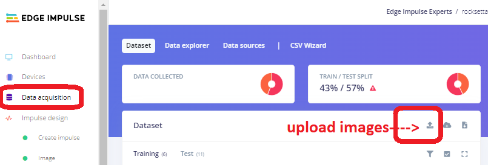

The following steps to train the machine learning model are mirrored on this site with images at [https://hpssjellis.github.io/multi-language-edgeimpulse-tutorial-vision-cell-phone/](https://hpssjellis.github.io/multi-language-edgeimpulse-tutorial-vision-cell-phone/)

 - Login or register at [Edgeimpulse.com](http://edgeimpulse.com)

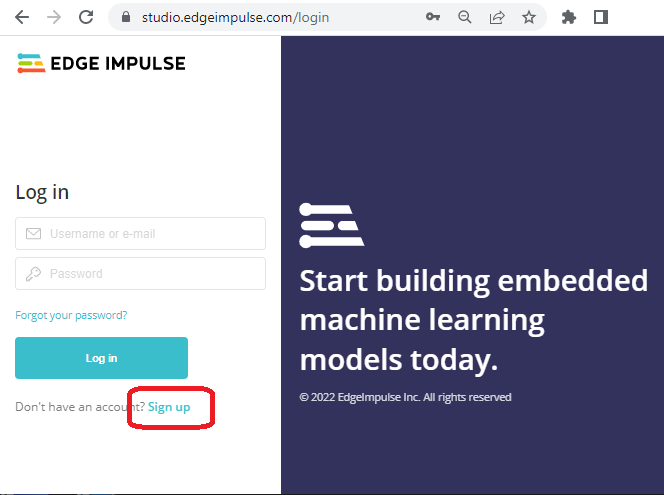

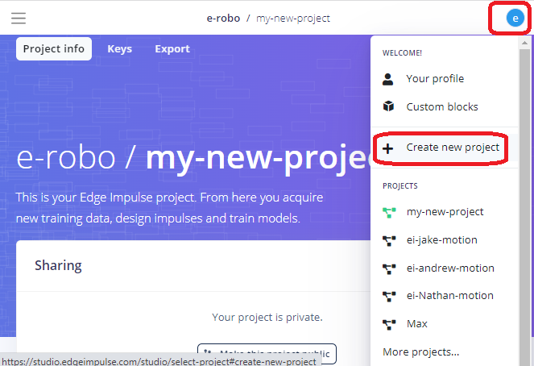

 - On the dashboard, go to the far right and change the label type from **"one label"** to **"bounding boxes."** This sets up the model for FOMO (faster objects, more objects) object detection. Also, set Target Device to **"Arduino Portenta H7 (Cortex M7 480 MHz)"**

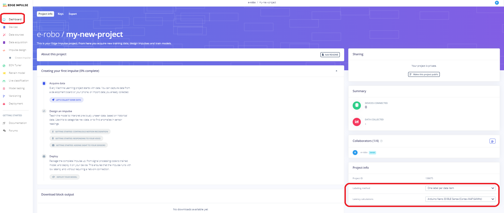

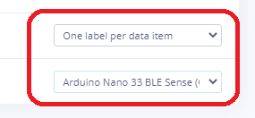

 - On the Dashboard, click on **Add Existing Data"** and upload your images that you took of the car driving around your object.

 - Go to **Data Acquisition** and click on the "Labeling Queue" and start drawing bounding boxes around your objects.  Make sure the label is the same for all of them.  I use "1eye". The number in front of your label is very important for an easy way to determine which label you are analyzing. 

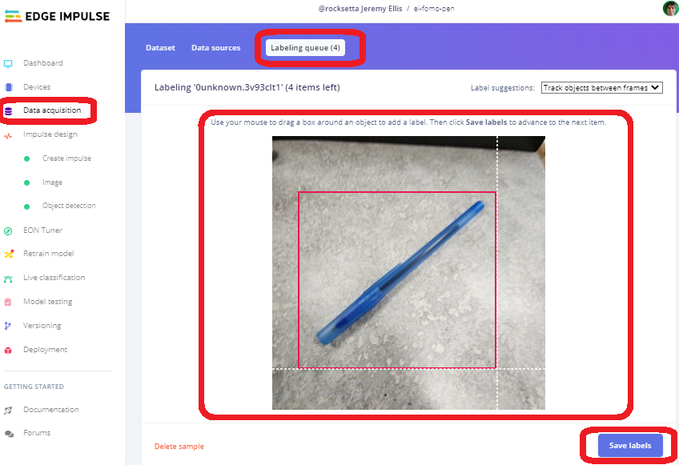

 - Once all of the images are labelled, create a FOMO model by clicking **Create impulse** and choose the Edge Impulse Image and Object Detection blocks. Double check before saving the Impulse that it has only one Object block.

 - On the next page, for the menu item **"Image"**, make sure select Grayscale, not RGB, and save it.

 - Click on **"Generate Features"**, wait a few minutes for the "Feature explorer" to be built, then check for any outliers and delete or change them as needed.

 - In the menu item "Object Detection" set the number of training cycles to about 200 (or whatever works for your project). Add a check in the box for **"Data Augmentation"** and click **"Start Training"**.  Depending on the final number of images, this will take about 8 minutes.

 - Once completed, check the F1 Score and Confusion matrix, which should hopefully be above 80% for the Background and the "1eye" labelled object.

 - Test the model on your phone or download it and flash it to the Portenta. As a reminder, this is an Arduino library so you will need to  upload it into the Arduino IDE as a zipped library.  Full documentation on this process is located here: [https://docs.edgeimpulse.com/docs/edge-impulse-studio/deployment](https://docs.edgeimpulse.com/docs/edge-impulse-studio/deployment).  Check the library file name and change the library that is in the default program to the new name.

 - Flash the model to the Portenta connected to your car. Make sure both batteries are charged. When testing directly on the vehicle, always securely place the car on a small box when testing, as it could jump off the table and break.

 - Always unplug both batteries when you have finished testing the car.

### 6. Add the Model to the Application

Download the Arduino library from the Edge Impulse **Deployment** page, and install the .zip file into your Arduino IDE (Sketch--> Include Library --> Add .ZIP Library). This could be a long compile depending on your computer's speed. Expect about 20 minutes for this to complete the first time, and about 3 minutes each time after that. Ensuring the code compiles and loading it onto the Portenta is a huge step. Well done if it works!

### 7. Load the Arduino Sketch

Download the Arduino Sketch named [dot551-robocar-v1.ino](https://github.com/hpssjellis/portenta-pro-community-solutions/blob/main/examples/dot5-portenta-machine-learning/dot55-robocar/dot551-robocar-v1/dot551-robocar-v1.ino).  Loading it is easy from the Arduino IDE if you have installed the "Portenta Pro Community Solutions" library as it will also load the included file `#include "edge-impulse-advanced-v2.h"`. If you want you can manually load that included file from: [edge-impulse-advanced-v2.h](https://github.com/hpssjellis/portenta-pro-community-solutions/blob/main/examples/dot5-portenta-machine-learning/dot55-robocar/dot551-robocar-v1/edge-impulse-advanced-v2.h). It is just a way to get rid of the complex coding, so your main file only has the necessary code that you might want to change.

### 8. Waveshare OLED (Optional)

If using the optional (but very useful for debugging) WaveShare grayscale 128 x 128 OLED, then attach the correct pins to the Portenta:
 
  * black to GND, 
  * red to 3v3, 
  * blue DIN (mosi) to D8, 
  * yellow (sck) to D9, 
  * orange (cs) to D7, 
  * green (dc) to D6, 
  * white (reset) not needed  

Run the code and observe your model, to determine if it works. This [file: dot229-128x128-gray-oled.ino](https://github.com/hpssjellis/portenta-pro-community-solutions/blob/main/examples/dot2-portenta-h7-with-accessories/dot22-actuators/dot229-128x128-gray-oled/dot229-128x128-gray-oled.ino) can be used just to test the WaveShare OLED with the Portenta.

### 9. Vehicle Modifications

Remove the 5-wire servo that comes with the Shredder car, and attach the 3-wire servo. The ball joints are a bit difficult to replace. You can test the servo <---> Portenta connection with this [code: [dot221-servo.ino](https://github.com/hpssjellis/portenta-pro-community-solutions/blob/main/examples/dot2-portenta-h7-with-accessories/dot22-actuators/dot221-servo/dot221-servo.ino). The connections are:
  
   * servo red to 6V battery positive
   * servo ground (brown or black) to 6V battery negative
   * servo ground (brown or black) to board GND
   * servo controller (orange or other color) to board PWM pin D2   

Here is an image of the entire wiring diagram: 

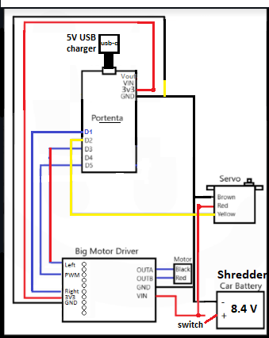

Using a long breadboard attached to the car, connect the Big Motor Drive.  This can be tested with [Motor Driver test code: dot227-big-dc-motor-driver.ino](https://github.com/hpssjellis/portenta-pro-community-solutions/blob/main/examples/dot2-portenta-h7-with-accessories/dot22-actuators/dot227-big-dc-motor-driver/dot227-big-dc-motor-driver.ino).

See image for pin connections:

  *  Left side of Big Motor Driver board in order from the top (see diagram): D3 - D4 - - D5  3V3  GND - - 
  *  Right side: OutA, OutB to the motor on the Shredder using the [Bullet-Connectors](https://www.amazon.com/AIRIC-Bullet-Connectors-Insulated-Terminals/dp/B08ZSQZCCR?th=1)
  *  Right side continued: GND, VIN to the 7.4 V Li-ion battery on the Shredder, using the [ws-deans-2-pin-ultra-plug](https://www.rcsuperstore.com/ws-deans-2-pin-ultra-plug-set-one-male-one-female-included/)

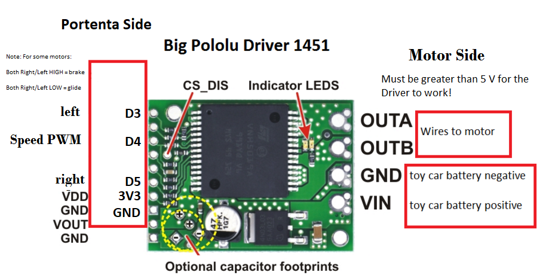

Make sure the car voltage is kept away from the 5-volt USB input for the Portenta.  A tricky part of the car build is getting the main battery power to the big motor driver, and deciding if the main battery is going to power the Portenta. We tried step-down 5V regulators, but the Portenta seemed very sensitive to power fluctuations when the car was running so I just powered the Portenta with a 5V USB battery pack attached to the top of the breadboard. Your big motor driver will need connectors for both the main battery and the motor. 

### 10.  Vehicle Testing

Test that the mechanical parts of the car are working by running this test code which puts together both the servo and the big motor driver: [a01-motor-testing.ino](.gitbook/assets/arduino-portenta-h7-self-driving-rc-car/a01-motor-testing.ino). This allows you to check the motor's slowest speed, and best full turning angle. Don't push the angles too far.

Once everything is proven to work, upload the main code again from [here: dot551-robocar-v1](https://github.com/hpssjellis/portenta-pro-community-solutions/blob/main/examples/dot5-portenta-machine-learning/dot55-robocar/dot551-robocar-v1/dot551-robocar-v1.ino), change a few of the variables such as PWM_MIN and maximum turning angles, and try-out your car.

## Improvements and Contributions

As everything here is open-source, feel free to improve the code, submit pull requests, share on social media and tag me on Twitter @rocksetta!

Here are some of the student's cars built so far:

## Conclusion

I hope you enjoyed this difficult project, it involved connecting an Arduino Portenta H7 to a DC motor and Servo motor, adding with Machine Learning using Edge Impulse, and problem-solving to improve the Computer Vision model. When you have the roboCar working, students can start making extensions, such as lighting and battery monitoring, including adaptions to help the car recover if it loses the trail and is unsure of the correct path to follow. Good luck and I hope you had fun!

## Appendix: Full Bill of Materials

 - [RC-Pro SHREDDER](https://www.rcpro.ca/collections/shredder/products/shredder) - (Do not get the more expensive brushless version of the Shredder car as the coding is much more difficult).
 - [Big VNH5019 Motor Driver Carrier](https://www.pololu.com/product/1451)
 - [2 Female Connectors](https://www.rcsuperstore.com/ws-deans-2-pin-ultra-plug-set-one-male-one-female-included/)
 - [2 Female Bullet Connectors](https://www.amazon.com/AIRIC-Bullet-Connectors-Insulated-Terminals/dp/B08ZSQZCCR)
 - Extra [3 wire Servo](https://www.rcpro.ca/collections/shredder/products/shredder-3-wires-19gram-metal-gear-servo) - You can get an extra servo motor as this makes coding much easier than the original car above, which uses a DC motor for turning and a potentiometer to determine what angle the motor is at. 
 - [Arduino Portenta H7](https://store-usa.arduino.cc/products/portenta-h7)
 - [Arduino LoRa Vision Shield](https://store-usa.arduino.cc/products/arduino-portenta-vision-shield-lora%C2%AE)
 - [10 pack of 40-pin male-female headers](https://www.amazon.ca/Pieces-2-54mm-Single-Female-Header/dp/B08CMNRXJ1)
 - [1.5inch OLED Display Module 128x128](https://www.amazon.ca/dp/B079KRC9X3
 - USB-C Cable, USB Battery Pack, microSD Card

