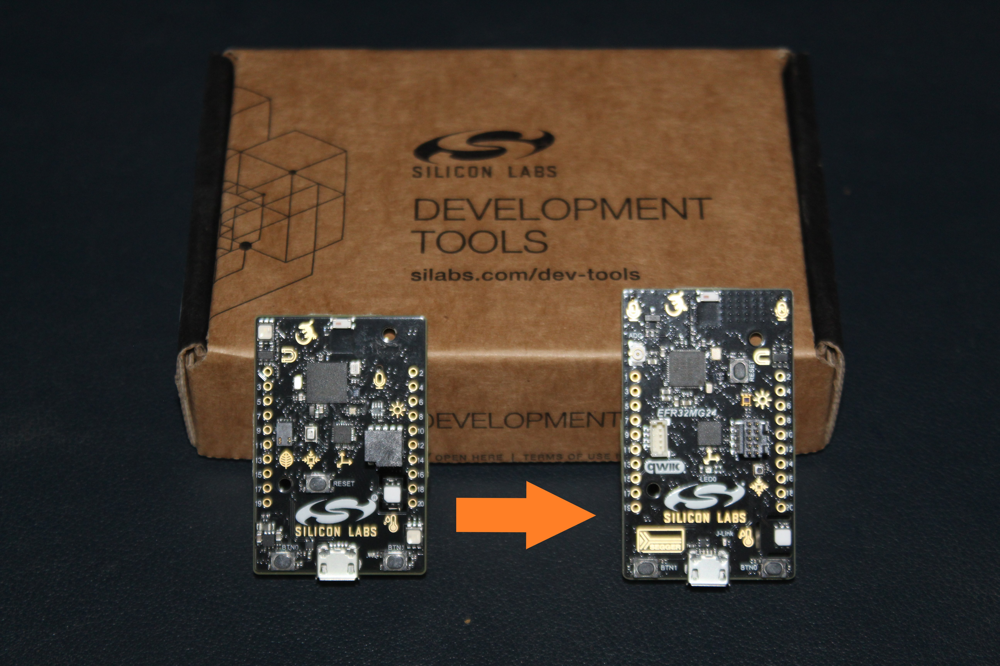
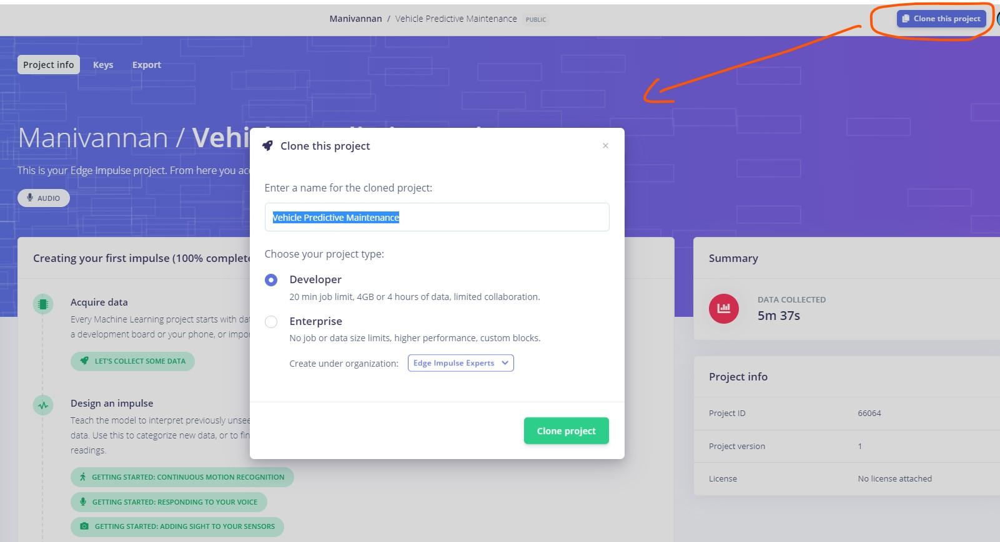
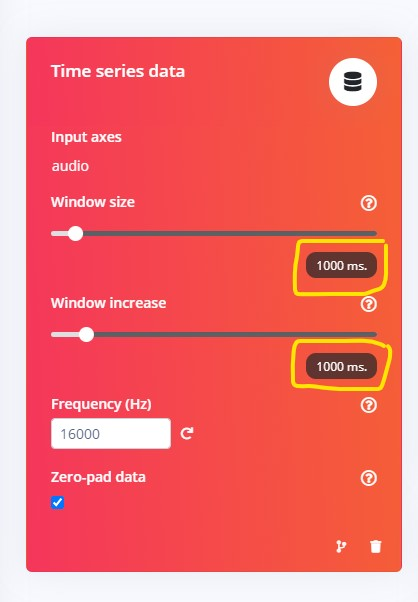
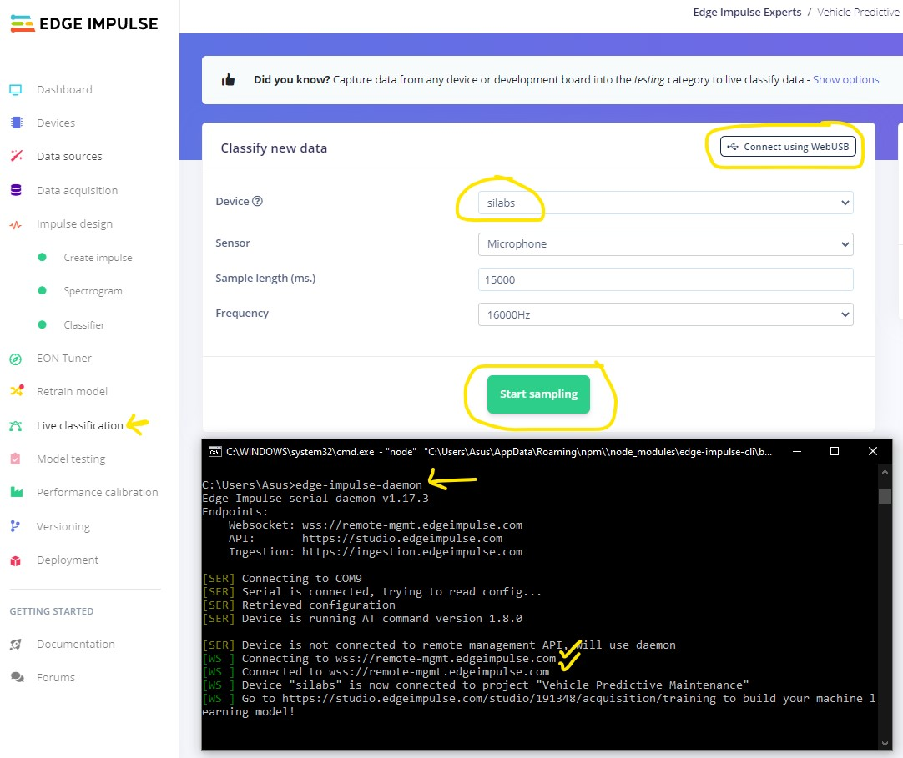

# Porting a Audio Recognition Project from the SiLabs Thunderboard Sense 2 to xG24 Dev Kit

Created By:
Pratyush Mallick 

Public Project (to Clone):
[https://studio.edgeimpulse.com/public/66064/latest](https://studio.edgeimpulse.com/public/66064/latest)

## Intro

This project focuses on how to port the existing audio recognition project built with thunderboard-sense-2 to the latest [EFR32MG24](https://www.silabs.com/wireless/zigbee/efr32mg24-series-2-socs). For demostration we would be porting [Manivannan Sivan's](https://www.hackster.io/manivannan) had created a project ["Vehicle Predictive Maintenance"](https://www.hackster.io/manivannan/vehicle-predictive-maintenance-cf2ee3) 
which is Edge Impulse based TinyML model to predict various vehicle failures like faulty drive shaft, Brake pad noises. Check out his work for more information.

Since, the audio sensor in thunderboard-sense-2 board and xG24 are the same (TDK InvenSense ICS-43434) ideally we're not required to collect any new data from xg24-devkit for model to work properly.
However, note has to be traken the xG24 has two microphones phones placed at the edged of the board. 
In this project, I am going to walk you through how you can clone his Public Edge Impulse project for thunderboard-sense-2 board, build it for xG24, test it out, deploy to the newer SiLabs xG24 device instead.



## Installing Dependencies

Before you proceed further, there are few other software packages you need to install.

- Edge Impulse CLI - Follow [this link](https://docs.edgeimpulse.com/docs/edge-impulse-cli/cli-installation) to install necessary tooling to interact with the Edge Impulse Studio and also run inference on the board. 
- Simplicity Studio 5 - Follow [this link](https://www.silabs.com/developers/simplicity-studio) to install the IDE
- Simplicity Commander - Follow [this link](https://community.silabs.com/s/article/simplicity-commander?language=en_US) to install the software. This will be required to flash firmware to the xG24 board.

## Clone And Build

If you don't have an Edge Impulse account, signup for free and log into [Edge Impulse](https://studio.edgeimpulse.com/). 
Then visit the below [Public Project](https://docs.edgeimpulse.com/docs/edge-impulse-studio/dashboard#1.-showcasing-your-public-projects-with-markdown-readmes) to get started.

[https://studio.edgeimpulse.com/public/66064/latest](https://studio.edgeimpulse.com/public/66064/latest)

Click on the "Clone" button at top-right corner of the page.

That will bring you to the below popup tab. Enter a name for your clone project, and click on the "Clone project" button.



This action shall clone all the collected data, model parameter, everything, into your own Edge Impulse Studio. You can verify by looking at the project name you entered earlier. 
Now if you navigate to "Create impulse" from the left menu, you will see how the model was created originally.


As you can see, the model was created based on audio data sampled at 16KhZ. Since the audio microphones used on the both board boards are same, we're not required to collect any additional data from the new board. 
However, if you want to collect some data from xG24, they would have to flash the base firmware and then use edge-impulse-daemon to connect the device to studio. 
You can follow the guide below to get this all done: 
["Edge Impulse xG24 Dev Kit Guide"](https://docs.edgeimpulse.com/docs/development-platforms/officially-supported-mcu-targets/silabs-xg24-devkit).

With default value of Window Size (10s) and Window Increase (500 ms), the processiong block shall throw as errow as represented below:


As the features in edge impulse processing block has been updated since this project was create, we you would need to update some of paramaters in the timer series block such as Window Size and Window Increase
or increase the frame stride parameter in the MFE processing block. This is what my updated window parameters look like.



If you added some new data and not sure of the model design, then EON tuner can come to the rescue. You have to just the select the target device as SiLabs EFR32MG24 (Cortex-M33 78MHz) and
configure you desired paramters and edge impulse tuner should come up with suggested architetures which you can use.


Next, navigate to "Classification" tab from the left menu and click on "Start training". 


Alternatively, you can also collect more data and train the model to identify other audio classes. You need to follow this guide:
["Edge Impulse xG24 Dev Kit Guide"](https://docs.edgeimpulse.com/docs/development-platforms/officially-supported-mcu-targets/silabs-xg24-devkit).

## Test

When you are done training, navigate to the "Live Classification" page from the left menu. This feature of edge impulse comes in handy especiially when migrating the project to different boards.
Rather than deploying the model and then testing it on the hardware, with this feature we can actually collect audio data from the hardware and run the model in the studio on the collected data.
This saves time and effort before hand. 

For the supported edge impulse board we can directly download the base edge impulse firmware and we can directly record audio data from the target.
Please follow the tutorial to get the latest firmware and connect the xG24 to the edge impulse studio:
["Edge Impulse xG24 Dev Kit Guide"](https://docs.edgeimpulse.com/docs/development-platforms/officially-supported-mcu-targets/silabs-xg24-devkit)

Once done, you can select the device name, select the sensor as "Microphone", sample length and the sampling frequency (ideally equally to collected samples).


Alternatively you can use ["Web Usb"](https://www.edgeimpulse.com/blog/collect-sensor-data-straight-from-your-web-browser) to collect data, if you don't want to install any tools.

## Deploy
When you are done retraining, navigate to the "Deployment" tab from the left menu, select "SiLabs xG24 Dev Kit" under "Build firmware", then click on the "Build" button at the bottom of the page. 
This will build your model and download a .zip file containing a `.hex` file and instructions.


With thunder board sense the deploymend could be done through directly dragging and dropping in the usb driver TB004. However, for xG24 we have to use simplicity commander to
upload the firmware to the board. You would need to first connect the xG24 board the PC. Mark the COM port for the board, ideally should pop up as J-Link UART port. 
Now open the Simplicity Commander tool and connect the board. Once connected, select the "flash" option on the left and then select the downloaded .hex file and flash it on to the board.

https://user-images.githubusercontent.com/45755431/223307262-30fa606c-8448-47f6-9889-bb488f6fb934.mp4

To star the inferenceing run the fowlling command in you terminal:
```
edge-impulse-run-impulse
```

Note that this is updated command supported by edge impulse cli, hence you would need to update your edge-impulse-cli version to get this running and avoid packages mismatch as shown below:


Now your model should recognize the same audio data and inferencing on different hardware platform xG24 dev kit, with little to no modifications to actual data or to the model architecture.
This higlights the platform agnostic nature of edge impulse ecosystem and mostly held true because sensors available for both the boards (Thunderboard and xG24) are comparable or somewhat better. 
Having said that, you would need do your own due diligence for migrating projects build with other sensor data such as humidity/temperature or light sensor.

One final note is that in this project, the xG24 is roughly 2x as fast as the Thunderboard Sense 2 in running DSP part and 8x in running the inference:


Hopefully this makes upgrading your SiLabs projects easier!


