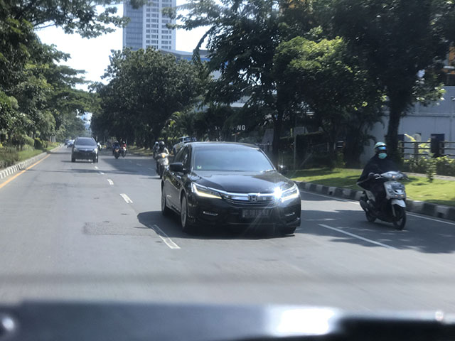
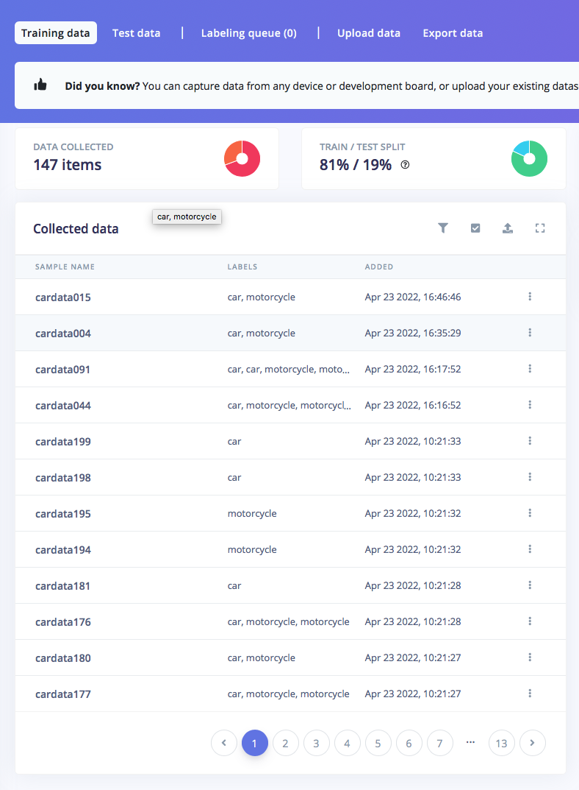
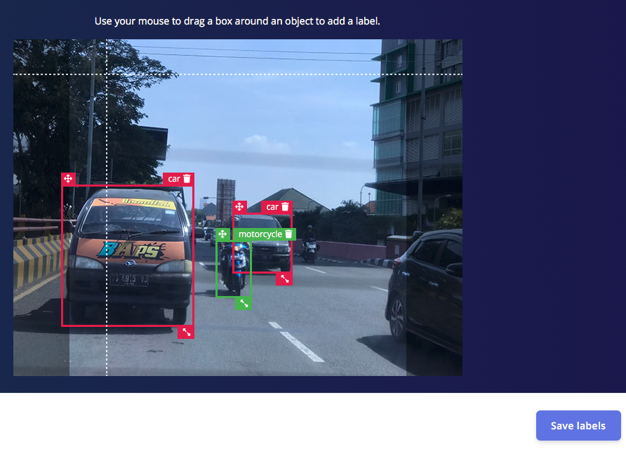
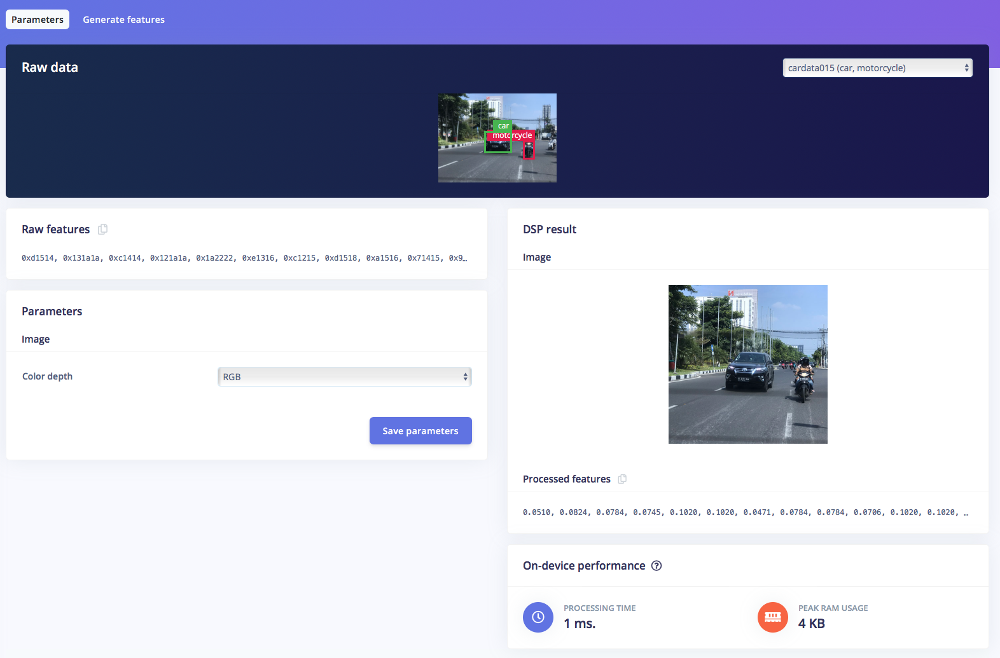
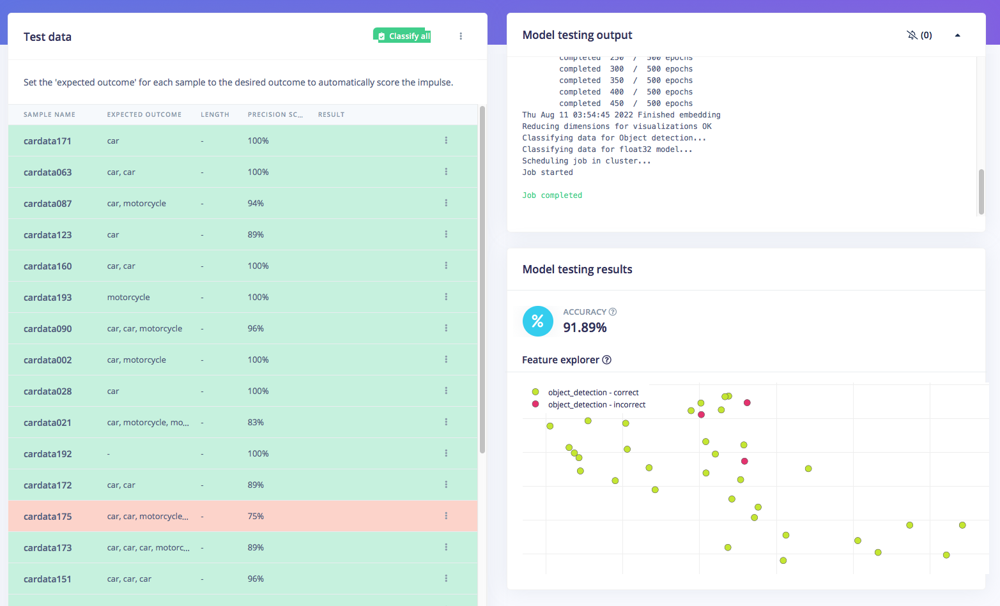

# Bicycle Rearview Radar with a Raspberry Pi

Created By:
Samuel Alexander 

Public Project Link:
[https://studio.edgeimpulse.com/public/96989/latest](https://studio.edgeimpulse.com/public/96989/latest)

## Project Demo



## About this Project

This embedded machine learning project focuses on visual object detection that can detect and differentiate between a car and a motorcycle. A camera is positioned under a bicycle saddle to see the rear view, and can replace the need for a rearview mirror.


The image data is collected by taking pictures from a car using a smartphone camera pointing backwards, this allows you to take images of the road / environment, cars, and motorcycles.

By selecting 320x320 pixels, RGB parameter, and Image and Object Detection learning blocks, the model can be expected to differentiate 2 output layers (car, motorcycle). The model should also be capable of obtaining the dimension of the Bounding Boxes, so based on the size and coordinate of the boxes, the distance and position of the car or motorcycle can be estimated.

MobileNetV2 SSD FPN lite 320x320 is selected in the Edge Impulse Studio and deployed to a Raspberry Pi 4 which is mounted on the bicycle top tube. An additional Python program is created, to take the Edge Impulse model and show output on a LED matrix 8x8 (SenseHAT) on the Pi 4. The LED matrix will display different colors to differentiate between a car and a motorcycle, and its distance and position.


### Hardware Components:

 - Raspberry Pi 4 Model B 
 - USB webcam
 - Sense HAT for Raspberry Pi
 - Powerbank / battery

### Software/Apps & Online Services:

 - Edge Impulse Studio 
 - Raspberry Pi OS
 - Terminal

### Others:

 - 3D printed case for Pi4 with Sense HAT on bike’s top-tube

## Steps

### Preparation:

Prepare the Raspberry Pi, connect via SSH, install dependencies, and the Edge Impulse for Linux CLI. Follow [this guide](https://docs.edgeimpulse.com/docs/development-platforms/officially-supported-cpu-gpu-targets/raspberry-pi-4) for extra details.

### Data Collection:

To simulate the rearview, I took pictures from the backseat of a car to take photos of other vehicles and their  surroundings. In order to obtain enough variety of vehicles types, colors, vehicle position, and different ambience, be sure to take lots of pictures.





### Data Labeling:

Click on Labeling with BoundingBoxes method, and choose Raspberry Pi 4 for latency calculations.

Then Upload your images, and then drag a box around each object and label it (car or motorcycle). Split or auto split all Training & Test data around 80/20.



### Train and Build Model:

Create an Impulse with 320x320 pixels and RGB parameter, and choose Image and Object Detection blocks. By using the  MobileNetV2 SSD FPN-lite 320x320 model, it will be able to output the object type (car and motorcycle) with a pretty accurate result. Using a YOLO method, the Bounding Box is also obtained, so we can create an estimation of how near or far away the vehicles are located. After getting the desired outcome during testing, the model is ready to be deployed to the Raspberry Pi 4.







### Deploy and Build the Python Program:

```
            for res, img in runner.classifier(videoCaptureDeviceId):
                if (next_frame > now()):
                    time.sleep((next_frame - now()) / 1000)

                # print('classification runner response', res)

                if "classification" in res["result"].keys():
                    print('Result (%d ms.) ' % (res['timing']['dsp'] + res['timing']['classification']), end='')
                    for label in labels:
                        score = res['result']['classification'][label]
                        print('%s: %.2f\t' % (label, score), end='')
                    print('', flush=True)

                elif "bounding_boxes" in res["result"].keys():
                    print('Found %d bounding boxes (%d ms.)' % (len(res["result"]["bounding_boxes"]), res['timing']['dsp'] + res['timing']['classification']))
                    sense.clear()
                    for bb in res["result"]["bounding_boxes"]:
                        print('\t%s (%.2f): x=%d y=%d w=%d h=%d' % (bb['label'], bb['value'], bb['x'], bb['y'], bb['width'], bb['height']))
                        img = cv2.rectangle(img, (bb['x'], bb['y']), (bb['x'] + bb['width'], bb['y'] + bb['height']), (255, 0, 0), 1)
                        mul = {'motorcycle': 1.5, 'car': 1.0}[bb['label']]
                        ledx = max(0, min(7, floor((sqrt(bb['width'] * bb['height'] * mul) - 60) / -70 * 8 + 8)))
                        ledy = max(0, min(7, floor((bb['x'] + bb['width'] / 2) / 320 * 8)))
                        colours = {'motorcycle': (255, 255, 0), 'car': (255, 0, 0)}
                        colour = colours[bb['label']]
                        sense.set_pixel(ledx, ledy, colour)

                if (show_camera):
                    cv2.imshow('edgeimpulse', cv2.cvtColor(img, cv2.COLOR_RGB2BGR))
                    if cv2.waitKey(1) == ord('q'):
                        break
```

## Real-world Test:

Finally, this embedded object detection project is able to be used in the real world. It serves as a possible application of embedded AI in our daily lives, in this case it is to help check for vehicles coming from behind when we are cycling.


