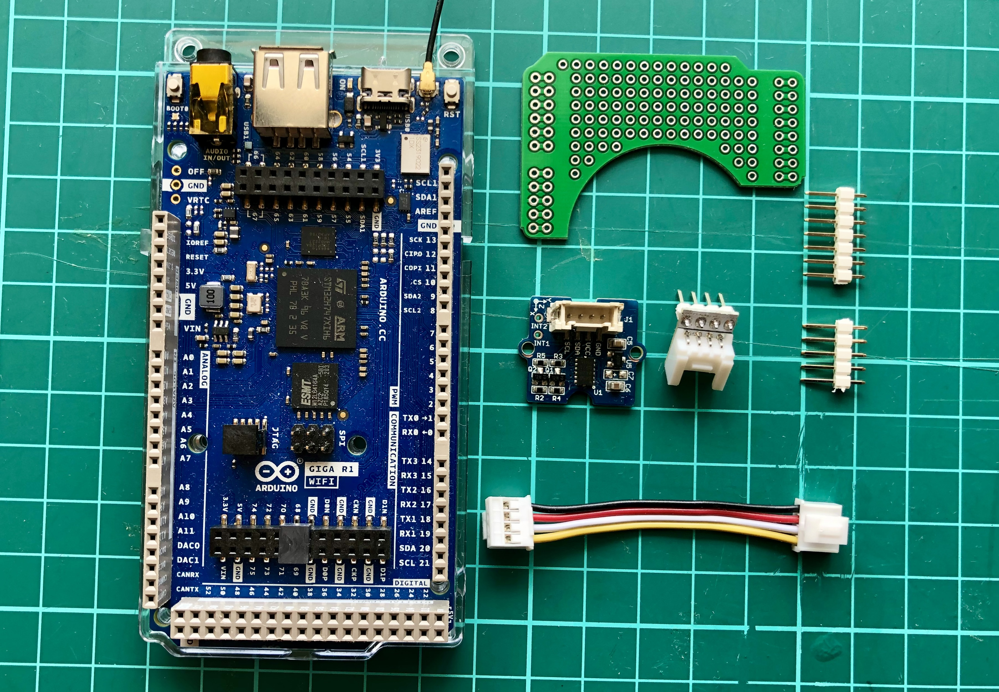
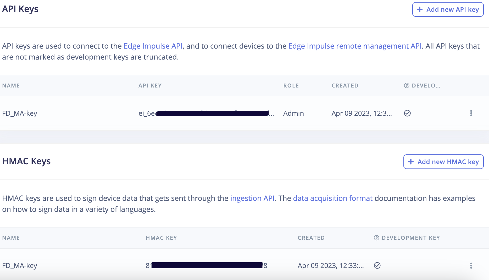
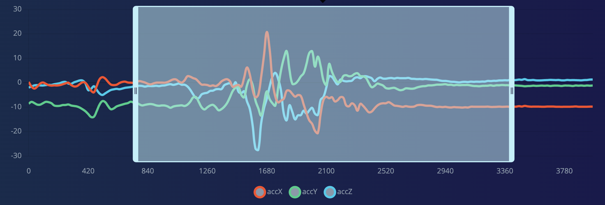
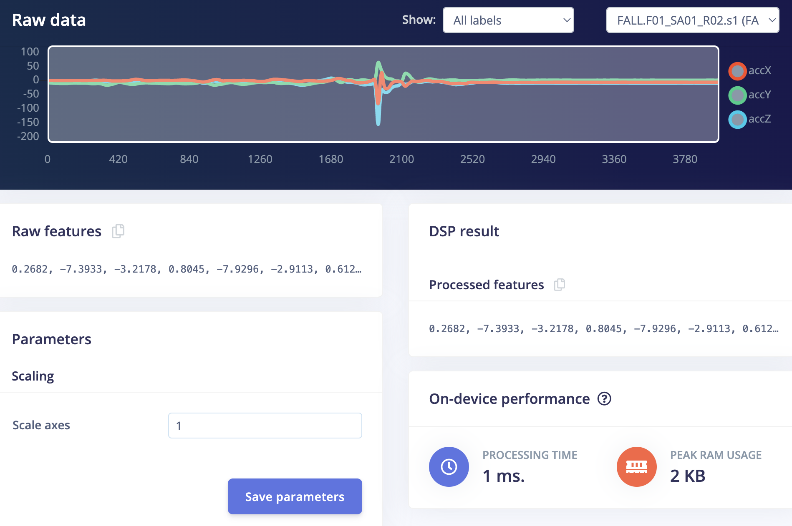
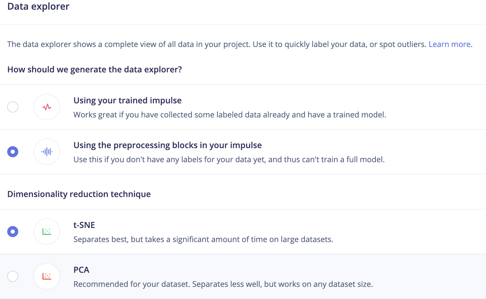
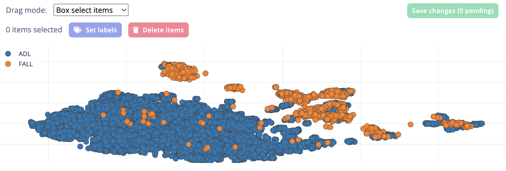
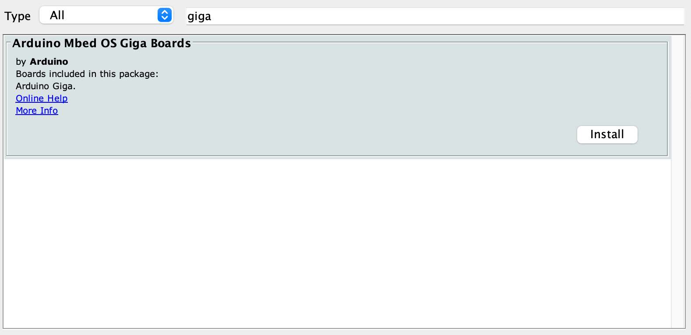

# Fall Detection using a Transformer Model with Arduino Giga R1 WiFi

Created By:
Naveen Kumar 

Public Project Link:
[https://studio.edgeimpulse.com/public/208622/latest](https://studio.edgeimpulse.com/public/208622/latest)


## Overview

Falls are a major health concern for older people. The number of fall-related deaths increased significantly in recent years, of which around 80% involved persons aged over 65 years. Falls can result in physical and psychological trauma, especially for the elderly. To improve the quality of life of our seniors this project presents the development of a fall-detection wearable device. The main aim of this project is to showcase a working demo of an edge AI device that uses a Transformer-based model.

## What is a Transformer model?

A Transformer is a deep learning model that adopts the mechanism of self-attention, differentially weighting the significance of each part of the input data.  Self-attention, sometimes called intra-attention is an attention mechanism relating different positions of a single sequence to compute a representation of the sequence. Like recurrent neural networks (RNNs), transformers are designed to process sequential input data with applications for tasks such as translation and text summarization. However, unlike RNNs, transformers process the entire input all at once. The ChatGPT, a large language model, also uses Transformer blocks in its architecture. In this project, the Transformer model is applied to time-series data instead of natural language. 

## Hardware Selection

This project requires a low-powered yet capable MCU to run a Transformer model with a reasonable inferencing rate. The Arduino Giga R1 is a good fit for our purpose since it has a powerful MCU with plenty of memory size.  Also, we will be using the SeeedStudio Grove 3-axis accelerometer (ADXL345) and a proto-board shield to connect the accelerometer firmly to the development board.



## Development Environment 

We will be using Edge Impulse Studio for model creation and training. We would need to sign up for a free account at https://studio.edgeimpulse.com and create a project to get started. 

## Training dataset

Collecting data for different kinds of activities of daily living (ADL) and falls is a time-consuming and laborious task. It needs many people from different age groups and requires a lot of man-hours to curate the datasets. Fortunately, there are many high-quality public datasets available for similar kinds of data. We have used the **SisFall: A Fall and Movement Dataset**, which is a dataset of falls and ADL acquired with an accelerometer. The dataset contains 19 types of ADLs and 15 types of falls. It includes acceleration and rotation data from 38 volunteers divided into two groups: 23 adults between 19 and 30 years old, and 15 elderly people between 60 and 75 years old. Data were acquired with three sensors (2 accelerometers and 1 gyroscope) at a frequency sample of 200 Hz. For this project, We are using acceleration data from one of the sensors. Also, I am using the same accelerometer ADXL345 with the same configuration which was used for data collection. The datasets are available in the raw format and can be downloaded from the link given in the paper below.

[https://www.ncbi.nlm.nih.gov/pmc/articles/PMC5298771/](https://www.ncbi.nlm.nih.gov/pmc/articles/PMC5298771/)

The data sample is given below. Only the first 3 columns are used which are 3-axis accelerometer data from the ADXL345 sensor.

```
34,-259, -74, -38, 20, -3, 50,-987,-132;
36,-258, -73, -36, 19, -2, 52,-986,-130;
32,-257, -68, -37, 21, -1, 54,-993,-130;
37,-260, -73, -36, 22, -1, 51,-992,-131;
34,-259, -74, -34, 20,  0, 51,-992,-128;
35,-264, -79, -33, 21, -1, 52,-991,-133;
35,-261, -68, -30, 21,  0, 52,-992,-128;
33,-257, -67, -27, 21, -1, 51,-993,-126;
34,-263, -70, -26, 21,  0, 50,-993,-127;
35,-261, -76, -24, 21,  1, 51,-994,-130;
33,-261, -70, -24, 21,  0, 55,-992,-124;
36,-260, -68, -23, 20, -1, 51,-994,-126;
```

Each 3-axis accelerometer data (x, y, z) are converted to gravity using the following conversion equation.

```
Resolution: 13 (13 bits)
Range: 16 (+-16g)

Acceleration [g]: [ ( 2 * Range ) / ( 2 ^ Resolution ) ] * raw_acceleration
```

## Uploading data to Edge Impulse Studio 

We need to create a new project to upload data to Edge Impulse Studio.


Also, we would need the API and HMAC keys for the Edge Impulse Studio project to generate signatures for the data acquisition format. We can copy the keys from the **Dashboard** > **Keys** [tab] at Edge Impulse Studio dashboard.



The accelerometer data are divided into two classes, **ADL** and **FALL**, and are converted to m/s^2 before uploading to the Edge Impulse Studio. Below is the Python script that converts the raw accelerometer data into the data acquisition JSON format required by the Edge Impulse studio.

```
python
import json
import time, hmac, hashlib
import glob
import os
import time

HMAC_KEY = "<hmac_key>"

# Empty signature (all zeros). HS256 gives 32 byte signature, and we encode in hex, so we need 64 characters here
emptySignature = ''.join(['0'] * 64)

def get_x_filename(filename):
    m_codes = ['D01', 'D02', 'D03', 'D04', 'D05', 'D06', 'D07', 'D08', 'D09', 'D10', 'D11', 'D12', 'D13', 'D14', 'D15', 'D16', 'D17', 'D18', 'D19']
    f_codes = ['F01', 'F02', 'F03', 'F04', 'F05', 'F06', 'F07', 'F08', 'F09', 'F10', 'F11', 'F12', 'F13', 'F14', 'F15']
    code = filename.split('_')[0]
    label = ''
    if code in m_codes:
        label = 'ADL'
    if code in f_codes:
        label = 'FALL'
    if label == '':
        raise Exception('label not found')
    x_filename = './data/{}.{}.json'.format(label, os.path.splitext(filename)[0])
    return x_filename 

if __name__ == "__main__":
    files = glob.glob("../SisFall_dataset/*/*.txt")
    CONVERT_G_TO_MS2 = 9.80665

    for index, path in enumerate(files):
        filename = os.path.basename(path)
        values = []
        with open(path) as infile:
            line_num = 0
            for line in infile:
                line = line.strip()
                if line and (line_num % 4 == 0):
                    row  = line.replace(" ", "") 
                    cols = row.split(',')
                    ax = ((2 * 16) / (2 ** 13)) * float(cols[0]) * CONVERT_G_TO_MS2 
                    ay = ((2 * 16) / (2 ** 13)) * float(cols[1]) * CONVERT_G_TO_MS2
                    az = ((2 * 16) / (2 ** 13)) * float(cols[2]) * CONVERT_G_TO_MS2
                    values.append([ax, ay, az])
                line_num += 1

        if (len(values) == 0):
            continue
    
        data = {
            "protected": {
                "ver": "v1",
                "alg": "HS256",
                "iat": time.time() # epoch time, seconds since 1970
            },
            "signature": emptySignature,
            "payload": {
                "device_name": "aa:bb:ee:ee:cc:ff",
                "device_type": "generic",
                "interval_ms": 20, # 50 Hz
                "sensors": [
                    { "name": "accX", "units": "m/s2" },
                    { "name": "accY", "units": "m/s2" },
                    { "name": "accZ", "units": "m/s2" }
                ],
                "values": values
            }
        }
    
        # encode in JSON
        encoded = json.dumps(data)
        # sign message
        signature = hmac.new(bytes(HMAC_KEY, 'utf-8'), msg = encoded.encode('utf-8'), digestmod = hashlib.sha256).hexdigest()
        # set the signature again in the message, and encode again
        data['signature'] = signature
        encoded = json.dumps(data)
        x_filename = get_x_filename(filename)
        with open(x_filename, 'w') as fout:
            fout.write(encoded)
```

To execute the script above save it to *format.py* and run the commands below. It is assumed that the SisFall dataset has been downloaded to the SisFall_dataset directory.

```
sh
$ mkdir data
$ python3 format.py
```

The converted data acquisition JSON is shown below. The sample rate is reduced to 50 Hz which is sufficient to predict fall events and also helps in reducing the model size, therefore interval_ms is set to 20 (ms).

```
{
  "protected": {
    "ver": "v1",
    "alg": "HS256",
    "iat": 1646227572.4969049
  },
  "signature": "3a411ca804ff73ed07d41faf7fb16a8174a58a0bef9adc5cee346f0bc3261e90",
  "payload": {
  "device_name": "aa:bb:ee:ee:cc:ff",
  "device_type": "generic",
  "interval_ms": 20,
  "sensors": [
    {
      "name": "accX",
      "units": "m/s2"
    },
    {
      "name": "accY",
      "units": "m/s2"
    },
    {
      "name": "accZ",
      "units": "m/s2"
    }
  ],
  "values": [
      [
        0.0383072265625,
        -9.95987890625,
        -2.3367408203125
      ],
      [
        -0.0383072265625,
        -9.9215716796875,
        -2.4516625
      ],
      [
        -0.1149216796875,
        -9.95987890625,
        -2.375048046875
      ],
      ...
    ]
  }
}
```

The data is uploaded using the Edge Impulse CLI. Please follow the instructions to install the CLI here: https://docs.edgeimpulse.com/docs/cli-installation.

The JSON files are prefixed with the label name (e.g. FALL.F10_SA07_R01.json) by the script above so that the label name is inferred automatically by the CLI. The command below is used to upload all JSON files to training datasets.

```
sh
$ edge-impulse-uploader --category training data/*.json
```

We could have used **--category split** to automatically split the data into training and testing datasets, but we need to segment the sample so it is uploaded there for convenience. We can see the uploaded datasets on the Edge Impulse Studio's **Data Acquisition** page.


The uploaded **FALL** event data have mixed motion events before and after the fall event which are removed by splitting the segments. The **ADL** category data are used without any modifications.



We can do a split by selecting each sample and clicking on the **Split sample** from the drop-down menu, but it is time-consuming and tedious work. Fortunately, there is an Edge Impulse SDK API that can be used to automate the whole process. After some experimentation, we have chosen a 4000 ms segment length which is the optimal length for detecting falls.

```
import json
import requests
import logging
import threading

API_KEY  = "<ei_api_key>"
projectId = "project_id"

headers = {
    "Accept": "application/json",
    "x-api-key": API_KEY
}

def get_sample_len(sampleId):
    url = f'https://studio.edgeimpulse.com/v1/api/{projectId}/raw-data/{sampleId}'
    response = requests.request("GET", url, headers=headers)
    resp =  json.loads(response.text)
    return resp['sample']['totalLengthMs']

def get_segments(sampleId):
    url = f'https://studio.edgeimpulse.com/v1/api/{projectId}/raw-data/{sampleId}/find-segments'
    payload = {
        "shiftSegments": False,
        "segmentLengthMs": 4000
    }
    response = requests.request("POST", url, json=payload, headers=headers)
    return json.loads(response.text)["segments"] 

def crop_sample(sampleId):
    sample_len = get_sample_len(sampleId)
    cropStart  = 200
    cropEnd    = int(sample_len/5)
    payload    = {"cropStart": cropStart, "cropEnd": cropEnd}
    #print(payload)
    url        = f'https://studio.edgeimpulse.com/v1/api/{projectId}/raw-data/{sampleId}/crop'
    response   = requests.request("POST", url, json=payload, headers=headers)
    resp =  json.loads(response.text)
    if resp['success']:
        logging.info(f'Crop: {sampleId}')
    else:
        logging.error(f'Crop: {sampleId} {resp["error"]}')

def segment(tid, ids):
    for sampleId in ids:
        try:
            crop_sample(sampleId)
            segments = get_segments(sampleId)
            
            if len(segments) > 0:
                payload = {"segments": segments}
                url = f'https://studio.edgeimpulse.com/v1/api/{projectId}/raw-data/{sampleId}/segment'
                response = requests.request("POST", url, json=payload, headers=headers)
                resp =  json.loads(response.text)
                if resp['success']:
                    logging.info(f'Segment: {tid} {sampleId}')
                else:
                    logging.error(f'Segment: {tid} {sampleId} {resp["error"]}')
        except Exception as e:
            logging.error(f'Segment: exception {sampleId}')
            continue 

def get_id_list():
    querystring = {"category":"testing", "excludeSensors":"true", "labels": '["FALL"]'}
    url = f'https://studio.edgeimpulse.com/v1/api/{projectId}/raw-data'
    response = requests.request("GET", url, headers=headers, params=querystring)

    resp = json.loads(response.text)
    id_list = list(map(lambda s: s["id"], resp["samples"]))

    return id_list
 
if __name__ == "__main__":
    format = "%(asctime)s: %(message)s"
    logging.basicConfig(format=format, level=logging.INFO,
                        datefmt="%H:%M:%S")

    id_list = get_id_list()
    logging.info('Sample Count: {}'.format(len(id_list)))

    div = 8
    n = int(len(id_list) / div)
    threads = list()

    for i in range(div):
        if i ==  (div - 1):
            ids = id_list[n*i: ]
        else:
            ids = id_list[n*i: n*(i+1)]

        x = threading.Thread(target=segment, args=(i, ids))
        threads.append(x)
        x.start()

    for thread in threads:
        thread.join()

    logging.info("Finished")
```

To execute the script above save it to a segments.py file and run the command below.

```
sh
$ python3 segments.py
```

After segmenting the dataset we can split it into training and testing sets by clicking the **Perform train / test split** button on the Edge Impulse Studio dashboard.


## Create Impulse

Go to the **Impulse Design** > **Create Impulse** page, click **Add a processing block**, and then choose **Raw Data**, which uses the data without pre-processing and relies on deep learning to learn features. Also, on the same page, click **Add a learning block**, and choose **Classification**, which learns patterns from data and can apply these to new data. We have chosen a 4000ms Window size and a 4000ms Window increase, which means we are using a single frame. Now click on the **Save Impulse** button.


Next, go to the **Impulse Design** > **Raw Data** page and click the **Save parameters** button.


Clicking on the **Save parameters** button redirects to another page where we should click on the **Generate Feature** button. It usually takes a couple of minutes to complete feature generation.


In the case of the Raw data processing block, the feature generation does not change the data. It divides them into given windows size only. In the image below, we can see the Raw features and the Processed features are the same.



 We can see the complete view of all data on the **Dashboard** > **Data Explorer** page.





To define the neural network architecture,  go to the **Impulse Design** > **Classifier** page and click on the **Switch to Keras(expert) mode** as shown below.


## Model Creation and Training

The key building block of a Transformer model is the Keras[ MultiHeadAttention](https://keras.io/api/layers/attention_layers/multi_head_attention/) layer. As part of a recent release the Edge Impulse SDK now supports this layer. The Transformer based models are usually large models. The Arduino Giga R1 WiFi has 1 MB RAM divided into 2 cores (M7/M4). The main core (M7) has 512 KB RAM. To fit the model into the available memory with other overheads we needed to slim down the architecture by defining 1 transformer block with 2 attention heads (size = 64). Also, reducing the dimension (units) of the penultimate Dense layer helps in keeping the model size within the limits. The aforementioned hyperparameters have been chosen after many training trials and keeping the optimal model size without losing much accuracy. 

The 4000ms of 3-axis accelerometer raw time-series data are fed into the Input layer. We have added a Normalize layer with pre-calculated mean and variance for each channel from the training datasets. The Transformer model is capable to learn features from the raw time series data while training.

 Below is the final model summary.

```
____________________________________________________________________________________________
 Layer (type)                   Output Shape         Param #     Connected to                     
============================================================================================
 input_1 (InputLayer)           [(None, 600)]        0           []                               
                                                                                                  
 reshape (Reshape)              (None, 200, 3)       0           ['input_1[0][0]']                
                                                                                                  
 normalization (Normalization)  (None, 200, 3)       0           ['reshape[0][0]']                
                                                                                                  
 layer_normalization (LayerNorm  (None, 200, 3)      6           ['normalization[0][0]']          
 alization)                                                                                       
                                                                                                  
 multi_head_attention (MultiHead (None, 200, 3)      1923        ['layer_normalization[0][0]',    
 dAttention)                                                      'layer_normalization[0][0]']    
                                                                                                  
 dropout (Dropout)              (None, 200, 3)       0           ['multi_head_attention[0][0]']   
                                                                                                  
 tf.__operators__.add (TFOpLamb  (None, 200, 3)      0           ['dropout[0][0]',                
 da)                                                              'normalization[0][0]']          
                                                                                                  
 layer_normalization_1 (LayerNo  (None, 200, 3)      6           ['tf.__operators__.add[0][0]']   
 rmalization)                                                                                     
                                                                                                  
 conv1d (Conv1D)                (None, 200, 4)       16          ['layer_normalization_1[0][0]']  
                                                                                                  
 dropout_1 (Dropout)            (None, 200, 4)       0           ['conv1d[0][0]']                 
                                                                                                  
 conv1d_1 (Conv1D)              (None, 200, 3)       15          ['dropout_1[0][0]']              
                                                                                                  
 tf.__operators__.add_1 (TFOpLa  (None, 200, 3)      0           ['conv1d_1[0][0]',               
 mbda)                                                            'tf.__operators__.add[0][0]']   
                                                                                                  
 global_average_pooling1d (Glob  (None, 200)         0           ['tf.__operators__.add_1[0][0]'] 
 alAveragePooling1D)                                                                              
                                                                                                  
 dense (Dense)                  (None, 32)           6432        ['global_average_pooling1d[0][0]'
                                                                 ]                                
                                                                                                  
 dropout_2 (Dropout)            (None, 32)           0           ['dense[0][0]']                  
                                                                                                  
 dense_1 (Dense)                (None, 2)            66          ['dropout_2[0][0]']              
                                                                                                  
============================================================================================
Total params: 8,464
Trainable params: 8,464
Non-trainable params: 0
___________________________________________________________________________________________
```


The complete training code is given below.

```
python
import tensorflow as tf
from tensorflow.keras import Model
from tensorflow.keras.layers import Dense, Input, MultiHeadAttention, Reshape, Dropout, GlobalAveragePooling1D, Conv1D, LayerNormalization, Normalization
from tensorflow.keras.optimizers import Adam

EPOCHS = 10
LEARNING_RATE = 0.0005
BATCH_SIZE = 32

# model architecture
def transformer_encoder(inputs, head_size, num_heads, ff_dim, dropout=0):
    # Normalization and Attention
    x = LayerNormalization(epsilon=1e-6)(inputs)
    x = MultiHeadAttention(
        key_dim=head_size, num_heads=num_heads, dropout=dropout
    )(x, x)
    x = Dropout(dropout)(x)
    res = x + inputs

    # Feed Forward Part
    x = LayerNormalization(epsilon=1e-6)(res)
    x = Conv1D(filters=ff_dim, kernel_size=1, activation="relu")(x)
    x = Dropout(dropout)(x)
    x = Conv1D(filters=inputs.shape[-1], kernel_size=1)(x)
    return x + res
    
def build_model(
    input_shape,
    head_size,
    num_heads,
    ff_dim,
    num_transformer_blocks,
    mlp_units,
    dropout=0,
    mlp_dropout=0,
):
    inputs = Input(shape=input_shape)
    x = Reshape([int(input_length/3), 3])(inputs)
    # pre-calculated mean and variance
    x = Normalization(axis=-1, mean=[-0.047443, -6.846333, -1.057524], variance=[16.179484,  33.019396,  22.892909])(x)
    
    for _ in range(num_transformer_blocks):
        x = transformer_encoder(x, head_size, num_heads, ff_dim, dropout)

    x = GlobalAveragePooling1D(data_format="channels_first")(x)
    for dim in mlp_units:
        x = Dense(dim, activation="relu")(x)
        x = Dropout(mlp_dropout)(x)
    outputs = Dense(classes, activation="softmax")(x)
    return Model(inputs, outputs)
    
input_shape = (input_length, )

model = build_model(
    input_shape,
    head_size=64,
    num_heads=2,
    ff_dim=4,
    num_transformer_blocks=1,
    mlp_units=[32],
    mlp_dropout=0.40,
    dropout=0.25,
)

# this controls the learning rate
opt = Adam(learning_rate=LEARNING_RATE, beta_1=0.9, beta_2=0.999)
callbacks.append(BatchLoggerCallback(BATCH_SIZE, train_sample_count, epochs=EPOCHS))

# train the neural network
model.compile(loss='categorical_crossentropy', optimizer=opt, metrics=['accuracy'])

model.summary()

train_dataset = train_dataset.batch(BATCH_SIZE, drop_remainder=False)
validation_dataset = validation_dataset.batch(BATCH_SIZE, drop_remainder=False)

model.fit(train_dataset, epochs=EPOCHS, validation_data=validation_dataset, verbose=2, callbacks=callbacks)

disable_per_channel_quantization = False
```

Now click the **Start Training** button and wait a few minutes until the training is completed. We can see the training results below. The quantized (int8) model has **96.4%** accuracy.


## Testing

We can test the model on the test datasets by going to the **Model testing** page and clicking on the **Classify All** button. The model has **97.32%** accuracy on the test datasets, so we are confident that the model should work on new data.


## Deployment

At the **Deployment** page, we will choose the **Create Library** > **Arduino library** option. 


For the **Select optimizations** option, we will choose **Enable EON Compiler**, which reduces the memory usage of the model. Also, we will opt for the Quantized (Int8) model. 


Now click the **Build** button, and in a few seconds the library bundle will be downloaded to your local computer.

## Run Inferencing

Please follow the instructions [here ](https://www.arduino.cc/en/software)to download and install Arduino IDE. After installation, open the Arduino IDE and install the board package for the **Arduino Giga R1 WiFi** by going to **Tools** > **Board** > **Boards Manager**. Search the board package as shown below and install it.



After the board package installation is completed, choose the **Arduino Giga R1** from **Tools** > **Board** >  **Arduino Mbed OS Giga boards** menu and select the serial port of the connected board from **Tools** > **Port** menu. 

Below is the Arduino sketch for inferencing. For continuous motion event detection, the application uses two threads on the MCU's main core , one for inferencing and another for data sampling so that no events should miss.

```
c++
#include <Adafruit_Sensor.h>
#include <Adafruit_ADXL345_U.h>
#include <FD_MA_inferencing.h>

#define MAX_ACCEPTED_RANGE 156.91f // m/s^2 for ADXL345  +/- 16g

static bool debug_nn = false;
static uint32_t run_inference_every_ms = 200;
static rtos::Thread inference_thread(osPriorityLow);
static float buffer[EI_CLASSIFIER_DSP_INPUT_FRAME_SIZE] = { 0 };
static float inference_buffer[EI_CLASSIFIER_DSP_INPUT_FRAME_SIZE];

Adafruit_ADXL345_Unified accel = Adafruit_ADXL345_Unified(12345);

/* Forward declaration */
void run_inference_background();

void setup()
{
  Serial.begin(115200);
  delay(500);

  pinMode(LEDR, OUTPUT);
  pinMode(LEDB, OUTPUT);

  Serial.println("Edge Impulse Inferencing using Transformer model");

  if (!accel.begin()) {
    ei_printf("Failed to initialize ADXL345 accelerometer!");
    while (1);
  }  else {
    ei_printf("ADXL345 accelerometer initialized\r\n");
  }

  accel.setRange(ADXL345_RANGE_16_G);
  accel.setDataRate(ADXL345_DATARATE_100_HZ);

  if (EI_CLASSIFIER_RAW_SAMPLES_PER_FRAME != 3) {
    ei_printf("ERR: EI_CLASSIFIER_RAW_SAMPLES_PER_FRAME should be equal to 3 (the 3 sensor axes)\n");
    return;
  }

  inference_thread.start(mbed::callback(&run_inference_background));
}

float ei_get_sign(float number) {
  return (number >= 0.0) ? 1.0 : -1.0;
}


void run_inference_background()
{
  // wait until we have a full buffer
  delay((EI_CLASSIFIER_INTERVAL_MS * EI_CLASSIFIER_RAW_SAMPLE_COUNT) + 100);

  int continous_fall_detected = 0;
  uint64_t last_fall_detected_time = 0;

  while (1) {
    // copy the buffer
    memcpy(inference_buffer, buffer, EI_CLASSIFIER_DSP_INPUT_FRAME_SIZE * sizeof(float));

    // Turn the raw buffer in a signal which we can the classify
    signal_t signal;
    int err = numpy::signal_from_buffer(inference_buffer, EI_CLASSIFIER_DSP_INPUT_FRAME_SIZE, &signal);
    if (err != 0) {
      ei_printf("Failed to create signal from buffer (%d)\n", err);
      return;
    }

    // Run the classifier
    ei_impulse_result_t result = { 0 };

    err = run_classifier(&signal, &result, debug_nn);
    if (err != EI_IMPULSE_OK) {
      ei_printf("ERR: Failed to run classifier (%d)\n", err);
      return;
    }

    ei_printf("Predictions (DSP: %d ms., Classification: %d ms.): \n", result.timing.dsp, result.timing.classification);
    for (size_t ix = 0; ix < EI_CLASSIFIER_LABEL_COUNT; ix++) {
      ei_printf("\t%s: %.5f\n", result.classification[ix].label, result.classification[ix].value);
    }

    // above 70% confidence score
    if (result.classification[1].value > 0.7f) {
      continous_fall_detected += 1;

      if (continous_fall_detected > 2) {
        continous_fall_detected = 0;
        digitalWrite(LEDR, LOW);
        last_fall_detected_time = ei_read_timer_ms();
      }
    } else {
      continous_fall_detected = 0;

      // turn off the led after 5s since last fall detected
      if (ei_read_timer_ms() - last_fall_detected_time >= 5000) {
        digitalWrite(LEDR, HIGH);
      }
    }
    delay(run_inference_every_ms);
  }
}


void loop()
{  
  // Determine the next tick (and then sleep later)
  uint64_t next_tick = micros() + (EI_CLASSIFIER_INTERVAL_MS * 1000);

  // roll the buffer -3 points so we can overwrite the last one
  numpy::roll(buffer, EI_CLASSIFIER_DSP_INPUT_FRAME_SIZE, -3);

  sensors_event_t event;
  accel.getEvent(&event);

  buffer[EI_CLASSIFIER_DSP_INPUT_FRAME_SIZE - 3] = event.acceleration.x; //  m/s^2
  buffer[EI_CLASSIFIER_DSP_INPUT_FRAME_SIZE - 2] = event.acceleration.y; //  m/s^2
  buffer[EI_CLASSIFIER_DSP_INPUT_FRAME_SIZE - 1] = event.acceleration.z; //  m/s^2

  for (int i = 0; i < 3; i++) {
    if (fabs(buffer[EI_CLASSIFIER_DSP_INPUT_FRAME_SIZE - 3 + i]) > MAX_ACCEPTED_RANGE) {
      buffer[EI_CLASSIFIER_DSP_INPUT_FRAME_SIZE - 3 + i] = ei_get_sign(buffer[EI_CLASSIFIER_DSP_INPUT_FRAME_SIZE - 3 + i]) * MAX_ACCEPTED_RANGE;
    }
  }

  // and wait for next tick
  uint64_t time_to_wait = next_tick - micros();
  delay((int)floor((float)time_to_wait / 1000.0f));
  delayMicroseconds(time_to_wait % 1000);
}
```

To run the inferencing sketch, import the downloaded library bundle using the menu **Sketch** > **Include Library** > **Add.ZIP Library** in the Arduino IDE. Create a new sketch with the code above and compile/upload the firmware to the connected Arduino Giga R1 board. We can monitor the inferencing output using the **Tools** > **Serial Monitor** with a baud rate of 115200 bps. The inferencing rate is **142ms** which is pretty impressive.

## Demo

Although the Arduino Giga R1 WiFi has onboard WiFi and Bluetooth chip which can be used to send out alert notifications, for demo purposes, whenever a fall event is detected the onboard red LED turns on. The device is mounted on a belt and worn at the waist. The accelerometer orientation is kept the same (Y-axis downward and Z-axis coming out from the wearer) as when the training data was collected.

(https://www.youtube.com/watch?v=wPJF7lJrIWw)

## Conclusion 

This project presents a proof-of-concept device that is easy to use for elderly people. This project also showcases that a Transformer based neural network can be used to solve complex problems without any signal processing, and can be run on inexpensive, low-powered,  and resource-constrained devices. 
