# Fluid Leak Detection With a Flowmeter and AI 

Created By:
Shebin Jose Jacob

Public Project Link:
[https://studio.edgeimpulse.com/public/166615/latest](https://studio.edgeimpulse.com/public/166615/latest)

GitHub Repository:

[https://github.com/CodersCafeTech/Fluid-Leakage-Detection-With-AI](https://github.com/CodersCafeTech/Fluid-Leakage-Detection-With-AI)

## Project Demo



## Intro

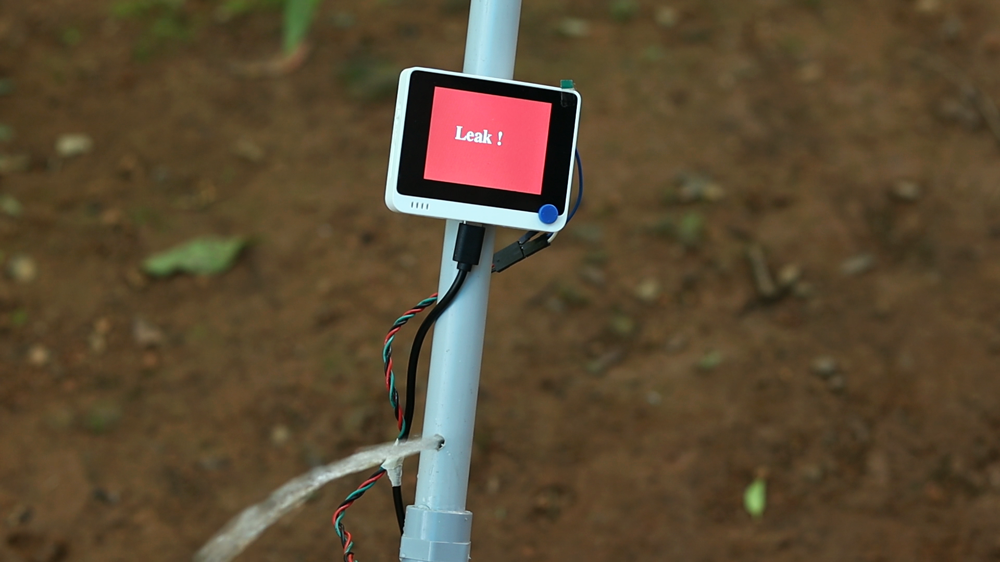

Fluid leakage in industrial pipelines can have serious and potentially destructive effects on both the environment and human health.

One of the most significant impacts of fluid leakage is the potential for contamination of soil and water sources. Many industrial fluids, such as oil and chemical compounds, are toxic and can have devastating effects on the ecosystems they come into contact with. For example, an oil spill can contaminate soil and water, leading to the death of plants and animals that depend on these resources. The cleanup process for such a spill can also be expensive and time-consuming, with long-term consequences for the affected area.

In addition to the environmental impacts, fluid leakage can also pose serious health risks to humans. Some industrial fluids, such as chemicals and gases, can be harmful when inhaled or ingested. Even small amounts of these substances can cause serious health problems, including respiratory issues, skin irritation, and even cancer.

Fluid leakage can also cause damage to the pipelines themselves, leading to costly repairs and downtime for the industrial facilities using them. In some cases, the leakage can even lead to explosions or fires, which can cause further damage and put workers and nearby communities at risk.

Overall, fluid leakage in industrial pipelines is a serious issue with far-reaching consequences. It is important for industrial facilities to take steps to prevent leakage and properly maintain their pipelines to minimize the potential for harm to both the environment and human health. This can include regular inspections and maintenance, as well as implementing safety protocols and training workers on how to handle potential leaks. By addressing this issue proactively, we can help protect our planet and keep our communities safe.

As a proposed solution to the issue of fluid leakage in industrial pipelines, we propose the use of artificial intelligence (AI) and machine learning. With this approach, flow rate sensor data is used to detect leaks in pipelines using machine learning algorithms that analyze changes in flow rates and identify deviations from normal patterns that may indicate a leak. This type of AI technology has the potential to significantly improve our ability to detect and respond to fluid leaks in industrial pipelines, helping to prevent undetected leaks from causing damage. In addition, the use of machine learning allows these systems to improve over time, becoming more accurate and reliable at detecting leaks. By leveraging these technologies, we can more effectively protect the environment and human health, and minimize the costs associated with leaks and their cleanup.

## Hardware Requirements

* [Seeed Wio Terminal](https://www.seeedstudio.com/Wio-Terminal-p-4509.html)
* [Water Flow Sensor](https://www.dfrobot.com/product-1517.html)

## Software Requirements

* [Edge Impulse](https://edgeimpulse.com)
* [Arduino IDE](https://www.arduino.cc/en/software)

## Hardware Setup 

The development board used in this project is the **Seeed Wio Terminal**. The reason why we used this development board in this project is that is a complete system equipped with Screen + Development Board + Input/Output Interface + Enclosure.

We used a DFRobot **Water Flow sensor** to detect the flow state of liquid.

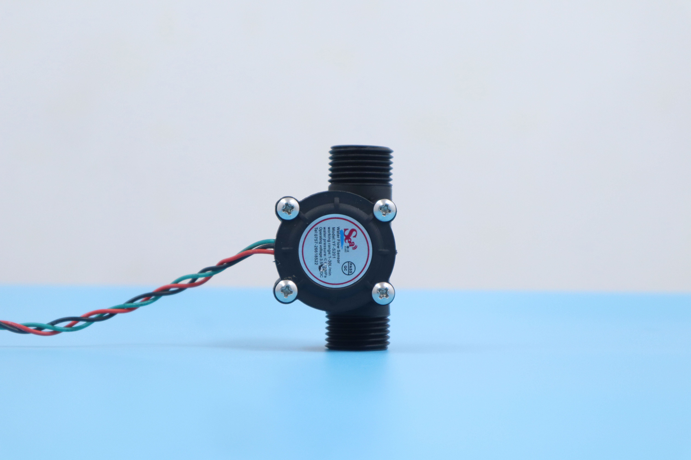 

It measures the rate of a liquid flowing through it by using a magnetic rotor and a Hall Effect sensor. When liquid flows through the sensor, a magnetic rotor will rotate and the rate of rotation will vary with the rate of flow. The Hall Effect sensor will then output a pulse-width signal.

 
This is the flow setup and it's pretty simple. Two pipes are attached to the inlet and outlet of the Flow Sensor. We will collect data from the sensor: 

- When there is no flow
- When there is a flow
- When there is a leak

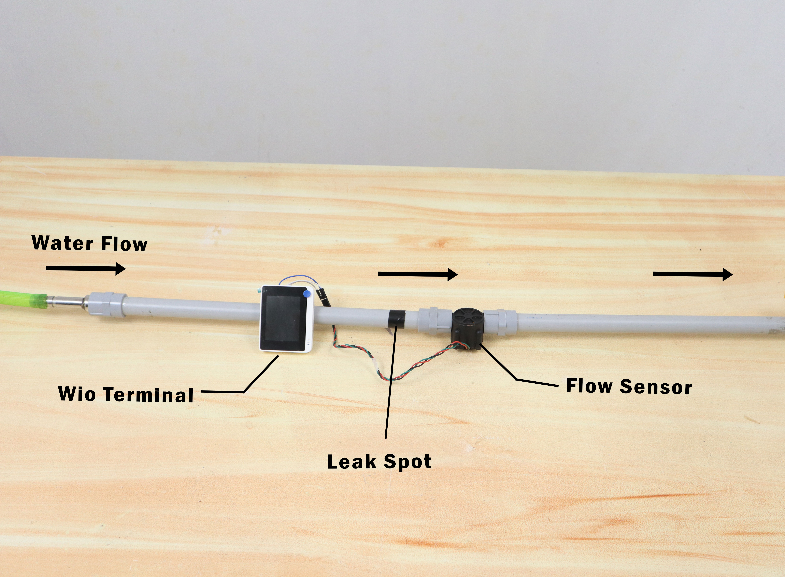

## Software Setup

To set up your Seeed Wio Terminal for Edge Impulse, you can follow this [guide](https://wiki.seeedstudio.com/Wio-Terminal-TinyML-EI-1/). But we are using an alternative method to collect data. In our method, the data is collected as CSV files and uploaded to Edge Impulse. And then we proceed to the TinyML model generation as usual.

### 1. Data Collection 

We have the water flow sensor which outputs a PWM signal. So instead of collecting the analog values from the sensor, we calculated the flow rate using an equation and it is collected as the time series data. We have collected the flow rates for **no flow**, **normal flow**, and **leak** which seem to be distinguishable by the model.

To collect data for your project, follow these steps:

* Upload **DataCollection.ino** to Wio Terminal.
* Plug your Wio Terminal into the computer.
* Run **SerialDataCollection.py** in the computer.
* Press button `C` to start recording.
* When you have enough data, press button `C` again to stop recording.
* Once you have stopped recording, it will generate a CSV file on your computer. Name it according to the flow state.
* Upload the CSV file to Edge Impulse using the **Data Acquisition Tab**.

After uploading the CSV files, we split the whole data into samples of 6s length. 

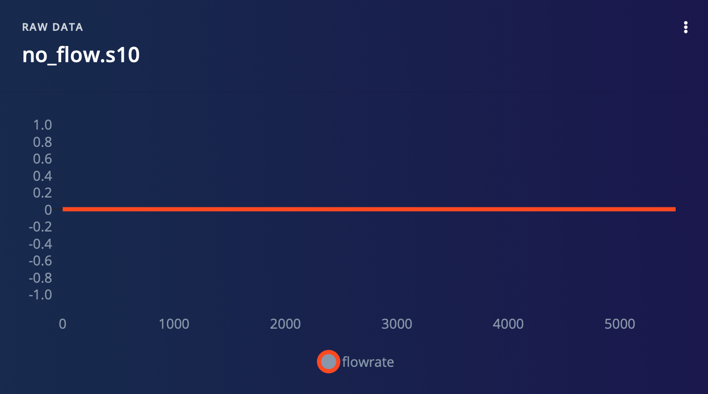

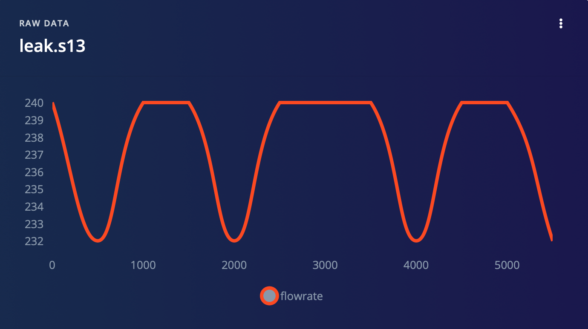

Then we split the whole dataset into **training** and **testing** datasets. Now we have a clean dataset to start our model training.

### 2. Impulse Design

An impulse is a machine learning pipeline that takes raw data, does signal processing to extract features, and then employs a learning block to categorize new data.

Here we are using the **Time Series Data** as the input block. We are using **Raw Data** as the processing block. As we have to classify the liquid flow into different states, we are using **Classification** as the learning block. Now we have an impulse that takes flow rate as input and categorize the flow into one of three classes.

Now move to the **Raw Data** tab. We can change the parameters like the scale axis, but we are keeping the default settings and continue to **Generate features**.

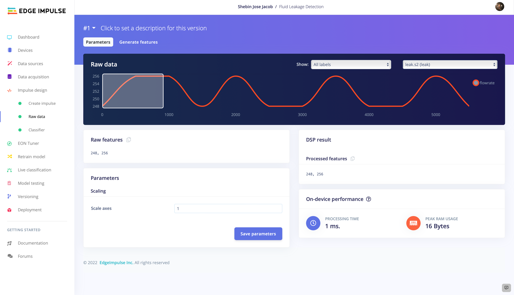

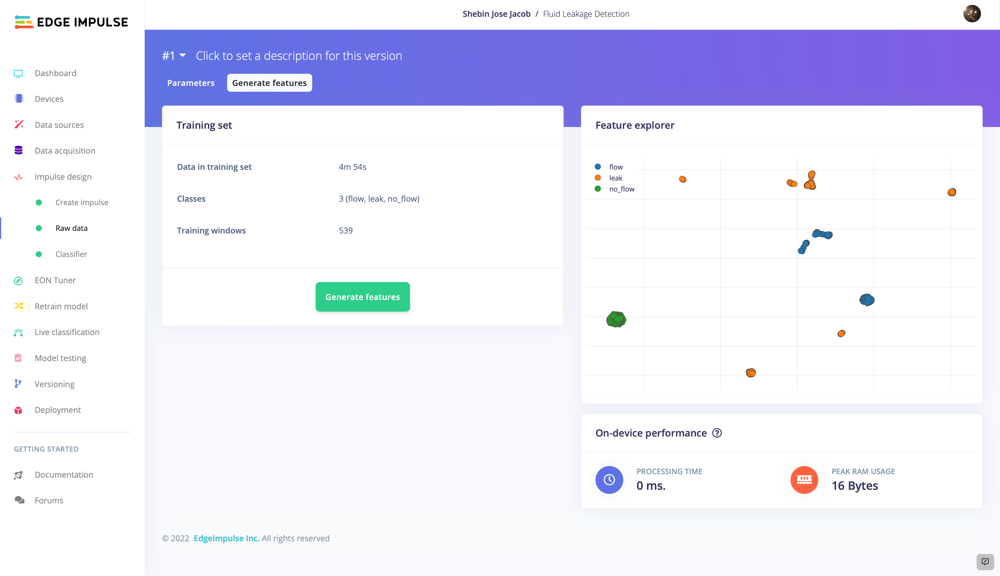

The features are well separated and there is no overlap between the classes, which indicates that we have a good dataset for model generation. So, let's proceed to train the model. 

### 3. Model Training And Testing

Move on to the **Classifier** tab. Here we have 3 parameters to modify. First, leave the settings as it is and train the model once. In our case, it output a model with 30% training accuracy. So we tweaked the parameters many times until satisfactory training accuracy is attained. These are our Neural Network settings.

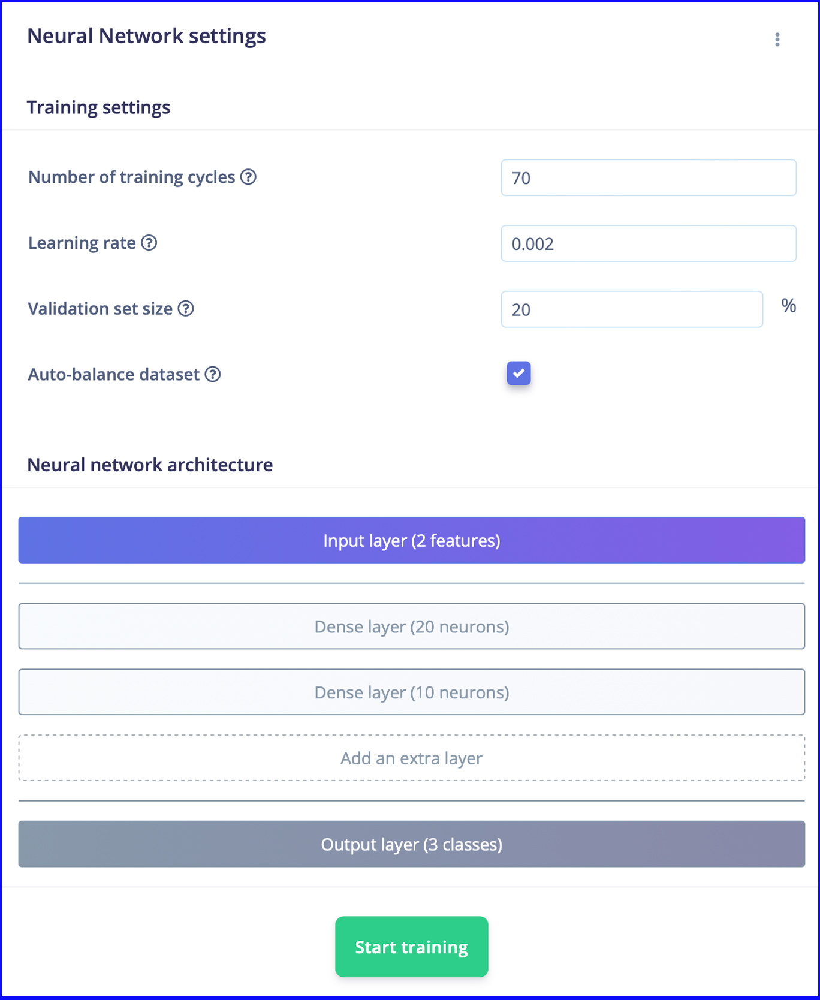

After training the model for 70 cycles with a learning rate of 0.002, we got an output model with 100% training accuracy and with a loss of 0.12.

Now we have a well-functioning model. Let's test its performance with some previously unseen data. Navigate to **Model Testing** and **Classify All**. Here are the results.

Amazing! We have got 100% testing accuracy. So our model is ready for deployment.

### 4. Deployment

From the **Deployment** tab, build an **Arduino Library**. You can enable optimisations with EON Compiler if you like, but is optional.

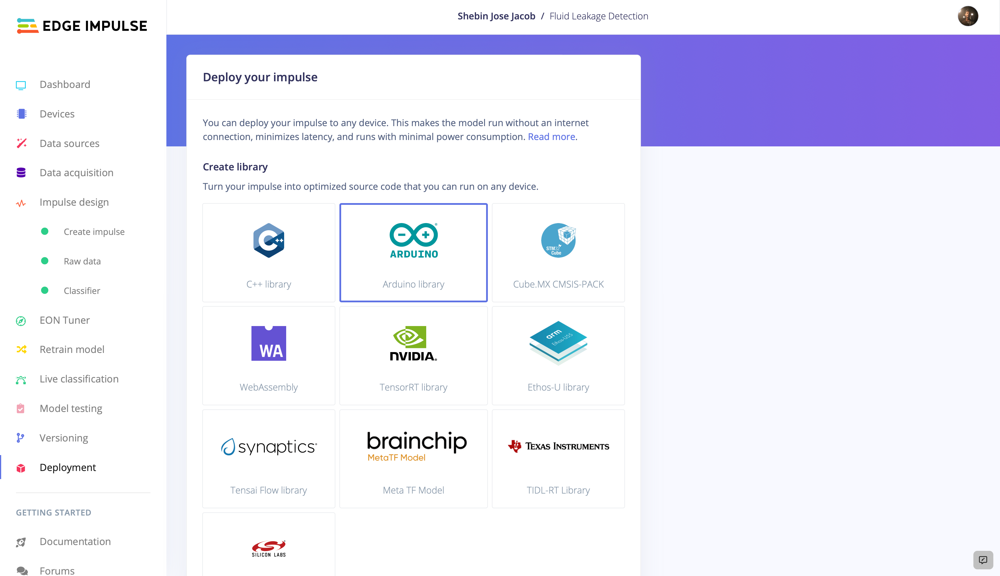

The build will output a `.zip` file containing the model and some examples. Add the library to the **Adruino IDE** using Sketch > Include Library > Add .ZIP library

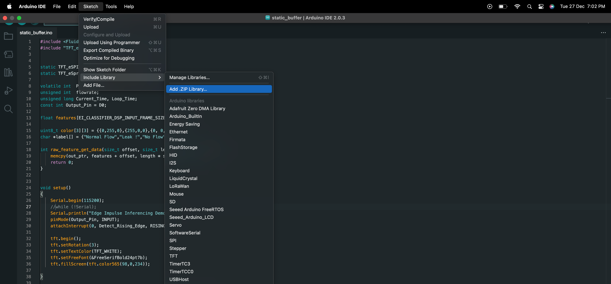

Modify the `static_buffer.ino` located at **File > Examples > Your Project Name > static_buffer > static_buffer.ino** to do dynamic inferencing. 

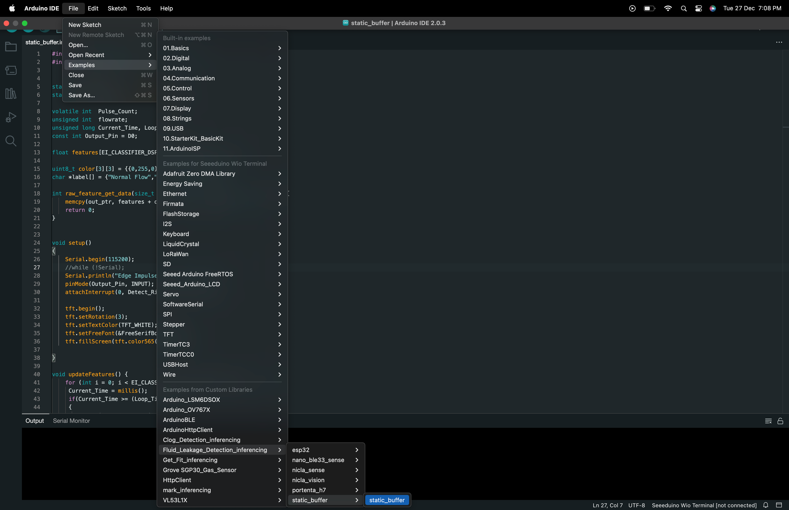

## Final Output

After the deployment, now we have a system consisting of a Wio Terminal, Flow Rate Sensor, and AI model that can detect a possible leak in the pipeline. The three modes of output are shown below.

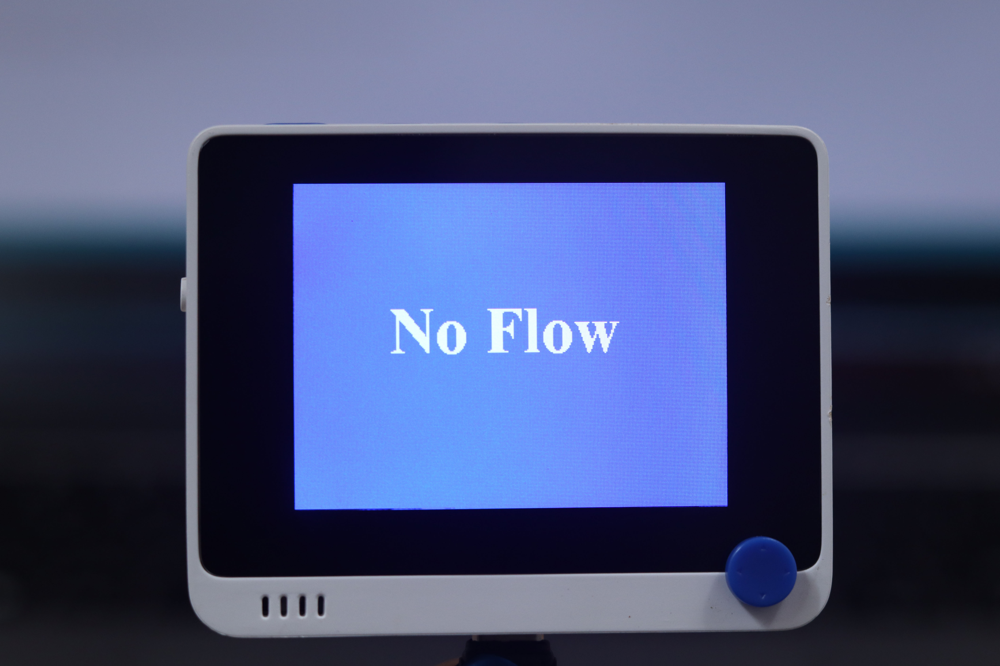

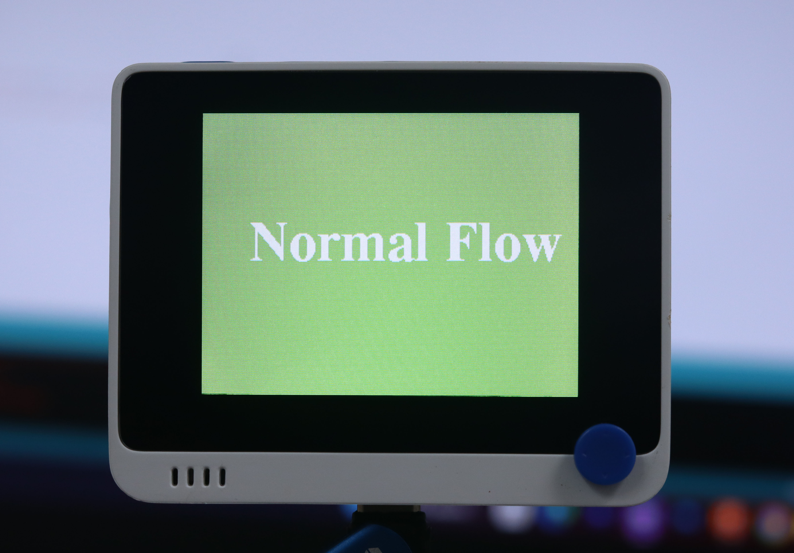

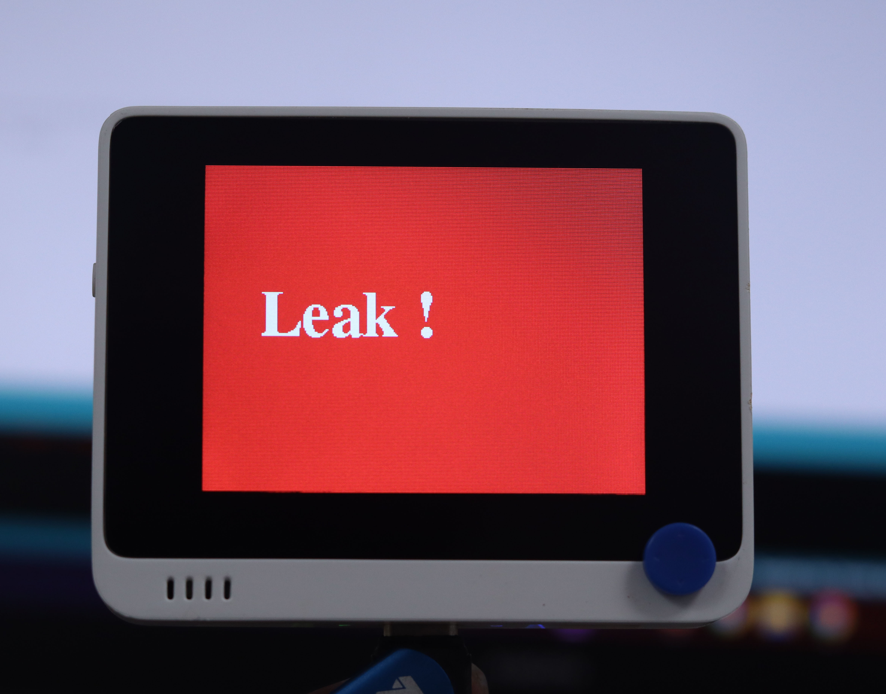

## Code

The entire assets for this project are available in this [GitHub repository](https://github.com/CodersCafeTech/Fluid-Leakage-Detection-With-AI).

