# Gas Detection in the Oil and Gas Industry - Thingy:91 

Created By:
[Zalmotek](https://zalmotek.com) 

Public Project Link:

[https://studio.edgeimpulse.com/studio/127759](https://studio.edgeimpulse.com/studio/127759)

GitHub Repository:

[https://github.com/Zalmotek/edge-impulse-gas-detection-thingy-91-nordic](https://github.com/Zalmotek/edge-impulse-gas-detection-thingy-91-nordic)

## Introduction

Gas detection is critical for ensuring the safety of workers in the oil and gas industry. Gas leaks can occur at any stage of production, from drilling and refining to transportation and storage. Gas sensors must be able to detect a wide range of gasses, including combustible gasses like methane and propane, as well as toxic gasses like carbon monoxide and hydrogen sulfide.

Gas detection systems have traditionally been based on point sensors, which are placed at strategic locations throughout a facility. These sensors are connected to a central control panel, which monitors the gas concentration in each location. If a gas leak is detected, an alarm is sounded and workers are evacuated from the area.

### The Challenge

Even if they are the industry standard, traditional gas detection systems based on point sensors have several limitations. 

1. They are limited by their space density, as they can only detect gas in the areas where they are positioned, meaning that leaks in other parts of the facility may go undetected. 

1. They are limited by network coverage. Many wireless communication-dependent sensors are prone to malfunction during severe weather events, leaving unsupervised locations in the facility.

1. These systems rely on human operators to evaluate the data and take action.

### Our Solution


 
To overcome those challenges, we propose a solution based on the Nordic Semi Thingy:91, an IoT multi-sensor device, equipped with an environmental sensor suite, LTE connectivity, and full compatibility with Edge Impulse machine learning models.

Thingy:91 is a complete prototype development platform for cellular IoT applications. It’s an easy-to-use prototyping tool that lets you quickly and cheaply try out your ideas and iterate until you have a working product. The onboard environmental sensor suite includes temperature, humidity, atmospheric pressure, color, light intensity, and UV index sensors. The onboard air quality sensor can detect a wide range of gasses, including methane, carbon monoxide, and hydrogen sulfide.

Gas sensor data is often noisy and unreliable, making it difficult to interpret. Machine learning algorithms can be used to filter out false readings and identify patterns in the data that indicate the presence of certain gasses.

By using the Thingy:91 as an edge device, it can measure the gas concentration, run a machine learning algorithm and decide if there is a trend in the quantity of dangerous gasses in the air and act out without human intervention either by sounding an alarm, either by sending a message to the nearby employees that might be in danger.

A monitoring system based on the Nordic:91 could be used in two manners, each with its own advantages and disadvantages:

1. As a static point sensor.

This is advantageous when the area in which the sensor is placed is inaccessible via cable connection and is prone to connectivity problems. Gas detection is often performed in remote or difficult-to-access locations, making it impractical to send data to the cloud for analysis. Edge computing allows data to be processed locally, in real time, by using machine learning algorithms.

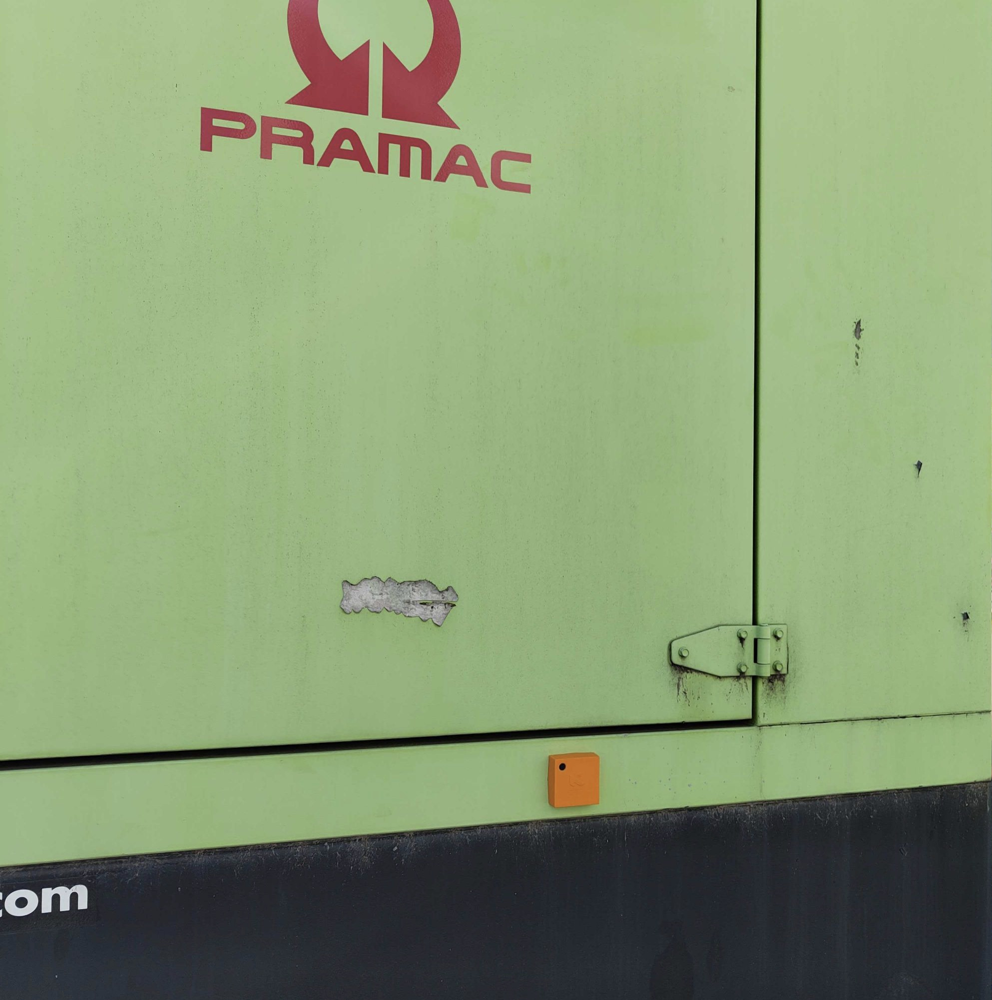

1. As a wearable.

By using it as a wearable, it will be able to detect gas leakages in the proximity of the employees that wear it. This is a great way of overcoming the space density problem, as it will monitor the air quality in the near vicinity of the employees, ensuring that they will not find themselves in an environment that might be dangerous for their health. Depending on the gasses that pose the greatest danger, the height at which the device must be placed varies. 

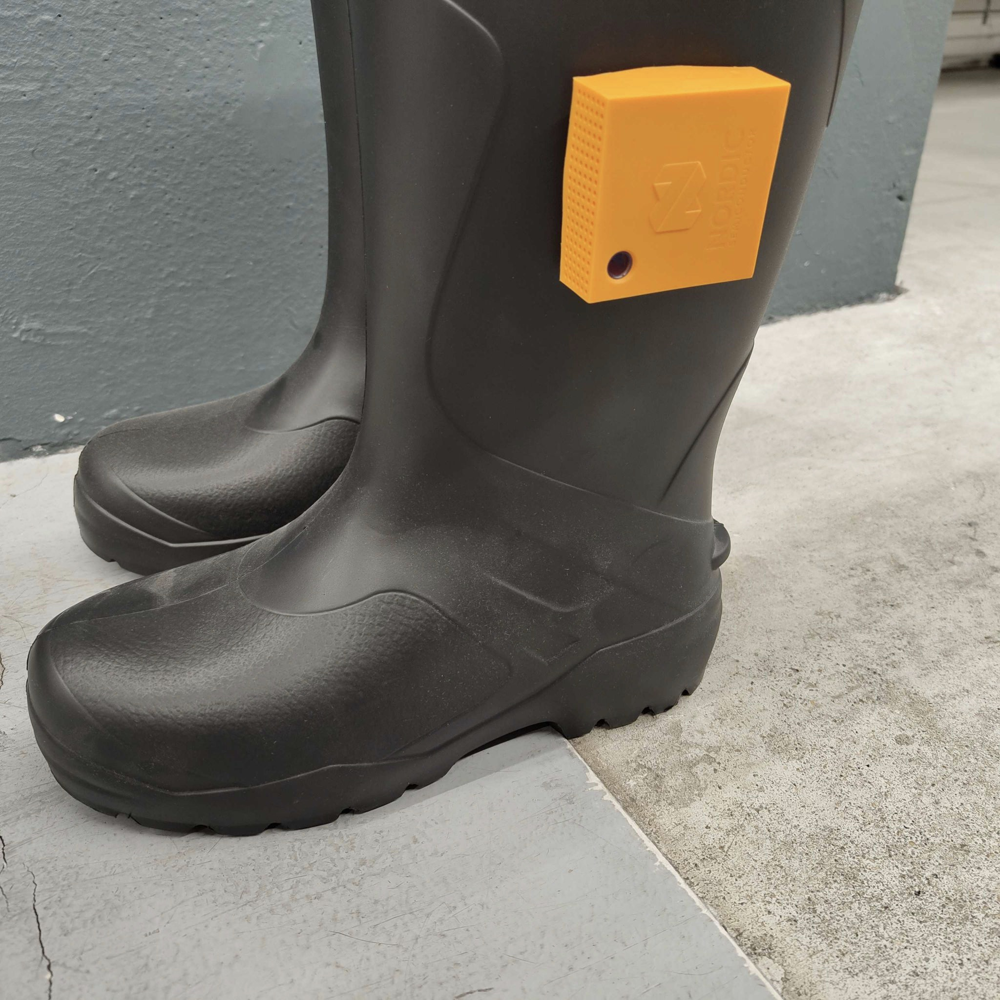

### Hardware requirements

- [Nordic Thingy:91](https://www.nordicsemi.com/Products/Development-hardware/Nordic-Thingy-91)
- Micro USB cable

### Software requirements

- Edge Impulse account
- [Edge Impulse CLI](https://docs.edgeimpulse.com/docs/edge-impulse-cli/cli-installation)
- GIT
- [nRF Connect](https://www.nordicsemi.com/Products/Development-tools/nrf-connect-for-desktop) 3.11.1
- [nRF command line tools](https://www.nordicsemi.com/Products/Development-tools/nrf-command-line-tools/download)

## Hardware Setup

For this use-case, as mentioned above, we will be using the Thingy:91, a prototyping development kit created by Nordic Semiconductor. It is packed with sensors, making it a great pick for rapid prototyping and also, equipped with a nRF9160 System-in-Package (SiP) that supports LTE-M, NB-IoT and GNSS, allowing you to add a connectivity layer to any application.

This development board comes equipped with a 64 MHz Arm® Cortex®-M33 CPU that is great for running TinyML models on the edge used to detect various phenomena, more specific for our use case, dangerous gas leaks.

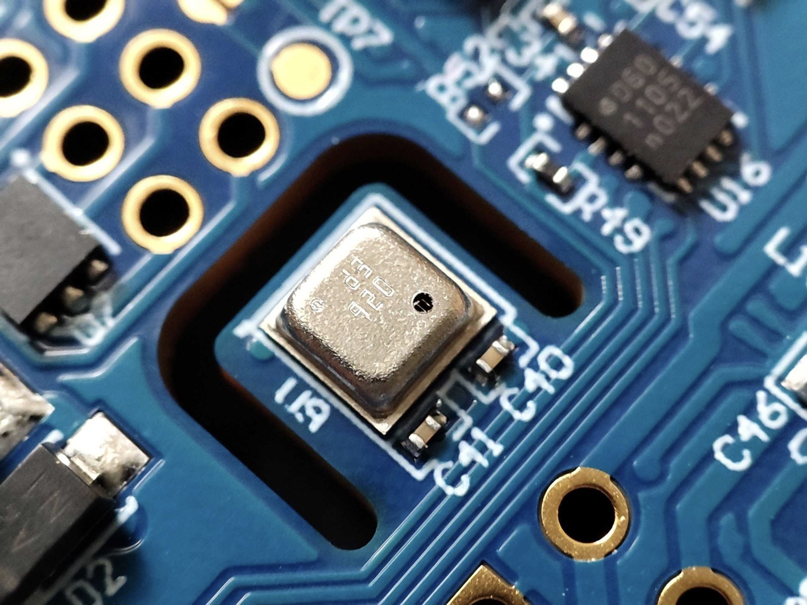

Because the board has all the required sensors embedded on it, there is no need for extra wiring. It’s enough to connect the board to a computer and start building the machine learning model. 

As for the deployment phase, it comes down to the specific environment in which the system will be deployed. The Thingy:91 weights under 100g so it can be mounted on hard surfaces using regular adhesives or, if the use case allows for it, it can be mounted using screws.

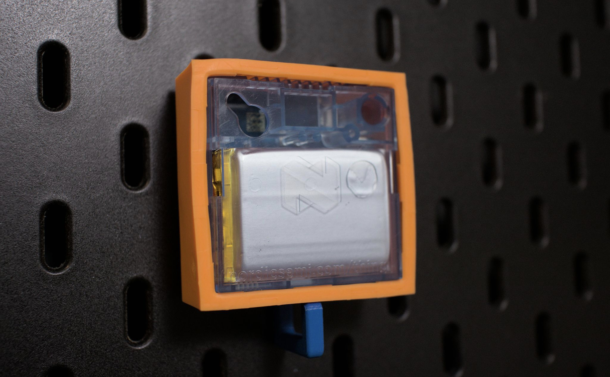

## Software Setup

### Creating an Edge Impulse Project

To build the machine learning model that will be used to detect dangerous leaks in environments characteristic to the oil and gas industry, we will be using the Edge Impulse platform. Register a free account and create a new project. Remember to give it a representative name and select  **Something else** when asked what kind of data will be used to build the project.

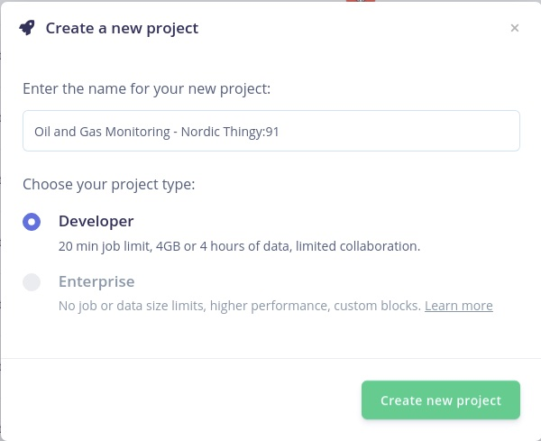

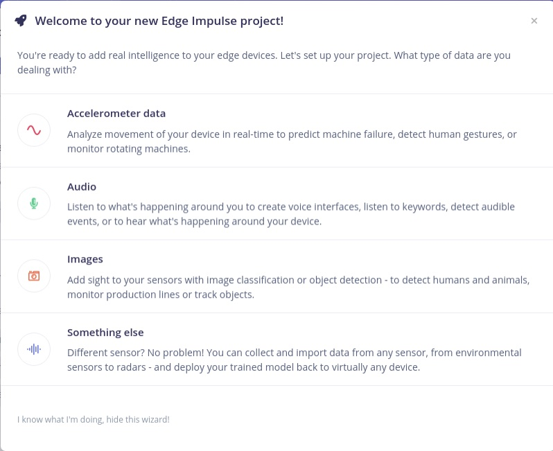

The Nordic Thingy:91 prototyping board is fully supported by the Edge Impulse platform, meaning that you will be able to sample data, build the model and deploy it back on the device straight from the platform, without the need to build any firmware. This is a great time saver because it allows users to optimize their models before having to create custom firmware for the target device

### Connecting the Device

To connect the device to Edge Impulse, download [nRF connect 3.11.1](https://www.nordicsemi.com/Products/Development-tools/nrf-connect-for-desktop) and [nRF command line tools](https://www.nordicsemi.com/Products/Development-tools/nrf-command-line-tools/download) from the official sources and install them.

If you are going to be using a Linux computer for this application, make sure to run the following command as well:

```
sudo apt install screen
```

Afterwards, download the official [Edge Impulse Nordic Thingy:91 firmware](https://cdn.edgeimpulse.com/firmware/thingy91.zip) and extract it.

Next up, make sure the board is turned off and connect it to your computer. Put the board in MCUboot mode by pressing the multi-function button placed in the middle of the device and with the button pressed, turn the board on. 


Next, launch the Programmer application in nRF Connect, select your board in the left side of the window, drag and drop the `firmware.hex` file in the Files area, make sure **Enable MCUboot** is enabled and press **Write**.


When prompted with the MCUboot DFU window, press **Write** and wait for the process to be finished.

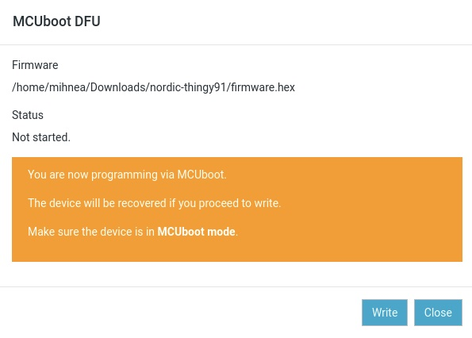

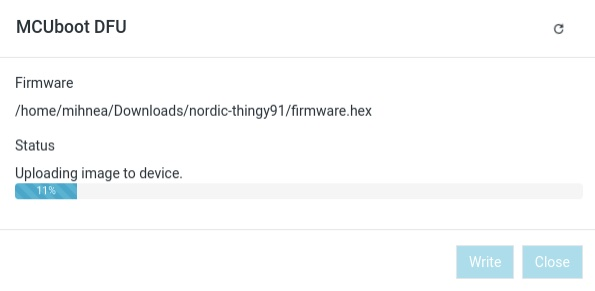


If you struggle at any point of this process, Edge Impulse has great [documentation](https://docs.edgeimpulse.com/docs/development-platforms/officially-supported-mcu-targets/nordic-semi-thingy91) on this subject.

Now, power cycle the board by turning it off and on again, this time without pressing the middle button, launch a terminal and issue the following command:

```
$edge-impulse-daemon
```

You will be prompted with a message to insert your username and password and then you will be asked to select which device you would like to connect to.

```
Edge Impulse serial daemon v1.14.10
? What is your user name or e-mail address (edgeimpulse.com)? <your user>
? What is your password? [hidden]
```

You may notice that the Thingy:91 exposes multiple UARTs. Select the first one and press ENTER.

```
Edge Impulse serial daemon v1.15.1
Endpoints:
	Websocket: wss://remote-mgmt.edgeimpulse.com
	API:   	https://studio.edgeimpulse.com/v1
	Ingestion: https://ingestion.edgeimpulse.com

? Which device do you want to connect to? /dev/ttyACM0 (Nordic Semiconductor)
[SER] Connecting to /dev/ttyACM0
[SER] Serial is connected, trying to read config...
[SER] Retrieved configuration
[SER] Device is running AT command version 1.3.0

Setting upload host in device... OK
Configuring remote management settings... OK
Configuring API key in device... OK
Configuring HMAC key in device... OK
[SER] Device is not connected to remote management API, will use daemon
[WS ] Connecting to wss://remote-mgmt.edgeimpulse.com
[WS ] Connected to wss://remote-mgmt.edgeimpulse.com
[WS ] Device "test" is now connected to project "Oil and Gas Monitoring - Nordic Thingy:91"
```

By navigating to the Devices tab in your Edge Impulse project, you will notice that your device shows up as connected.


### Building the Dataset

To create this data set, we have exposed the gas sensor to various gasses that might be encountered in environments specific to Oil and Gas industries like high concentrations of CO2, CO, and Isopropanol. 

To simulate increased concentrations of CO2, we have used a simple set-up that employs baking soda (Sodium Bicarbonate) and vinegar (Acetic Acid). By combining those 2 elements in a confined environment, the CO2 resulting from their reaction, being heavier than air, would spill from the container in which the reaction takes place and get picked up by the Nordic Thingy:91.

To simulate an increased concentration of carbon monoxide, we have exposed the Thingy:91 board to wood smoke. Smoke is fundamentally a complex mixture of fine particles and compounds in a gaseous state like polycyclic aromatic hydrocarbons, nitrogen oxides, sulfur oxides, and carbon monoxide.

Finally, to get a reading specific to an alcohol leakage, we have exposed the gas sensor to a bottle of 97% concentration Isopropanol. Being a very volatile compound, it quickly evaporates and is easily picked up by VOC sensors.


With the device connected, head over to the Data acquisition tab, select Environmental as the sensor that will be used for acquiring data, set the data acquisition frequency to 1Hz and start recording data.

For this application we will be defining 2 classes, labeled “Gas_Leak” and “Normal”. Neural networks do not know what to do with data it has never seen before and will try to classify it in one of the predefined ones. This is why it’s important to define a “Normal” class that contains readings specific to usual conditions in which the system will be deployed, so as to avoid triggering a false positive reading in the detection algorithm.

Keep in mind that machine learning heavily relies on the quantity and quality of data, so when defining a new class make sure to have at least 2.5 minutes of data for it. 

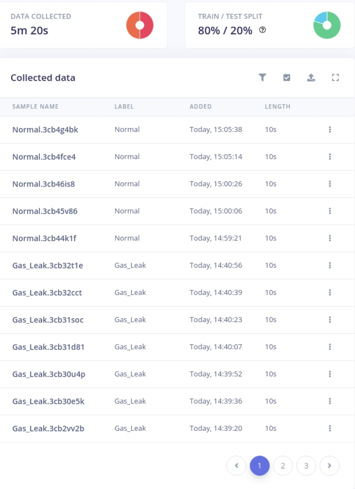

With all the data gathered, it’s time to split the data into 2 categories: Training and Testing data. 

Edge impulse has automated this process and all you have to do is press the exclamation mark near the Train/Test split section. What we are aiming for is 80% Training data and 20% Testing data.

The dataset used to create this model can be [downloaded here](https://github.com/Zalmotek/edge-impulse-gas-detection-thingy-91).

### Designing the Impulse

It's time to design the Impulse now that the dataset is available.

The process of taking raw data from the dataset, pre-processing it into manageable chunks called "windows," extracting the relevant features from them using digital signal processing algorithms, and then feeding them into a classification neural network to determine whether any anomaly in the running regime of the machinery is detected is set up at this point. 

An “Impulse” contains all the processes mentioned above in a manageable and easily configurable structure.


To create a gas sensing model, we will be using a 2000ms Window Size, with a Window Increase of 1000ms and a sampling frequency of 1Hz. This will be passed through a Raw Data processing block with only the “gas res” dimensions checked and then, fed into a Classification Neural Network. 

### Configuring the Raw Data Block

Once you click “Save impulse”, you will notice that every block can be configured by clicking on its name, under the “Impulse Design” submenu.

The Raw data block may be the simplest of the processing blocks, as it has only one parameter that can be modified, namely the “Scale axes” that we will set to 10. On the top side of the screen you can see the time-domain representation of the selected sample.


When you are done configuring the block and exploring the dataset, click on **Save parameters**.


There are multiple parameters that can be configured in the NN classifier tab that will influence the training process of the classifier neural network. Before configuring those, it is worth understanding how this training process works. Fundamentally, a random value between 0 and 1 is initially assigned to the weight of a link between neurons. Once the training process starts, the neural network is fed the Training dataset defined in the data acquisition phase and the classification output is compared to the correct results. The algorithm then adjusts the weights assigned to the links between neurons and then compares the results once more. This process is repeated for a number of epochs, defined by the **Number of training cycles** parameter and the **Learning rate** defines how much the weights are varied each epoch. 

During this training process, the neural network may become overtrained and will start to pick up measurement artifacts in the data as the defining feature of a class, instead of looking for the underlying patterns in the data. This process is called overfitting and it's the reason why the performance of a neural network must be evaluated on real world data. 

When you click “Start training”, the process will be assigned to a cluster and once the computation ends, you will be presented with the performance of the Neural Network, tested on a percent of samples from the Training dataset held over for validation purposes. The dimension of this datapool is defined by the **Validation set size** parameter.


When building a machine learning model, what we aim for is a high Accuracy and a low Loss. **Accuracy** is the percentage of predictions for a given sample where the predicted value coincides with the actual value, and **Loss** is the total of all errors made for all samples in the validation set.

The confusion matrix presents the percent of samples that were miscategorized and the Data explorer offers a visual representation of the classified samples. It is clearly noticeable that the amount of “Normal” samples wrongly classified as Gas_Leak is greater than the number of Gas_Leak data points categorized as “Normal”. For this particular application, this is not a problem because the model will lean towards triggering a false positive and warn the user that there might be a problem, rather than passing a real gas leak as normal environmental conditions.

### Model Testing

The Model Testing tab allows the user to see how the neural network fares when presented with data it has not seen before.  Navigate to this tab and click Classify All. Edge Impulse will then feed all the data in the Testing data pool to the neural network and present you with the classification results and the performance of the model, just like during the training process. 

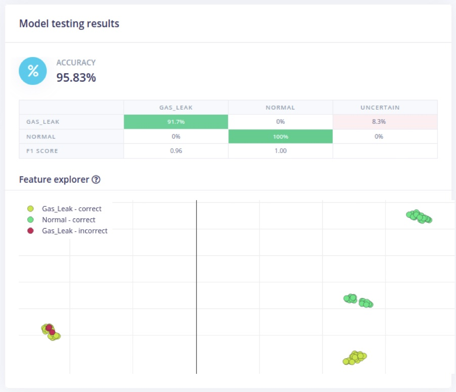

### Increasing the Model Performance

If your model manifests low performance when met with unseen data, there are various things you can do. First and foremost, the best thing you can do to increase the performance of the model is to give it more data. Neural Networks need a plentiful and balanced data set to be properly trained. 

In our case, the dataset was large but we managed to increase the performance of the model by increasing the number of training cycles and the learning rate of the model, a sign that our neural network was not trained enough. 

By increasing the number of training cycles to 100 and the Learning rate to 0.001, we observed a jump in performance on unseen data from 95.83% performance to 100% performance. 

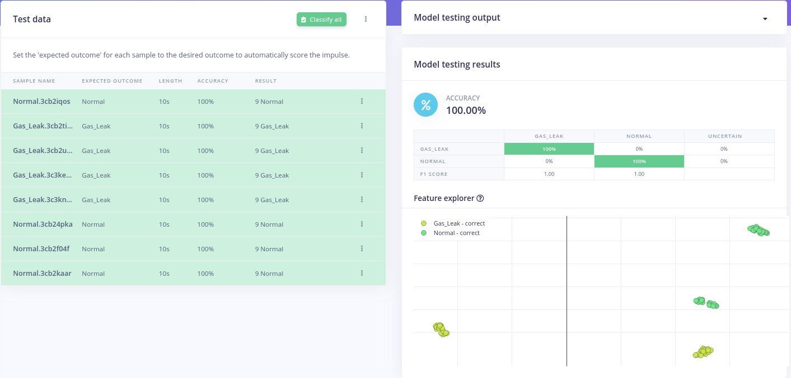

## Deployment

Finally, it’s time to see how to model fares when deployed on the edge. Navigate to the **Deployment** tab and select **Nordic thingy:91** under the **Build firmware** tab.

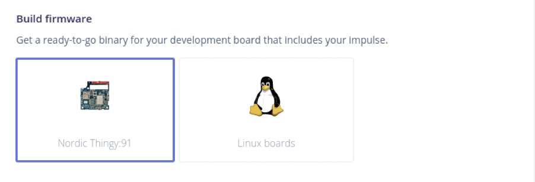

After you click on Nordic Thingy:91, you will be presented with the option of enabling the EON Compiler. It’s worth comparing the difference in the resources used when the compiler is turned on vs when it's disabled. Take in consideration the fact that it might increase on-device performance with the price of reduced accuracy. This is very helpful when deploying models on resource-constrained devices or when battery life is an issue but it may not be worth using when the device has plentiful resources and is affixed to a wall with a power source available. 

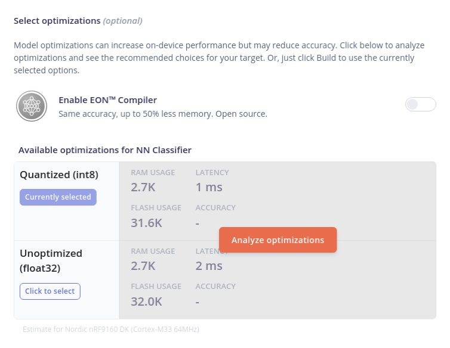

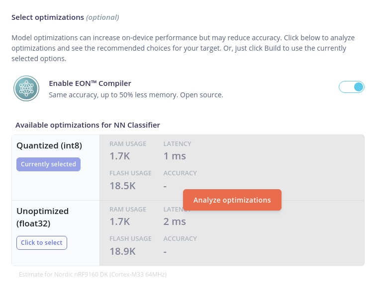

Once you have decided, click on **Build**.

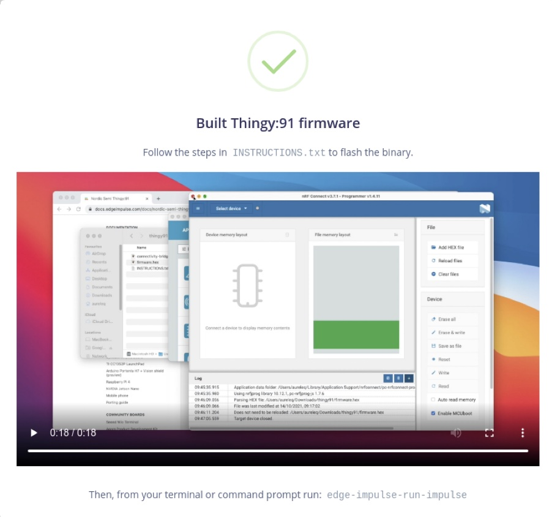

Once the process ends, deploy the firmware built by the Edge Impulse platform in the same way you have uploaded the data-forwarder firmware during the “Connecting the device” section.

Afterwards, with the board connected to the computer and turned on, issue the following command in a terminal:

```
$edge-impulse-run-impulse
```

You will be prompted with the results of the classification that is currently running offline on the device.

```
Inferencing settings:
    Interval: 1000ms.
    Frame size: 2
    Sample length: 2000ms.
    No. of classes: 2
Starting inferencing, press 'b' to break
Starting inferencing in 2 seconds...
Predictions (DSP: 0 ms., Classification: 2 ms., Anomaly: 0 ms.):
	Gas_Leak:     0.10937
	Normal:     0.89062
```

### Creating Custom Firmware

When you consider the performance of the model when running on the target to be satisfying, Edge Impulse offers its users the ability to export the Impulse as a C++ library that contains signal processing blocks, learning blocks, configurations and the SDK needed to integrate the ML model in a custom application. By choosing this method of deployment you can build applications that can trigger alarms, log data or send notifications remotely by using the connectivity layer provided by the Nordic Thingy:91 platform.

You can find a great guide about how you can [Build an application locally for a Zephyr-based Nordic Semiconductor development board](https://docs.edgeimpulse.com/docs/deployment/running-your-impulse-locally/running-your-impulse-locally-zephyr) in the official Edge Impulse Documentation.

## Conclusion

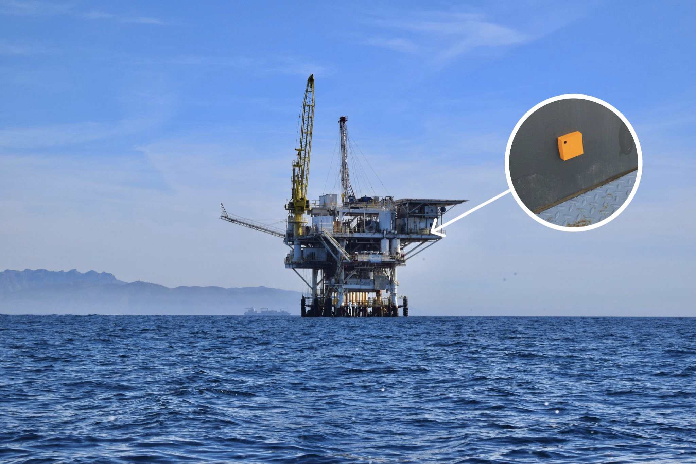

In conclusion, a system built around the  Nordic Thingy:91 and Edge Impulse platform is a great way to overcome some of the challenges associated with traditional gas detection systems. By using it as an edge device, it can measure the gas concentration, run a machine learning algorithm and decide if there is a trend in the quantity of dangerous gasses in the air and act out without human intervention. Additionally, by using it as a wearable, it will be able to detect gas leakages in the proximity of the employees that wear it, ensuring that they are not exposed to dangerous levels of gas.

If you need assistance in deploying your own solutions or more information about the tutorial above please [reach out to us](https://edgeimpulse.com/contact)!
