# Glass Window Break Detection - Nordic Thingy:53

Created By: [Zalmotek](https://zalmotek.com)

Public Project Link:

[https://studio.edgeimpulse.com/studio/139844](https://studio.edgeimpulse.com/studio/139844)

## Introduction

Glass/window breaking detection systems are used in office buildings for safety purposes. They can be used to detect when a window is broken and trigger an alarm. These systems can also be used to collect data about the event, such as the time, location, and type of break, thus generating data that can be used to further bolster the safety of office buildings in the future.

There are many different types of glass/window breaking detection systems available on the market but they fall in two broad categories:

1. Systems that use vibration and audio sensors to detect the sound of breaking glass.
2. Computer vision based systems used to detect signs of damage in the windows.

## The challenge

The biggest challenge with any detection system is to minimize false positives - that is, to avoid triggering an alarm when there is no actual danger. This is especially important in the case of glass/window breaking detection systems, as a false positive can cause significant disruption and even panic.

There are many factors that can cause a false positive with these types of systems, such as:

* **Background noise**: office buildings are typically full of ambient noise (e.g. people talking, computers humming, etc.) which can make it difficult for sensors to accurately identify the sound of breaking glass.
* **Weather**: windy conditions can also create background noise that can interfere with sensor accuracy.
* **Sound Volume**: if the sound of breaking glass is not loud enough, it may not be picked up by sensors.

## The Solution

Our approach for those challenges is to create an IoT system based on the Nordic Thingy:53™,development board that will run a machine learning model trained using the Edge Impulse platform that can detect the sound of breaking glass and send a notification via Bluetooth when this event is detected. We have narrowed our hardware selection to the Nordic Thingy:53™ as it integrates multiple sensors (including an accelerometer, gyroscope, microphone, and temperature sensor) onto a single board, which will simplify our data collection process. In addition, the Nordic Thingy:53™ has built-in Bluetooth Low Energy (BLE) connectivity, which will allow us to easily send notifications to nearby smartphones or other devices when our glass/window breaking detection system is triggered. The Nordic Thingy:53 is powered by the nRF5340 SoC, Nordic Semiconductor’s flagship dual-core wireless SoC that combines an Arm® Cortex®-M33 CPU with a state-of-the-art floating point unit (FPU) and Machine Learning (ML) accelerator. This will enable us to run our machine learning model locally on the Thingy:53, without needing to send data to the cloud for processing.

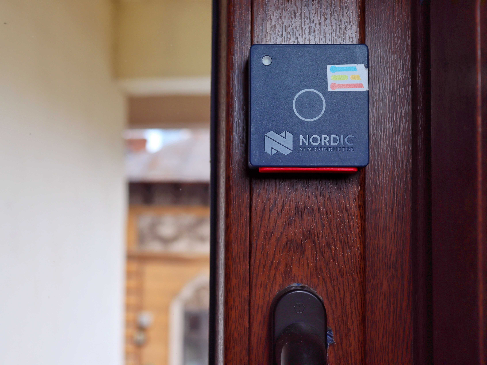

To build our machine learning model, we will be using the Edge Impulse platform. Edge Impulse is a Machine Learning platform that enables you to build custom models that can run on embedded devices, such as the Nordic Thingy:53™. With Edge Impulse, you can collect data from sensors, process this data using various types of Machine Learning algorithms (such as classification or regression), and then deploy your trained model onto your target device.

Edge Impulse has many benefits, the most useful being that you don't need extensive data to train a high-functioning AI model. You can also easily adjust the models based on various needs like processing power or energy consumption.

### Hardware Requirements

* [Nordic Thingy:53](https://www.nordicsemi.com/Products/Development-hardware/Nordic-Thingy-53)
* Android/iOS device

### Software Requirements

* nRF Programmer Android/IoS App
* Edge Impulse account
* [Edge Impulse CLI](https://docs.edgeimpulse.com/docs/edge-impulse-cli/cli-installation)
* Git

## Hardware Setup

Due to the fact that the Nordic Thingy:53 comes with a high quality MEMS microphone embedded on it, there is no wiring that must be done. Simply connect the development board to a power supply and move over to the next step.


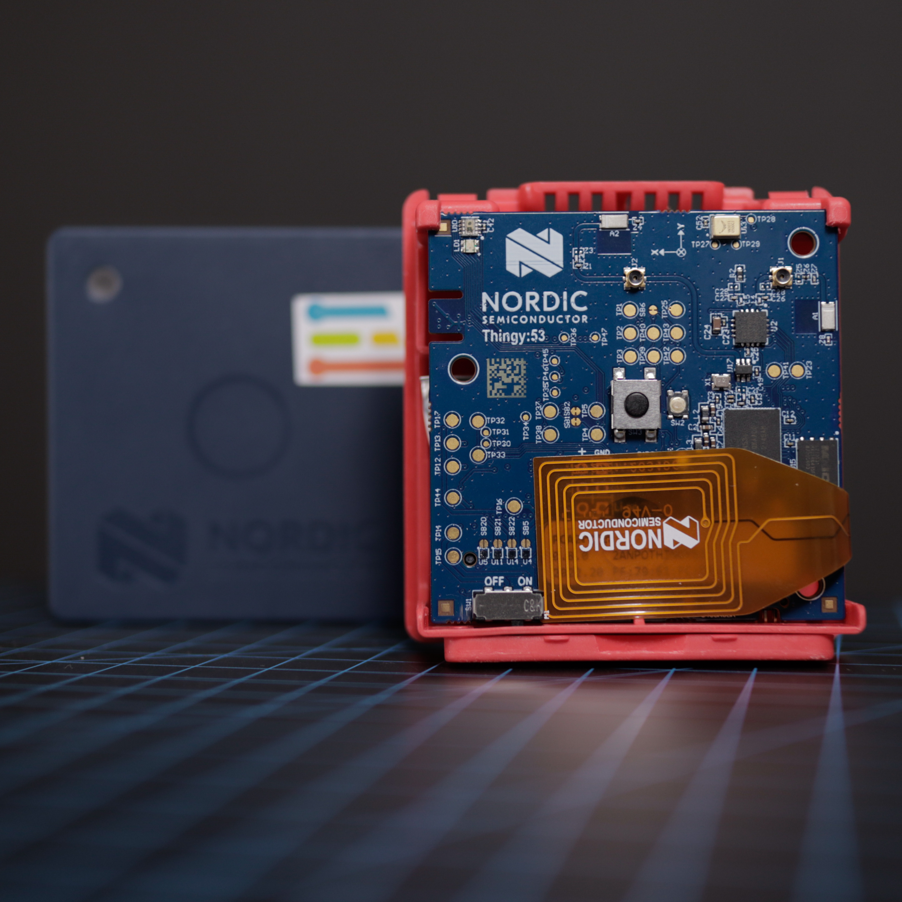

## Software Setup

### Creating an Edge Impulse Project

Let's start by creating an Edge Impulse project. Select **Developer** as your project type, click **Create a new project**, and give it a memorable name.


### Connecting the Device

New Thingy:53 devices will function with the Nordic nRF Edge Impulse iPhone and Android apps as well as the Edge Impulse Studio right out of the box.

Before connecting it to the Edge Impulse project, the firmware of the Thingy:53 must be updated. Download the **nRF Programmer** mobile application for Android or iOS and launch it. You will be prompted with a number of available samples.


Select the **Edge Impulse** application, select the version of the sample from the drop-down menu and tap **Download**.

When that is done, tap **Install**. A list with the nearby devices will appear and you must select your development board from the list. Once that is done, the upload process will begin.

.jpg>)

With the firmware updated, connect the Thingy:53 board to a computer that has the edge-impulse-cli suite installed, turn it on, launch a terminal and run:

```
edge-impulse-daemon --clean
```

You will be required to provide your username and password before choosing the project to which you want to attach the device.

```
Edge Impulse serial daemon v1.14.10
? What is your user name or e-mail address (edgeimpulse.com)? <your user>
? What is your password? [hidden]
```

Once you select the project and the connection is successful, the board will show up in the **Devices** tab of your project.


## Building the Dataset

For this particular use case, recording data containing glass breaking sounds is challenging. For such situations, Edge Impulse offers its users the possibility of uploading publicly available recordings of various phenomena that can be post-processed in the Data Acquisition tab.

We have gathered over 15 minutes of glass shattering sounds from various license-free SFX sound effects websites and we have uploaded them in our training data pool, using **GlassBreaking** as their Label. This can be done by navigating to the **Upload data** tab.


We also need audio for this application that doesn't contain the sound events that we want to identify. We must add sounds that belong to the "background sounds" category to the data pool, such as honks, people talking loudly, doors closing and other various background sounds that the system might be exposed to during normal use. The name of this class should be "BACKGROUND." When populating your dataset, keep in mind that the most crucial component of machine learning is data, and the richer and more varied your data set is, the better your model will perform.

## Designing the Impulse

Now that the data is available, it’s time to create the Impulse. The functional Block of the Edge Impulse ecosystem is called “Impulse” and it fundamentally describes a collection of blocks through which data flows, starting from the ingestion phase and up to outputting the features.

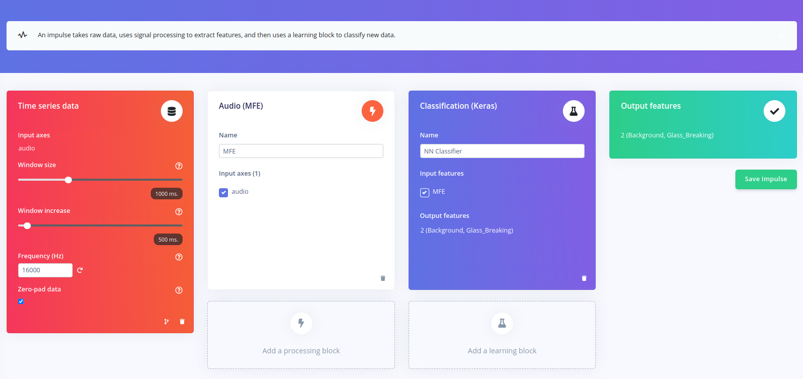

The setup is rather straightforward for this use case. We will be using a 1000ms window size, with a window increase of 200ms at an acquisition frequency of 100Hz. For the processing block we will be using an **Audio (MFE)** and for the Learning block, we will be employing a basic **Classification (Keras)**.

## Configuring the Spectrogram Block

When navigating to this menu, you will notice that in the top part of the screen you can explore the time domain representation of the data you have gathered.


Underneath, various parameters of the processing block may be modified. For the moment, we will be moving forward with the default values.

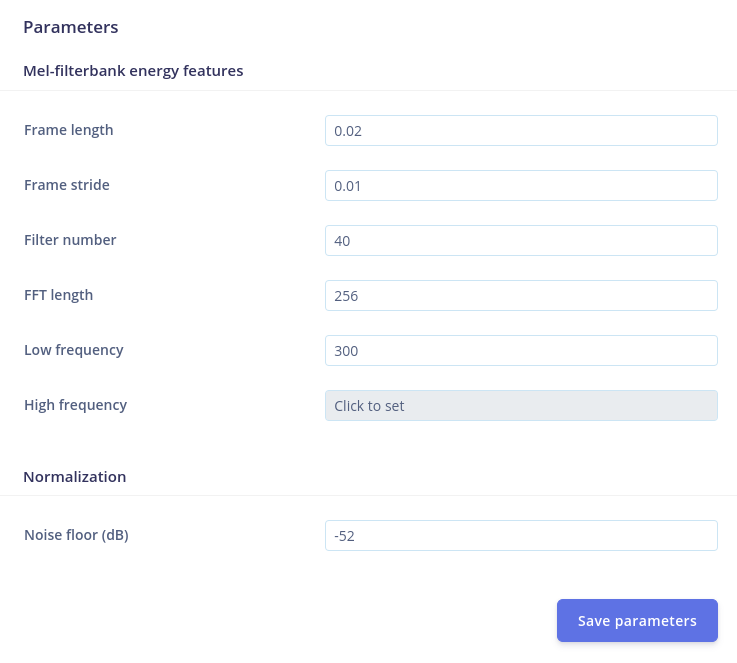

And finally, on the right side of the window you can observe the results of the Digital Signal Process and a spectrogram of the raw signal.


A good rule of thumb when tweaking the DSP block parameters is that similar signals should yield similar results.

Once you are happy with the results, click on **Save parameters**. After the **"Generate features"** page loads, click on **Generate Features**.

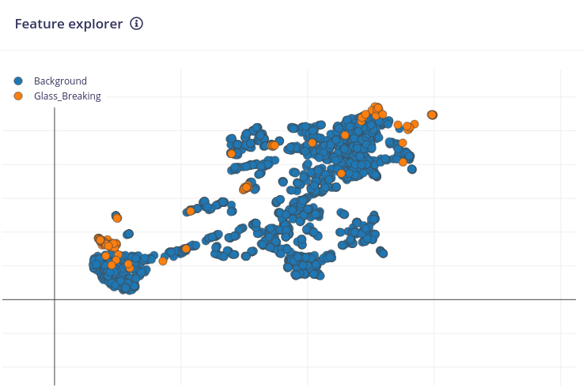

In the **Generate features** tab, you can observe the **Feature explorer**. It enables visual, intuitive data exploration. Before beginning to train the model, you can rapidly verify whether your data separates neatly. If you're looking to identify the outliers in your dataset, this feature is fantastic because it color-codes comparable data and enables you to track it back to the sample it originated from by just clicking on the data item.

## Configure the NN Classifier

The next step in developing our machine learning algorithm is configuring the NN classifier block. There are various parameters that can be changed: the **Number of training cycles**, the **Learning rate**, the **Validation set size** and to enable the **Auto-balance dataset** function. They allow you to control the number of epochs to train the NN on, how fast it learns and the percent of samples from the training dataset used for validation. Underneath, the architecture of the NN is described. For the moment, leave everything as is and press **Start training**.

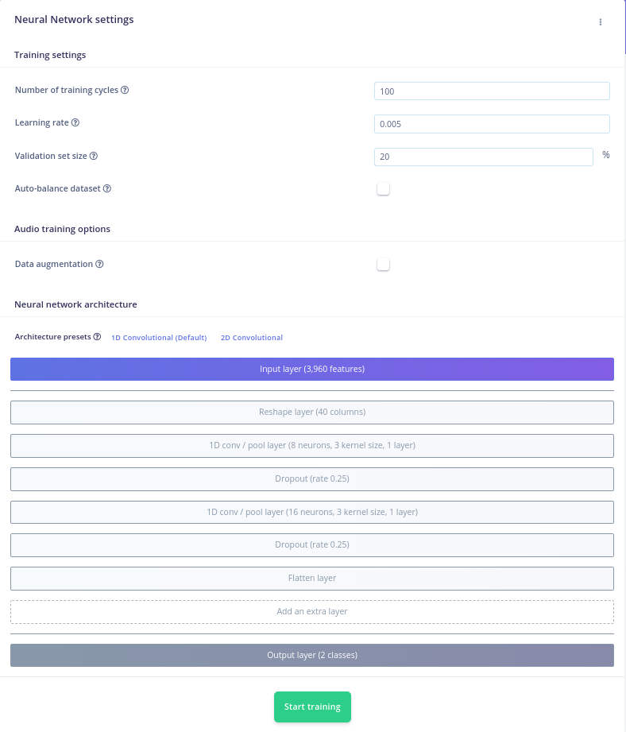

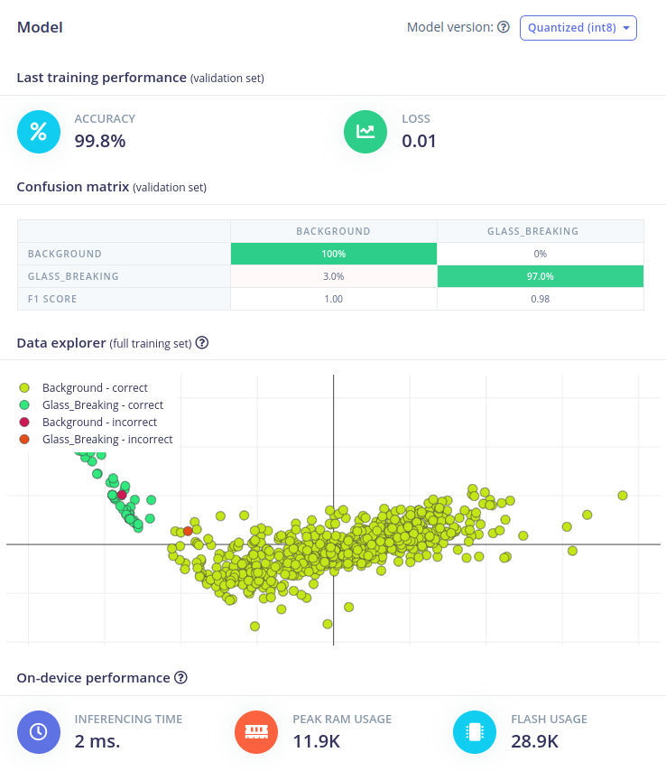

The training will be assigned to a cluster and when the process ends, the training performance tab will be displayed. Here, you can evaluate the Accuracy and the Loss of your model, the right and wrong responses provided by our model after it was fed the previously acquired data set, in a tabulated form.

Moreover, you can see the Data explorer that offers an intuitive representation of the classification and underneath it, the predicted on-device performance of the NN.

### Upload the Impulse via USB Cable

You will notice that another menu pops up that allows you to opt in if you want to enable EON Compiler. We will get back to this later, for now click **Build** and wait for the process to end. Once it’s done, download the .hex file and follow the steps in the video that shows up to upload it on the Thingy:53 board.

With the impulse uploaded, connect the board to your computer, launch a terminal and issue the following command to see the results of the inferencing:

```
edge-impulse-run-impulse
```

### Upload the Impulse via Android/IoS App

Another way of deploying the model on the edge is using the **Nordic nRF Edge Impulse** app for iPhone or Android:

1. Download and install the app for your Android/IoS device.
2. Launch it and login with your edgeimpulse.com credentials.
3. Select your project from the list

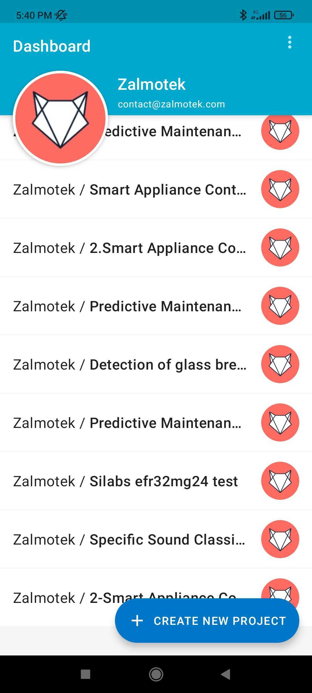

Navigate to the Devices tab and connect to the Thingy:53


Navigate to the **Data** tab and press **connect**. You will see the status on the button changing from Connect to Disconnect.

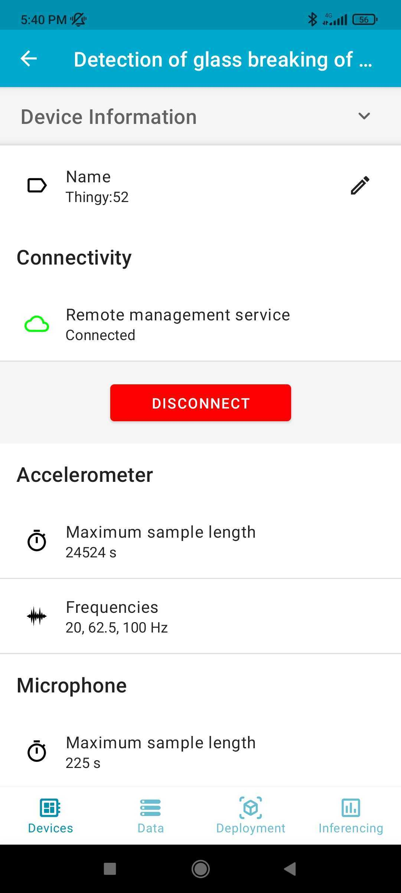

Navigate to the **deployment** tab and press **deploy**.

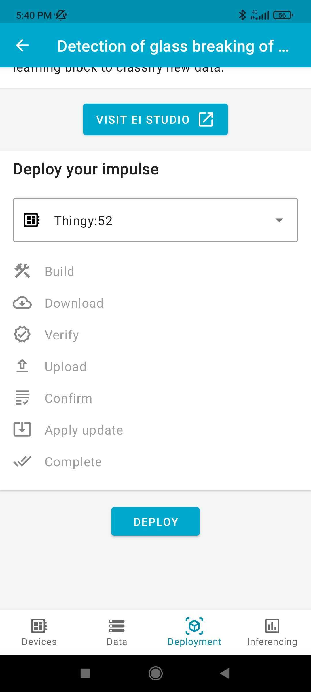

In the **inferencing** tab, you will see the results of the Edge Impulse model you have flashed on the device:

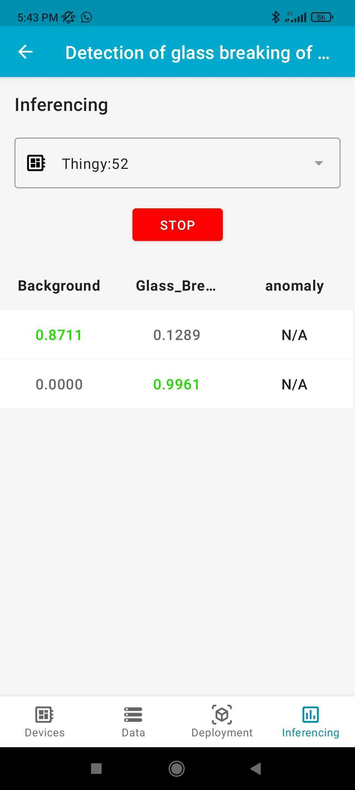

## Conclusion

In this article, we have described how to create a glass/window breaking detection system using the Nordic Thingy:53™ development board and Edge Impulse Machine Learning platform. This system can be used in office buildings or other commercial settings to help improve safety and security. We believe that this approach has several advantages over existing solutions, including its low cost, ease of use, and accuracy. With further development, this system could be expanded to include other types of sensors (e.g. cameras) to improve detection accuracy or be used in other applications such as door/window opening detection or intruder detection.

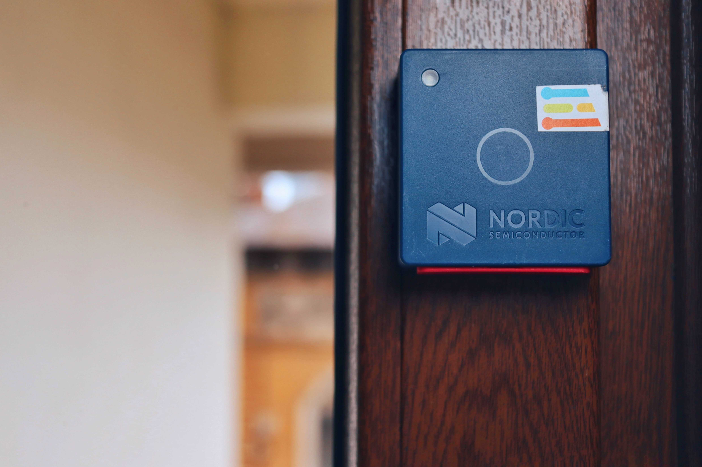
