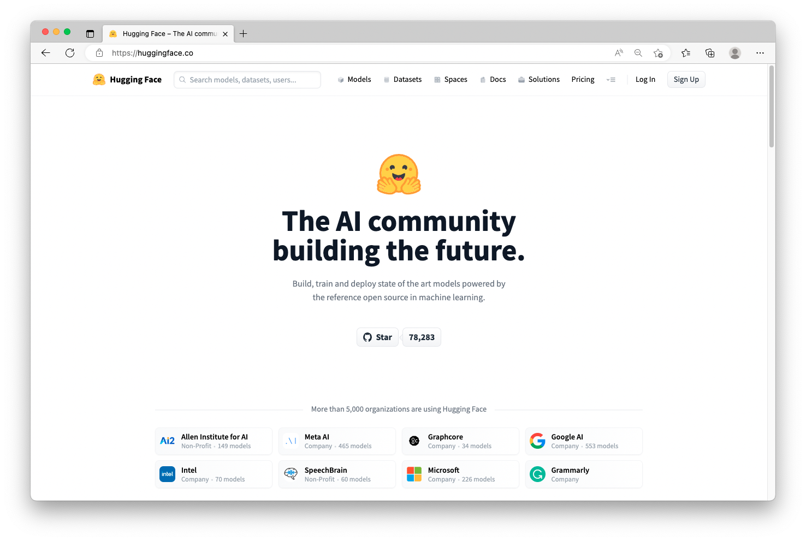
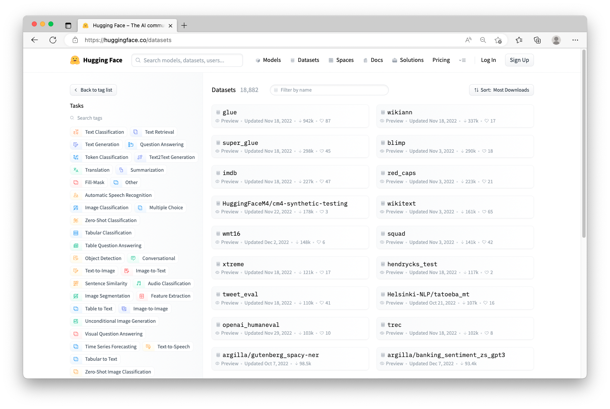
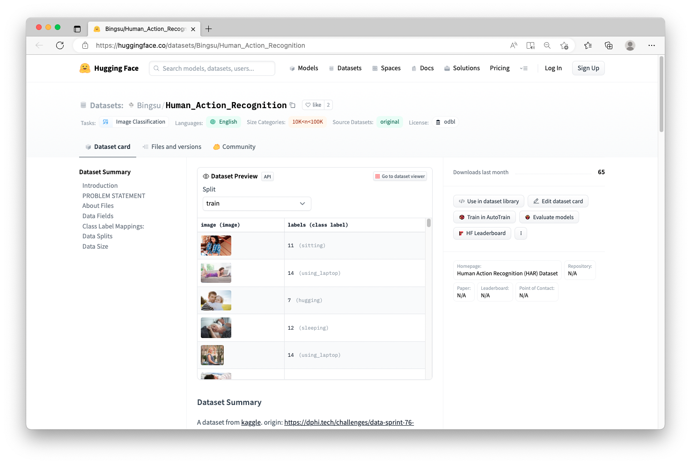
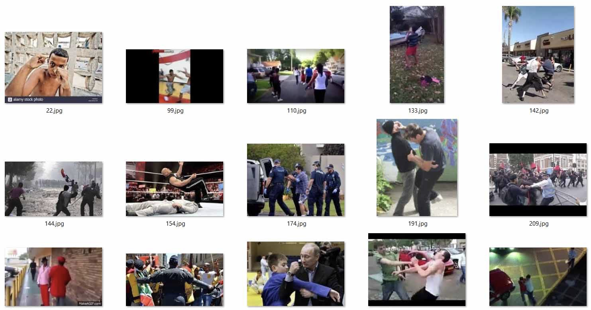
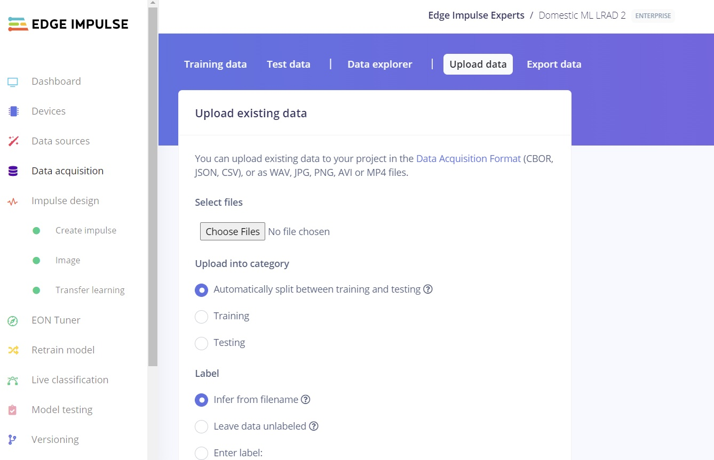
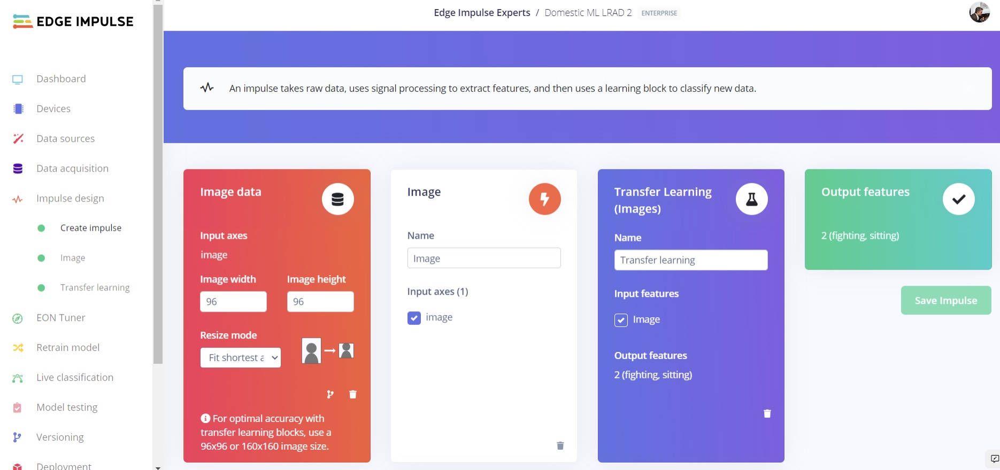
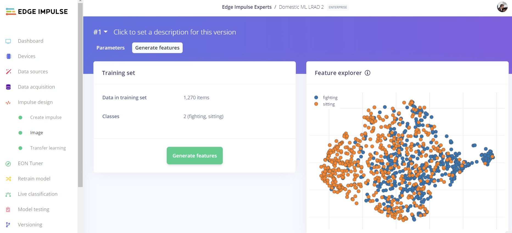
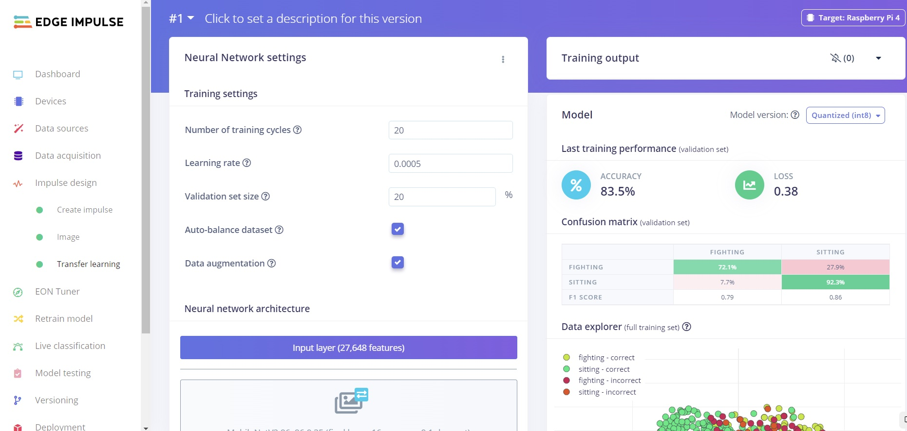

# How to Use a Hugging Face Image Classification Dataset with Edge Impulse

Created By:
Roni Bandini 

Public Project Link:
[https://studio.edgeimpulse.com/public/161949/latest](https://studio.edgeimpulse.com/public/161949/latest)

GitHub Repository:
[https://github.com/ronibandini/domesticLMLRAD](https://github.com/ronibandini/domesticLMLRAD)

## Introduction

Recently, I was making a "long range acoustic device" (LRAD) triggered by specific human actions, and I thought about obtaining my own pictures to train a model.  But with just a few pictures (under representation in the training data) my predictions would not be reliable.  As you can imagine, the quality of the data affects the results of predictions, and thus the quality of an entire machine learning project.

Then I learned about Hugging Face, an AI community with thousands of open-source and curated image classification datasets and models, and I've decided to use one of their datasets with Edge Impulse. 

In this tutorial I will show you how I got a Hugging Face Image Classification dataset imported to Edge Impulse, in order to train a machine learning model.
 
## Hugging Face Dataset Download


 
1. Go to https://huggingface.co/

2. Click on Datasets, then on the left, in the Tasks find and click on Image Classification (you may need to click on "+27 Tasks" in order to see the entire list of possible options).

    

3. For this project, I chose to use this dataset [https://huggingface.co/datasets/Bingsu/Human_Action_Recognition](https://huggingface.co/datasets/Bingsu/Human_Action_Recognition)

    

4. There are a few important things to note on this page:

- The dataset name (Bingsu/Human_Action_Recognition)
- How many images are contained in the dataset (if you scroll down, you will see 12,600 images are in Train and 5,400 are in Test)
- The Labels assigned to the images (15 different Classes are represented)

```
{
    'calling': 0,
    'clapping': 1,
    'cycling': 2,
    'dancing': 3,
    'drinking': 4,
    'eating': 5,
    'fighting': 6,
    'hugging': 7,
    'laughing': 8,
    'listening_to_music': 9,
    'running': 10,
    'sitting': 11,
    'sleeping': 12,
    'texting': 13,
    'using_laptop': 14
}
```

You can click on the "Use in Dataset Library" button on the right to view instructions on how to download the images to your local computer, either via the Hugging Face library, or via a `git clone` of the repository containing the dataset.  Alternatively, I have written a small python script to handle the download.  You can retrieve the `huggingFace.py` script from [https://github.com/ronibandini/domesticLMLRAD](https://github.com/ronibandini/domesticLMLRAD), then open the file in an editor to have a look at it's contents.


You can see that there are a few dependencies that need to be installed first, before using the script.  So we'll open a command line or terminal with admin permissions, then run:

```
md datasets
cd datasets
pip install datasets
pip install datasets[vision]
```

*Note: to test that everything was installed, run:
```
python -c "from datasets import load_dataset; print(load_dataset('squad', split='train')[0])"
```

The script also identifies just one Class label to download, as you can see on line 15 (currently set to Class number 11 which corresponds to "sitting").  If you change `myLabel=11` to `myLabel=6`, you will instead download the "fighting" Class.  Now you can run the python download script:

`python huggingFaceDownloader.py`

The contents of the dataset Class for "fighting" will be downloaded to the /datasets folder you just created.



## Data Acquisition

Now we can follow the normal Edge Impulse data upload process.  More information on that process can be [found here](https://docs.edgeimpulse.com/docs/edge-impulse-studio/data-acquisition).  Essentially, you will go to Edge Impulse and login to your account, choose your project (or create a new one), click on **Data Acquisition**, and then click on **Upload data**.



We only have the one Class for now, which is fine, so simply select the Hugging Face images that are in the `/datasets` folder you created earlier, and you can automatically split between Training and Testing.  You'll also need to enter the Label: "fighting". 

To prepare another Class, edit line 15 in the `huggingFace.py` script once again and change the value to another number, perhaps the original value of Class 11 (sitting) is a good one.  Re-run the script, and the images for that Class will be downloaded, just like previously.  Then, repeat the Data Upload steps, remembering to change the Label in the Edge Impulse Studio to "sitting".

## Machine Learning Model Creation

With our images uploaded, we can now build a machine learning model.  To get started, go to Impulse Design on the left menu, then in Create Impulse you can choose the default values and add an Image block and a Transfer Learning (Images) block, then click **Save Impulse**.



On the next page, you can leave the Parameters at their default settings as well and click **Save parameters**, to proceed to Generate Features.  You should see your data represented dimensionally, and you can click **Generate features**.



Next, on the left, click on **Transfer Learning** and you will start the actual model training process.  Click on **Start training** and wait a few moments for the job to complete.



Once it has finished running, you will see your Model training performance.  You can click on Deployment on the left menu to have a look at the various deployment options available, depending upon the type of device you will be using.  Edge Impulse supports microcontrollers, CPU's, GPU's, and custom AI accelerators, and various formats for use such as an Arduino library, an EIM file for Python and Linux devices, C++, WebAssembly, TensorRT, and more.

## Conclusion 

At this point, you now have a trained machine learning model ready to use in your edge AI project, courtesy of an open-source dataset hosted and provided by Hugging Face and their community.  These steps can be applied to make use of other Hugging Face datasets, additional Classes can be added, or the type of project could be altered to object detection, etc.  Of course, we haven't deployed the model onto a physical device in this tutorial as we are more concerned with the image curation process from Hugging Face, but information on running your model on a device is [located here](https://docs.edgeimpulse.com/docs/edge-impulse-studio/deployment), so be sure to give it a read.


