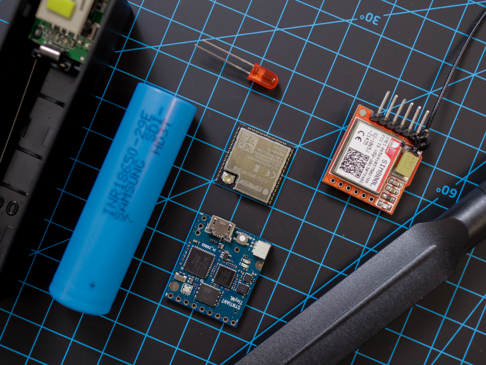
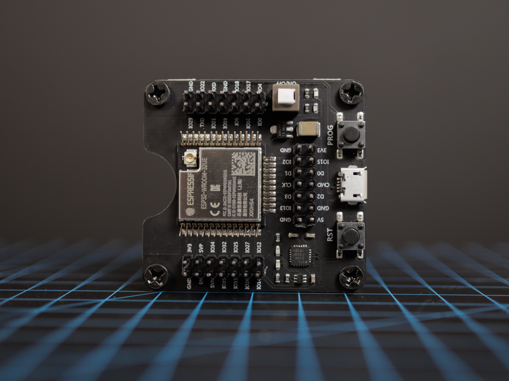
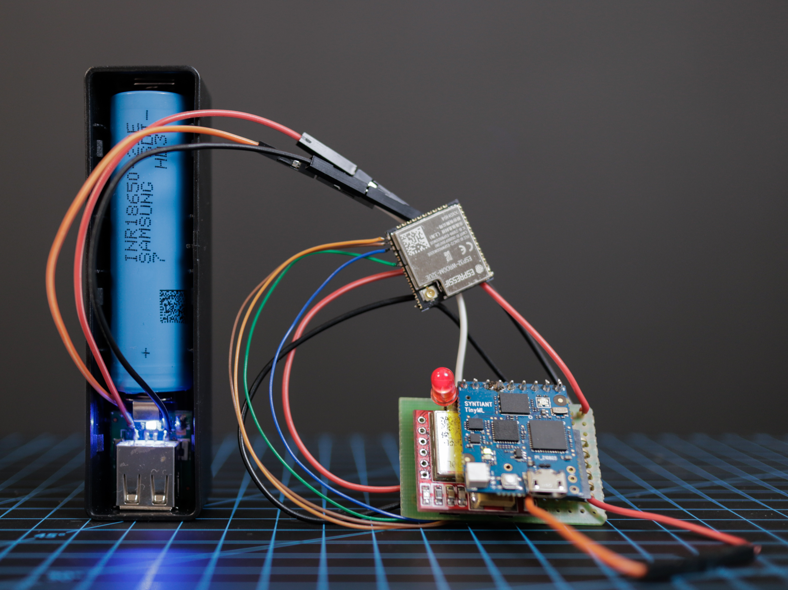
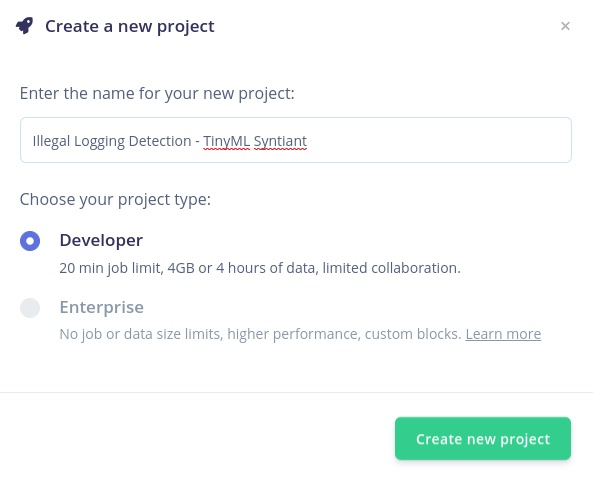
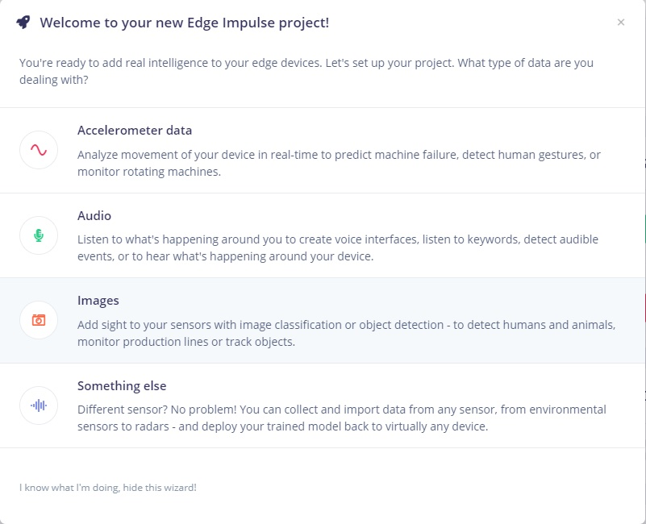
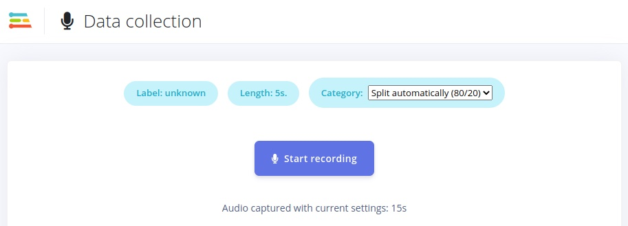
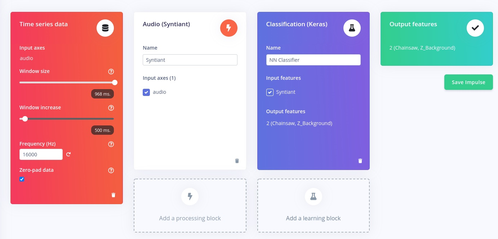
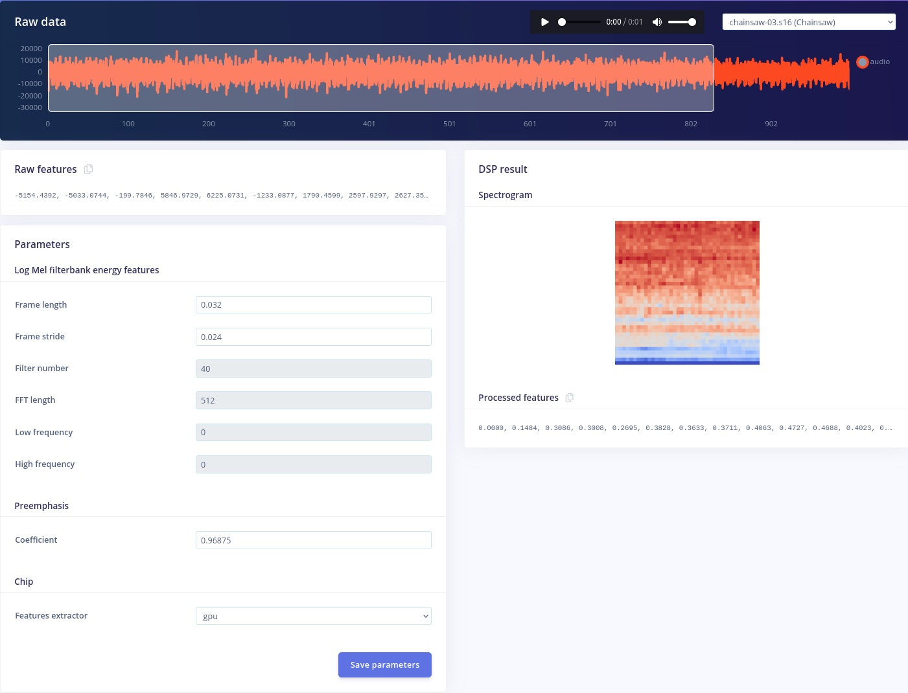
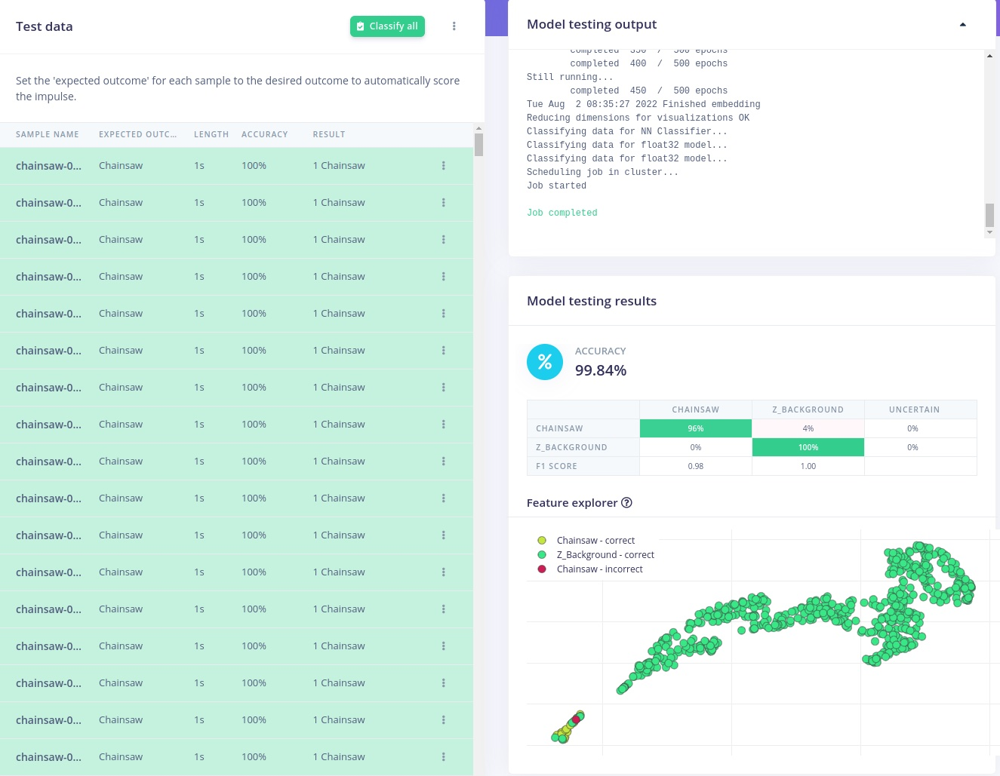

# Illegal Logging Detection in the Forest - Syntiant TinyML

Created By:
[Zalmotek](https://zalmotek.com) 

Public Project Link:

[https://studio.edgeimpulse.com/studio/126774](https://studio.edgeimpulse.com/studio/126774)

## Introduction

Illegal logging is a major environmental issue worldwide. It not only destroys forests but also decreases the amount of available timber for legal purposes. In addition, illegal logging often takes place in protected areas, which can damage ecosystems and jeopardize the safety of people and wildlife.

One way to combat this problem is through the use of machine learning algorithms that can detect chainsaw noise and be deployed on battery-powered devices, such as sensors in the forest. This allows for real-time monitoring of illegal logging activity, which can then be quickly addressed.

## The Challenge

Detecting illegal logging is therefore essential for both environmental and economic reasons. However, it is difficult to detect illegal logging activity due to the vastness of forested areas, as it often takes place in remote and hard-to-reach areas. Traditional methods such as ground patrols are often ineffective, and satellite imagery can be expensive and time-consuming to analyze. 


When combined with satellite data, ML can be used to quickly and cost-effectively identify areas where illegal logging is taking place. By deploying sensors in the forest, they are able to detect illegal logging activity in real time. In addition, by providing data on where illegal logging is taking place, they are helping to better target enforcement efforts. This information can then be used to deploy ground patrols or take other actions to stop illegal activity. In this way, ML can play a vital role in protecting forests and ensuring that timber is harvested legally.

## Our Solution


 
Our approach to this problem is to create an IoT system based on the TinyML Syntiant development board that will run a machine learning model trained using the Edge Impulse platform that can detect the sound of chainsaws and send a notification via SMS when this event is detected.

We have picked the Syntiant TinyML board as our specialized silicon that can easily run the machine learning algorithm thanks to its Neural Decision Processors (NDPs). Moreover, having an onboard PH0641LM4H microphone makes it great for quickly prototyping audio-based projects. This board is ideal for building and deploying embedded Machine Learning models, as it is fully integrated with Edge Impulse and it has very low power consumption, advantageous for this use case as we do not want to charge the battery often.

Because this device must be deployed in remote and difficult-to-reach locations, a fitting power source must be used and so, we have opted to power it from a 2500 mAh rechargeable Li-Ion battery.

We will use a publicly available chainsaw noise dataset and the Edge Impulse platform to train and deploy a model that can distinguish between this sound and other similar sounds.


### Hardware requirements

- [Syntiant TinyML board](https://www.syntiant.com/tinyml)
- Micro USB cable
- SIM800L GSM module
- ESP32
- ESP32 programmer
- 3.3V power supply (LD1117S33)
- Power bank: rechargeable Li-Ion battery (INR18650-29E6 SAMSUNG SDI) + charger
- Consumables (wires, prototyping board, LED)
- Enclosure (carved stone)

### Software requirements

- Edge Impulse account
- Edge Impulse CLI
- Arduino IDE
- Arduino CLI
- Git

## Hardware Setup

As stated before, our choice of Edge computing hardware for this use case is the Syntiant TinyML board, designed for working with Syntiant’s Neural Decision Processors (NDPs). This development board is a powerful tool for developing and deploying Machine Learning algorithms, as it is equipped with an ARM Cortex-M4 processor, which allows for real-time inference of the trained Machine Learning model. Another advantage of this Syntiant board is that it is equipped with 5 GPIOs that enable it to interact with other external circuitry and trigger an external output.

Over the ML detection layer of our system, we will be adding a communication layer. In this case, we are using an external circuit based on the ESP32 MCU that can read a trigger from Syntiant TinyML, which is further interfaced with a SIM800L module, responsible for sending an SMS message to the user when chainsaw noise is detected.

Be advised that the SIM800L is using 2G networks, in the EU there are still many providers for it and the coverage is way better for it in comparison with the speedier networks. Since we are deploying it in a forest it's actually a good option for us. In the US the 2G networks are being phased out currently so be sure to check what GPRS module works best in your case.



In order to camouflage the device, we can fit all of the electronics into a fake stone, making it less likely to be detected. This will make it difficult for illegal loggers to find and destroy the device, as they will not be able to see it.


Since we want to fit all the modules inside the rock, we’re using the smaller SMD ESP32-WROOM-32UE SoC instead of the ESP32 development board, so we also have to use a breakout board to program the board.



To power the system we’re using a power bank based on the rechargeable INR18650-29E6 Li-Ion battery, from which we can obtain both 5V for the Syntiant TinyML board and 3.8V for the SIM800L GSM module. We also have to use a 5V to 3.3V voltage regulator to power the ESP32. You can find all the details in the full wiring schematic presented below. 

NOTE: The Syntiant TinyML board has no power voltage input (the 5V pin does not power up the board and by looking at the schematic we can see it's actually before a voltage regulator that draws from the USB power supply). We had to resort to soldering a small wire to a 5V test pad on the bottom of the board that luckily powers the board.

Because of the space constraints, we opted for a quick point-to-point wiring solution by directly soldering the components for our proof of concept. Of course, after further testing, a printed circuit board could be designed to accommodate all modules and provide a direct plug for the battery making it easier to produce in larger numbers in an automated fashion.




## Software Setup

To connect the Syntiant TinyML to Edge Impulse, download the [Audio firmware archive](https://cdn.edgeimpulse.com/firmware/syntiant-tinyml.zip). Put the board in boot mode by double-clicking on the reset button when connecting the board to your computer, while the orange LED is blinking. In boot mode, you should see the red LED fading on and off. Then flash the firmware by running the script for your OS from the archive:

```
# for macOS and Linux  
./arduino-build.sh --flash
# for Windows
arduino-win-build.bat --flash
```

### Creating an Edge Impulse Project

Let's start by creating an Edge Impulse project.

Register an account with Edge Impulse. Select **Developer** as your project type, click **Create new project**, and then give it a memorable name.



Afterward, select **Accelerometer data** as the type of data you will be dealing with.



### Data Collection

Create a new Edge Impulse project, give it a meaningful name, and select Developer as your desired project type. Afterward, select **Audio** as the type of data you wish to use. To collect audio data from the microphone, connect the board to your computer. Once plugged in, the Syntiant TinyML Board shows up as a USB microphone and Edge Impulse can use this interface to record audio directly. Make sure the board is selected instead of your default microphone in your audio input settings. 


Then, go to **Devices -> Connect a new device** in your Edge Impulse project, choose **Use Your Computer**, and allow access to your microphone. 




### Building the Dataset

Sometimes, gathering relevant data for your TinyML model might be a complicated endeavor, just like in this case. This is a situation in which the **Upload data** function under the **Data acquisition** tab saves the day. What it allows you to do is use publicly available recordings of the phenomena you wish to identify and use them as training data for your model.

In this case, what you must do is find publicly available recordings of chainsaws (in WAV format) and download them. Navigate to the **Upload data** menu, click on **Choose Files** and select your files, select **Training** as the upload category and manually enter the **"Chainsaw"** Label and click **Begin upload**. 

It’s important to upload data that corresponds to background or unknown sounds because the NDP101 chip expects one and only negative class and it should be the last in the list, that we will be naming **Z_Background**. 

For this, we will be using the Noise and Unknown dataset that can be found in the [Keyword Dataset](https://cdn.edgeimpulse.com/datasets/keywords2.zip), which we will label Z_Background.


The next thing on the list is the data formatting. The data uploaded from the Keyword Dataset is split into 1-second long recordings, while the Chainsaw sounds are usually longer, over 30 seconds long. To make things uniform, we will select one Chainsaw data entry, click on the menu marked by the 3 vertical dots, and press on **Split Sample**. We will leave the segment length to 1000ms and add additional segments if needed. Click on **Split** and then do this for every chainsaw sample we have uploaded.


Once this is done, it’s time to do the **Train/Test Split**. Just click on the triangle with an exclamation mark on it, in the Train/Test Split section and Edge Impulse will do the job for you. An ideal ratio would be 80%-20%.


### Designing the Impulse

Once the Data acquisition is over, it’s time to build the Impulse.



You will notice the odd window size. Make sure to leave it at the default 968ms because this is a hardware constraint of the NDP101 chip.

For the processing block, we will be using **Audio (Syntiant)**. This will compute log Mel-filterbank energy features from the audio signal that is fed in it and as for the learning block, we will be employing a **Classification(Keras)** block.

Once you are happy with the set-up, click on **Save Impulse**. 

### Configuring the Digital Processing Block

What this submenu does is let you explore the raw data, and see the signal processing block’s results.



Navigate to the **"Syntiant"** submenu under **Impulse Design**, leave the parameters on their default value and click on **Save parameters**, and then on **Generate Features**.


One of the most effective tools provided by Edge Impulse is the **Feature Explorer**. It enables visual, intuitive data exploration that enables you to rapidly verify whether your data separates neatly, even before starting to train your model. If you're looking to identify the outliers in your dataset, this feature is fantastic because it color-codes comparable data and enables you to track it back to the sample it originated from by just clicking on the data item.

### Configure the Neural Network

In this stage, we may provide a number of parameters that affect how the neural network trains under the **NN Classifier** tab in the **Impulse Design** menu. The Training set can now be kept at its default setting. When you click the Start Training button, take note of how a processing cluster is chosen to host the training process.


What is worth noting here is the particular structure of the neural network. To be more precise, we need to use a 3-layer NN architecture, every layer consisting of 256 neurons to be able to run our model on the NDP101 chip.


Once the program is finished, you will see the training output displayed. A degree of accuracy of more than 95% is what we aim for. The accurate and incorrect responses that our model provided after being fed the previously gathered data set are shown in tabular form in the Confusion matrix just below it. In this case, the dataset was clean enough that the model exhibits a 100% Accuracy rating.

### Model Testing

Navigating to the **Model Testing** page is a wonderful method to start testing our model before deployment. The samples kept in the **Testing data** pool will be displayed to you. To run all of this data through your impulse, select **Classify all**. 



Before making the effort to deploy the model back on the edge, the user has the opportunity to test and improve the model using the model testing tab. When building an edge computing application, the ability to go back and add training data, modify the DSP and Learning block, and fine-tune the model reduces development time significantly. We strongly recommend taking the time to go back, tweak and optimize your model before deploying it on the edge.

To check how the model behaves when deployed on the edge, navigate to the Deploy tab, click on Syntiant TinyML under the **Build firmware** section, select the posterior parameters as the audio events we wish to detect, and press build. 

Edge Impulse will then compile a pre-built binary that can be deployed in the same manner as the data-forwarder used in the data acquisition phase.

With the model uploaded on the board, you can use any serial monitor, like picocom or the serial monitor embedded in Arduino IDE to debug and evaluate the performance of the Impulse.

```
BIN File Loaded correctly from Serial Flash Setup for audio done
Loaded configuration
Inferencing settings:
	Interval: 0.0625 ms.
	Frame size: 15488
	Sample length: 968 ms.
	No. of classes: 2
Starting inferencing, press 'b' to break
Predictions:
    Chainsaw: 	0
    Z_Background: 	1
```

## Deploying the Model on the Edge

Once you are happy with your model, it's time to deploy it on the device.

For our use case, we will be using our custom machine learning model alongside the firmware provided by Edge Impulse to create a custom application that will trigger an output when Chainsaw sounds are detected.

First and foremost, navigate to the **Deployment** tab, select **Syntiant NDP101 library**, and then click on **"Find posterior parameters"**. This is a particularity of the NDP101 architecture that allows the user to set the thresholds for words or other audio events at which a model activates.

Select "Chainsaw" as the audio event that you want to detect and press **Find parameters**. Once that is done, you are ready to press **Build**.

The task will be assigned to a computing cluster and when the job finishes, you will be able to download it locally.

Afterward, clone the [Syntiant firmware repository](https://github.com/edgeimpulse/firmware-syntiant-tinyml) and copy and paste the model files into the **"src"** folder.

Open the **"firmware-syntiant-tinyml.ino"** in Arduino IDE, without creating a folder for it, and modify the on_classification_changed function like so:

```
#include "src/syntiant.h"
#include <NDP.h>
#include <NDP_utils.h>
#include <Arduino.h>

void on_classification_changed(const char *event, float confidence, float anomaly_score) {
    if (strcmp(event, "Chainsaw") == 0) {
        OUT_1_LOW();
        delay(10000);
    }else{
        OUT_1_HIGH();
    }
}
void setup(void)
{   syntiant_setup();
    OUT_1_HIGH();
}
void loop(void)
{
    syntiant_loop();
}
```

Save and close. 

Next up, launch a terminal, navigate to the **firmware-syntiant-tinyml** folder and run:

```
./arduino-build.sh --build
```

Once the firmware successfully builds, connect the Syntiant board to your computer, place it in Boot mode and run:

```
./arduino-build.sh --flash
```

If everything goes smoothly, the firmware will be flashed on your Syntiant TinyML board and when your board detects Chainsaw sounds, it will light up the LED in the color red.

## Sending SMS Notifications

Now that you have a Syntiant TinyML board that is able to detect chainsaw noises, you can program the ESP32 board to send an SMS notification through the SIM800L GSM module whenever the sound is detected. The GSM module is connected to the UART2 of the ESP32 microcontroller. Open Arduino IDE and paste the code below, then adjust the phone number and upload it to your ESP32 board:

```
// code adapted from: https://circuitdigest.com/microcontroller-projects/interfacing-sim800l-module-with-esp32

void setup() {
  Serial.begin(9600);
  Serial2.begin(9600);
  delay(3000);
  pinMode(16, INPUT);
  pinMode(18, OUTPUT);
  digitalWrite(18, LOW);
  test_sim800_module();
}

void loop() {
  updateSerial();
  if (digitalRead(16) == HIGH) {
    digitalWrite(18, HIGH);
    send_SMS();
    delay(1000);
  }
  digitalWrite(18, LOW);
}

void test_sim800_module() {
  Serial2.println("AT");
  updateSerial();
  Serial.println();
  Serial2.println("AT+CSQ");
  updateSerial();
  Serial2.println("AT+CCID");
  updateSerial();
  Serial2.println("AT+CREG?");
  updateSerial();
  Serial2.println("ATI");
  updateSerial();
  Serial2.println("AT+CBC");
  updateSerial();
}

void updateSerial() {
  delay(500);
  while (Serial.available()) {
    Serial2.write(Serial.read()); // Forward what Serial received to Software Serial Port
  }
  while (Serial2.available()) {
    Serial.write(Serial2.read()); // Forward what Software Serial received to Serial Port
  }
}

void send_SMS() {
  Serial2.println("AT+CMGF=1"); // Configuring TEXT mode
  updateSerial();
  Serial2.println("AT+CMGS=\"+xxxxxxxxxxx\""); // change ZZ with country code and xxxxxxxxxxx with phone number to sms
  updateSerial();
  Serial2.print("Illegal logger detected!"); // SMS
  updateSerial();
  Serial.println();
  Serial.println("Message Sent");
  Serial2.write(26);
}
```


## Conclusion


In conclusion, illegal logging is a major environmental issue that can be effectively combated through the use of machine learning algorithms. The system described in this article provides a way to quickly and easily monitor large areas of forest for illegal logging activity, and take action to stop it. The Syntiant TinyML board is an efficient and robust platform for running machine learning models and can be used to quickly and easily detect illegal logging activity. With this system in place, we can help to preserve our forests and ensure that they are managed in a sustainable way.

If you need assistance in deploying your own solutions or more information about the tutorial above please [reach out to us](https://edgeimpulse.com/contact)!
