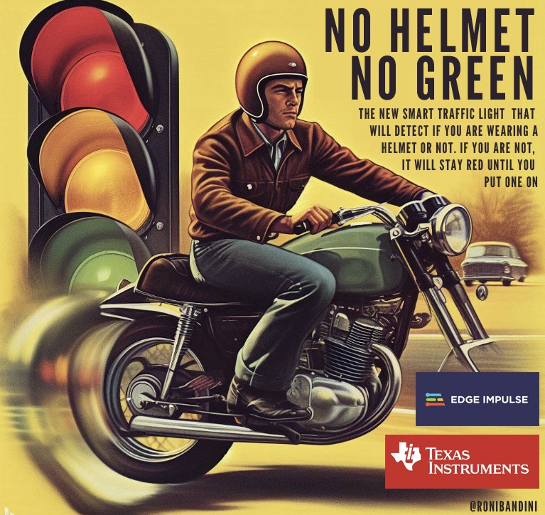
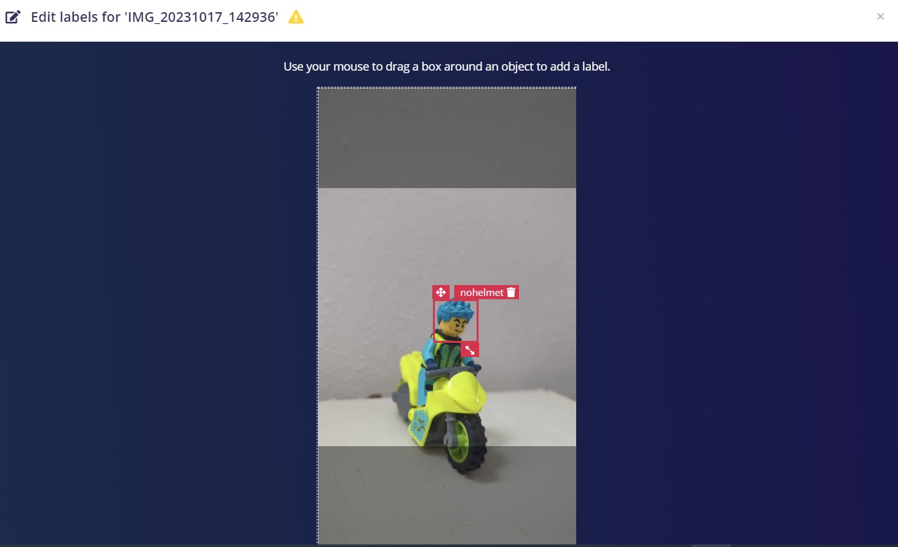
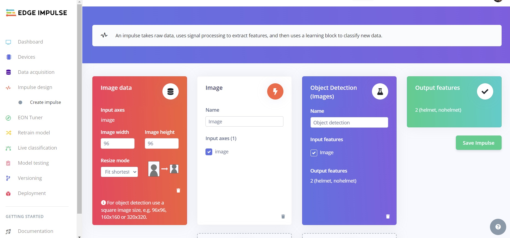
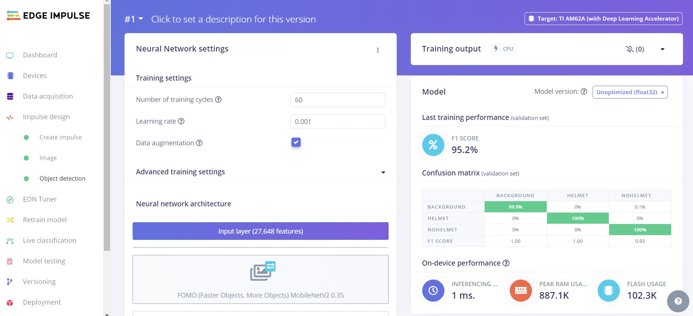
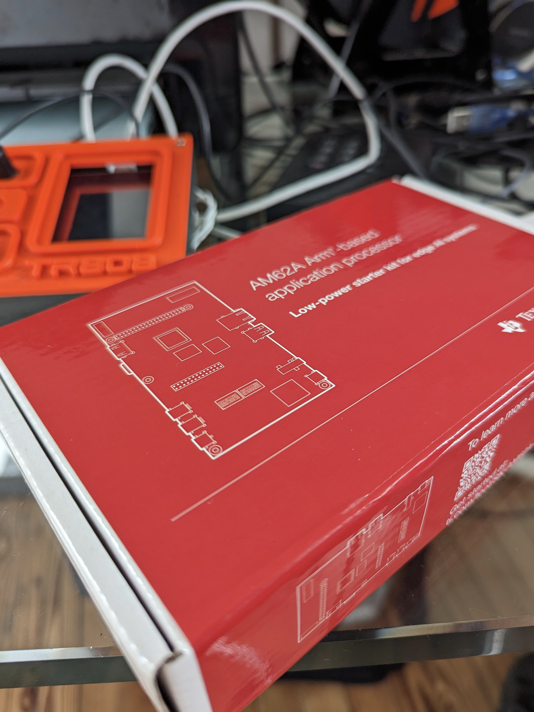
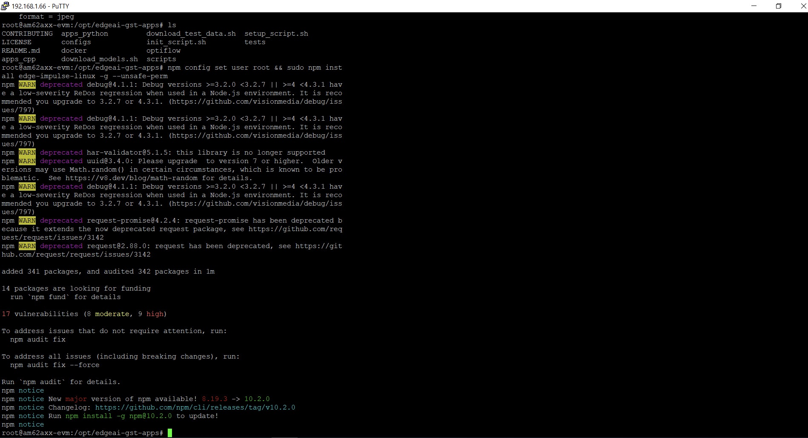
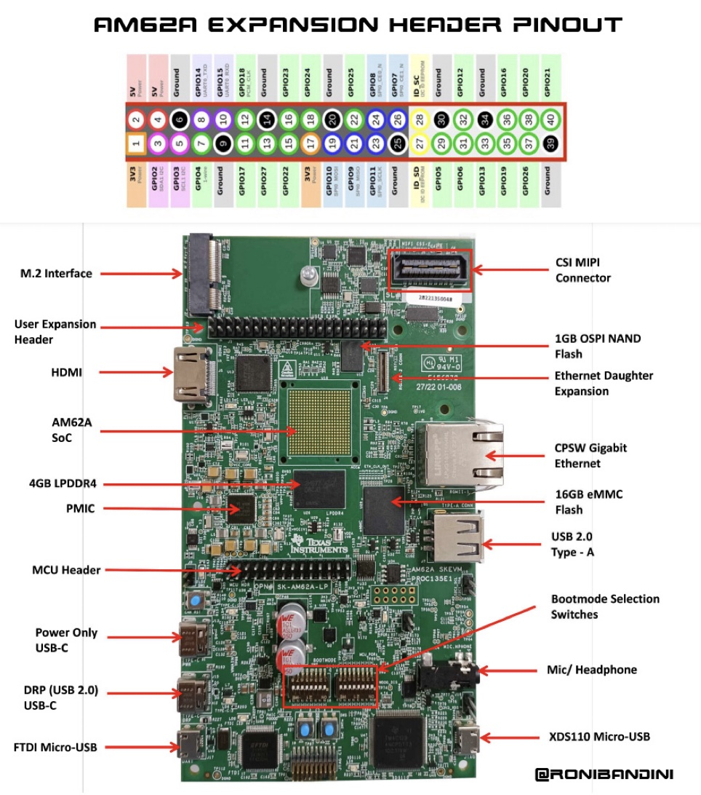
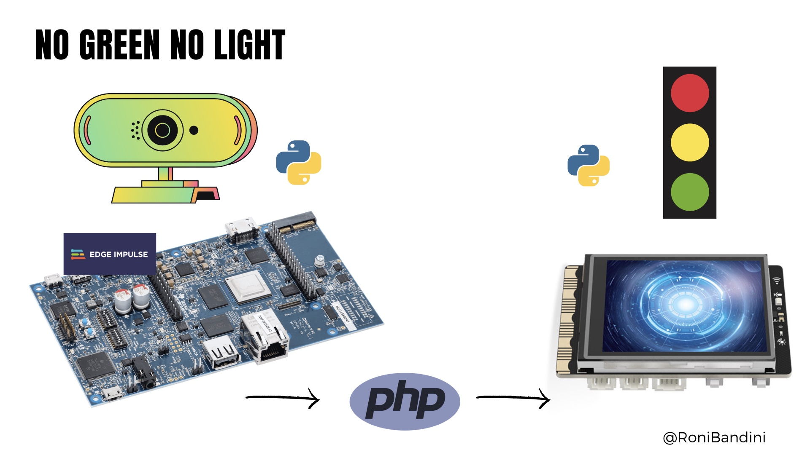
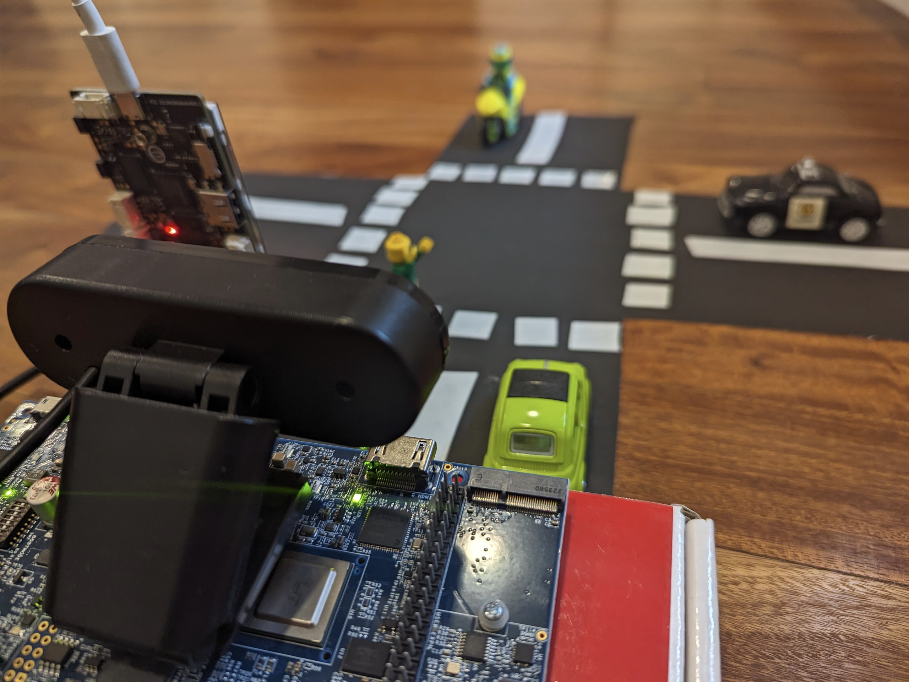

# Motorcycle Helmet Identification and Traffic Light Control - Texas Instruments AM62A

Created By: Roni Bandini

Public Project Link: [https://studio.edgeimpulse.com/public/295740/latest](https://studio.edgeimpulse.com/public/295740/latest)

GitHub Repository: [https://github.com/ronibandini/TIAM62AITrafficLight](https://github.com/ronibandini/TIAM62AITrafficLight)



## Introduction

The data is undeniable: helmets are essential for motorcycle safety. About 40% of fatal motorcycle crashes involve riders who are helmetless. And even for those who survive, traumatic brain injuries can cause irreversible damage and disability. Not to mention the burden on public health and resources.

I was intrigued by a viral video of an AI traffic light that had a clever idea: it would only turn green for motorcycles if the riders had helmets on.

Could I replicate this system using the Texas Instruments AM62A Starter Kit for Edge AI?

I had some experience with other TI boards like the TDA4VM, so I thought this would be a breeze. But I encountered some challenges, learned some lessons, and discovered some useful tips for other developers who want to start new ML projects with Edge Impulse and the TI AM62A.

## Model Training

For this section an Edge Impulse account is needed. Edge Impulse is free for developers, and [you can sign up here](https://studio.edgeimpulse.com/signup).


For practicality reasons, instead of using an actual traffic light, I made a scale model of an intersection, and I have trained the machine learning model with a Lego figure.

Detection/segmentation is one of the functional algorithms in machine learning. You have to take enough pictures for every case you'd like to identify (such as riders wearing helmets, and riders not wearing them for this project), so that the neural network is able to identify subtle patterns and provide inferences for new pictures it has not seen before.

To take pictures you can use the TI board with an attached USB camera, but I have decided instead to use an Android App named [Open Camera](https://play.google.com/store/apps/details?id=net.sourceforge.opencamera&hl=en&gl=US) that includes a continuous shutter feature. 

I have taken around 30 pictures for each desired label, `helmet` and `nohelmet`. I uploaded the pictures to Edge Impulse using the **Data aquisition** tab, then I went to the **Labeling queue**. 



On the **Impulse design** tab, I created an Impulse for Image data with 96x96px dimensions, chose an **Image** Processing block, **Object Detection** as the Learning block, and 2 output features corresponding to the labels: `helmet` and `nohelmet`.



After generating features, I used for Neural Network Settings of 60 cycles (epochs), a 0.001 Learning rate, and enabled _Data augmentation_ (small random changes to data during training to increase accuracy).  The end result after the training was completed, was a 95.2% F1 score.




The next step for many projects is to build firmware using the **Deployment** tab, but there is no need to build from the Studio for this project, since I will execute the `edge-impulse-runner` on the board and the model will be directly downloaded on to the AM62A.

> Note: You can also just clone my trained model instead of training a new one. The Public Project URL link is [https://studio.edgeimpulse.com/public/295740/latest](https://studio.edgeimpulse.com/public/295740/latest)

## Hardware 

### Texas Instruments AM62A

The Texas Instruments AM62A SK-AM62A-LP is a "low-power Starter Kit for Edge AI systems" featuring a quad-core 64-bit Arm® Cortex®-A53 microprocessor, a single-core Arm Cortex-R5F, an H.264/H.265 video encode/decode, 2GB 32bit LPDDR4 memory, 512MB OSPI, 16GB eMMC, USB 2.0, microSD slot, Gigabit Ethernet, 3.5mm TRRS audio jack, and a 40 pin GPIO expansion header.



There are several differences in working with this board compared to a Raspberry Pi for example. You cannot just connect a keyboard, mouse, and monitor to login; the OS is an Arago Linux version with limited tools installed by default (though you could also build your own operating systems if necessary).

After some trial and error, my recommendationed method for interacting with the board is:

 - Download this operating system image version: [https://www.ti.com/tool/download/PROCESSOR-SDK-LINUX-AM62A/08.06.00.45](https://dr-download.ti.com/software-development/software-development-kit-sdk/MD-D37Ls3JjkT/08.06.00.45/tisdk-edgeai-image-am62axx-evm.wic.xz)
 - Flash the image to a 16gb or larger microSD card with Balena Etcher or any other similar software
 - Connect the Power Supply, HDMI, USB Camera, and Ethernet Cable
 - Check the board IP on the HDMI screen when board boots up and the default application loads
 
 
 
 - Login to that IP using Putty or any other SSH client, using `root` as the user, and no password
 - Run `npm config set user root && sudo npm install edge-impulse-linux -g --unsafe-perm`
 
 
 
 - Run `sudo pip3 install requests` (this will be required later to publish the detection rate for the WiFi traffic light module)
 - Adjust the camera position to aim at your target, and then run the following:  `edge-impulse-linux-runner --force-engine tidl --force-target runner-linux-aarch64-am62a`.  The first time you run this, you will need to login to your Edge Impulse account and select the right project.  Once running, launch a web browser and navigate to your board's IP address, port 4912.  For example, `http://192.168.1.66:4912` in my case.
 - Download the `am62a_traffic.py` file [from the GitHub repository](https://github.com/ronibandini/TIAM62AITrafficLight) and then upload the script to the AM62A board using SFTP. The credentials are the same as logging in directly:  You'll need your IP address, username is `root`, and there is no password.

## GPIO 



The original idea was to control 3 Leds from the User Expansion Header. With the Texas Instruments TDA4VM, adding an overlay line enabled GPIO. I thought the same situation would be possible with the AM62A, but unfortunately that did not work.

After asking TI support, I have obtained this answer:

"RPi.GPIO is not within our SDK and we don't provide support for it. Instead, the SDK utilizes the Chardev interface. Here is a link to an E2E FAQ that explains how to get 
started: [https://e2e.ti.com/support/processors-group/processors/f/processors-forum/1260373/faq-transitioning-the-gpio-userspace-interface-from-sysfs-to-chardev](https://e2e.ti.com/support/processors-group/processors/f/processors-forum/1260373/faq-transitioning-the-gpio-userspace-interface-from-sysfs-to-chardev). Please note that Chardev should work with SDK 8.6."

That seemed like a rabbit hole and I decided to take another approach. What if I can send the inference results from the AMD62A to a central server that will be queried by the traffic light? What if I use an LCD screen instead of normal LEDs? That will be more visually appealing and more interesting from the coding side.

So, the inference value for not wearing a helmet will be sent from the AM62A to a server, and the server will be queried by the traffic light using WiFi.



## Server Application

I created and uploaded files named `updateHelmet.php` and `helmet.ini` (which are also available in the same GitHub repo as earlier) to a web server, assigned 777 permissions to `helmet.ini`, and edited the URL inside the `am62a_traffic.py` file on the AM62A.

> Note: For this prototype, only one inference value is uploaded to the server. For a multi-traffic light environment, unique IDs would have to be added (and also security controls).



## Unihiker Traffic Light

[Unihiker](https://www.unihiker.com/) is a Debian/Python ready single board computer with an integrated LCD screen. So, from the hardware point of view and software requirements, it has everything to code a script to get inferences from an intermediate web server, and display traffic lights (which in fact will be 3 iterating png files: `green`, `yellow` and `red.png`)

To begin, connect a USB-C cable to the Unihiker, open a web browser to `http://10.1.2.3`, enter your WiFi SSID and password, and obtain the new IP address of the Unihiker.

Now with that Unihiker on the same network, you can connect via SFTP to the Unihikey using the user `root` and password `dfrobot`, and upload the `unihiker_trafficLight.py` file (again, obtained from the GitHub repo) and the three traffic light images to the `/images` folder.

## Run the System

Now that the camera was placed, the inference module was ready, the intermediate server was ready, and the traffic light was ready, I started the system by executing from an SSH session on each board:

- AM62A: `python3 am62a_traffic.py`
- Unihiker: `python unihiker_trafficLight.py`

## Demo Video



## Conclusions

The applications and the machine learning model work as expected, succesfully identifying helmets (or lack of) on the Lego figures.  However, the ethical and practical implications of this project are debatable (helmeted riders are penalized by the system too, and traffic congestion may increase if non-helmeted riders trigger a red-light, with no ability to acquire a helmet thus creating an indefinite red light). But, it is worthwhile to explore and develop machine learning for human and public health scenarios.

This project was trained with Lego figures, but the same principles can be scaled up and applied to real-world situations. In fact, it may be easier to detect patterns with larger figures considering the camera quality and resolution.

Edge Impulse also provides the ability to use a [previously trained model through the BYOM feature](https://docs.edgeimpulse.com/docs/edge-impulse-studio/bring-your-own-model-byom), so there could be existing or better models already developed that would make this more applicable.

## Further Development

As mentioned, if a rider does not have a helmet, the light would remain red indefinitely. Obviously, that is not acceptable, so what about sending a Telegram notification to authorities instead?

Just add this function to the `am62a_traffic.py` file, and you are all set.

```
def telegramAlert(message):

	apiToken = '00:000'
	chatID = '-0000'
	apiURL = f'https://api.telegram.org/bot{apiToken}/sendMessage'

	try:
		response = requests.post(apiURL, json={'chat_id': chatID, 'text': message})
		print(response.text)
	except Exception as e:
		print(e)
```

Or, as riders likely could not be identified with precision, what about using a secondary camera with otical character recognition (OCR) to capture the license plate of the motorcycle and issuing the rider an automatic ticket? The TI AM62A is able to utilize several cameras concurrently, in fact there are 2 CSI ports on the board ready for Raspberry Pi Cameras. You can use them to take a picture from behind the vehicle, send the picture to an OCR application, obtain the license plate and automatically make the ticket.

For OCR, a good Python library is located here [https://pypi.org/project/pytesseract/](https://pypi.org/project/pytesseract/)

Here is an example of how to use it in an application:

```
from PIL import Image
import pytesseract
print(pytesseract.image_to_string(Image.open('licenseplate.png')))
```

## Resources

### Files

- Source Code:  [https://github.com/ronibandini/TIAM62AITrafficLight](https://github.com/ronibandini/TIAM62AITrafficLight)
- Edge Impulse Public Project:  [https://studio.edgeimpulse.com/public/295740/latest](https://studio.edgeimpulse.com/public/295740/latest)
- Traffic Light 3D Printed Stand:  [https://www.thingiverse.com/thing:6277702](https://www.thingiverse.com/thing:6277702)

### References

 - [https://www.steelhorselaw.com/news/motorcycle-accident-claim-impact-of-not-wearing-a-helmet#:~:text=Of%20those%20who%20died%2C%20helmets,could%20have%20otherwise%20been%20prevented](https://www.steelhorselaw.com/news/motorcycle-accident-claim-impact-of-not-wearing-a-helmet#:~:text=Of%20those%20who%20died%2C%20helmets,could%20have%20otherwise%20been%20prevented)
 - [https://applications.emro.who.int/docs/EM_RC56_Tech_Disc_1_en.pdf](https://applications.emro.who.int/docs/EM_RC56_Tech_Disc_1_en.pdf)
 - [https://docs.edgeimpulse.com/docs/edge-impulse-studio/bring-your-own-model-byom](https://docs.edgeimpulse.com/docs/edge-impulse-studio/bring-your-own-model-byom)
 - [https://docs.edgeimpulse.com/docs/tips-and-tricks/data-augmentation](https://docs.edgeimpulse.com/docs/tips-and-tricks/data-augmentation)

### Contact

If you are interested in other Artificial Intelligence and Machine Learning projects: [https://www.youtube.com/playlist?list=PLIw_UcVWFyBVYAQXp8S2pfe2frzGcyxlP](https://www.youtube.com/playlist?list=PLIw_UcVWFyBVYAQXp8S2pfe2frzGcyxlP) 

#### Social Media
[https://twitter.com/RoniBandini](https://twitter.com/RoniBandini)
[https://www.instagram.com/ronibandini](https://www.instagram.com/ronibandini)

#### Web 
[https://bandini.medium.com/](https://bandini.medium.com/)


