# Methane Monitoring in Mines - Silabs xG24 Dev Kit 

Created By:
[Zalmotek](https://zalmotek.com) 

Public Project Link:

[https://studio.edgeimpulse.com/studio/158034](https://studio.edgeimpulse.com/studio/158034)

GitHub Repository:

[https://github.com/Zalmotek/edge-impulse-methane-monitoring-with-silabsxg24](https://github.com/Zalmotek/edge-impulse-methane-monitoring-with-silabsxg24)


## Introduction

Methane is a colorless, odorless gas that is the main component of natural gas. It is also a common by-product of coal mining. When methane is present in high concentrations, it can be explosive. For this reason, methane monitoring is essential for the safety of workers in mines and other workplaces where methane may be present.

There are many different ways to monitor methane levels. Some methods, such as fixed gas monitors, are designed to provide constant readings from a set location. Others, such as personal portable gas monitors, are designed to be carried by individual workers so that they can take immediate action if methane levels rise to dangerous levels.

Most countries have regulations in place that require the monitoring of methane levels in mines and other workplaces. These regulations vary from country to country, but they all have the same goal: to keep workers safe from the dangers of methane gas exposure.

### The Challenge

There are many different methane monitoring systems on the market, but choosing the right one for your workplace can be a challenge. There are a few things you should keep in mind when choosing a methane monitor:

1. **The type of work environment**: Methane monitors come in a variety of shapes and sizes, each designed for a specific type of work environment. You will need to choose a methane monitor that is designed for use in the type of workplace where it will be used. For example, personal portable gas monitors are designed to be worn by individual workers, while fixed gas monitors are designed to be placed in a specific location.

2. **The size of the workplace**: The size of the workplace will determine how many methane monitors you will need. For example, a small mine might only require a few fixed gas monitors, while a large mine might require dozens.

3. **The methane concentration**: The level of methane present in the workplace will determine how often the methane monitor needs to be used. For example, in a workplace with a high concentration of methane, the monitor may need to be used more frequently than in a workplace with a low concentration of methane.

Choosing the right methane monitor for your workplace can be a challenge, but it is an important part of keeping your workers safe from the dangers of methane gas.
 
### Our Solution

The Silabs EFR32xG24 Dev Kit is the perfect solution for methane monitoring in mines and other workplaces. It features a Machine Learning (ML) hardware accelerator that can be used to develop custom gas detection algorithms. The Silabs EFR32xG24 comes equipped with a pressure sensor, ambient light sensor, and hall-effect sensor, all of which can be used to further customize the monitoring system.

To shield the electronic system from the harsh environment specific to the mining industry, we have designed and 3D printed a case that exposes only the transductor of the methane sensor and offers the possibility of mounting the ensemble on a hard surface. The files for the enclosure can be [found here](https://www.myminifactory.com/object/3d-print-enclosure-for-silabs-xg24-and-flying-fish-mq-4-257523).

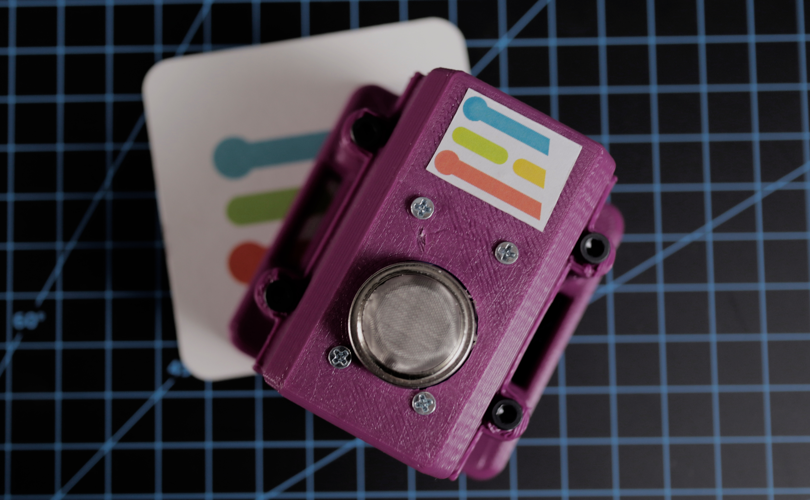


### Hardware Requirements

- [Silicon Labs EFR32xG24 Dev Kit](https://www.silabs.com/development-tools/wireless/efr32xg24-dev-kit?tab=overview)
- [MQ-4 gas sensor](https://www.optimusdigital.ro/en/gas-sensors/1130-modul-senzor-de-gaz-mq-4.html)
- Micro USB cable
- 3D printed enclosure
- Prototyping wires

### Software requirements

- Edge Impulse account
- Edge Impulse CLI
- [Simplicity Studio IDE](https://www.silabs.com/developers/simplicity-studio)
- [J-Link Software](https://www.segger.com/downloads/jlink/)

## Hardware Setup

To use the MQ-4 sensor with the Silabs EFR32xG24 Dev Kit, you will need to connect the sensor to the board as follows:

- Connect the VCC pin on the sensor to the 3.3V pin on the board.
- Connect the GND pin on the sensor to the GND pin on the board.
- Connect the A0 pin on the sensor to the A0 pin on the board.

With the hardware set up, you are ready to begin developing your methane monitoring system.


## Software Setup

### Creating the Build Environment

The EFR32xG24 Dev Kit has an on-board USB J-Link Debugger so you’ll need to install the [J-Link Software and Documentation pack](https://www.segger.com/downloads/jlink/) as well as the [Simplicity Studio IDE](https://www.silabs.com/developers/simplicity-studio) to be able to program it. Connect the board to your computer using the micro-USB cable and run the Simplicity Studio installer. In the Installation Manager, choose **Install by connecting device(s)**.

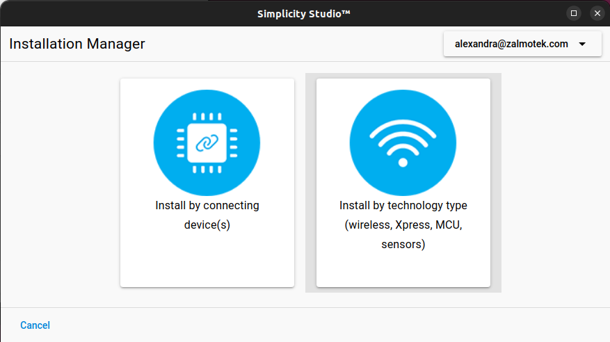

In the next screen, you should see your device name:

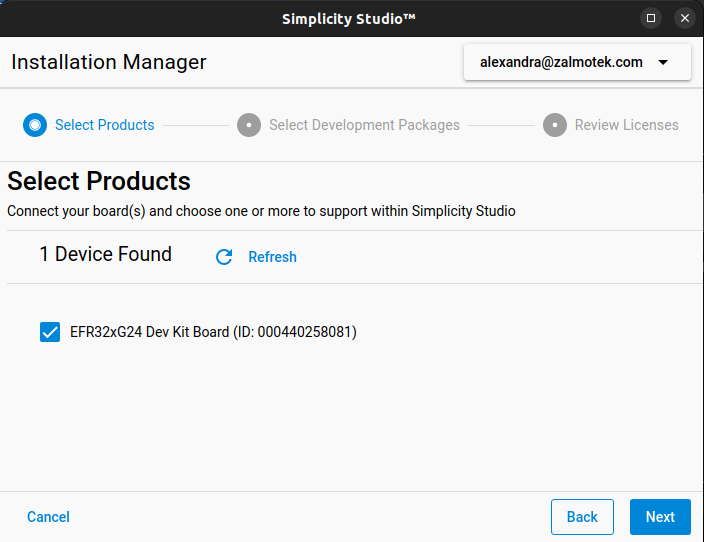

Afterwards, select **Auto** in the Package Installation Options menu and click **Next**.


Now that you have the setup for the build environment, download the data collection project [from here](https://github.com/Zalmotek/edge-impulse-methane-monitoring-with-silabsxg24) and open it with Simplicity Studio from File -> Import project.

This code sample reads analog values from the Methane sensor connected to Pin 16 of the dev board, which corresponds to PC05 (Pin 5, Port C). If you want to change the pin, you’ll have to update the following lines of code:

```
#define IADC_INPUT_0_PORT_PIN     iadcPosInputPortCPin5;

#define IADC_INPUT_0_BUS          CDBUSALLOC // ABUSALLOC
#define IADC_INPUT_0_BUSALLOC     GPIO_CDBUSALLOC_CDODD0_ADC0 // GPIO_ABUSALLOC_AODD0_ADC0
```

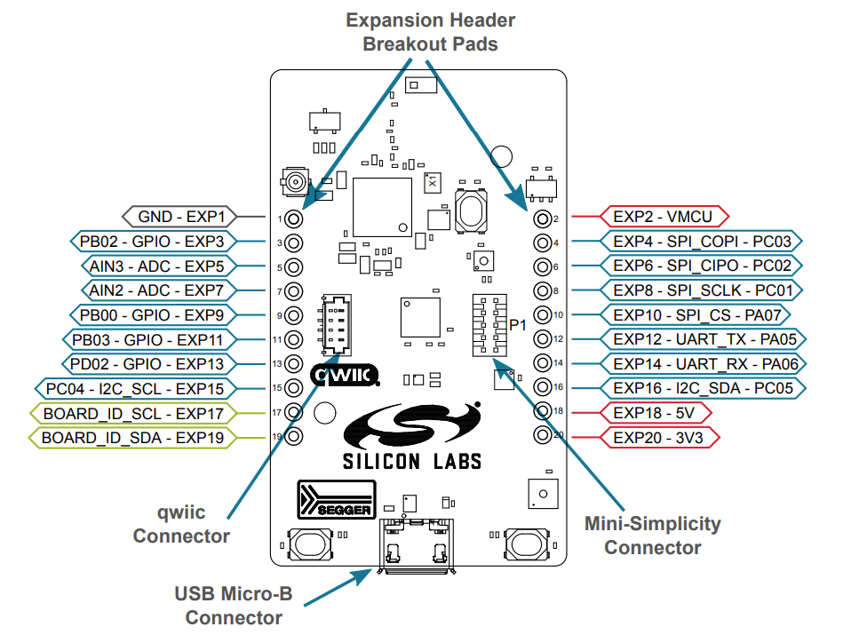

Next up, right click on the project name in the **Project Explorer** menu, click on **Run as** and select **Silicon Labs ARM program**. The **Device Selection** menu will pop up and you’ll have to select your board.


In case this warning pops up click Yes:


To check out the values printed by the dev board, you can use the Arduino IDE serial monitor or Picocom.

### Creating an Edge Impulse Project

To get started, you will need to create an Edge Impulse project. Edge Impulse is a Machine Learning platform that makes it easy to develop custom algorithms for a variety of applications, including methane monitoring.

To create an Edge Impulse project, simply log in or sign up for an account at https://www.edgeimpulse.com/. Once you have an account, click the "Create new project" button on the dashboard.

You will be asked to give your project a name and select a category. For this project, we will be using the "Custom classification" template. Give your project a name and description, then click the "Create project" button.

With your Edge Impulse project created, you are ready to begin developing your methane detection algorithm.

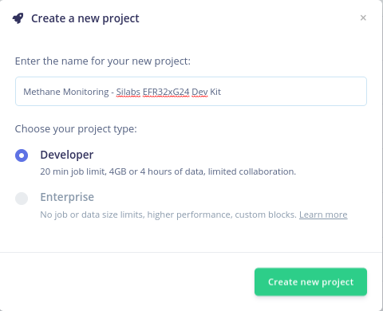

### Connecting the Device

To populate the data pool, connect the board to the computer using a micro-USB cable, launch a terminal and run:

```
edge-impulse-data-forwarder
```

After entering your account information (username and password), you must first choose a project for the device to be assigned to.

```
Edge Impulse data forwarder v1.15.1
? What is your user name or e-mail address (edgeimpulse.com)? zalmotek
? What is your password? [hidden]
Endpoints:
    Websocket: wss://remote-mgmt.edgeimpulse.com
    API:       https://studio.edgeimpulse.com/v1
    Ingestion: https://ingestion.edgeimpulse.com

[SER] Connecting to /dev/ttyACM0
[SER] Serial is connected (00:04:40:25:80:81)
[WS ] Connecting to wss://remote-mgmt.edgeimpulse.com
[WS ] Connected to wss://remote-mgmt.edgeimpulse.com

? To which project do you want to connect this device? (Use arrow keys)
```

You will then be prompted to name the sensor axis that the `edge-impulse-data-forwarder` picked up.

```
? To which project do you want to connect this device? Zalmotek / Methane Monito
ring - Silabs EFR32xG24 Dev Kit
[SER] Detecting data frequency...
[SER] Detected data frequency: 1925Hz
? 1 sensor axes detected (example values: [17]). What do you want to call them? 
Separate the names with ',': Methane
```

If everything went well, the development board will appear on your project's Devices tab with a green dot next to it, signifying that it is online and prepared for data collection.


### Collecting Training Data

The first step in developing a Machine Learning algorithm is to collect training data. This data will be used to train the algorithm so that it can learn to recognize the patterns that indicate the presence of methane gas.

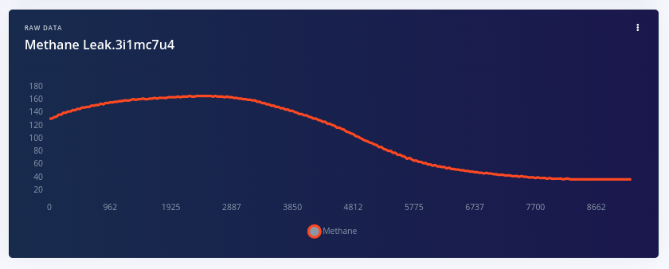

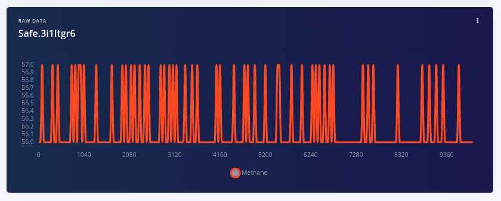

To collect training data, you will need to use the methane sensor to take readings in a variety of conditions, both with and without methane gas present. For each reading, you will need to take note of the concentration of methane present, as well as the ambient temperature and humidity.

It is important to collect a variety of data points, as this will give the algorithm a better chance of learning to recognize the patterns that indicate the presence of methane gas. Try to take readings in different places, at different times of day, and in different weather conditions. If possible, it is also helpful to take readings with different people so that the algorithm can learn to recognize the patterns that are specific to each situation.

Now, you will need to configure the sensor settings. For this project, we will be using the following settings:

- Sensor: MQ-4
- Board sampling rate: 1924 Hz
- Data recording length: 10 seconds

With these settings configured, click the "Start sampling" button to begin collecting data. The data will be automatically stored in the Edge Impulse cloud and can be used to train your Machine Learning algorithm.

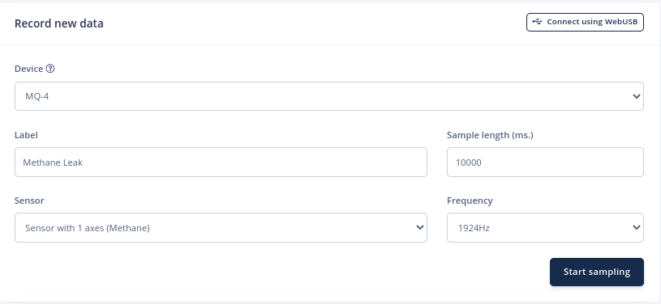

Machine learning algorithms need to be trained on data that is representative of real-world data that they will encounter when deployed on the edge. For this reason, it is important to split the data into training and testing sets, the first of them being used during the training process of the neural network and the other one will be used to evaluate the performance of said NN.

### Designing the Impulse

With the training data collected, you are ready to begin designating your methane detection algorithm. In Edge Impulse, algorithms are designed using a drag-and-drop interface called the "Impulse designer".


To access the impulse designer, click the "Design impulse" button on your project's dashboard. You will be presented with a list of available blocks that can be used to build your algorithm. For this project, we will be using the following blocks:

### Configuring the Spectral Analysis Block

After you click “Save impulse,” you will notice that each block may be configured by clicking on its name under the “Impulse Design” submenu. The Spectral Analysis block is one of the simplest processing blocks since it only has a few adjustable parameters. On the upper part of the screen, you can see a time-domain representation of the sample that was selected.

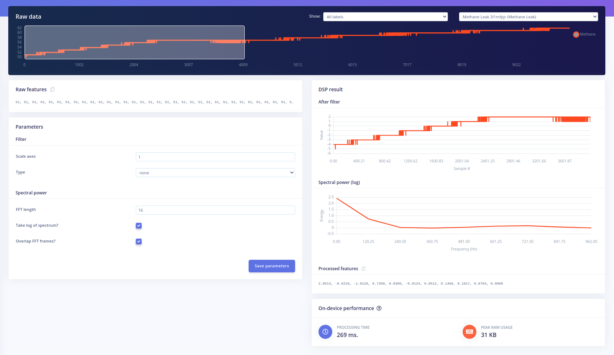

### Configure the Classification (Keras) Block

So, how does a neural network know what predictions to make? The answer lies in its many layers, where each layer is connected to another through neurons. At the beginning of the training process, connection weights between neurons are randomly determined.

A neural network is designed to predict a set of results from a given set of data, which we call training data. This works by first presenting the network with the training data, and then checking its output against the correct answer. Based on how accurate the prediction was, the connection weights between neurons are adjusted. We repeat this process multiple times until predictions for new inputs become more and more accurate.

When configuring this block, there are multiple parameters that can be modified:

The **number of training cycles** is defined as the total number of epochs completed in a certain amount of time. Each time the training algorithm makes one complete pass through all of the learning data with back-propagation and modifies the model's parameters as it goes, it is known as an epoch or training cycle (Figure 1).

The **learning rate** controls how much the model's internal parameters are updated during each step of the training process, or in other words, how quickly the neural network will learn. If the network overfits too rapidly, you can lower the learning rate.

**Auto-balance dataset** mixes in more copies of data from classes that are uncommon. This function might help make the model more robust against overfitting if you have little data for some classes.

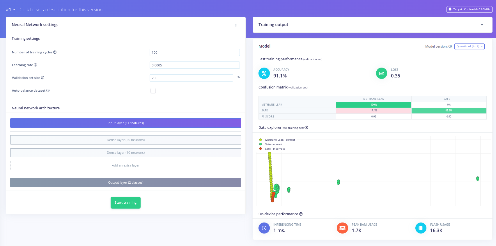

## Conclusion

Even though methane leaks in mining operations are a well-known problem with a variety of market-available solutions, conventional threshold-based detection systems have some drawbacks, including the need for remote data processing and the challenges of ensuring connectivity in mining-specific environments.

Edge AI technologies allow users to circumvent those weak points by embedding the whole signal acquisition, data processing and decision making on a single board that can run independently from any wireless network and which can raise an alarm if dangerous trends in the methane levels in the facility are detected.

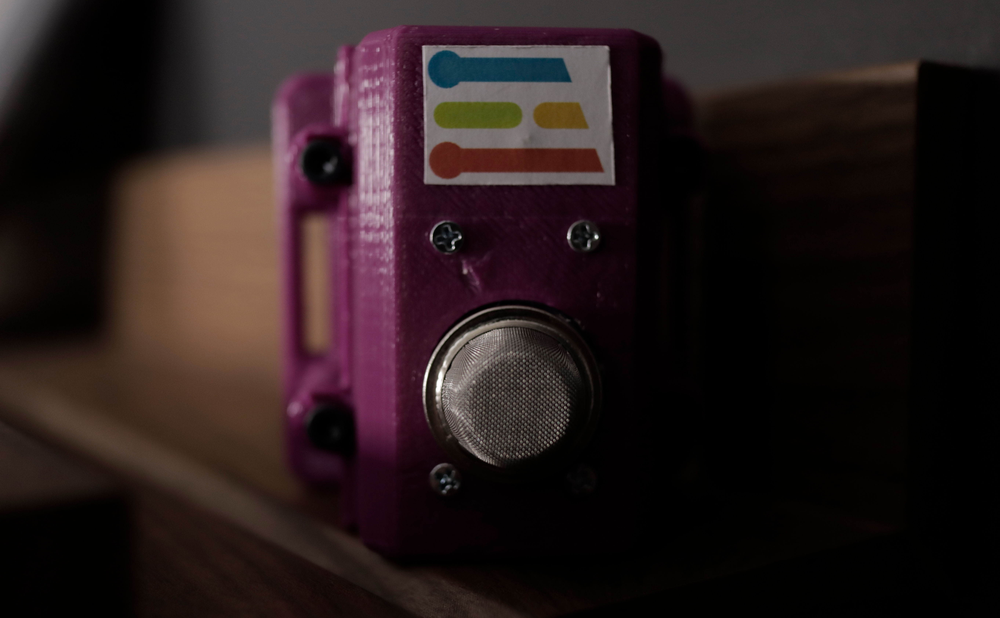


