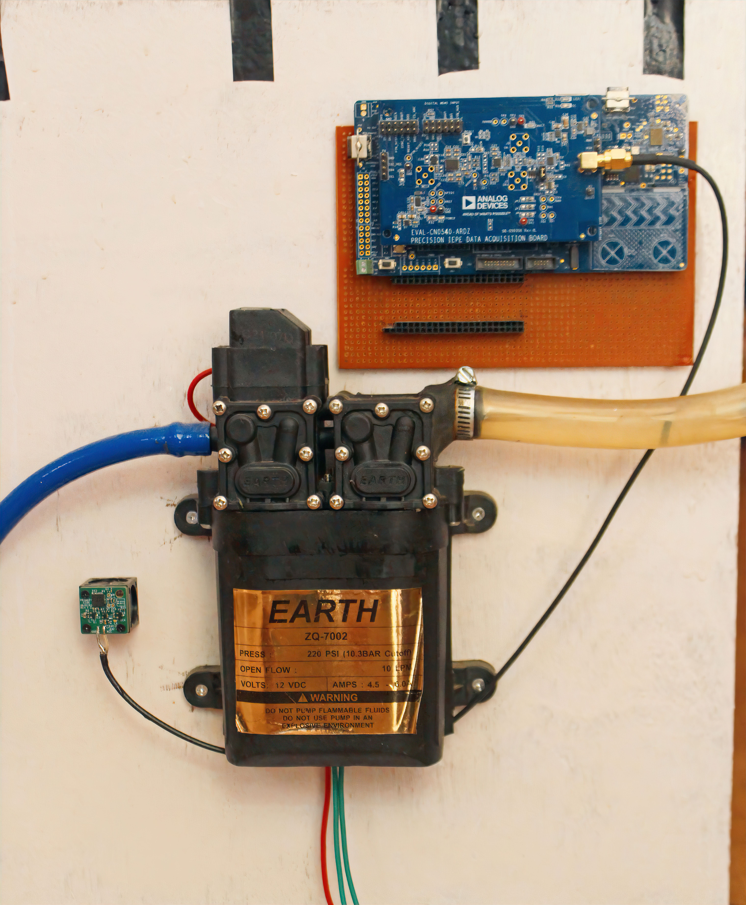
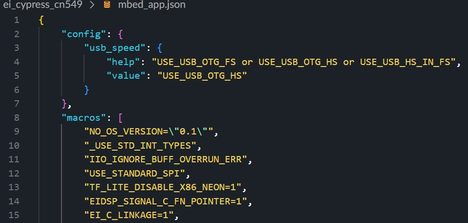
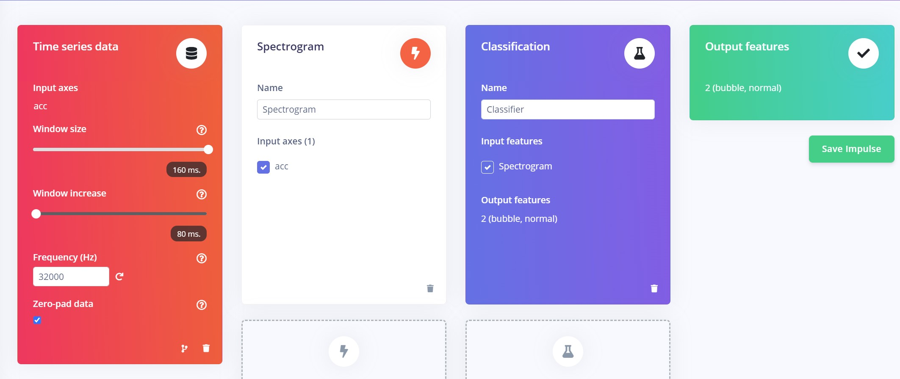
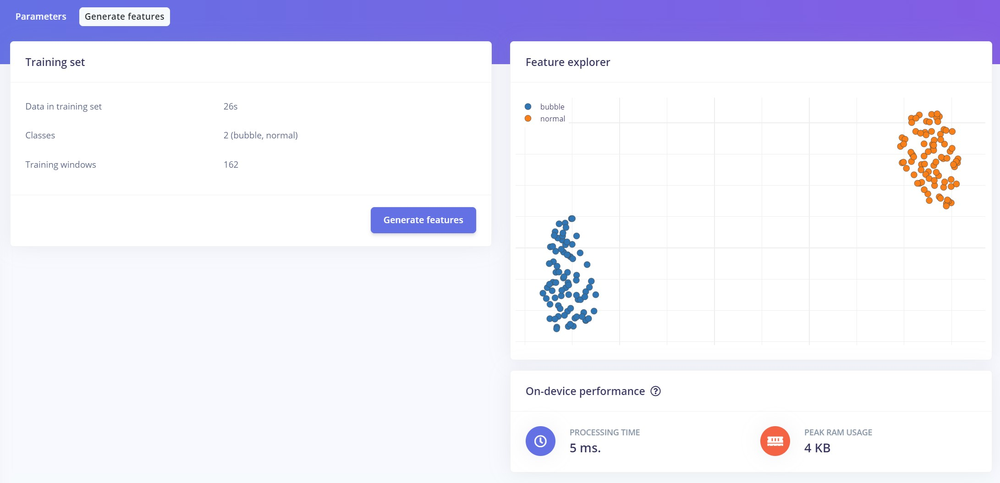
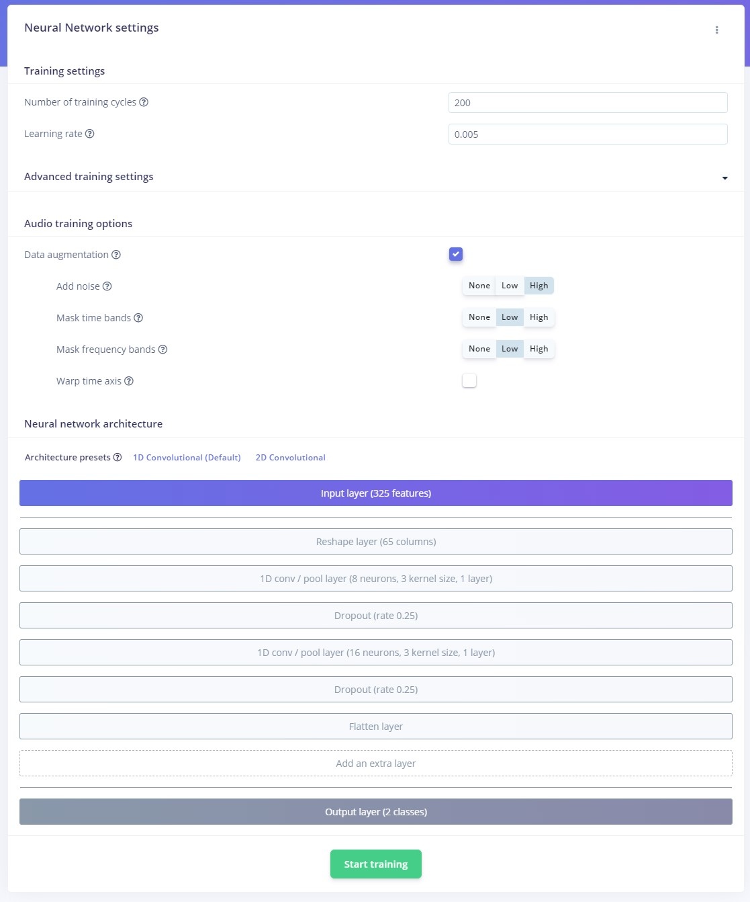
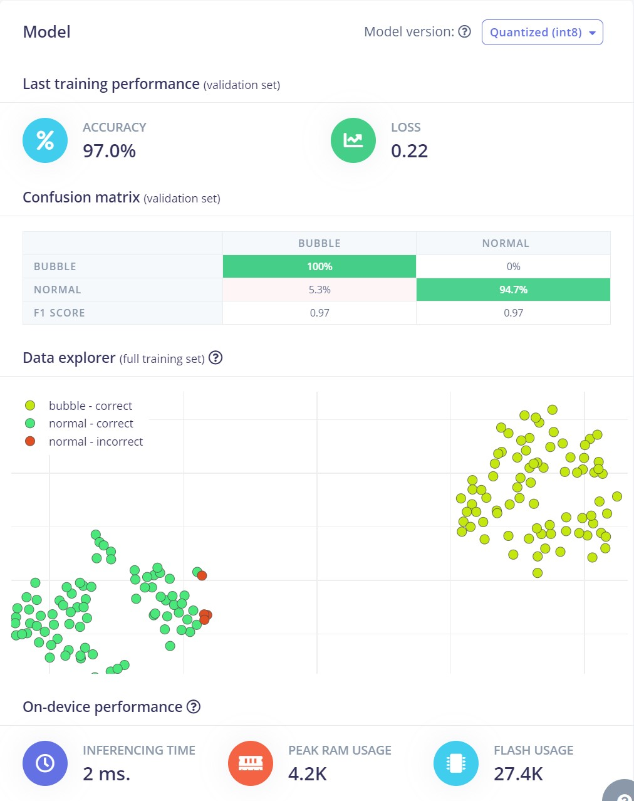
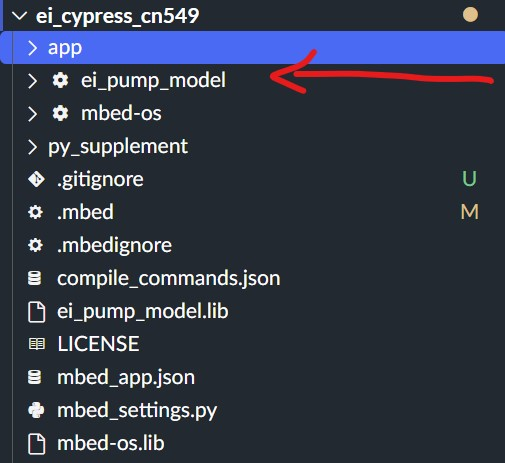

# Motor Pump Predictive Maintenance - CY8CKIT-062-WIFI-BI pioneer kit - CN0549 Monitoring Platform

Created By: Pratyush Mallick

Public Project Link:

[https://studio.edgeimpulse.com/public/189940/latest](https://studio.edgeimpulse.com/public/189940/latest)

GitHub Repository:

[https://github.com/Pratyush-Mallick/ei_cypress_cn549](https://github.com/Pratyush-Mallick/ei_cypress_cn549/)

## Introduction
Pumps are critical equipment in every industrial operation. Pumps move liquids like beverages, dyes, and chemicals around production lines. They're also part of ancillary systems like hydraulics, lubrication, machine cooling, HVAC, and wastewater—all necessary to keep machines working, plant environments safe, and temperatures steady. Whatever pumps are doing, we want to keep them healthy! 
For years, manufacturers have been practicing a preventive maintenance approach for industrial Pumps. However, this method of monitoring pump health has previously been a potentially time-intensive and costly task due to manual inspections of each equipment. When equipment is large in number and placed in accessible areas, the probability of failed equipment going unnoticed for an extended period is relatively high. 

### The Challenge

In industrial settings, pumps provide air to power tools, transfer steam for aluminum, paint sprayers, abrasive blast equipment, phase shift refrigerants for air conditioning and refrigeration, and propel gas through pipelines.
For some applications like steam making, the industrial pump must provide an optimal laminar liquid flow through the pipelines. Despite their harmless appearance, the bubbles in pumping systems are fundamentally distinct from those children typically blow with a wand. When pressure fluctuations inside the pumps give rise to minuscule bubbles, the ensuing collapse of these bubbles generates shock waves that are both powerful and constant. Over time, these recurring shocks wear down the components of the system through erosion or even may lead to ruining the production output. Regarding processing systems, bubbling or bubble cavitation should be avoided at all costs. 

### Our Solution

To address this, we will develop a predictive maintenance solution that gathers vibration data from a motor pump and uses machine learning algorithms to detect any bubble cavitation being formed in the pumping systems, which is considered abnormal behavior. 
The whole principle of operation of a motor pump is based on moving parts. The process of formation and collapse in cavitation is characterized by its rapid and violent nature, which results in a different vibration signal than a normally operating pump. When such machinery manifests anomalous vibration patterns, a possible malfunction may occur, and critical equipment failure may be inbound. Such modifications may occur for hours or days, and human operators seldom pick them up. Such phenomena can be detected by harnessing IoT devices and machine learning algorithms, and maintenance teams may be alerted before machinery failure occurs.

### Hardware Requirements

* [Infineon PSoC™ 6 WiFi-BT Pioneer Kit](https://www.infineon.com/cms/en/product/evaluation-boards/cy8ckit-062-wifi-bt/)
* [CN0549 Condition monitoring Platform](https://www.analog.com/en/design-center/reference-designs/circuits-from-the-lab/cn0549.html)
* Industrial Motor Pump
* 2 * USB-C cable

### Software requirements

* [Edge Impulse account](https://edgeimpulse.com/)
* [Edge Impulse CLI](https://docs.edgeimpulse.com/docs/edge-impulse-cli/cli-installation)
* [Keil Studio Cloud](https://studio.keil.arm.com/auth/login/)
* [Mbed-OS](https://github.com/ARMmbed/mbed-os)
* [Precision Converters Firmware for CN0549](https://github.com/analogdevicesinc/precision-converters-firmware/tree/main/projects/ad77681_iio)
* [pyadi-iio 0.14](https://pypi.org/project/pyadi-iio/0.0.14/)
* [libiio 0.24](https://github.com/analogdevicesinc/libiio/releases/tag/v0.24)
* python 3.10

## Hardware Setup

For this application, we would use a condition-based prototyping platform developed by Analog Devices CN0549 and PSOC 6 Wifi-BT pioneer kit by Infineon.

The CN0549 is a condition-based monitoring platform based around the integrated electronic piezoelectric (IEPE) standard, a popular signaling interface standard for high-end microelectronic mechanical systems (MEMS) and piezo sensors that are prevalent in the industry today. The kit comes with a mechanical mount optmized for vibration fidelity. For setting up the board with the sensor and learn more about the hardware, please refer to the links below:
* [Putting together CN0549](https://wiki.analog.com/resources/eval/user-guides/circuits-from-the-lab/cn0549#:~:text=Card%20using%20Linux-,Putting%20together%20the%20CN0549,-Take%20out%20the)
* [Understanding the circuit](https://www.analog.com/en/design-center/reference-designs/circuits-from-the-lab/cn0549.html#rd-functionbenefits)

The anchor of this solution is Infineon's PSOC 6 Wifi-BT pioneer kit. The application processor is performance-optimized and runs at  150 MHz, and the co-processor is M0, which can run at 100 MHz. Both cores are power-efficient. It has a floating-point unit (FPU), an 8 KB 2-way associative cache, 1 MB Flash, and 288 KB RAM. The board also has a capacitive sensing block and the capability of programable digital and analog blocks known as PSOC. It is an excellent pick for developing edge ML applications requiring a direct sensor interface. Moreover, board Wi-Fi support and a USB host device would be helpful for high-speed data logging. 

Here are some pictures of the hardware before and after the assembly. Refer to the CN0549 reference guide for sensor-specific modifications, such as selecting coaxial wire and jumper settings. Switch the SW7 to position one on the MCU board side, ensuring that the sensor board is powered from kitprog2 stable VDD supply. Also, ensure the board is in daplink mode for easy debugging in the software section. 

## Software Setup

### Creating an Edge Impulse Project

Let's start by developing an Edge Impulse project.

Log into your Edge Impulse account, pick **Create new project** from the menu, give it a recognizable name, choose **Developer** as the project type, and then click **Create new project**.

Afterward, select **Accelerometer** data as the type of data you will be dealing with.

### IIO Background 
The Industrial I/O subsystem is intended to support devices analog to digital or digital to analog converters (ADCs, DACs) or even beyond. It provides a standard interface to talk to converters across different hardware and software platforms. Using libiio and other application-specific wrapper libraries, the hardware can talk to any client-side number-crunching applications such as Python or Matlab. Since the firmware for CN0549 is based on the iio stack, we would use the pyadi-iio package to collect data in Python from the firmware. 

Before starting to build the dataset, you should install these first, or else the Python code might fail to run:
* [pyadi-iio 0.14](https://pypi.org/project/pyadi-iio/0.0.14/)
* [libiio 0.24](https://github.com/analogdevicesinc/libiio/releases/tag/v0.24)
* python 3.10

### Building the firmware: 
The default firmware available for CN0549 is based on mbed-OS and iiod stack. Since our cy8ckit-062-wifi-bt is also mbed-enabled, we can port the existing code to our board with little modifications. I have already done that for you; you can directly import the firmware into the Keil studio cloud from the link below, which lets you build and debug the firmware inside the browser. 
* [EI_Cypress_CN0549](https://github.com/Pratyush-Mallick/ei_cypress_cn549)
* [Guide for clone Github project into Keil Studio Cloud](https://developer.arm.com/documentation/102497/1-7/Work-with-Mbed-projects/Create--import-or-clone-an-Mbed-project-or-a-standalone-library/Clone-an-Mbed-project-or-a-standalone-library)

Some of the modifications done so far to make this compatible are listed below:
* Changed the SPI mode in the user_config.c and pin mappings in app_config_mbeb.c/.h files. You can want to use different pins or configurations; you can change them in these files.
* Disabled some of the wireless stacks on the mbed-OS to avoid conflicts. There can be found .mbedignore file in the root of the directory.
* Changed pin name in mbed-OS to avoid conflict with edge impulse library. This happens explicitly when using the ARM compiler. With GCC, it builds fine. The modified mbed-OS can be found [here](https://github.com/Pratyush-Mallick/mbed-os). The mbed-OS for our firmware would be cloned from this repository when we import the code into Keil studio.

* We're using the board as a USB host; you might need to connect another cable to another port.

* Change the DAC code in the firmware to remove any DC bias. IEPE accelerometer has a specific DC bias voltage that must be removed because this voltage does not carry any useful information. This is a crucial step to ensure that you're receiving reliable data. Even changing the length of the cable connected to the sensor can also affect the DC bias. You can use the code and select option - 21 (Compensate Piezo sensor offset), which Automatically compensates for voltage offsets in the sensor, giving more accurate data. The user should run this after connecting a new sensor.
	* [Offset Compensation Code](https://wiki.analog.com/resources/eval/user-guides/circuits-from-the-lab/cn0540/sdp-k1#:~:text=Compensate%20Piezo%20sensor,a%20new%20sensor.)
	* [Learn more about CN0549 board circuit](https://www.analog.com/en/design-center/reference-designs/circuits-from-the-lab/cn0540.html#rd-description)
	

* Since most of the drivers and firmware for the CN0549 are C code and edge impulse is on C++, we need to use EI_C_LINKAGE=1 flags to build the code properly. Some other flags and configurations can be found in the mbed_app.json file.

Once the code has been imported into the Keil studio, connect the board through the kitprog2 USB port, and the studio should automatically detect the device, or else you can manually select the board and build the code.
Ensure that all libraries have been appropriately cloned. All the modified mbed-OS and edge impulse model libraries are linked through .lib files with specific commit ids. Click the exclamation mark in the picture below, and that should check out the libraries properly.

Please change the macro in the app_config.h file depending upon the intended use. You can either use it for data logging or inferencing. In inference mode, the firmware returns the client two extra bytes of classification results and the accelerometer data.

Once all the modifications are done, build and load the code onto the hardware directly from the Keil Studio using the run button or download the hex file and drag-n-drop into the daplink drive.

If everything loads up correctly, you can connect the cable to the USB device port on board, which should be detected.

### Building the Dataset

To build the data set, we would collect the data from the device using pyadi-iio drivers into Python and then push it to edge impulse using its ingestion APIs. You can find the Python drivers in the py_supplement folder of the firmware repository or visit the following [link](https://github.com/Pratyush-Mallick/ei_cypress_cn549/blob/main/py_supplement/pcg_cn549_python.ipynb).
This jupyter notebook has all the initialization and data logging code. Run all the cells in the notebook one by one except the last two cells. One is used for inference, and the other is for pushing data into the edge impulse. 
Here is the snapshot of the code. Add your HMAC and API_KEY into the code, and you can also set the sampling frequency (which needs to be in sync with the sampling frequency specified in the firmware) and then run the code.
Changing the block_size will determine the sample lengthsample length, which also depends on the sampling frequency. Here is a snapshot:

Your device will show up in the device section. Also, before running the code, set the label in the script, and data would arranged accordingly in the edge impulse studio. You should be able to see your incoming data in the data acquisition tab.

We have built a motor pump system with an inlet and outlet container to demonstrate the solution. For this application, the accelerometer is directly mounted on the wooden sheet near the motor pump unit for demonstration purposes in the hardware setup. The mounting block has a cross-section for inserting a screw into any hardware. You can also mount the accelerometer and mounting block directly on the pump. Once mounted, we record data for "Normal" and "Bubbling." For bubbling, we deliberately half-fill the container so air bubbles can form at the motor inlet.
Ensure to take data on various motor power to avoid overfitting the model. Here are some snaps:

During regular operation, the motor pump manifests a vibration with a low amplitude, with rhythmic increases in amplitude once every cycle. However, when bubbling, there are multiple rhythmic spikes appearing in the signal.

Here are videos demonstrating the data collection process:
 



### Designing the Impulse

After building the data set, it's time to create the Impulse. An Impulse is a symbolic pipeline of gathering data, passing it through a preprocessor, feeding it into a neural network, and outputting it, each step of the process being customizable.

For this application, we will be using an input block with a 160ms window size, with a window increase of 80ms at an acquisition frequency of 32000Hz, a **Spectrogram** block is used as our processing block, and a combination of learning blocks, a **Classification** which good for audio and vibrational data.
Suppose you need help determining which blocks to select. In that case, you can always try out [Edge Impulse EON tuner](https://docs.edgeimpulse.com/docs/edge-impulse-studio/eon-tuner), which can validate different impulse architectures and give insights on the suitable ones for your specific application.

For the sake of simplicity, there are only two conditions to detect; however, you can collect data for as many classes as you want and infer them.

### Configure the Spectrogram Block

The Spectrogram processing block extracts time and frequency features from a signal. It performs well on audio data for non-voice recognition use cases or any sensor data with continuous frequencies. Low-pass and high-pass filters can be used in this block to eliminate undesirable frequencies. As with our use case, this block typically performs well when decoding recurrent patterns in a signal, such as those caused by the vibrations or motions picked up by an accelerometer unit.
Under the parameters tab, you can configure your spectrogram features or let the edge edge do it by clicking on the "Autotune Parameters" button.

After being redirected to the feature generation tab, check "Calculate feature importance" and press **Generate features**. Calculating the importance of each signal feature is a great asset of the Edge Impulse platform, as it allows the block to prioritize those values as they are the most meaningful for the observed phenomenon.
The **Feature Explorer** allows you to quickly check if the data separates nicely, as it visually represents all the data from the Training dataset. Any point in the feature explorer can be hovered over to reveal the source for that point. If you work with time series data, clicking on a data item will show you the raw waveform, the utilized signal window, and a quick link to the signal processing page. This makes identifying the outlier data points in your dataset very simple.

### Configure the NN Classifier

The NN Classifier block's configuration is the next phase in developing the machine learning algorithm. The number of training cycles, learning rate, size of the validation set, and whether or not the Auto-balance dataset function is enabled are just a few of the factors that can be modified. 
They provide users control over the number of epochs the NN is trained on, how quickly the weight of the links between neurons is modified each epoch, and the proportion of samples from the training dataset that are used for validation. The architecture of the NN is detailed underneath.

Edge impulse also provides options to augment the preprocessed data, which can help avoid overfitting the model, making it robust against a wide range of input data.

Leave everything on default settings for the time being and click **Start training**.

After the training has been assigned to a cluster, the training performance tab will be displayed. Here, you can view in tabulated form the correct and incorrect predictions made by the model after being presented with the Validation data set. When training a neural network, we aim for a high **Accuracy** (the percentage of predictions where the expected value matches the actual value of the data input) and a low **Loss** (the total sum of errors produced for all the samples in the validation data set).

Underneath those performance indices, you can visually explore the data to find the outliers and the mislabeled data. You can see that on the right side of the graphic, there is a small cluster of "Normal" data points that were mislabeled, represented with red dots.
You can also explore different data type options for the model and their impact on model output parameters, such as RAM usage and accuracy.

### Model Testing

The **Model Testing** tab allows users to quickly evaluate how the machine learning model fares when presented with new data. The platform uses the data available in the Test data pool, defined during the data acquisition phase, and evaluates the performance of the model.
Since we're using our custom firmware, live testing is not supported directly. However, if you want to use the live testing option in the Edge Impulse studio, you can go through the following link:
[Live Testing](https://docs.edgeimpulse.com/docs/edge-impulse-studio/live-classification)

## Deploying the Model on the Edge

Edge impulse allows users to export the machine learning model they have just created as a pre-compiled binary for the supported platforms without going through the effort of building custom firmware. 
However, since our platform uses different sensors supported by the original board, we must download the model as a C++ library and then integrate the SDK into our firmware.

You can build the firmware with the SDK offline using the GCC compiler or Keil Studio Cloud online, as I did. You can drag and drop the edge impulse C++ library into the folder structure or create a git repository and import it into Keil studio as we did initially. 

To view the inference results, you must rebuild the code with the inference macro enabled in app_config.h file. This shall build the code to transport inference results as part of the data stream on the host; on the client side, it should be able to separate it.

Run the jupyter notebook with all instructions as we did during data logging, except just one step: running the last cell, modified explicitly for data inferencing. 
If everything goes well, Hurray!, you should see the streaming data along with classification in your jupyter notebook. 

## Conclusion

Employing machine learning-based models for predictive Maintenance can help us efficiently operate the equipment, plan the downtimes, and increase longevity. 
Baking intelligence into the edge and moving computing closer to where data is a paradigm shift from traditional computing, and edge impulse is at the forefront. 
Imparting intelligence is just one aspect, and selecting a proper data collection platform is equally important as it can make or break a system. Platforms like CN0549, with their software and hardware scalability, provide the least past of resistance for such data acquisition heavy tinyML models. 
