# Renesas CK-RA6M5 Cloud Kit - Getting Started with Machine Learning 

Created By:
Swapnil Verma 

Public Project Link:
[https://studio.edgeimpulse.com/public/233106/latest](https://studio.edgeimpulse.com/public/233106/latest)

## Introduction

The [Renesas CK-RA6M5 Cloud Kit](https://www.renesas.com/us/en/products/microcontrollers-microprocessors/ra-cortex-m-mcus/ck-ra6m5-cloud-kit-based-ra6m5-mcu-group) enables users to securely connect to the cloud and explore the features of the Cortex M33-based Renesas RA6M5 group of MCUs and cloud services. This development board can run machine-learning models and is [officially supported by Edge Impulse](https://docs.edgeimpulse.com/docs/development-platforms/officially-supported-mcu-targets).

This is a Getting Started Guide for the Renesas CK-RA6M5 board with Edge Impulse. Here we will connect the board to the Edge Impulse Studio, collect sensor data directly from the board, prepare a machine learning model using the collected data, deploy the model back to the board, and perform inferencing locally on the board. Let's get started!

## Unboxing

The Cloud Kit comes with the following items in the box:

- The CK-RA6M5 development board
- RYZ014A PMOD (CAT-M1 Cellular Module)
- SIM card
- Antenna
- 2 Micro USB to A cables
- Micro USB A/B to A adapter cable
- Documentation

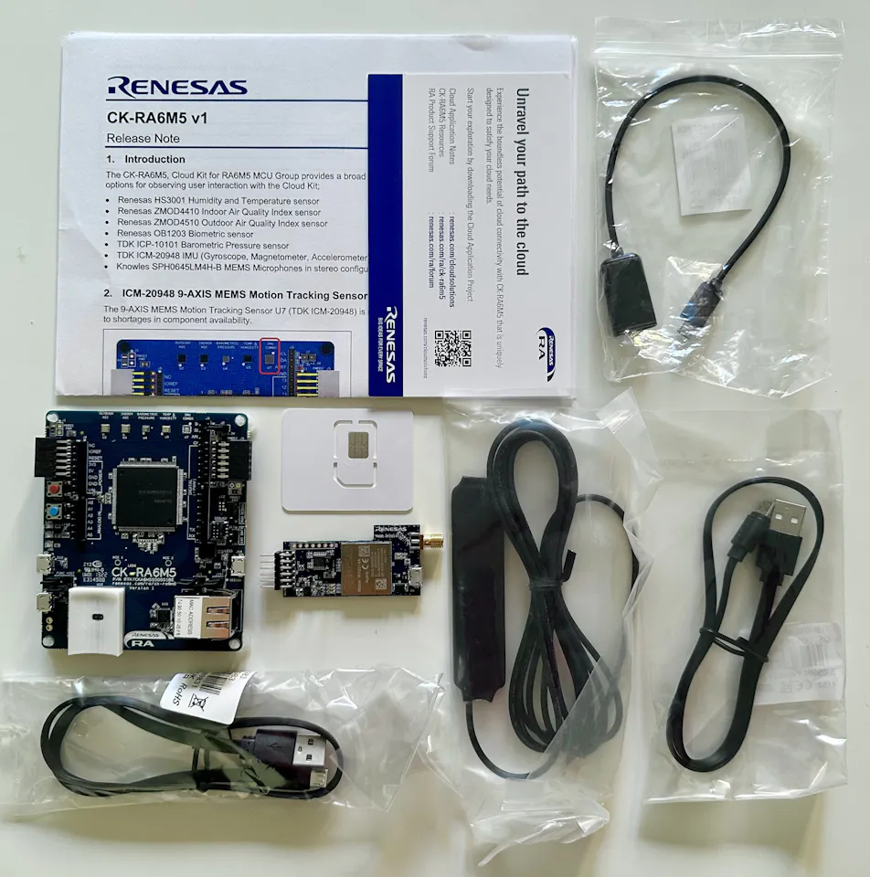

## Quick Start Project

Each CK-RA6M5 board comes preinstalled with a quick-start project. Let's run that quick-start project to verify our board is working properly.

- Make sure that (a) J22 is set to link pins 2-3 (b) J21 link is closed and (c) J16 link is open.
- Connect J14 and J20 on the CK-RA6M5 board to USB ports on the host PC using the 2 micro USB cables supplied.
- The power LED (LED6) on the CK-RA6M5 board lights up white, indicating that the CK-RA6M5 board is powered on.

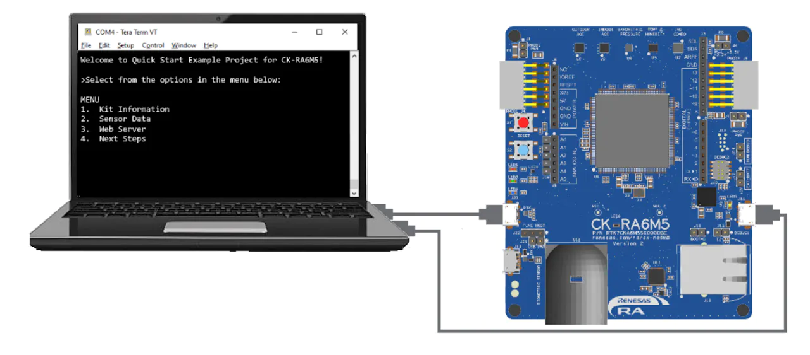

Immediately after the power on, the four user LEDs will take on the following states:

- LED1 Red – Off
- LED2 RGB – Off
- LED3 Green – Steady, full intensity
- LED4 Blue – Blinking at 1hz frequency

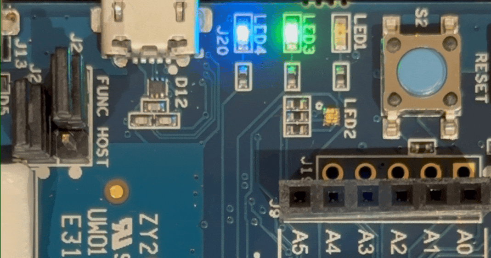

Press the user button (S2) on the board to change the blinking frequency of the user LED4 (blue). With every press of the first user button (S2), the frequency will switch from 1 Hz to 5 Hz to 10 Hz and cycle back.

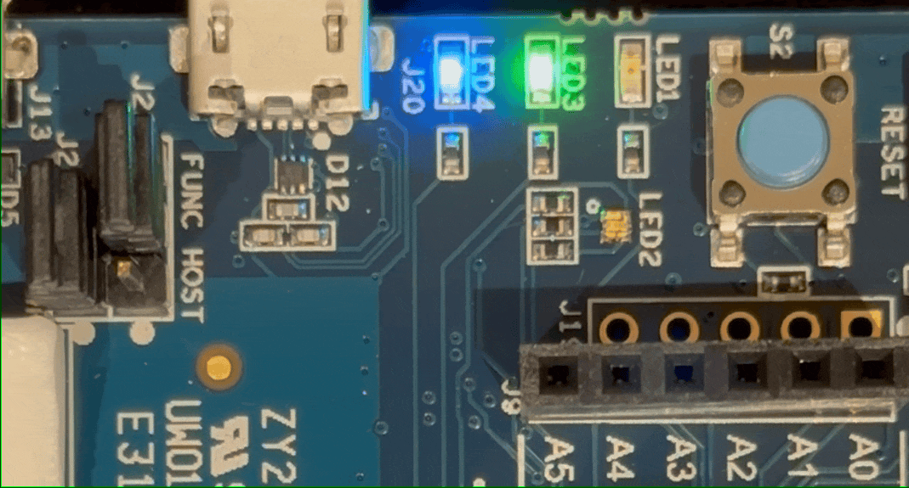

## Updating the Firmware

In order to connect the CK-RA6M5 board to the Edge Impulse Studio, we need to upgrade the board's firmware. Please follow the official Edge Impulse guide to update its firmware:

> Firmware Update Guide - [https://docs.edgeimpulse.com/docs/development-platforms/officially-supported-mcu-targets/renesas-ck-ra6m5](https://docs.edgeimpulse.com/docs/development-platforms/officially-supported-mcu-targets/renesas-ck-ra6m5)

Once the board is flashed with Edge Impulse firmware, the real magic starts.

## Edge Impulse Project

To begin, you'll need to create an Edge Impulse account and a project in the Edge Impulse Studio. Please follow the below steps to do so:

- Navigate to the [Edge Impulse Studio](https://studio.edgeimpulse.com/login) and create an account. If you already have an account then please login using your credentials.

- After login, please create a new project, give it a suitable name, and select an appropriate _Project type_.

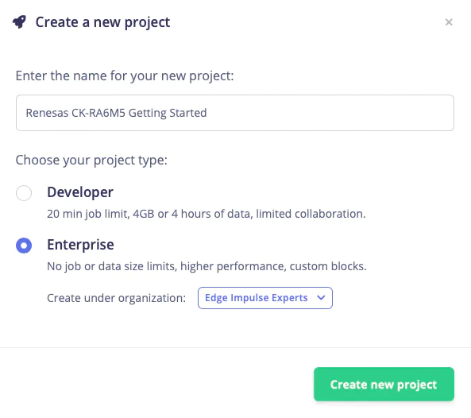

- After creating a new project, navigate to the _Devices_ Tab.

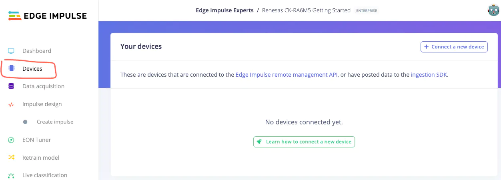

## Connecting Renesas CK-RA6M5 to Edge Impulse

The next step is connecting our Renesas CK-RA6M5 board to the Edge Impulse Studio, so we can ingest sensor data for the machine learning model. Please follow the below steps to do so:

- Connect the Renesas CK-RA6M5 board to the computer by following the steps mentioned in the _Quick Start_ section.
- Open a terminal or command prompt and type `edge-impulse-daemon`. The [Edge Impulse daemon](https://docs.edgeimpulse.com/docs/Edge Impulse-cli/cli-daemon) will start and prompt for user credentials.
- After providing user credentials, it will prompt you to select an Edge Impulse project. Please navigate and select the project created in the previous steps, using the arrow keys.

- After selecting the project, it will ask you to give the connected board a name. It is useful when you want to connect multiple boards to the same project.

- Now the board should be connected to the selected project. The `edge-impulse-daemon` will tell you which project the board is connected to. We can also verify by checking the devices tab of that project.

It will also list all the sensors available for data gathering.

## Data Gathering

Edge impulse provides multiple options for data acquisition. In this getting started guide, we will look at the direct data ingestion from the board using `edge-impulse-daemon`. Please follow the below steps for data acquisition:

- Navigate to the _Data Acquisition_ tab in the Edge Impulse Studio.

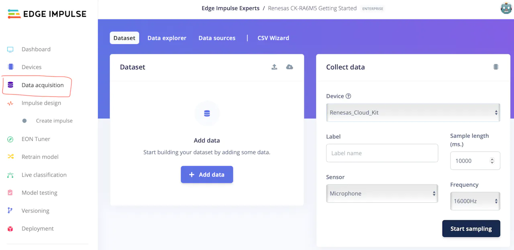

- Here you will find the _Device_ we connected in the previous step and the sensor list. Please select the suitable sensor from the drop-down menu. For this project, I have selected the _Microphone_ sensor and used default parameters.
- Add a _Label name_ for the sample you are about to collect. I am collecting clap and whistle sounds therefore I will use _clap_ and _whistle_ as labels.
- Clicking _Start Sampling_ will start the sample collection process. Once the sample is collected, it will be automatically uploaded to the Edge Impulse Studio.

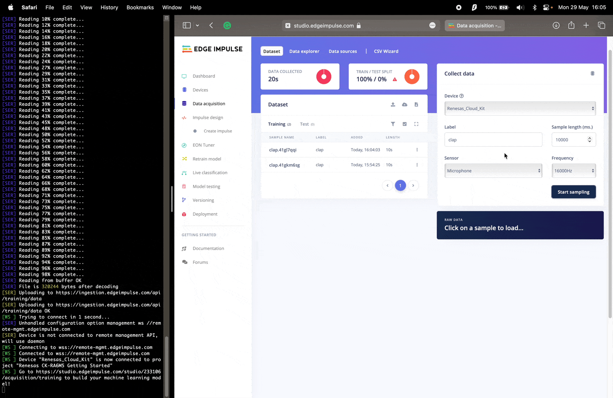

When enough samples are collected, [balance the data](https://docs.edgeimpulse.com/docs/Edge Impulse-studio/data-acquisition#dataset-train-test-split-ratio) and if required [clean the data](https://docs.edgeimpulse.com/docs/Edge Impulse-studio/data-acquisition#cropping-samples) as well.

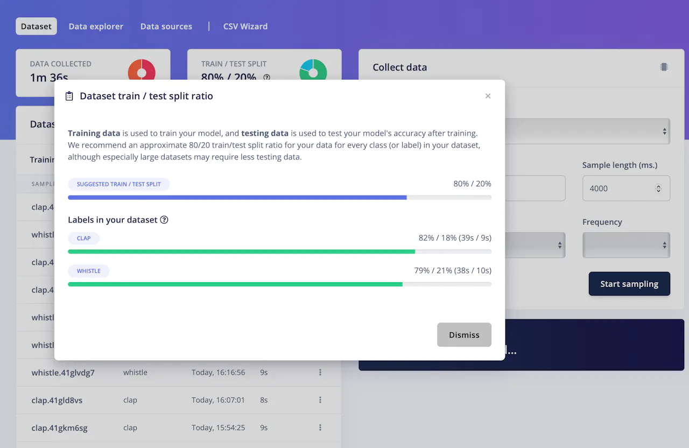

## Machine Learning Model Preparation

After data collection, the next step is machine learning model preparation. To do so, please navigate to the _Impulse design_ tab and add relevant [preprocessing](https://docs.edgeimpulse.com/docs/edge-impulse-studio/processing-blocks) and [learning blocks](https://docs.edgeimpulse.com/docs/edge-impulse-studio/learning-blocks) to the pipeline.

- Edge Impulse Studio will automatically add an [input block](https://docs.edgeimpulse.com/docs/edge-impulse-studio/impulse-design#input-block) and it will recommend a suitable preprocessing and a learning block based on the data type. I have used the recommended ones in this project with default arguments.

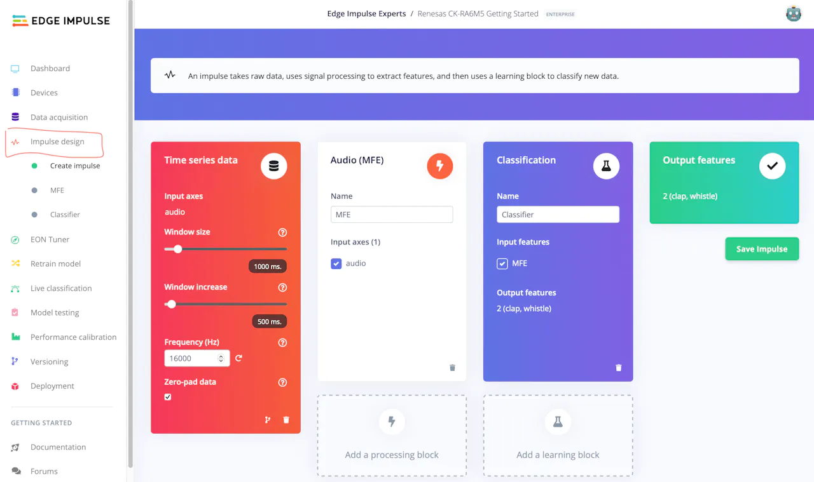

- After Impulse design is complete, save the design and navigate to the preprocessing tab (MFE in this case) for the feature generation.

Click on the _Save parameters_ button, then navigate to the _Generate features_ tab and click _Generate features_ button for data preprocessing.

- After feature generation, please navigate to the _Learning Tab_ ([Classifier](https://docs.edgeimpulse.com/docs/edge-impulse-studio/learning-blocks/classification) in this case) to design the neural network architecture. I have used the default architecture and parameters recommended by the Edge Impulse Studio. After selecting a suitable configuration, click on the _Start training_ button.

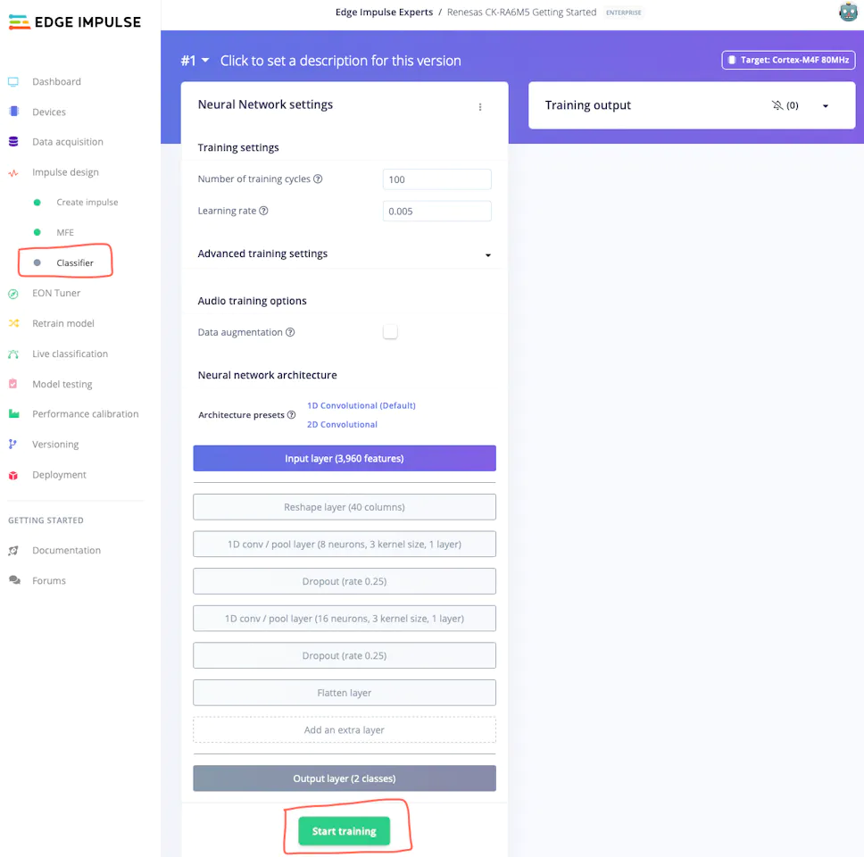

- Once the training is complete, please navigate to the [Model testing](https://docs.edgeimpulse.com/docs/Edge Impulse-studio/model-testing) tab, and click _Classify all_ button.

After testing is finished, the Edge Impulse Studio will show the model accuracy, and other parameters.

> Even though it is a simple example, the Edge Impulse Studio prepared an excellent machine learning model just by using the default recommended parameters, in just a couple of minutes.

## Deployment

In this step, we will deploy our prepared model to the Renesas CK-RA6M5 board, so we can perform the inference locally on the board.

- Please navigate to the [Deployment](https://docs.edgeimpulse.com/docs/Edge Impulse-studio/deployment) tab, select the Renesas CK-RA6M5 board using the search bar, and click on the _Build_ button.

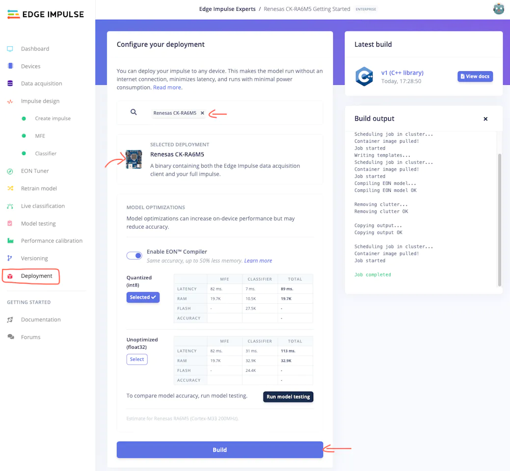

- After the _build_ is finished, the new firmware will be downloaded automatically to your computer, and the Edge Impulse Studio will provide next-step instructions.

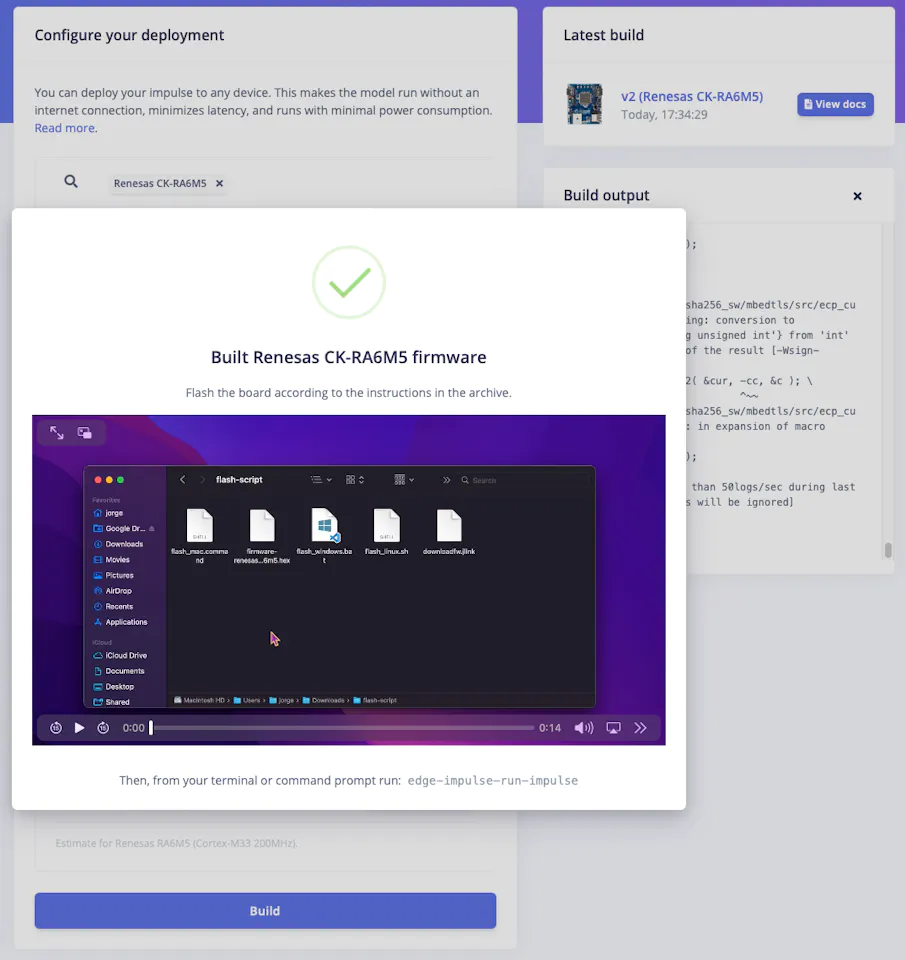

- Please extract the folder and double-click the `flash_<operating-system>` file. This will flash the newly created firmware on the CK-RA6M5 board. This firmware contains the machine learning model we prepared in the above steps.

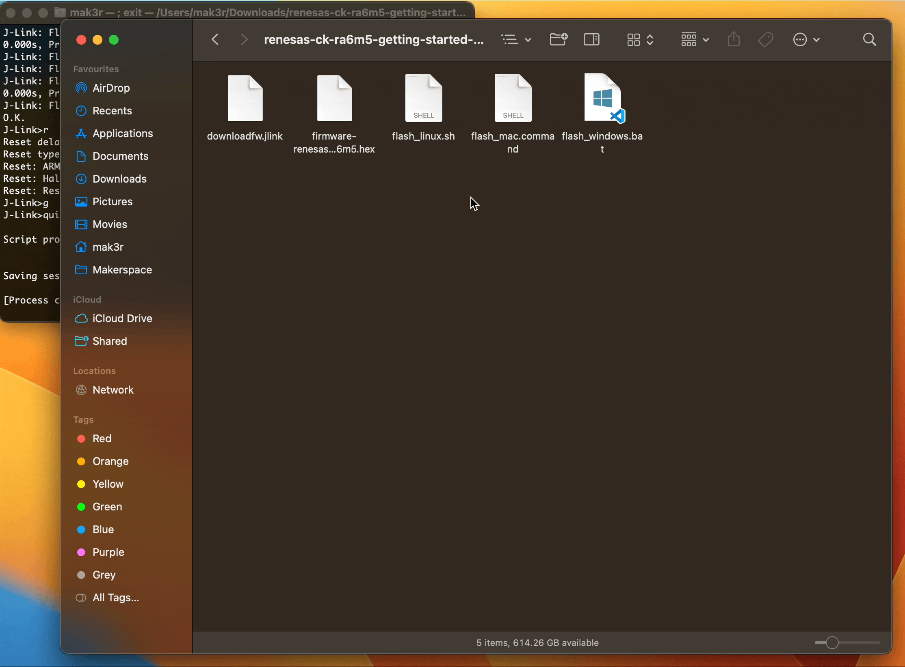

## Inferencing

The next step is testing!! Let's see how well our model performs when run locally on the Renesas CK-RA6M5 board:



And, that's it. I hope this Getting Started Guide will be useful for you when using the Renesas CK-RA6M5 with Edge Impulse.

If you have any questions, please check out the [Edge Impulse Forum](https://forum.edgeimpulse.com/).

> Edge Impulse Public Project Link - [Renesas CK-RA6M5 Getting Started](https://studio.edgeimpulse.com/public/233106/latest)

