# Renesas RZ/V2L DRP-AI Neural Network Accelerator and Pose Detection

Created By:
Peter Ing

## Introduction


This post provides an overview of Renesas RZ/V MPU platform as well as their novel low power DRP-AI Deep Neural Network Accelerator and the associated software tooling and workflows required to use DRP-AI for accelerating AI based Computer Vision Applications.

You will see how Edge Impulse allows you to use DRP-AI in as a little as a few clicks will greatly improves productivity and reduces time to market especially with the flexible and easy to use Deployment options provided by Edge Impulse.

## Renesas RZ and DRP-AI

Renesas is a leading producer of a variety of specialized Microprocessor and Microcontroller solutions which are found at the heart of many industrial and consumers systems.

Their RZ family of Microprocessors includes a range of Arm Cortex A based multicore models targeting a wide range of applications from, industrial networking(RZ/N) and real time control (RZ/T), to general purpose/HMI and graphics applications (RZ/A, RZ/G) and finally AI based computer vision applications (RZ/V).

At the heart of the AI focused RZ/V MPU series is Renesas’ own DRP-AI ML accelerator. DRP-AI is a low power high performance ML accelerator that was designed around Renesas Dynamic Reconfigurable (DRP) processor technology originally created to accelerate computer vision applications with DRP being especially useful in speeding up pre and post processing of image data in a computer vision pipeline. 

A traditional CPU has fixed data paths and algorithms are implemented by instructions or software written by a developer to manipulate how these fixed data paths are used.  DRP is a form of reprogrammable hardware that is able to change its processing data paths during run time.  This capability is referred to as its Dynamic Reconfiguration feature which enables DRP to provide the optimal hardware based implementation of an algorithm adapting its computing path ways to implement the algorithm in the most efficient way possible. The data path configuration that is loaded into the DRP specifies the operations and interconnections that the DRP will implement in hardware. DRP contains a Finite State Machine known as a State Transition Controller (STC) that manages the data path configuration in hardware and allows for changing out of data path configurations during run time.

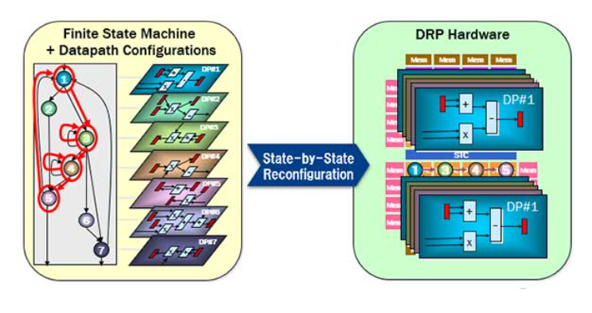

Changing of hardware configurations between different data path configuration is referred to as *context switching* meaning that the hardware adapts in real time to the computing needs of complex algorithms. DRP works like an FPGA except instead of being programmed once during the development phase, it is being dynamically reconfigured in real time by the STC to ensure its constantly adapting to the to the processing requirements of the algorithm. This provides runtime configuration capabilities that are somewhat limited on ASICS and FPGA’s.

Thanks to the other Dynamic Loading feature of DRP it is also able to load an entire new configuration (STC and data paths) in 1ms to completely change configuration as as an processing pipeline executes. Being able to completely load new sets of data path configurations in real-time means that you can effectively load complete processing algorithms and execute them as needed in hardware. 

This is best illustrated with an example, in this case a traditional computer vision image processing pipeline that is seeking to extract edges as features from input images. The pipeline is shown below with DRP capabilities included.  In this particular example the hardware is configured to implement Median filters for noise reduction, then perform edge detection using the Canny Edge Detection function and finally threshold detection to clean up the edges. 

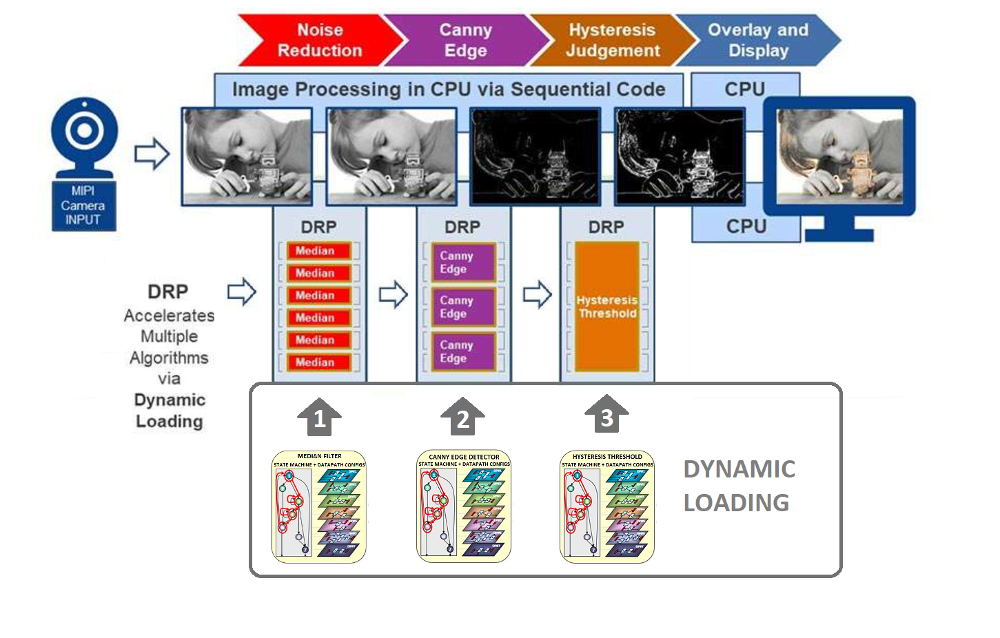

The input frame is fed to a Median filter with the Dynamic Loading capability being used to load a complete set of configurations for implementing the Median filter function in the DRP (Step 1). The image is then processed by what is effectively a hardware implementation of the Median filter with all the processing steps of the filter being executed by having the internal Finite State Machine load different data path configurations.

Dynamic Loading is then used to quickly switch out the Median Filter configuration for an implementation of the Canny Edge Detector in DRP(Step 2) which happens in as little as a millisecond. The output of the Median Filter is then quickly fed into the Canny Edge Detector.

Similarly the Hysteresis Threshold function is applied to the output of the Canny Edge Detector and is implemented in DRP in the same way through Dynamic Loading(Step 3). The resultant processing to overlay and display the results are then implemented in CPU

These functions would traditionally be performed in CPU but DRP results in performance that is magnitudes higher than running these functions on the CPU and can typically run up to 15X faster than on the CPU.

While DRP itself was developed for image processing acceleration on its own can it can improve DNN inference by accelerating the operations found in pre processing and feature extraction. Renesas further enhanced DRP to include a configurable high speed Multiply Accumulate (MAC) hardware unit for use with AI.  The combination of DRP with the AI-MAC unit results in the full DNN accelerator that Renesas calls DRP-AI.

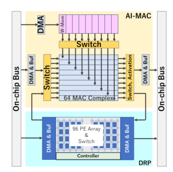

The MAC implementation in DRP-AI has also been especially designed to reduce power consumption by reusing data in operations such as in the convolution kernels that usually waste memory bandwidth and power by fetching the same data repeatedly. Another novel feature is that DRP-AI can anticipate 0 valued weights which occur frequently in DNN models due the way the RELU activation function clamps all negative numbers to 0. By being able anticipate these in real time unnecessary operations can be eliminated further reducing power consumption. To further improve inference latency and reduce power DRP-AI also has a mechanism to schedule operations to occur in the most efficient away reducing memory access and increasing processing throughput for the your model.

The DRP component of the DRP-AI accelerator is also able to boost performance of operations such as pooling in addition to feature extraction and various operations found in a Convolutional Neural Network.


All of this translates into DRP-AI being a DNN accelerator that is not only fast but also uses very little power and doesn’t require heatsinks and extensive cooling as compared to GPU’s. 

DRP-AI brings low power tinyML like characteristics to Edge applications while allowing you run complex unconstrained models with more parameters such as YOLO using less power than other competing solutions.


## Hardware Support for DRP-AI

DRP-AI is built into the RZ/V MPU family which includes a range of models designed for image processing, AI and general purposes applications with new parts being added in future.


The RZ/V2L is designed to optimize its performance for AI-powered and computer vision applications. It includes DRP-AI that is capable of processing complex calculations and neural network processing tasks in real-time, making it ideal for applications such as object recognition, speech recognition, and predictive maintenance. 

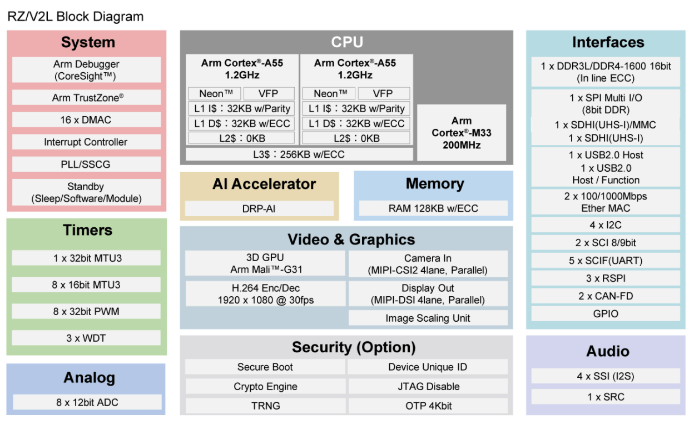

The RZ/V2L also includes a Cortex M33 MCU for real time interfacing making it a hybrid MPU/MCU solution, an Arm Mali GPU and a host of peripheral interfaces covering a wide range of applications.

## Development Board Options

### Renesas RZ/V2L Evaluation Kit

The Renesas RZ/V2L Evaluation Kits comes in the form a SMARC v2.1 Module that has the RZ/V2L and supporting hardware bundled together with a SMARC carrier board that provides Dual Gigabit Ethernet, MIPI Camera, MicroHDMI, CAN, PMOD and audio interfaces.  The RZ/V2L Evaluation kit also runs Yocto Linux and is geared towards product developers and professional applications. 


There is also a MIPI camera bundled with the kit but any suitable MIPI camera can be used. Currently Edge Impulse provides direct board support for the RZ/V2L Evaluation Kit.

## Avnet RZBoard V2L

The Avnet RZBoard V2L is an alternative option also based on the RZ/V2L that is ideal for quick prototyping and rapid deployments and comes in the form of a cost effective Single Board Computer with the Raspberry Pi form factor. It also includes Bluetooth and WiFi connectivity over and above the GigaBit Ethernet for a wide variety of AIoT applications.

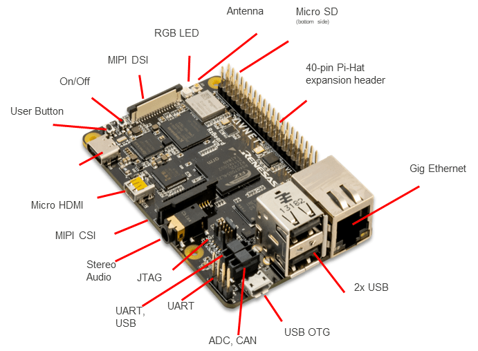

The RZBoard does not have all the features of the Renesas Eval kit but is useful for deployments and most common scenarios where you would use a SBC and can actually act as a drop in replacement for similar SBC’s especially when ML acceleration is required. 

## Using DRP-AI with Your Own Model

Utilizing the features of DRP-AI requires that your model is preprocessed and prepared before deployment in your application. This is done by means of a special software called DRP-AI translator which effectively converts or translates your model into a form that can leverage all the benefits of DRP-AI mentioned above. 

There is a lot of things happening behind the scenes within the DRP-AI accelerator. The actual implementation is transparent to the user who does not need to understand how to directly optimize their model and work on the DRP-AI hardware and how DRP-AI works at a low level. There are two tools available to users to take of this by translating you model into the suitable underlying configurations that makes it possible to run on DRP-AI.  One tool is called DRP-AI Translator and the other is called DRP-AI TVM both of which create a DRP-AI optimized version of your model but are used in different scenarios. The output of both these tool then tells the  DRP-AI hardware to optimally execute your model maximizing performance at the lowest power consumption.

**DRP-AI Translator**

DRP-AI Translator adds an additional step into your ML Ops workflow and  takes ONNX models as input and then converts the model into the necessary components needed to configure and instruct the DRP and AI MAC found within DRP-AI.

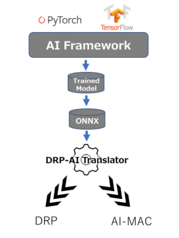

DRP-AI Translator also performs model optimization and setups up the DRP-AI hardware execute the model provided. 

**DRP-AI TVM**

DRP-AI TVM performs a similar function and incorporates DRP-AI into a Apache TVM framework which is a aims to unify the model compiling and deployment pipeline across various hardware and ML Frameworks. The TVM framework is able to convert models from a wider range of frameworks including TensorFlow and PyTorch. TVM may not produce the most optimized conversions for DRP-AI and the DRP-AI Translator tool on its own results in the highest performance. 

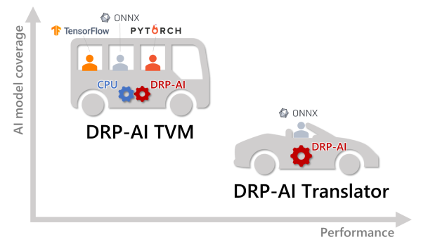

### Working with DRP-AI Translator

To directly utilize DRP-AI Translator the process requires additional configuration files to be provided with the ONNX model files to enable DRP AI to create the necessary configuration files to setup the DRP-AI hardware to execute your model. The additional input files are created in YAML and you need to provide Pre and Post Processing definition files together with an address map:

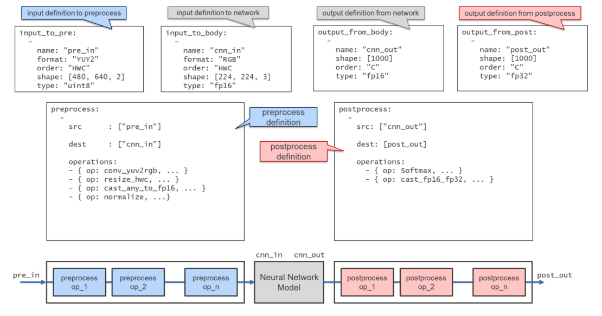

The DRP-AI Translator tool then generates many output files which include the various configuration for the DRP-AI to implement your model and these files need to be incorporated in your final application.

The figure below shows a summary of the input files provided and the resultant output files which then need to implemented into your application.

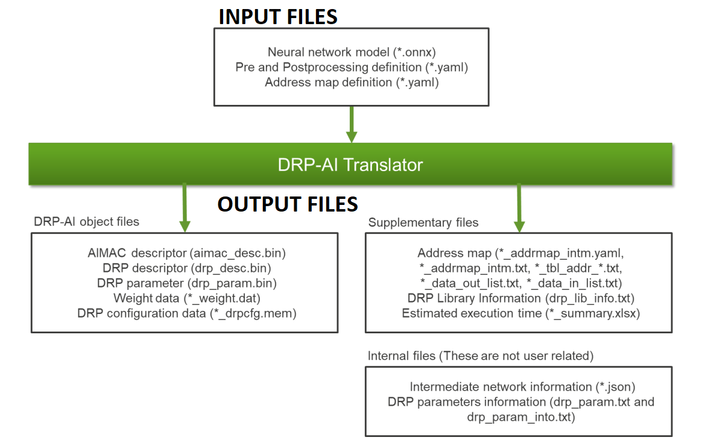

The input files themselves require and understanding of the model input and output layers and they are prepared in YAML format. In addition while DRP-AI Translator simplifies and abstracts the underlying workings of of the DRP-AI hardware it still requires an understanding the configuration process and most of most of these output files and how to work with them. There is documentation that is over 80 pages long detailing how to create the configurations to convert your models using DRP-AI Translator.

## Simple DRP-AI Edge Impulse

Whether you wish to use DRP-AI Translator or DRP-AI TVM both tools that require understanding and expertise to use.  The learning curve and effort required adds additional delays and costs into creating your end application which is why you are using ML in the first place. Unless you are working with a custom model architecture you are most likely needing to use Deep Learning to for Object Detection and Image classification which are the most common applications of AI vision.

Edge Impulse includes built in DRP-AI support for YOLOv5 and Edge Impulse’s own FOMO for Object Detection as well as MobileNet V1 and V2 for Image Classification.

With Edge Impulse’s support of DRP-AI all of this is done behind the scenes with DRP-AI Translator and the associated configurations taking place in the back for the supported models. There is no need to work with the configuration files or read and understand lengthy manuals or understand the whole process of working with DRP-AI Translator and the associated input and output files. All that is needed is a few clicks to add DRP-AI support to existing or new models.

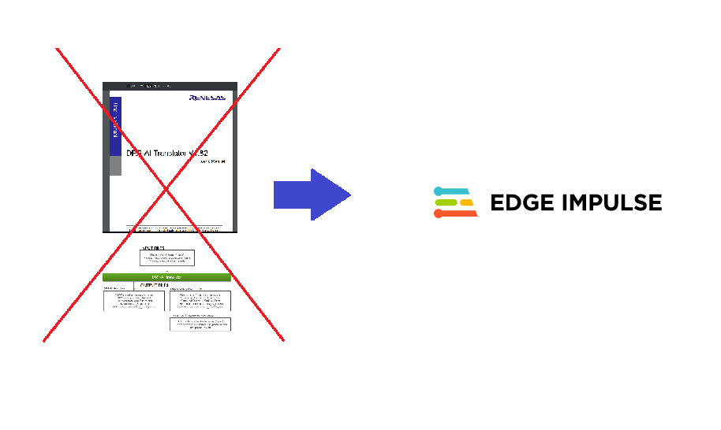

### Model Creation for DRP-AI

To add DRP-AI support in your ML projects with Edge Impulse, all that is needed is to select the Renesas RZ/V2L (with DRP-AI accelerator) target from the Target selection menu in the Edge Impulse Studio. This invoke the DRP-AI Translator tool and input file generation automatically behind the scenes while also ensuring it works with your custom model.

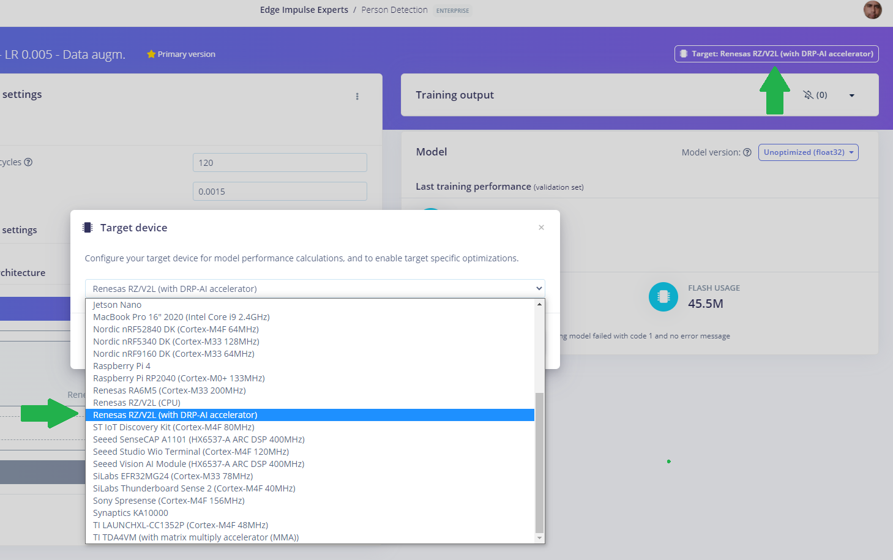

Selecting this target works for both Image Classification and Object Detection (FOMO) and YOLO. 

When using FOMO you can use the standard FOMO model however for YOLO there is a special YOLO training block for DRP-AI that needs to be selected. Once you have made those selections your workflow proceeds as per normal in Edge Impulse


This allows developers to transparently leverage  the benefits of DRP-AI and instead be focused on the final application. This is in line with Edge Impulse’s philosophy of enabling developers at all skill levels to build production ready ML based applications as quickly and easily as possible.

## Deployment with Edge Impulse

Once you have completed the process of building your model the next step is to actually deploy the model your hardware. For quick testing of your model directly on the RZ/V2L Evaluation kit you can use the Edge Impulse CLI specifically the `edge-impulse-linux-runner` command from the RZ/V2L board itself after installing all Edge Impulse CLI. This deploy the model directly to your board hosted in Edge Impulse’s TypeScript based Web Deployment and you can connect to the running model from your browser and evaluate performance.

You will ultimately want to deploy the model into a custom application on your own custom application and the two choices you have are to use the C++ DRP-AI Library for embedding in a custom C++ application or the EIM deployment.


The DRP-AI C++ library is based on Edge Impulse’s standard C++ SDK library and contains the DRP-AI acceleration configuration built in making it easy for developers to use the SDK in their code with DRP-AI through the same API that is used across all platforms. The DRP-AI C++ library can be dropped into your application without you needing understand the underlying configuration.

Edge Impulse has a created an a packaged executable called an EIM (Edge Impulse Model) that is essentially a Linux executable that wraps up your model and all associated feature processing and acceleration into one executable which is accessed via a simple Inter process Communication Interface (IPC). You can easily pass your input data to this executable via the IPC interface and the receive the results via the same interface.

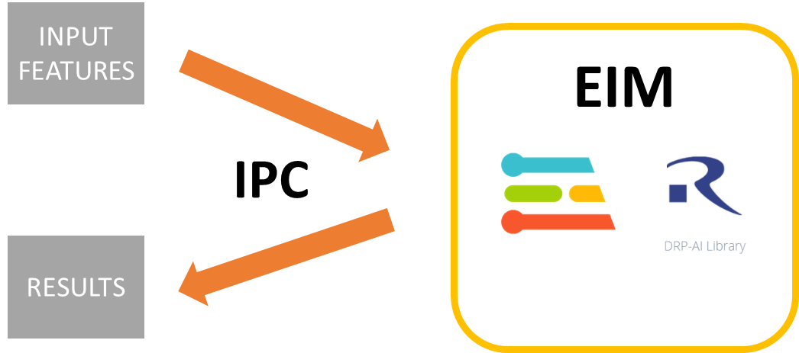

The EIM DRP-AI deployment is easily accessible from the Edge Impulse Studio by selecting the Renesas RZ/V option under Build Firmware. This automatically results an EIM download. The EIM file can then be copied to your RZ/V2L board and called from your C++, Python, NodeJS or GoLang application.

Not only do both of these options provide you flexibility for most applications and allow your developer to be able to use DRP-AI transparently, you also benefit from the additional optimization provided by the Edge Impulse’s EON Tuner. EON assists with improving accuracy and is supported on RZ/V for image classification.

## Deployment Examples

Both Object Detection and Image Classification can be used on their own however it is useful to combine them together where the Object Detector first locates specific objects in a frame and then Classifier is used to further classify an object into different categories. This requires the Object Detector to run first then the output of the Object Detector is passed to the Classifier. The output being Object Detection Bounding boxes with a classification label.


In this example such an implementation is provided as Python based Web Application that you can modify for your own use. The web application supports EIM and allows you to specify an Object Detection model built as an EIM as the first stage and similarly a Classification model built as an EIM as the second stage. The output of the Object Detector are bounding boxes for all the objects detected in the scene. Each of these bounding boxes are or objects are cropped out of the original frame and transformed to match the aspect ratio of the Transfer Learning object classification input layer which then classifies each object detected. 

The 2 stage pipeline runs sequentially and the more objects detected the more classifications that are required so it is ideal for applications where there only a few expected objects in a scene. There are many use cases where this will work.

While this pipeline can be deployed to any Linux board that supports EIM, it can be used with DRP-AI on the Renesas RZ/V2L Eval kit or RZ/Board leveraging the highly performant and low power DRP-AI by selecting these options in Edge Impulse Studio as shown earlier. By deploying to the RZ/V2L you will achieve the lowest power consumption vs framerate against any of the other supported platforms. YOLO Object Detection also ensures you get the level of performance needed for demanding applications.

The application consists of two files [app.py](http://app.py) which contains the main 2 stage pipeline and web server and [eim.py](http://eim.py) which is a custom Python SDK for using EIM’s in your own application

To configure the application various configuration options are available in the Application Configuration Options section near the top of the application:

```
python
# Application Configuration Options
config_camera_opencv_deviceid = 0 # camera device id 0-default camera 
config_draw_bbox = True # for turning on bounding box display
config_draw_labels = True # for drawing object detection class label
config_two_stage = True # enables the two stage pipeline which adds secondary detection class on top of YOLO label
config_video_save = True # turn on the saving of video output to output.avi
classifier_objdet = eim.EIM_Engine(eimfilename='person-detection_drpai.eim', eimtype='image')
classifier_classify = eim.EIM_Engine(eimfilename='person-classification_drpai.eim', eimtype='image')
```

The application can be run as just a single stage (YOLO Object Detection only) or the two stage pipeline where the Objects detected by the YOLO Object Detector are passed to a Classifier. Note that this is a top down approach where each object is detected is sent to a classifier as can be seen in the following two examples.

**Prerequisites for the examples to follow:** 

- RZ/V2L Evaluation Kit/ Avnet RZBoard
- USB Web Cam
- Yocto Linux with support for Python3, OpenCV for Python and Edge Impulse CLI

### Product Quality Inspection - Candy Inspection

A possible use case of this is to detect product quality where a candy Detection Model was trained together with a classification model to detect the quality of the candy. 

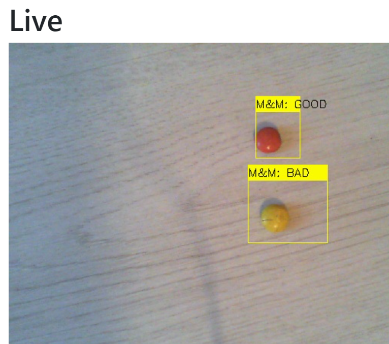

Power consumption figures are shown running on an actual RZ/V2L Eval Kit measuring the current draw through the primary power source without a USB UART cable connected. These figures are under test conditions with board being set to use 5V power via the USB-C Power Input


As can be seen the power current draw for YOLOv5 Object Detection is under 500mA in total whereas Image Classification is just under 400mA whereas the board draws just under 300mA while idle with a single user logged in via SSH. This shows the phenomaly low power operation of DRP-AI which also does not require any heatsinks to be attached to the RZ/V2L MPU.

### Pose Detection on Renesas RZ/V2L with DRP-AI

Edge Impulse has created a feature processing block that contains a pretrained PoseNet model. This Posenet block produces body keypoints as features from input images instead of producing raw scaled image data features as is normally image classification models. To train this model you need to capture images of different poses and label the images according to the poses.

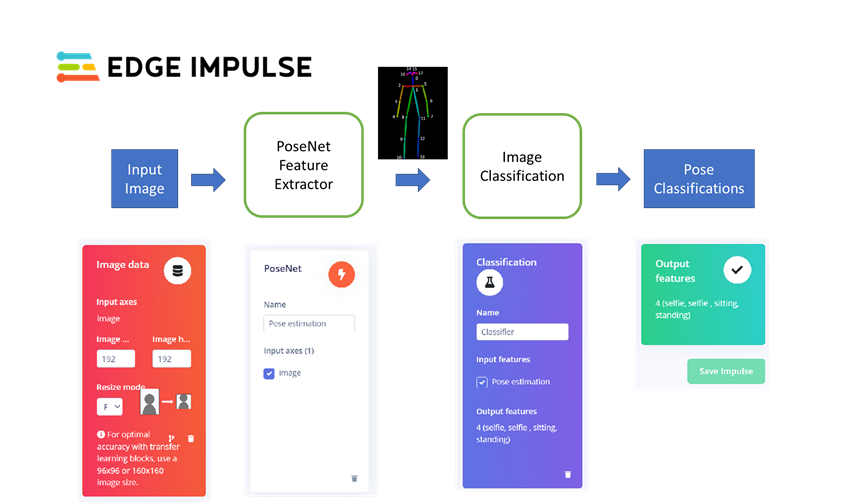

The generated keypoints are fed to a normal classifier instead of an Transfer Learning (image classifier) and the classifier learns to associate sets of keypoints with poses according to the labels.

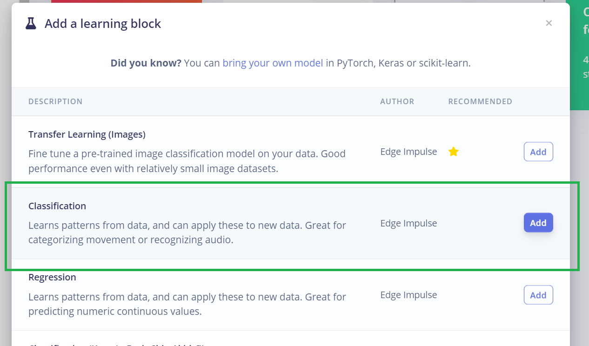

Provided the labels were correctly done the classifier learns to detect different kinds of poses. This is very useful for working with pose models to actually classify types of poses and figure out activities being performed by by people detected in a scene.

The PoseNet block requires that you run it locally on your own machine if you don’t have an Enterprise account more details can be found at [https://github.com/edgeimpulse/pose-estimation-processing-block](https://github.com/edgeimpulse/pose-estimation-processing-block)

When using the PoseNet feature extractor with DRP-AI the feature extraction block runs in CPU whereas Edge Impulse will generate DRP-AI accelerated implementation of the Classifier provided the *Renesas RZ/V2L (with DRP-AI accelerator)* target is selected.

The Classification model can be dropped into the two stage pipeline as the second stage classifier. If used with in the two stage pipeline in this way, the bounding boxes from YOLO are transformed and cropped and sent to the PoseNet classifier for each person detected. This then allows the poses of multi people to be detected in a scene and is form of top down pose classification of a scene. 

The number of people in the scene will impact performance in this way however with DRP-AI this is achieved with a lower power draw.

An example web based application written in Python with Flask is available (source) to test the two stage pipeline using Edge Impulse’s PoseNet (link to PoseNet) pipeline as part of the second stage classification in the pipeline. This demonstrates the power of using Python for simplification of the application logic while still being able to utilize the power of DRP-AI with Edge Impulse’s EIM deployments thereby making life easier. 

The output of the Object Detection step draws a bounding box with the label shown on the left in this case a PERSON was detected. The second stage classifier shows the output of the classification in this case using the PoseNet pipeline showing a person POINTING.

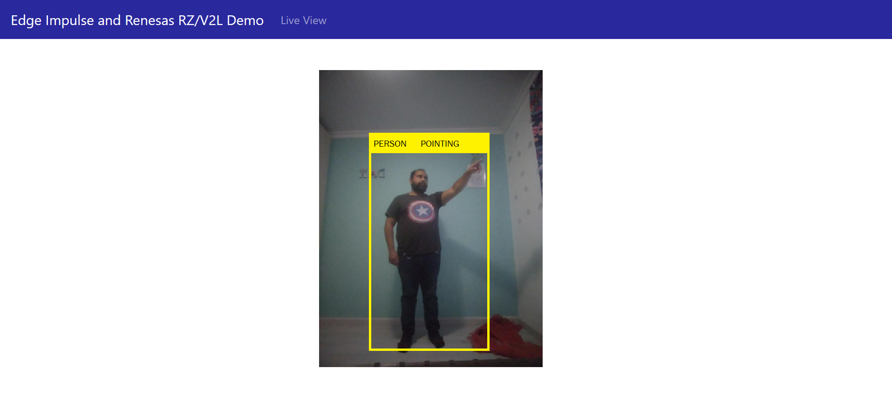

The exact same application was use as the Candy Detection above by simply substituting EIM’s. 

Edge Impulse will make it easy for you to build different cases and deploy a new pipeline by simply building your models and downloading the EIM’s. 

## Summary

Renesas has created a low power highly performant and novel ML accelerator in the form of DRP-AI. The DRP-AI is provided as part of the RZ/V series of Arm Cortex A MPU’s which were developed for AI based vision applications, offering a wide variety of peripherals to suit most applications from B2B to B2C. 

DRP AI is a full ML accelerator that exploits the dynamically configurable capabilities which Renesas has designed to allow the hardware to effectively adapt itself in real time to the ML model being executed thereby accelerating the inference process while also consuming a lower amount of power than other solutions such GPU’s.

Edge Impulse makes it easy to use DRP-AI without needing understand or implement the workflows required to convert your models to work with DRP.  Everything needed for DRP-AI translation baked in to allow you to leverage the benefits of DRP-AI in your vision based AI applications with a few clicks greatly simplifying the developer experience.

Deployment options available start with Edge Impulse’s own EIM executable models that have the DRP-AI acceleration requirements built in to help you get going quickly on Linux and can be used with applications written in Python as we have demonstrated earlier. 

Alternatively there is also a C++ DRP-AI library built around Edge Impulse’s SDK that allows you to build in DRP-AI support into your custom applications [https://docs.edgeimpulse.com/renesas/deployment/drp-ai-library/deploy-your-model-as-a-drp-ai-library](https://docs.edgeimpulse.com/renesas/deployment/drp-ai-library/deploy-your-model-as-a-drp-ai-library)

When used in combination with Renesas DRP-AI, the RZ/V2L becomes an even more powerful tool for developers working on AI-powered applications. Together, these two products offer a high-performance, low-power consumption solution for processing large amounts of data quickly and efficiently.

There are two readily available hardware kits one being the professionally orientated RZ/V2L Evaluation Kit from Renesas and the other being the Maker focused Avnet RZ/Board V2L which could also be used in production systems.

Overall, Renesas DRP-AI and RZ/V2L are powerful tools that can help developers to create cutting-edge AI-powered applications that are optimized for high-speed data processing and low power consumption. With their ease of use and versatility, these products are well-suited for a wide range of development projects, from those with little to no AI experience to those who are experts in the field.
