# Computer Vision for Product Quality Inspection with Renesas RZ/V2L 

Created By:
Solomon Githu 

Public Project Link:
[https://studio.edgeimpulse.com/public/198270/latest](https://studio.edgeimpulse.com/public/198270/latest)

## Overview

In the manufactured product casting process, liquid material is poured into a mold with a cavity that corresponds to the shape of the desired finished product. Casting defects can develop during the liquefaction of the material, resulting in problems or defects such as shrinkage, pinholes, blow holes, etc. Most manufacturers have a quality inspection process for separating defective products from the non-defective ones. Accuracy and decision making normally depends upon human inspection and interpretation. Computer vision based systems can therefore improve accuracy or speed up the process, and will be explored in this project.

## Solution

In this project I implement a computer vision based cast inspection procedure and application. I trained a YOLOv5 object detection model using the [Edge Impulse platform](https://edgeimpulse.com/), and deployed it to the [Renesas RZ/V2L Evaluation Board](https://www.edgeimpulse.com/blog/edge-impulse-launches-official-support-for-the-renesas-rzv2l-evaluation-board). A [Google Coral camera](https://coral.ai/products/camera/) first takes a top-view image of a submersible pump impeller moving on a conveyor belt. An application running on the Renesas RZ/V2L then classifies if the impeller is good, or defective. The time per inference is around 63 milliseconds, which equates to around 16 frames per second (fps). This low latency during inference can be related to the fact that the Renesas RZ/V2L board is designed for vision AI applications, due to it's powerful hardware acceleration through its Dynamically Reconfigurable Processor (DRP) and multiply-accumulate unit (AI-MAC).


## Components and Hardware Configuration

Software components:
- Edge Impulse Studio account
- Edge Impulse for Linux

Optional software components for rebuilding the Web application:
- Edge Impulse Python SDK
- Flask
- PyInstaller

Hardware components (including conveyor belt construction):
- Renesas RZ/V2L Evaluation Board Kit
- USB Type-C cable "AK-A8485011" (manufactured by Anker)
- USB PD Charger Anker "PowerPort III 65W Pod" (manufactured by Anker)
- Ethernet cable
- 12V AC/DC adapter
- 470 Ohm resistor
- 10k Ohm multiturn trimmer potentiometer
- 1M Ohm resistor
- IRF540 mosfet
- A 3cm x 3cm strip board
- 4 2.5mm pin spaced male header pins
- A soldering gun and some solder wire
- At least four male-female jumper wires
- N20 3mm DC 6V 200RPM Metal Gear motor
- [Mini conveyor assembly](https://www.printables.com/model/492442-mini-conveyor-3d-model)
- [Renesas RZ/V2L Evaluation Board Kit camera support](https://www.printables.com/model/491830-renesas-rzv2l-and-google-coral-camera-holder)
- At least 20 pairs of M3 bolts and nuts

## Data Collection Process

I used the [casting product image data for quality inspection](https://www.kaggle.com/datasets/ravirajsinh45/real-life-industrial-dataset-of-casting-product) dataset on Kaggle. This dataset contains top view gray-scaled and augmented images of submersible pump impellers. The dataset has folders for defective and non-defective images of submersible pump impellers.

In total, I had 1300 images: 1047 for training and 253 for testing.

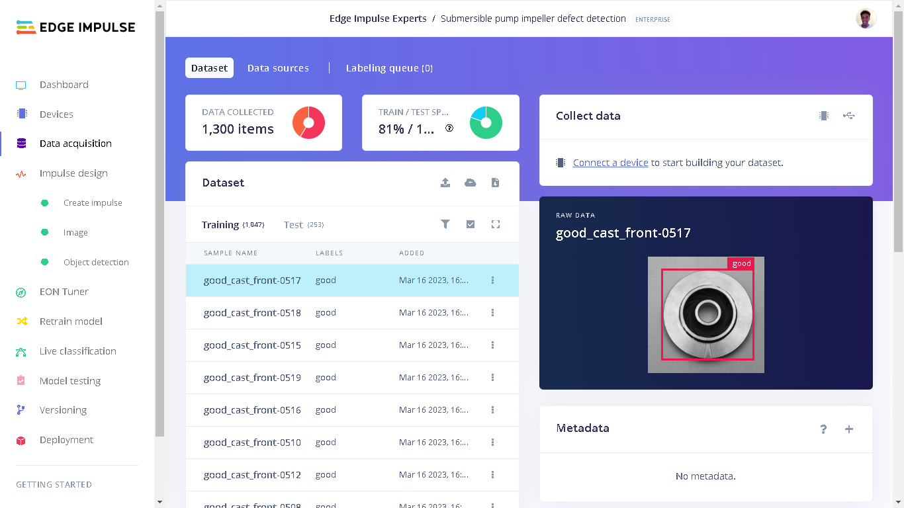

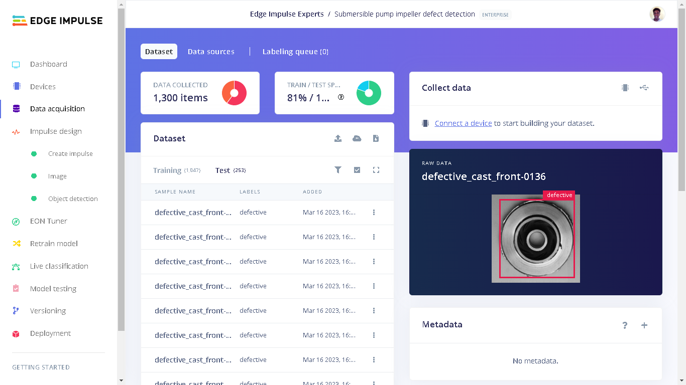

With 1300 images it would be tiresome to draw bounding boxes for all the objects. Edge Impulse offers various [AI-assisted labelling methods](https://www.edgeimpulse.com/blog/3-ways-to-do-ai-assisted-labeling-for-object-detection) to automate this process. In my case, I chose to track object within frames and the bounding boxes as well as their labels were set automatically.

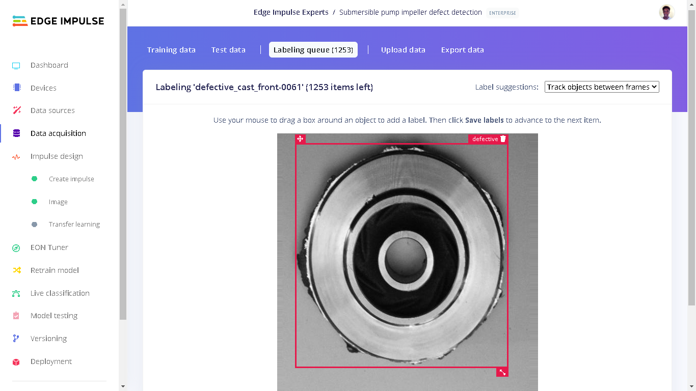

## Training and Building the Model

An [Impulse](https://docs.edgeimpulse.com/docs/edge-impulse-studio/impulse-design) is a machine learning pipeline that indicates the type of input data, extracts features from the data and finally a neural network is created that trains on the features from your data.

For the YOLOv5 model, I used an image width and height of 160 pixels and the "Resize mode" set to "Squash". The processing block was set to "Image" and the learning block set to "Object Detection (Images)".

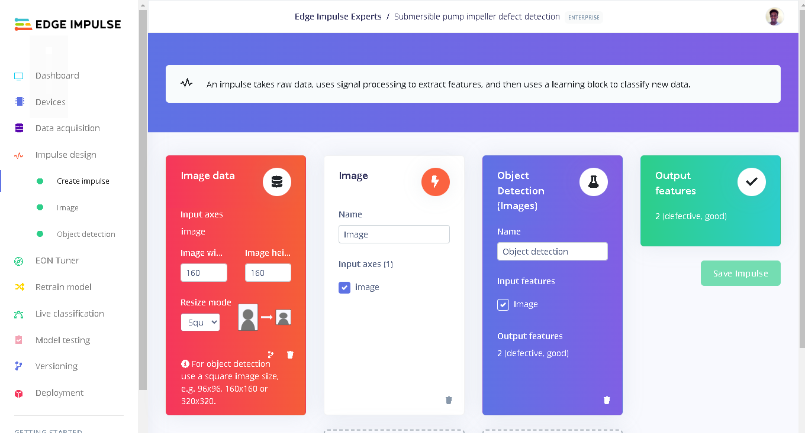

Under "Image" in Impulse design, the color depth of the images is set to RGB and the next step was to extract features.

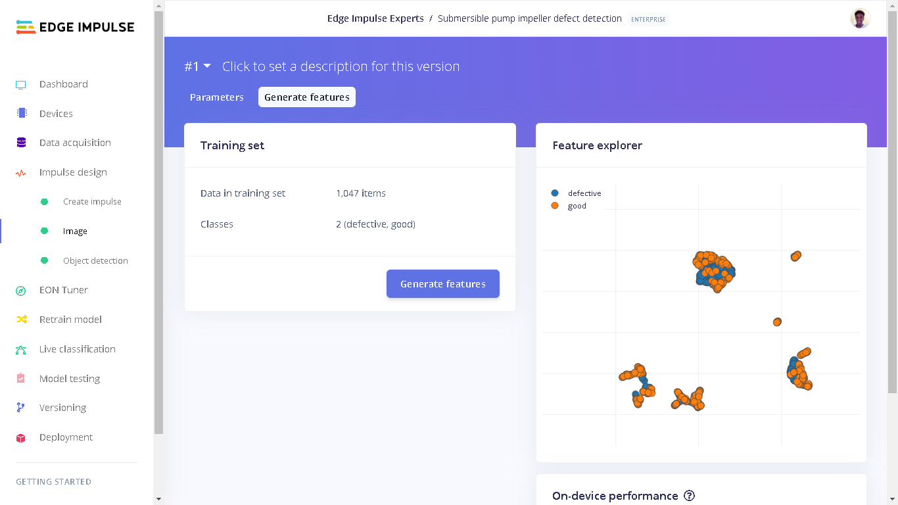

On the [Feature explorer](https://www.edgeimpulse.com/blog/visualizing-complex-datasets-in-edge-impulse), we can see that the blue and orange data don't completely separate from each other. This can be related to the fact that both defective and good impellers have similar features like their disc-shaped property. We can see that there is a trend of some sort on the data; the blue data are grouped together on one side and the orange data grouped together on another side. What separates the good and defective impellers are the bad "artifacts" like cracks, holes and protrusions.

In the Features tab we can also see the on-device performance for generating features during the deployment. These estimated metrics are for the Renesas RZ/V2L (with DRP-AI accelerator). The performance evaluations are enabled and available as a result of the Renesas RZ/V2L Evaluation Board Kit being a fully supported device by Edge Impulse.

Currently, all Edge Impulse models can run on the RZ/V2L CPU which is an Arm Cortex-A55 based SoC. However, so that I can benefit from the DRP-AI hardware acceleration, I chose a YOLOv5 model, which will run on the accelerator. Note that on the training page you have to select the RZ/V2L (with DRP-AI accelerator) before starting the training in order to tell the studio that you are training the model for the RZ/V2L. This can be done on the top right in the training page or by changing target device in the Dashboard page.

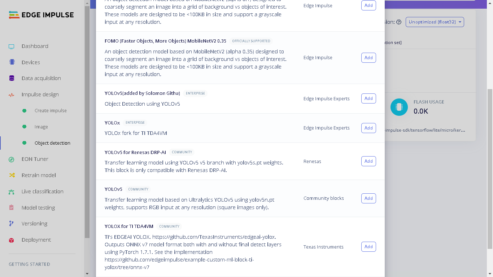

After training the model on various parameters, I settled with 100 training cycles and a learning rate of 0.001. It is however advised to train a YOLOv5 model using more than 1500 photos per class and more than 10,000 instances per class to produce a robust YOLOv5 model. For this proof-of-concept, there are only 1300 images in total, but this is enough to demonstrate and prove the concept.

After the training process, I got a precision score of 96%. Precision is the number of True Positives divided by the number of True Positives plus the number of False Positives.

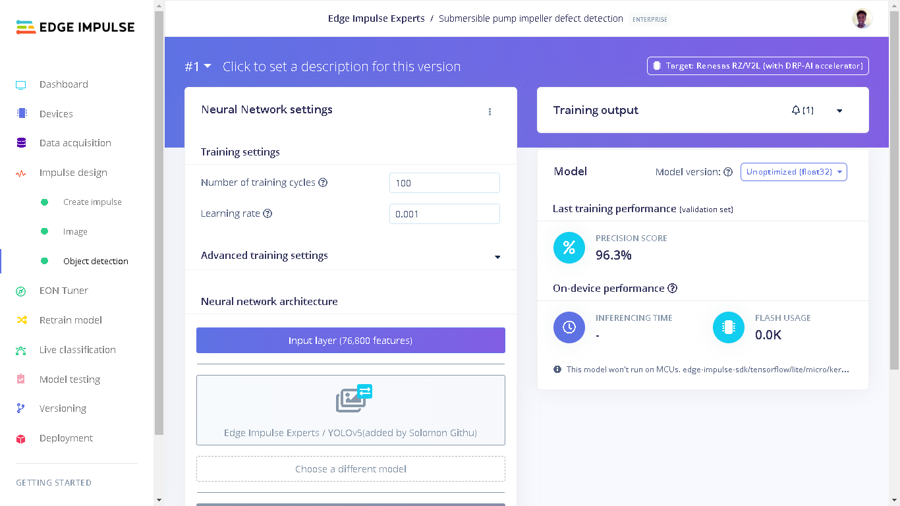

## Model Testing

After training a model, we need to do a test with the unseen (Test) data. In my case, the model had an accuracy of 91%. This accuracy is a percent of all samples with a precision score above 98%.


I chose this as an acceptable performance and proceeded to deploy the model to the Renesas RZ/V2L board.

## Deploying the Model to a Renesas RZ/V2L

The Renesas RZ/V2L Evaluation Kit comes with the Renesas RZ/V2L board and a 5-megapixel Google Coral camera. To setup the board, Edge Impulse has [documentation](https://docs.edgeimpulse.com/renesas/development-platforms/officially-supported-cpu-gpu-targets/renesas-rz-v2l) that shows how to prepare the Linux image, install [Edge Impulse for Linux](https://docs.edgeimpulse.com/docs/edge-impulse-for-linux/edge-impulse-for-linux), and finally connected the board to the Edge Impulse Studio. 

After the Renesas RZ/V2L board has been setup we can SSH into the board through an ethernet connection between a development computer and the board, or the board and a router. To SSH into the RZ/V2L we can run the following terminal/Command prompt command on a computer:

``` 
ssh root@smarc-rzv2l
```

Note: if the `smarc-rzv2l` hostname is not identified on your network, you can use the board's local IP address instead.


To run the model locally on the RZ/V2L we can run the command `edge-impulse-linux-runner` which lets us log in to our Edge Impulse account and select a project. The model will be downloaded and inference will start automatically.

Alternatively, we can also download an executable of the model which contains the signal processing and ML code, compiled with optimizations for the processor, plus a very simple IPC layer (over a Unix socket). This executable is called [.eim model](https://docs.edgeimpulse.com/docs/edge-impulse-for-linux/edge-impulse-for-linux#.eim-models).

To do a similar method, create a directory and navigate into the directory:

```
mkdir submersible_pump_impeller_classification_with_Edge_Impulse && \
cd submersible_pump_impeller_classification_with_Edge_Impulse

```
Next, download the eim model with the command:

```
edge-impulse-linux-runner --download modelfile.eim
```

Now we can run the executable model locally using the command:

```
edge-impulse-linux-runner --model-file modelfile.eim
```

Here, we pass the name of the downloaded file **modelfile** in the command.

We can go to the provided URL (RZ/V2L IP address at port 4912) and we will see the feed being captured by the camera as well as the bounding boxes if present.

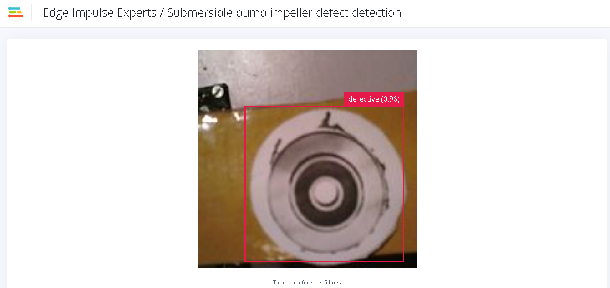

## Results - An Industrial Demo of AI in Quality Inspection

Using the `.eim` executable and [Edge Impulse Python SDK](https://docs.edgeimpulse.com/docs/edge-impulse-for-linux/edge-impulse-for-linux#sdks), I developed a Web Application using [Flask](https://flask.palletsprojects.com/en/2.2.x/) that counts the number of good, and number of defective submersible pump impellers. The images and the counts are then displayed on the Webpage in real time. 

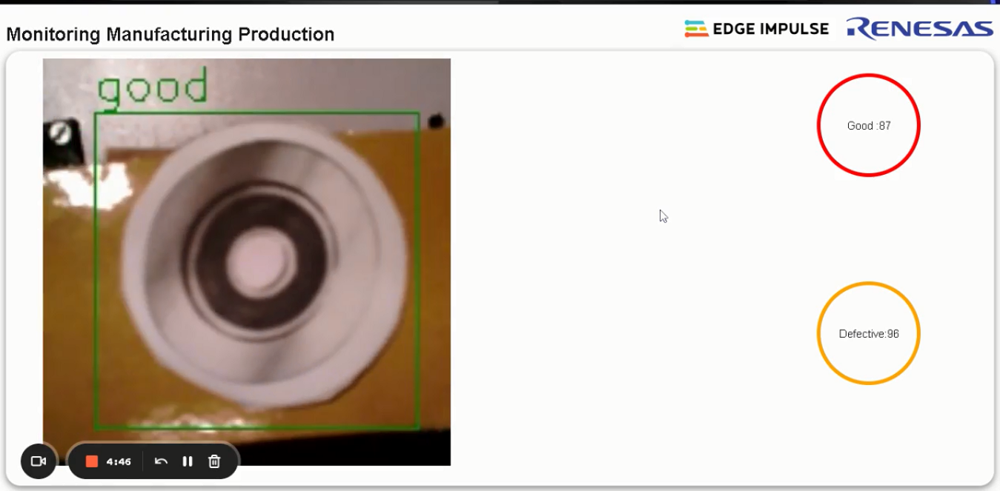

Afterwards I designed and 3D-printed some PLA-based parts that can be assembled to a mini conveyor belt. These parts can be downloaded on [printables.com](https://www.printables.com/model/492442-mini-conveyor-3d-model). The mini conveyor mechanism assembly is made up of corner brackets, rollers, roller support, M3 bolts and even a motor housing. I assembled the conveyor on a board platform made of chip plywood. I also designed and 3D-printed a crate that is used to catch the parts as they are falling from the conveyor.

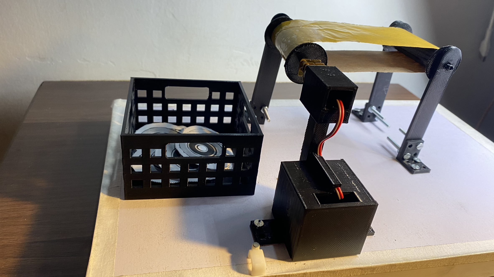

The conveyor mechanism is actuated by one N20 3mm DC 6V 200RPM Metal Gear motor. The motor housing has a chamber to put a circuit board for driving the motor. A cable management channel is also provided for the wires running from the motor driver circuit to the motor. 


To assemble the conveyor mechanism the following parts are needed:
- 4 corner brackets
- 4 roller supports
- 2 rollers
- 1 motor support
- 1 motor support cover
- At least 20 pairs of M3 bolts and nuts (if you plan to screw 2 out of 4 four holes)
- 1 crate

The motor driver circuit is based on this [tutorial](https://www.homemade-circuits.com/dc-motor-speed-controller-circuits/). It has one DC input and a DC output. I used a 12V AC/DC adapter to power the conveyor mechanism. The speed of the motor can be controlled by adjusting the potentiometer.

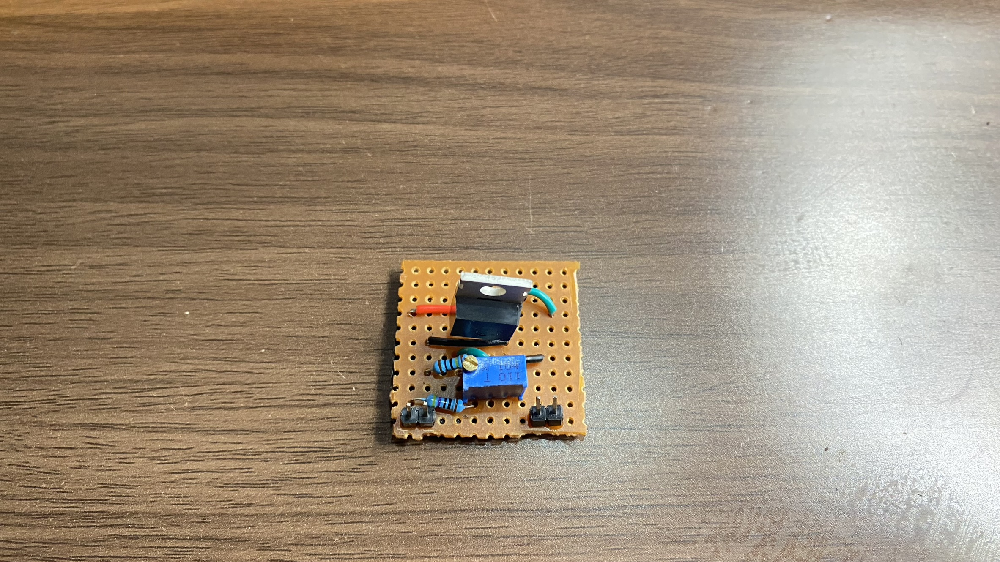

Afterwards, I also designed and 3D-printed a support for the Renesas RZ/V2L Evaluation Board Kit components. This support is made up of two parts: a base support for the board and a part for increasing the height of the base support. The Google Coral camera can be mounted upright or facing downwards through the provided slots. This Renesas RZ/V2L EVK support is also available for download on [printables.com](https://www.printables.com/model/491830-renesas-rzv2l-and-google-coral-camera-holder).


Finally, I printed some 3cm wide submersible pump impeller images from the testing dataset. As the conveyor belt is moving, the Google Coral camera takes a picture of the printed images and the results are shown on the WebApp.  Actual impellers could also be used of course, or 3D-printed representations of them, but keep in mind that if they are too different from the training data, accuracy could suffer when doing inferencing.

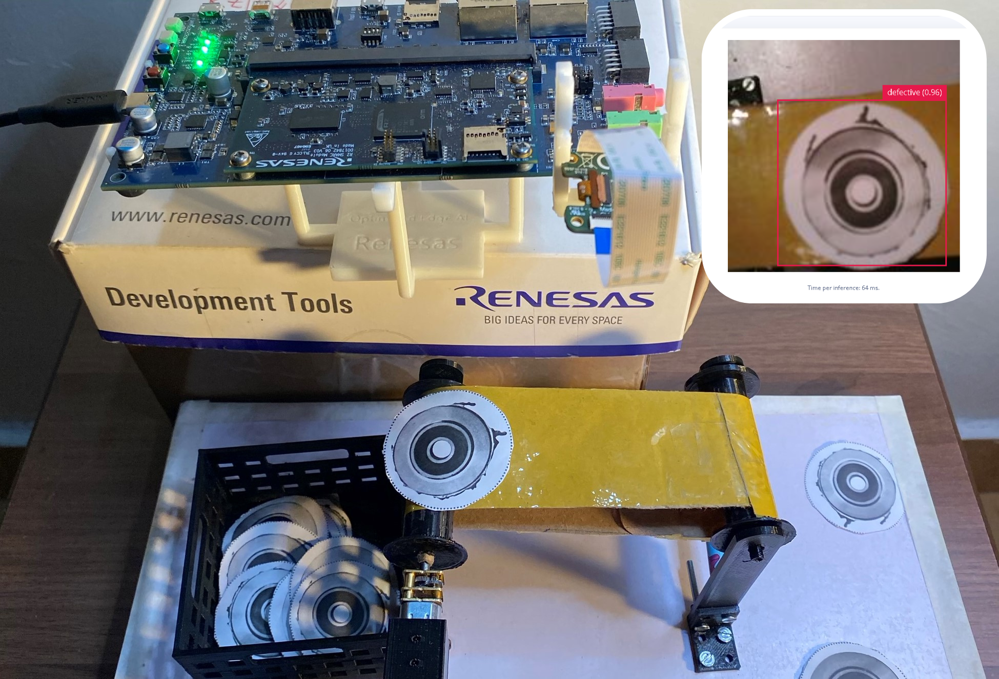

Here is a demo of the application classifying submersible pump impellers as they are moving on the conveyor belt.


The WebApp is available in this [GitHub repository](https://github.com/SolomonGithu/cast_manufactured_product_inspection_with_Edge_Impulse-submersible_pump_impeller). It can be cloned on the Renesas RZ/V2L board and the installation steps are in the repository. You can run the Flask application using Python (after installing Flask) or run the binary executable built with PyInstaller for Aarch64 platforms.

You can find the public Edge Impulse project here: [Submersible Pump Impeller Defect Detection](https://studio.edgeimpulse.com/public/198270/latest). To add this project to your Edge Impulse projects, click "Clone this project" at the top of the window.

## Conclusion

This project has shown that we can leverage computer vision to identify manufacturing defects on cast production by integrating Machine Learning for visual inspection. This approach can not only increase the inspection accuracy, but also reduce worker fatigue and increase inspection velocity by helping supplement human inspection.

An interesting future project could be to add capability to the conveyor mechanism so that the defective parts can be moved to a separate location. Renesas has a documentation on how to set the GPIO with the [Renesas Flexible Software Package (FSP)](https://www.renesas.com/us/en/document/apn/setting-gpio-flexible-software-package) for
writing applications.

Credits:
- https://www.homemade-circuits.com/dc-motor-speed-controller-circuits/
- https://www.kaggle.com/datasets/ravirajsinh45/real-life-industrial-dataset-of-casting-product 


