# Safeguarding Packages During Transit with AI

Created By:
Shebin Jose Jacob 

Public Project Link:
[https://studio.edgeimpulse.com/public/129415/latest](https://studio.edgeimpulse.com/public/129415/latest)

## Project Demo



## Intro

Safe transit of packages is a headache for many online retailers since damage can occur during transit. Damaged shipments lead to a greater number of product returns, a poor customer experience, and negative reputation of the retailers. Since we have no knowledge of what happens during delivery, it might be difficult to prove that a package's contents were destroyed during travel, as opposed to before or after transfer to a carrier. Due to this lack of transparency, both unfair accusations or deliberate fraud are possible. 

As a solution, we are designing a device that can monitor the safe handling of packages during transit. This device uses an Arduino Nano 33 BLE Sense and a GSM module, along with Edge Impulse to identify the locations where impetuous handling of the package occurs. Using the accelerometer data, the device can identify possible insecure handling that occurred during the transit. When insecure handling is detected by the device, an alert is generated in our system which logs the current time of the incident. The log can be analyzed by the retailer as part of an internal audit to analyze the performance of the courier services. The user can also track the handling of the package using the web interface provided. 

This device is extremely useful in transporting **Handle With Care** packages that should be handled very carefully.

## How Does It Work?

The Arduino Nano 33 BLE Sense has a 9-axis IMU (3-axis accelerometer + 3-axis gyroscope + 3-axis magnetometer), which makes it ideal for recognizing gestures. The movements are classified by an AI model into five classes - Hard Fall, Vigorous Shaking, Throwing, Normal Carrying, and Idle - after ingesting the data from the IMU. Hard Fall, Vigorous Shaking, and Throwing are categorized as "insecure handling" and the rest are categorized as "secure handling". Once an insecure handling event is detected by the AI model, the GSM module is activated and it logs the insecure handling event in Firebase. The events can be tracked by the user or an internal audit team to analyse the performance of carriers.

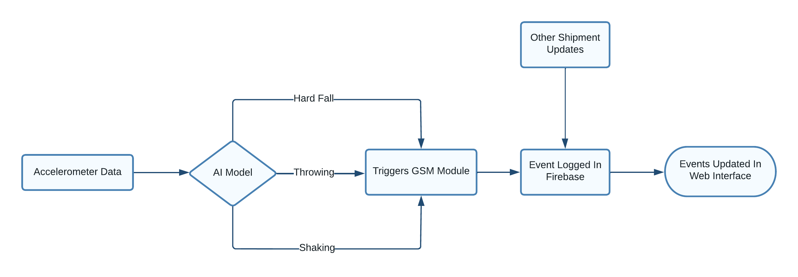

## Hardware Requirements
* Arduino Nano 33 BLE Sense
* SIM 800L GSM Module
* TP4056 Module
* Boost Converter
* Li-ion Battery


## Software Requirements
* Edge Impulse
* Arduino IDE


## Software Setup


## 1. Create a new project

The first step is to create a new Edge Impulse project. If you already have an account, you can create a new project by following the steps shown below. If you don't have an Edge Impulse account, sign up for a new account and follow the steps.

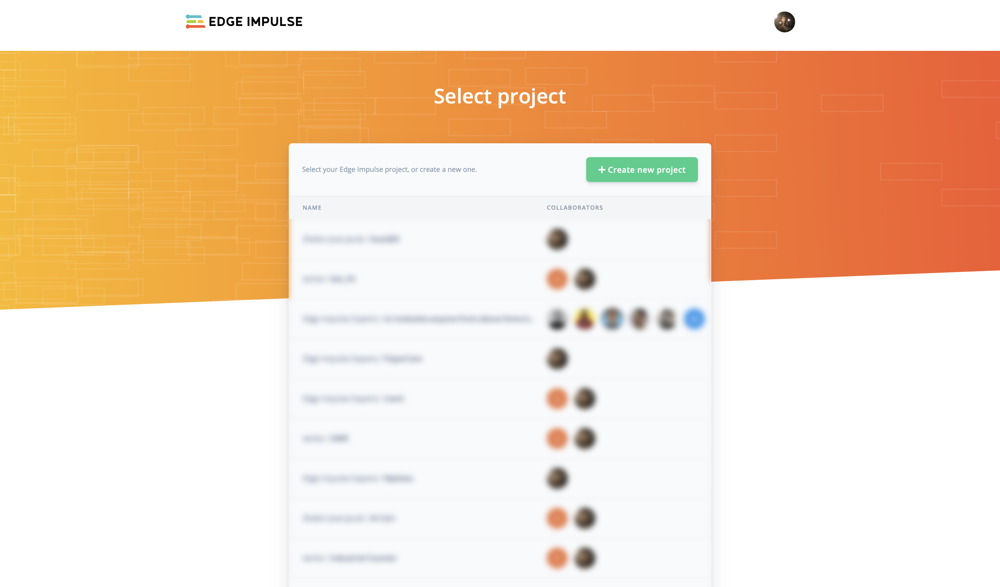


In our case we are classifying the gestures after analysing the accelerometer data from the IMU. So make sure you choose **Accelerometer Data** from the list.

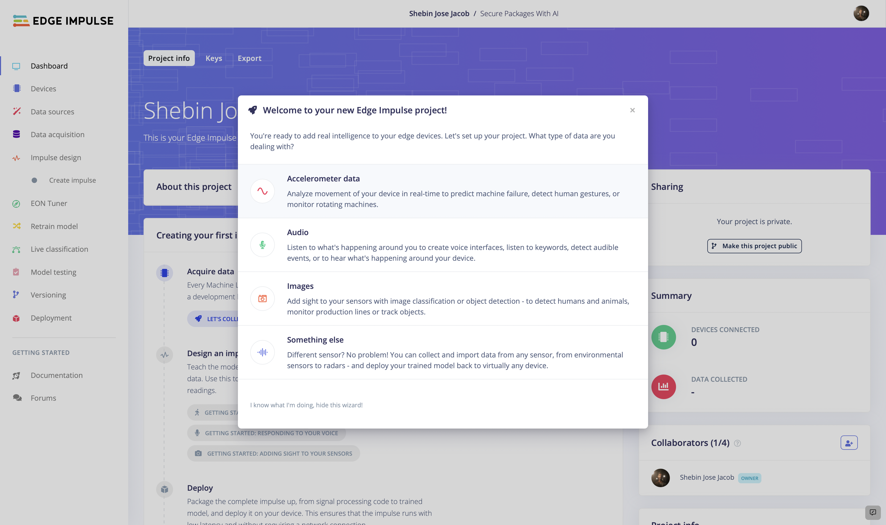

## 2. Connect the Device

In order to collect accelerometer data directly from the Arduino Nano 33 BLE Sense, we should connect the device to the Edge Impulse Studio first. Follow the steps given [here](https://docs.edgeimpulse.com/docs/development-platforms/officially-supported-mcu-targets/arduino-nano-33-ble-sense) to connect the device with the Studio.

After you have completed all the above steps, make sure you see your device in the **Devices** tab.

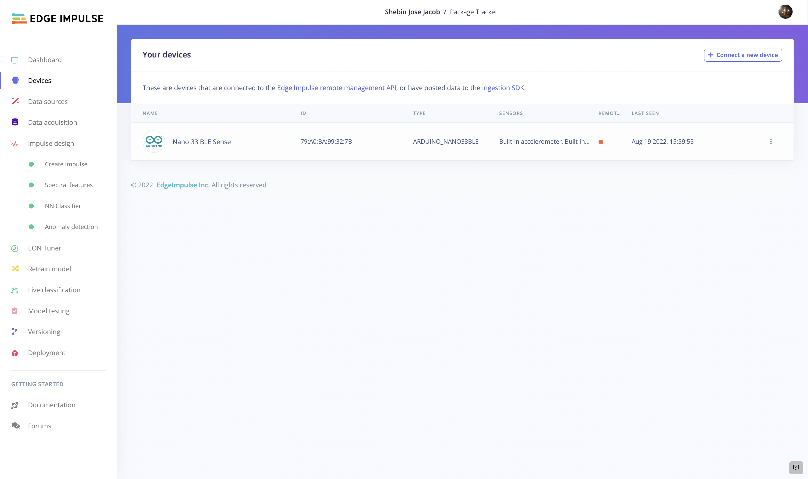


## 3. Data Collection

Machine learning begins with the data you provide. It is crucial to gather clean data so that your machine learning model can identify the proper patterns. How accurate your model is, will depend on the quality of the data you provide the computer. Inaccurate or out-of-date data will result in inaccurate results or predictions that are irrelevant. 

As it will directly impact the result of your model, be sure to obtain data from a reputable source. Good data is pertinent, has few duplicated and missing information, and accurately represents all of the classifications and subcategories that are there.

As we are building a motion recognition model, we are collecting the acceleromter data from the IMU. 

To collect the data, navigate to the **Data Acquisition** tab. 


There you can see a **Record new data** tab, where we can collect data from the supported devices connected to Edge Impulse. Setting all the data sampling parameters as shown in the figure, now it's time to collect some data. Vary the sampling parameters according to your needs.

We embedded the Arduino Nano 33 BLE Sense on a cushion to collect the required data for training.


## 4. Data Preperation

Finally, we have 28 minutes of accelerometer data. The data is collected under 5 different classes - Hard Fall, Vigorous Shaking, Throwing, Normal Carrying, Idle. 

After we have our data, we have to prepare it. For this we can do the following.

### 1. Visualise The Data

Visualize the data to understand how it is structured and understand the relationship between various variables that may help us in designing the impulse.

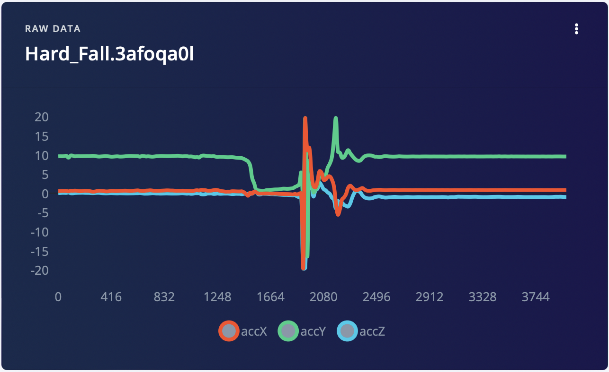

### 2. Clean The Unwanted Data

After we visualise the data we can determine whether the data is useful for model training. Remove unwanted data to create a clean dataset.

### 3. Split The Data
Once we have a clean dataset, split it into training and testing datasets. Here we split them up into two groups, in the ratio 80:20. If your data is not split, perform a test/train split either from **Data Acquisition Tab** or from **Dashboard**

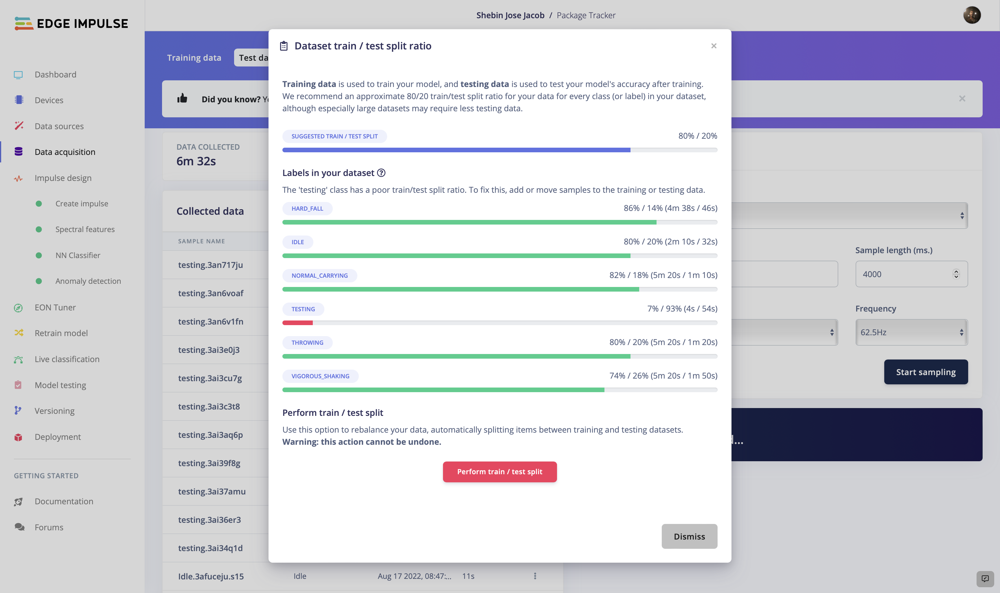

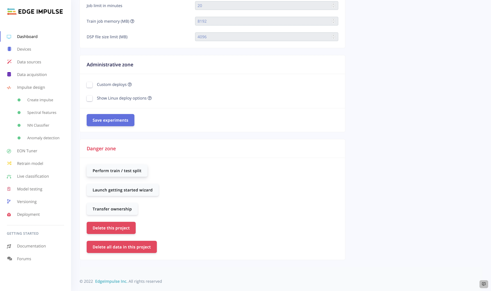

## 5. Impulse Design

By creating an Impulse in Edge Impulse, you're creating your own machine learning pipeline. Navigate to **Impulse design > Create Impulse**

An impulse contain 3 blocks : *input block, processing block and a learning block*. I have chosen **Time series data** as my input block, **Spectral Analysis** as the processing block, and **Classification (Keras)** as the learning block. You can add an anomaly block if you're interested in detecting anomalous motions, I'm just omitting it for now.


## 6. Feature Generation

Next, select **Save Impulse**, then navigate to the **Spectral Features** in the Impulse design panel by clicking on it. Once the parameters have been generated, wait a moment and then click **Save parameters**.


Now proceed to the **Generate features** tab and then click **Generate features**. When the process is finished, the feature explorer tab will allow you to view your dataset. This allows you to quickly verify whether your data is properly clustered or not.

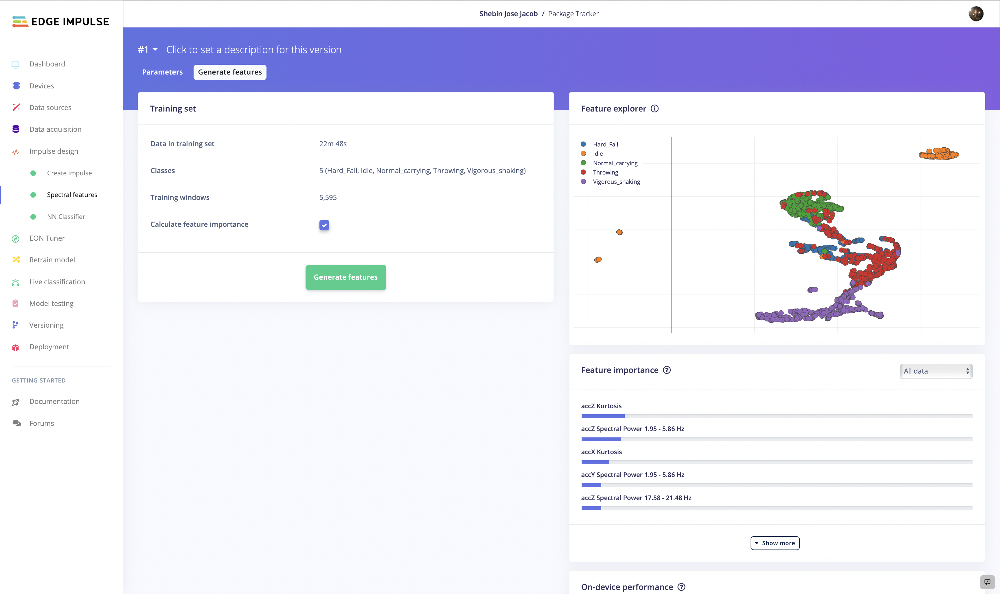

## 7. Model Training

Model training is the phase in which the neural network tries to fit the best combination of weights and biases to a machine learning algorithm to minimize a loss function.

In the **NN Classifier** tab, under the **Impulse Design** menu, we can configure various parameters that influence the training process of the neural network. I have changed the default values as shown in the image to attain better accuracy.

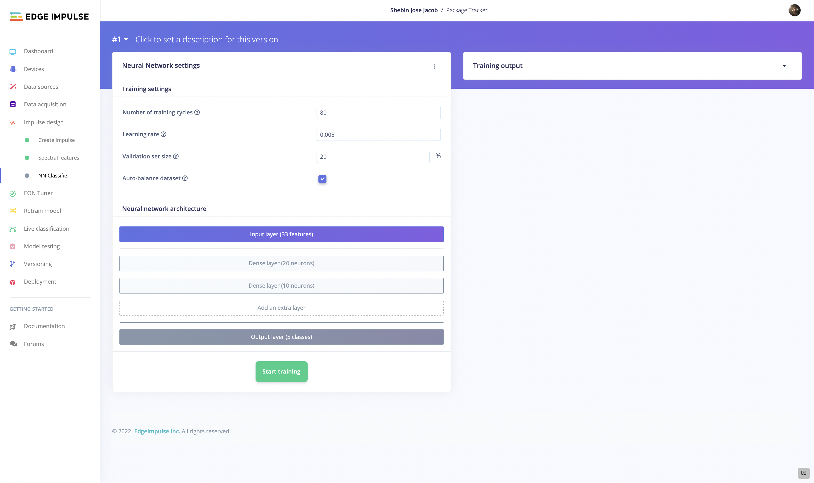

After finishing, you will see some training performance metrics, like Accuracy and Loss. Our trained model has an accuracy of 95.4%, which would suffice for our needs. 

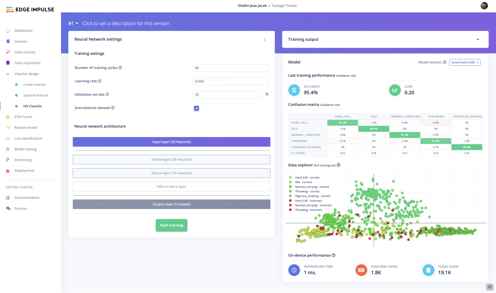

## 8. Model Testing

Once the model is trained, we can now test it to see how it performs with new data. Select **Classify All** under **Model Testing**. The model's performance on our testing data is displayed in the Model testing results tab. Our accuracy is 91.3%, which is still quite good. You can also look at the Confusion matrix to determine which labels are most susceptible to error. On the basis of this, you can expand the training dataset for these classes with additional items.

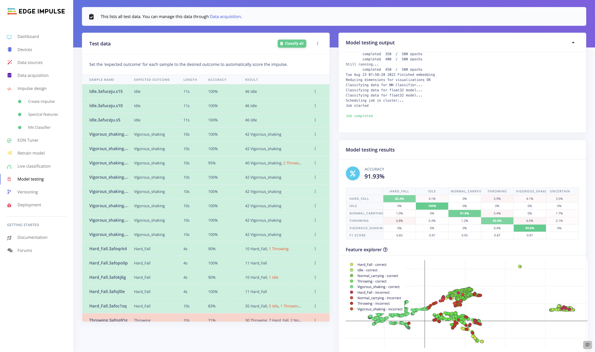

In addition to classifying the test data, we can head on to **Live Classification** to collect real-time data and classify it in real-time. This will ensure that the model is working flawlessly with real world data.

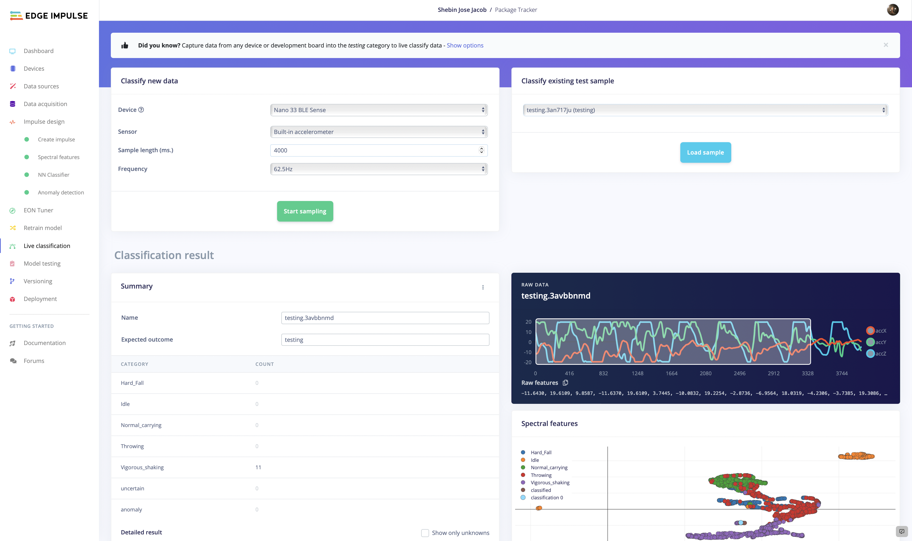

## 9. Deploying Model to the Device

Once the model is trained and tested, it's time to deploy it back to the device. For this, navigate to **Deployment > Build Firmware**. Select **Arduino Nano 33 BLE Sense** and **Build**. It will generate the model and download it to your computer as a Zip file. Add the downloaded Zip file in the Arduino libraries, and you are good to go.

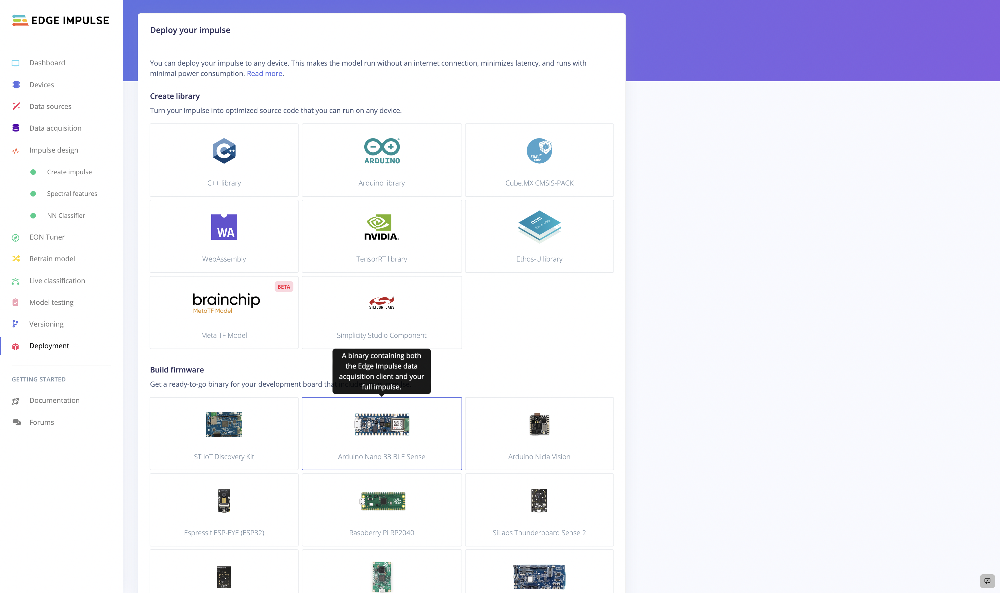

There are choices for choosing the NN classifier optimizations in Edge Impulse. We can improve device performance by choosing the best option. Edge Impulse will suggest the option that is optimal for our needs. We will achieve the same accuracy with less memory if we enable the Eon compiler.

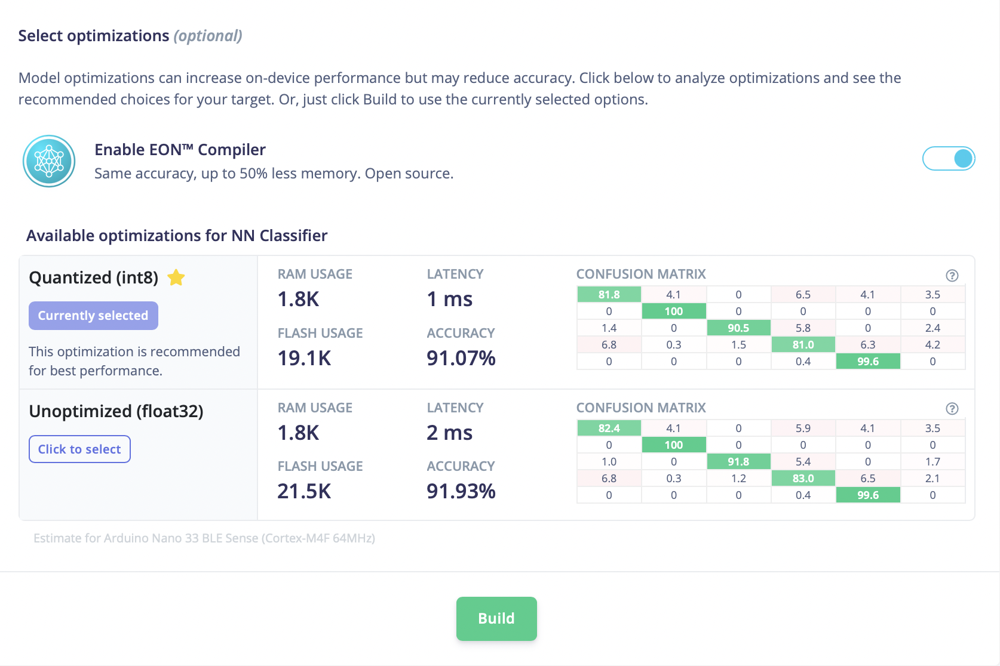

## 10. Firebase Realtime Database

Firebase is a platform for creating both mobile and online applications. Thanks to Firebase, developers may now concentrate on creating amazing user experiences. No Server management is necessary, no need to create APIs. Firebase is your server, API, and data storage, all of which are constructed in such a generic way that you can adapt them to the majority of demands. In our project, we are using Firebase real-time database to instantly post and retrieve data.

To find your Firebase Config:

* Go to Firebase
* Then go to Settings > Project Settings
* Under Your Apps > SDK Setup and Configuration > Config (Sample given below)
```
const firebaseConfig = {
  apiKey: "<apiKey>",
  authDomain: "<authDomain>",
  databaseURL: "<databaseURL>",
  projectId: "<projectID>",
  storageBucket: "<storageBucket>",
  messagingSenderId: "<ID>",
  appId: "<APP ID>"
};
```

## 11. Web Interface

The web interface is designed in such a way that it can reflect all the events updated in the Firebase database. The insecure handling events are updated in the Firebase directly from the Nano 33 BLE Sense and other shipping updates can be updated using an API.

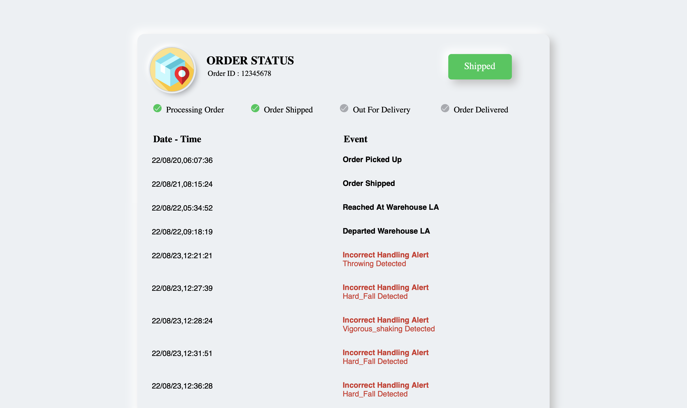

## Hardware   

The heart of the **Package Tracker** is an Arduino Nano 33 BLE Sense. We opted for this board due to its tiny form factor and its high capability. It comes with a series of embedded sensors and here we use the LSM9DS1 sensor which is a 9-axis inertial module. It comes with one extra hardware serial port which benefits here, to connect with the GSM module.


The power supply for the device is a 3.7V 18650 Li-ion cell with a current of 2000mah. 

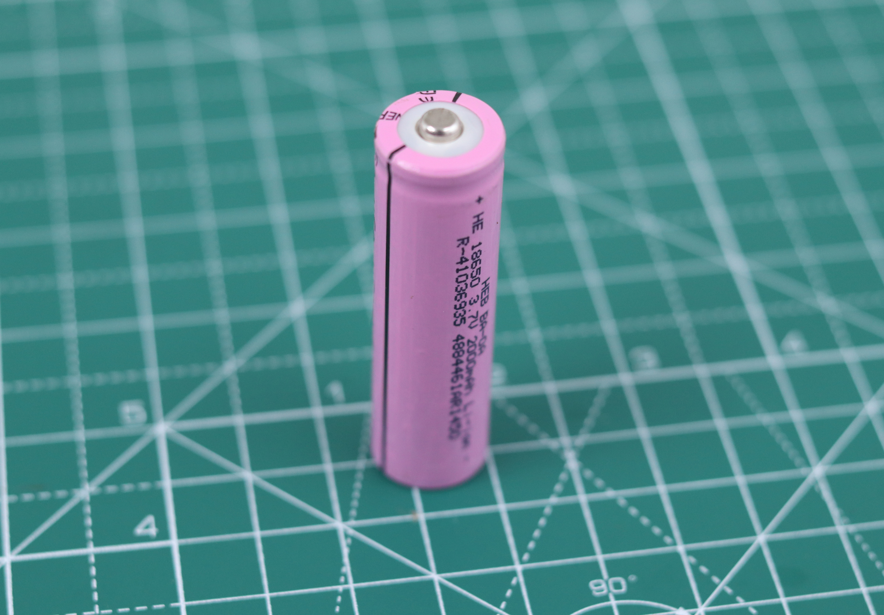

This cell can be charged via a micro-USB port. The charge controller used in this project is TP4056.

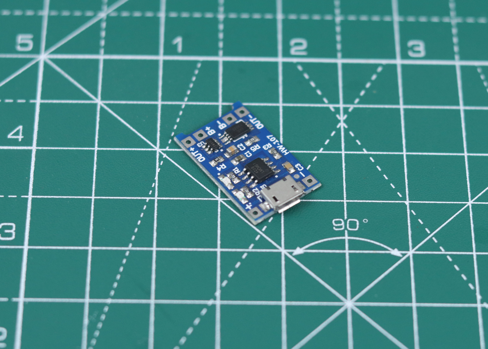

The power coming out of the TP4056 module is actually not enough for the **Vin** of Arduino . So we used this tiny boost converter module.


For sending the notification to Firebase we use a Sim800l GSM module. This module is from Simcom, and gives any microcontroller GSM functionality, meaning it can connect to the mobile network to receive calls and send and receive text messages, and also connect to the internet using GPRS, TCP, or IP. The communication between the Arduino and GSM module is serial.

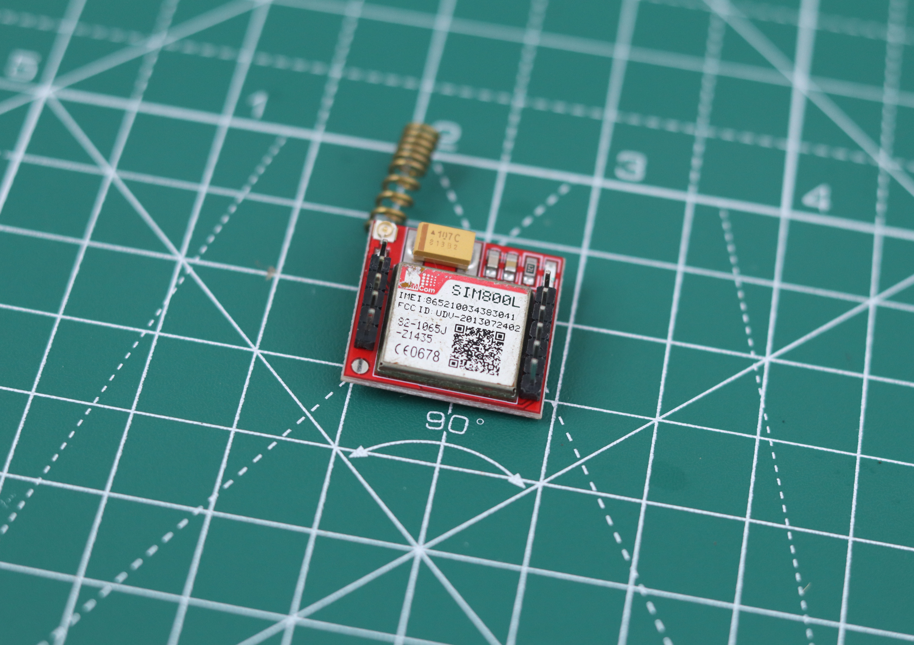

We designed and 3D printed these tiny case for securing all the hardware elements. This can be easily attached to any package using wiring ties.

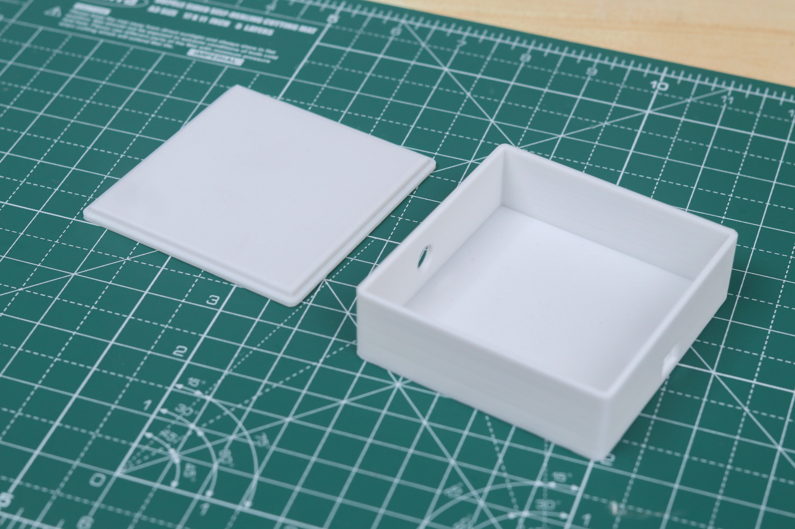

Then we secured all the elements one by one in the box and tied it to the package.


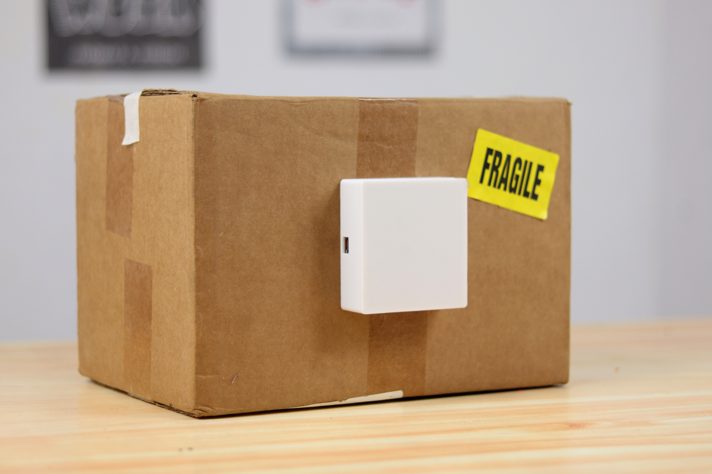


## Code

The entire code and assets are available at : [https://github.com/CodersCafeTech/Package-Tracker](https://github.com/CodersCafeTech/Package-Tracker)

## Summary

This project demonstrates a low-cost way to monitor a package through the shipment process, detecting 4 different classes of insecure handling.
