# Porting a Posture Detection for Worker Safety Project from the SiLabs Thunderboard Sense 2 to xG24 Dev Kit

Created By:
Salman Faris 

Public Project:
[https://studio.edgeimpulse.com/public/188507/latest](https://studio.edgeimpulse.com/public/188507/latest)

## Introduction

In this project I'm going to walkthough how to port an exisiting project developed on the SiLabs Thunderboard Sense 2, to SiLabs' newer and more powerful xG24 development board. 

The original project was developed by [Manivnnan Sivan](https://www.hackster.io/manivannan) to detect correct / incorrect posture of manufacturing workers using a wearable belt.

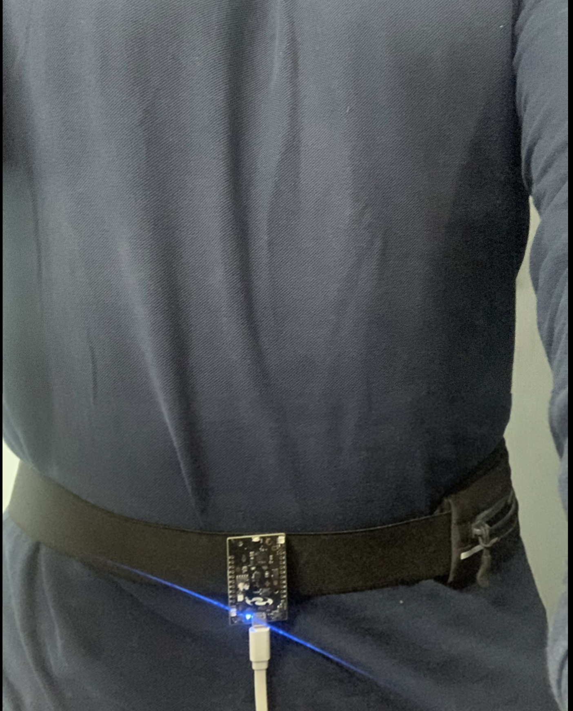

I will walk you through how you can clone his Public Edge Impulse project, deploy to a SiLabs Thunderboard Sense 2, test it out, and then build and deploy to the newer SiLabs xG24 device instead.

## About the project : Posture Detection for Worker Safety 

You can find more about the project here in the original project documentation, [Worker Safety Posture Detection](https://docs.edgeimpulse.com/experts/prototype-and-concept-projects/worker-safety-posture-detection). 

The project is intended to help workers in manufaturing. They work in conditions that can put a lot of stress on their bodies. Depending on the worker's role in the production process, they might experience issues related to cramped working conditions, heavy lifting, or repetitive stress.

Poor posture can cause problems for the health of those who work in manufacturing. Along with that, research suggests that making efforts to improve posture among manufacturing employees can lead to significant increases in production. Workers can improve their posture by physical therapy, or simply by being more mindful during their work day.

[Manivnnan Sivan](https://www.hackster.io/manivannan) has created a wearable device using a SiLabs Thunderboard Sense 2 which can be fitted to a worker's waist. The worker can do their normal activities, and the TinyML model running on the hardware will predict the posture and communicate to the worker through BLE communication. The worker can get notified in the Light Blue App on their phone or smartwatch.

## Running the Project on Thunderboard Sense 2

Before porting, we need to run the project on the existing platform to understand how it's run and familiarize ourselves with it's paramters. So let's get started.

### Installing Dependencies

Before you proceed further, there are few other software packages you need to install.

- Edge Impulse CLI - Follow [this link](https://docs.edgeimpulse.com/docs/edge-impulse-cli/cli-installation) to install necessary tooling to interact with the Edge Impulse Studio.
- LightBlue - This is a mobile application. Install from either Apple Store or Android / Google Play. This will be required to connect the board wirelessly over Bluetooth. The Android version can be found here: [https://play.google.com/store/apps/details?id=com.punchthrough.lightblueexplorer&hl=en_IN&gl=US&pli=1](https://play.google.com/store/apps/details?id=com.punchthrough.lightblueexplorer&hl=en_IN&gl=US&pli=1). Apple / iOS users can download the App here: [https://apps.apple.com/us/app/lightblue/id557428110](https://apps.apple.com/us/app/lightblue/id557428110).

### Clone the Project 

Go to the Edge Impulse project page using the [link here](https://studio.edgeimpulse.com/public/148375/latest), and clone it. 

Click **Clone** on the right corner buttton to create a copy of the project.
 
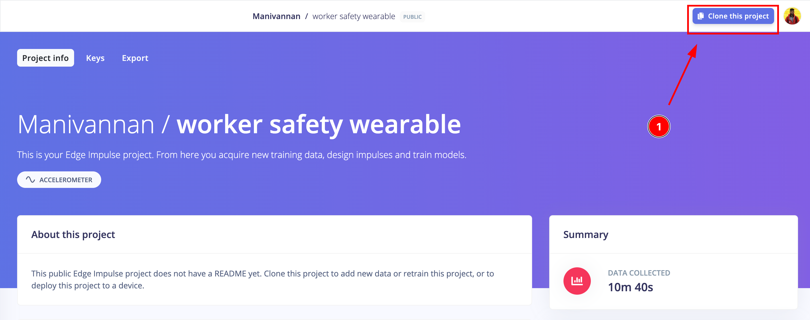

Provide a project name in the text field, and click on the **Clone project** button. 

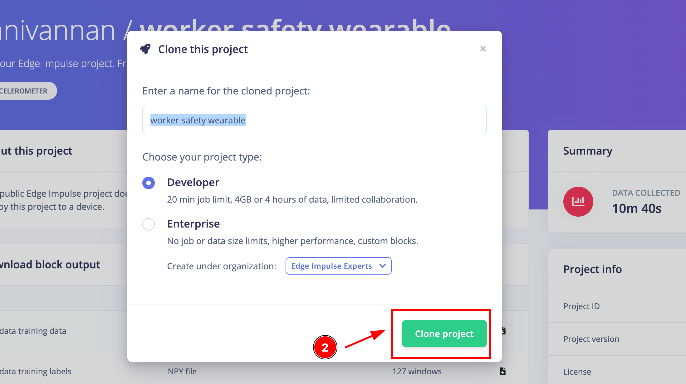

Done, the project is successfully cloned into your Edge Impulse account:

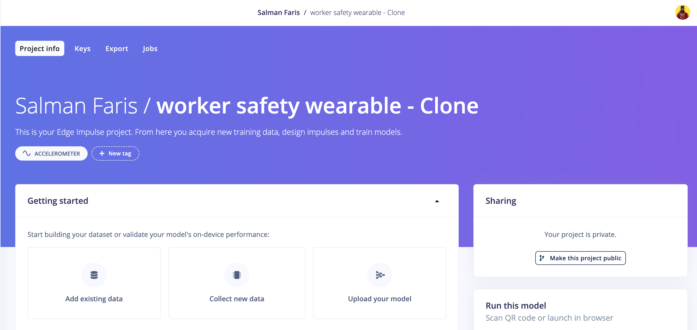

As we clone the project, it will be loaded with dataset collected by Manivnnan. 

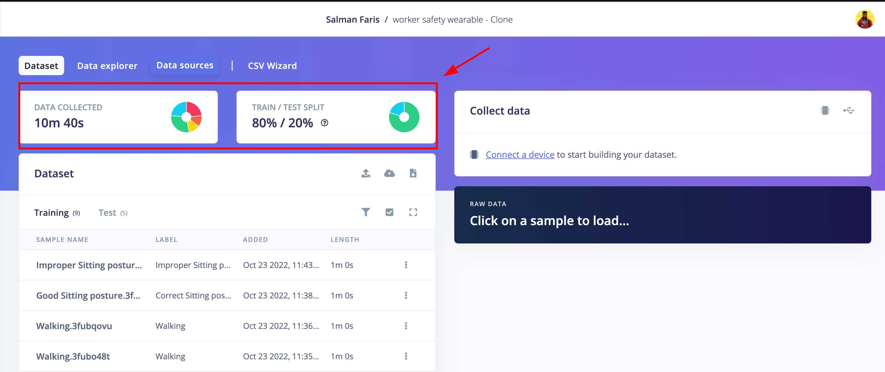

### Run the Project 

We can try to deploy the project on a Thunderboard Sense 2: 

1. **Connect the development board to your computer** : Use a micro-USB cable to connect the development board to your computer. The development board should mount as a USB mass-storage device (like a USB flash drive), with the name `TB004`. Make sure you can see this drive.

2. **Update the firmware** : The development board does not come with the right firmware yet. To update the firmware:
    
    2.1 [Download the latest Edge Impulse firmware.](https://cdn.edgeimpulse.com/firmware/silabs-thunderboard-sense2.bin)

    2.2 Drag the `silabs-thunderboard-sense2.bin` file to the TB004 drive.

    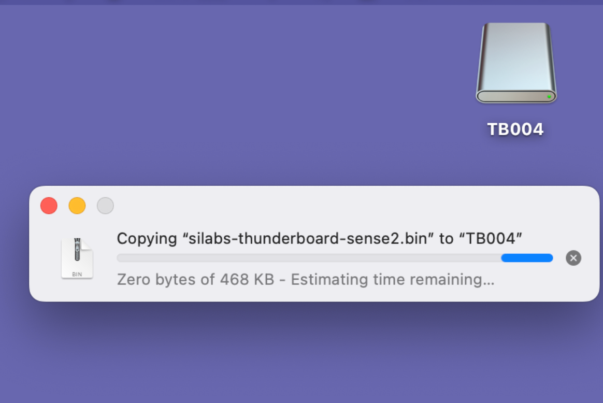
    
    2.3 Wait 30 seconds.

Next, open the CLI and run `edgeimpulse-daemon`

From here, Log in with your Edge Impulse credentials and choose the cloned project from the followed project list. 

Then provide a name for the device that is connected to the computer. 

After completing these steps, you will see that the device is connected to the Edge Impulse Studio via the CLI. 

### Build & Deploy the Project 

Choose "Deployment" from the left toolbar and then choose the target device as "SiLabs Thunderboard Sense 2", and click "Build" to start the process. 

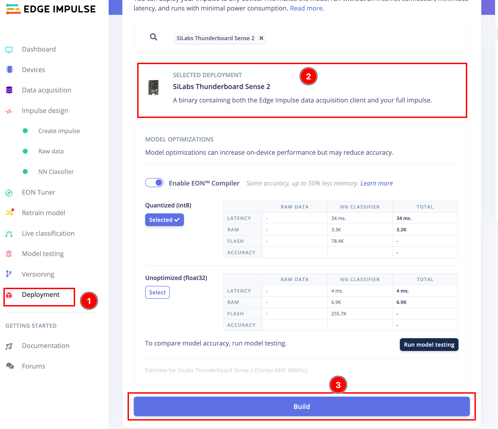

After the build completes, a `.bin` file will be automatically generated and downloaded. You need to drag and drop it to the Thunderboard Sense 2 device drive.

Done, we can now open the LightBlue mobile app to run and see the inference:

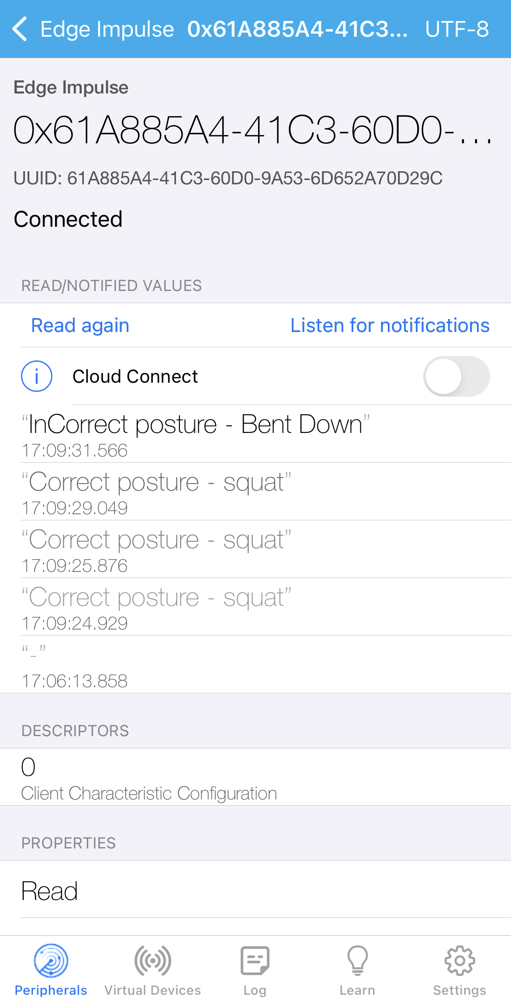

Alternativly you can run it on a computer, if you dont't have access to a phone. Run the command below to see if the tinyML model is inferencing. 

`edge-impulse-run-impulse`

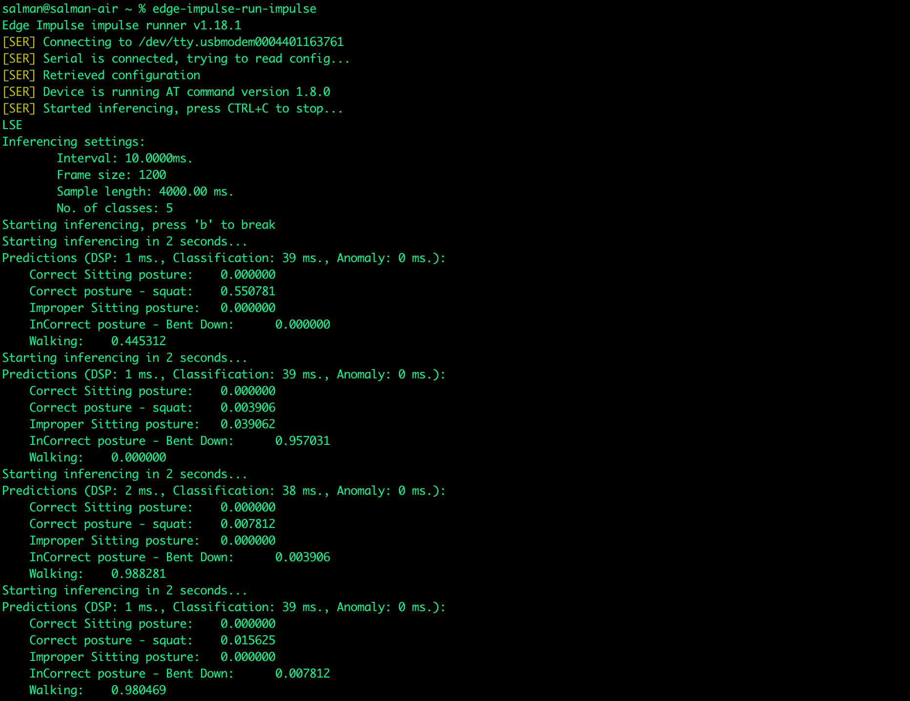

Nice, so far we cloned and implemented the project. Now we are going to port to the new board! 

## The New SiLabs EFR32MG24

SiLabs have launched the new EFR32MG24 also known as xG24 Wireless SoCs and they are full of interesting sensors and features making them very good for mesh IoT wireless connectivity using Matter, OpenThread, and Zigbee protocols for smart home, lighting, and building automation products or any other use case you see fit to this combination of sensors and connectivity.

The sensors present onboard are an accelerometer, a microphone, environmental sensors comprising temperature, humidity, and air pressure, a Hall sensor, an inertial and an interactional sensor. 

## Collect More Data Using the xG24

Compared to the Thunderboard Sense 2, the xG24 does have some changes while connecting to Edge Impulse and uploading the firmware. 

1. First - [Download the base firmware image](https://cdn.edgeimpulse.com/firmware/silabs-xg24.zip) - Download the latest Edge Impulse firmware, and unzip the file. Once downloaded, unzip it to obtain the firmware-xg24.hex file, which we will be using in the following steps.

2. **Connect the xG24 Dev Kit to your computer** - Use a micro-USB cable to connect the xG24 Dev Kit to your development computer, and download and install [Simplicity Commander](https://community.silabs.com/s/article/simplicity-commander).

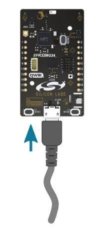

3. **Load the base firmware image with Simplicity Commander** - You can use [Simplicity Commander](https://community.silabs.com/s/article/simplicity-commander) to flash your xG24 Dev Kit with the Edge Impulse [base firmware image](https://cdn.edgeimpulse.com/firmware/silabs-xg24.zip). To do this, first select your board from the dropdown list on the top left corner:

Then go to the "Flash" section on the left sidebar, and select the base firmware image file you downloaded in the first step above (i.e., the file named `firmware-xg24.hex`). You can now press the Flash button to load the base firmware image onto the xG24 Dev Kit.

After this, we can follow the usual method on how we select the device in the Edge Impulse Studio via the CLI.

Next, open the CLI and run `edgeimpulse-daemon`

From here, log in with your Edge Impulse credentials and choose the cloned project from the project list that follows. 

Then provide a name for the device that is connected to the computer. 

After doing these steps, you can see the device is connected to the Edge Impulse Studio via the CLI. 

I collected a bit of additional data using the xG24, and it looks good. 

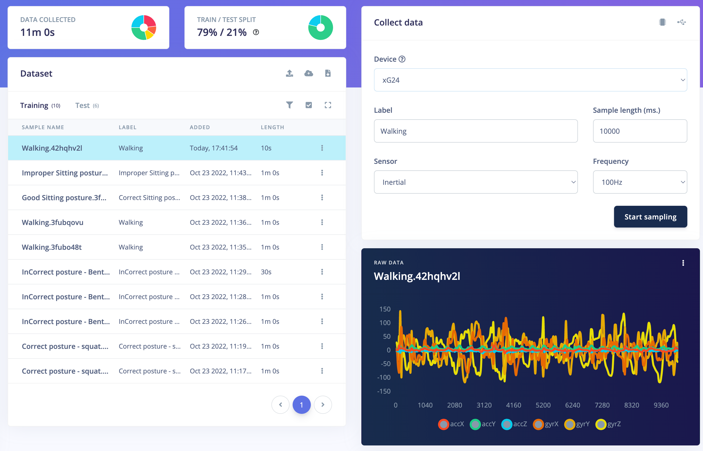

Now, we need to retrain the data set, but before that we need to set the target as **SiLabs EFR32MG24**. 

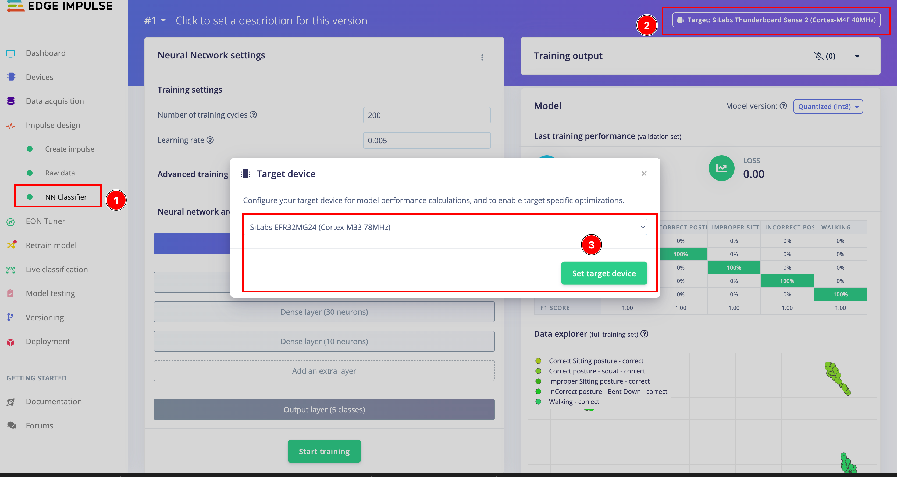

Great, we got nice accuracy in model training. 

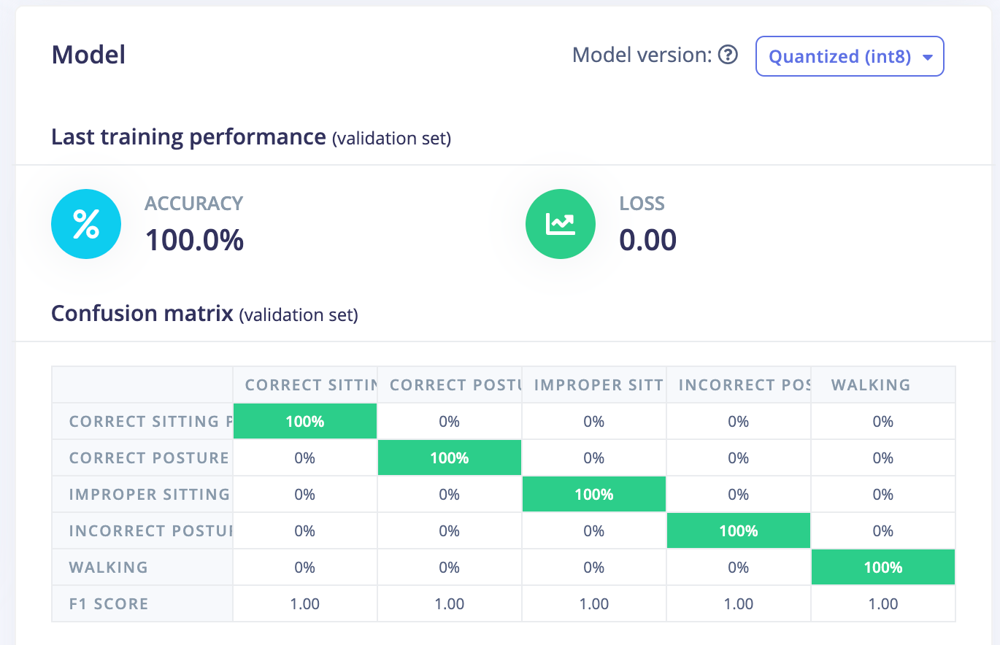

Now, we can build the model and deploy to the xG24. For the build, we need to choose the correct device first, then click "Build". 

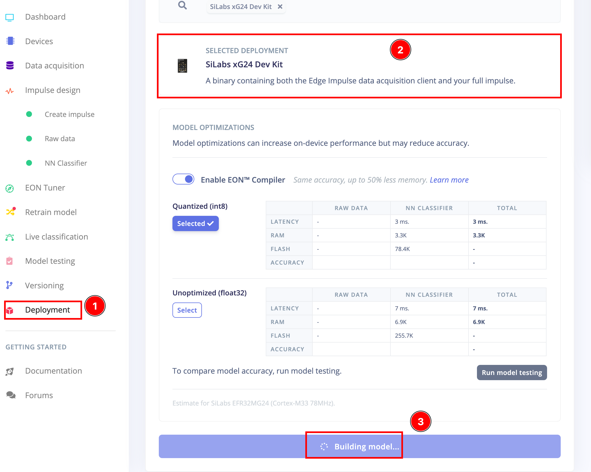

After genrating the `.bin` file, we need to use [Simplicity Commander](https://community.silabs.com/s/article/simplicity-commander) to flash your xG24 Dev Kit with this firmware. To do this, first select your board from the dropdown list on the top left corner:

Then go to the "Flash" section on the left sidebar, and select the generated firmware image file you downloaded after the build process. You can now press the Flash button to load the generated .hex file firmware image onto the xG24 Dev Kit.

Next, we can use the LightBlue mobile app to run and see the inference. 

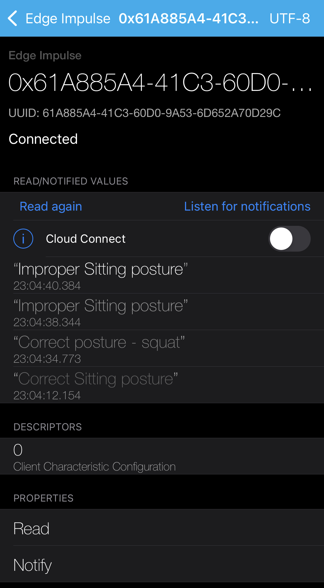

Alternatively, we can run on computer as we did for the Thunderboard Sense 2, if you dont't have access to a phone. Run the command below to see if the tinyML model is inferencing. 

`edge-impulse-run-impulse`

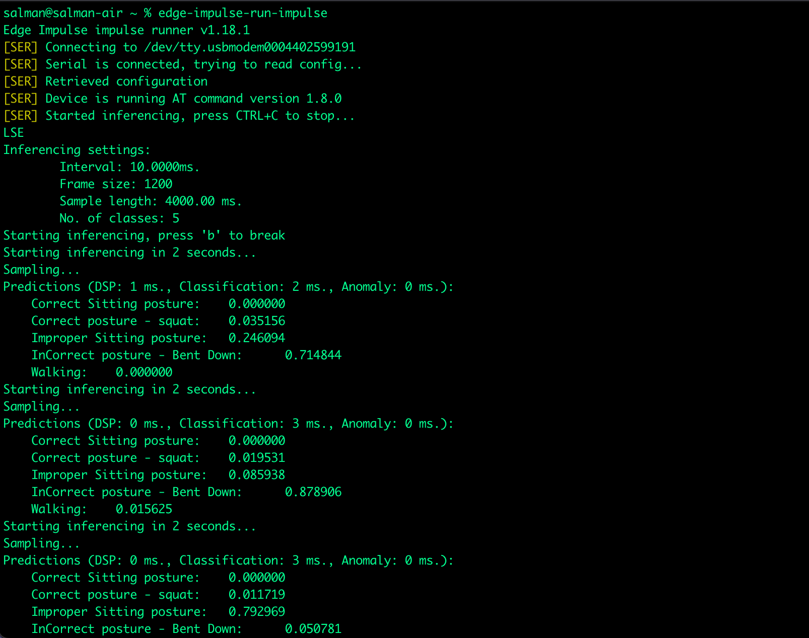

Awesome, we have now sucessfully ported a project from Thunderboard Sense 2 to the xG24 Dev Kit! 

## Conclusion

We can see here, the xG24 does a faster classfication of these tinyML datasets without compromising the accuracy. 

Here you can see the comparison data, and we can see **91.1765%** increased inferencing speed in the NN Classfier, while the RAM and Flash usage are the same. 

Similar results are acheived in the field data when we are inferencing the live data stream. Here we can see a 92.3077% increase in speed in the classification, which is more than what was calculated in the model optimization. 

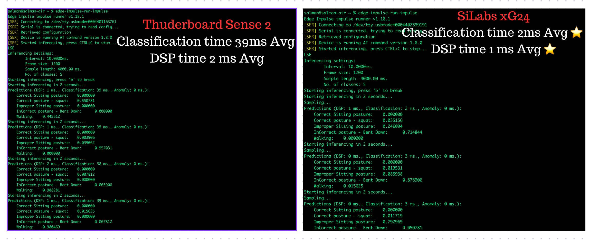

To conclude the porting project post, we can confirm that it's worth to upgrade products and projects using the Thunderboard Sense 2 to the new and efficient SiLabs xG24 Dev Kit. 

