# Smart Baby Swing Rocker 

Created By:
Manivannan Sivan 

Public Project Link:
[https://studio.edgeimpulse.com/public/134216/latest](https://studio.edgeimpulse.com/public/134216/latest)

## Project Demo



## Problem Statement

On a typical baby swing rocker only a manual ON/OFF switch, or a swing timer option function can be chosen.  But when a baby starts to cry in the middle of the night, the baby swing rocker is normally in the "Off" position, so it cannot calm the baby.

## TinyML Solution

I have automated the baby swing movement with a TinyML model.  An Arduino is running audio inferencing and will classify the baby crying sound from room noise and activate the baby swing rocker motor, so that it can calm the baby and help them fall asleep again.

## Overview

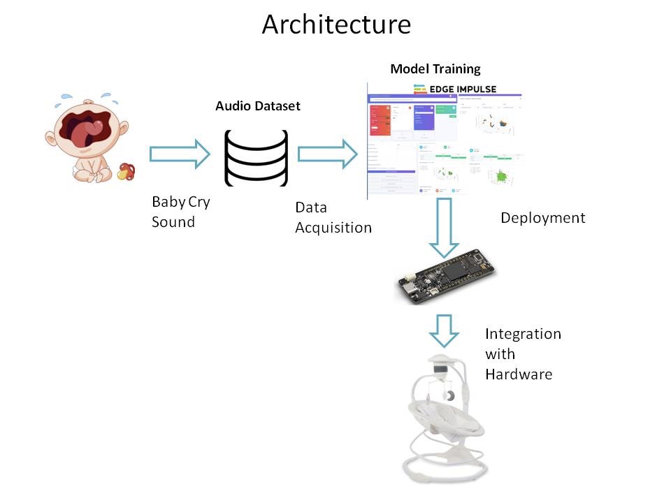

The above block diagram explains the overall architecture of the project.  The TinyML model is trained in Edge Impulse, and then deployed back to an Arduino Portenta H7.

I have collected baby crying sounds and background room noise for TinyML model training, trained the model with enough data to provide good accuracy, and finally integrated the system with the swing hardware.

## Hardware Required

 - Arduino Portenta H7
 - Portenta Vision Shield
 - Baby swing rocker

## Data Acquisition

For data acquisition, I have collected real baby crying sounds and room noise. I have used an Arduino Portenta H7 with the Vision Shield to collect audio samples.  The Arduino Portenta Vision Shield is used because it contains two MP34DT05 microphones which run on 16 MHz.

For initial setup of the Portenta, follow the steps [mentioned in this link](https://docs.edgeimpulse.com/docs/development-platforms/officially-supported-mcu-targets/arduino-portenta-h7)

Once the Portenta firmware is flashed to the Arduino Portenta H7 hardware, then open the command window in your system and run the below command:

`edge-impulse-daemon`

The Portenta is now connected to Edge Impulse. I have collected a dataset of real baby crying sounds and some normal room noise.

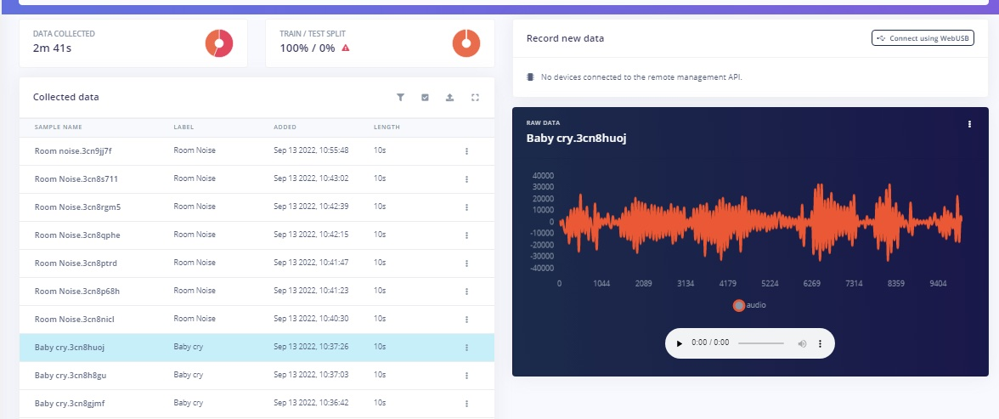

I have collected a datasets of around 2 mins and 41 seconds. This dataset is used for the model training.

## Create Impulse

Inside your Edge Impulse account, in the *Create Impulse* section, the Window Sampling is selected as 2500ms and Window Increase is set as 500ms. I have configured spectrogram as a Preprocessing block.

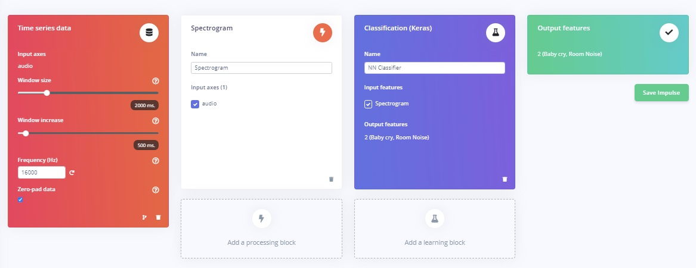

## Neural Network Training

I have used a sequential neural network layer. The input data in 2 Dimensions is reshaped into 1 Dimension using a reshape layer. Then a 1 Dimensional convolution layer with Max pooling is used.

### 1D Convolution Layer

The below diagram demonstrates the 1D convolution layer and max pooling filtering.

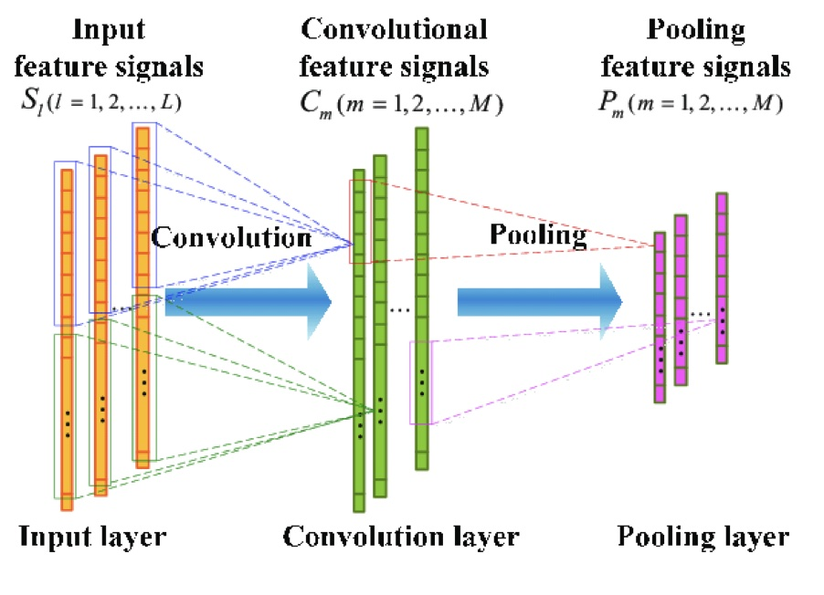

### Max Pooling

The 1D max pooling block moves a pool (window) of a set size over the incoming data with a set stride, computing the maximum in each specific window. The below diagram demonstrates the max pooling technique in 1D input data.

In our network, the max pooling is configured as `MaxPooling1D(pool_size=2, strides=2, padding='same')`. This means the pool size is 2, where it takes 2 indices values and outputs the maximum value in that. And the stride length is 2, so it moves the pool layer twice in one direction.

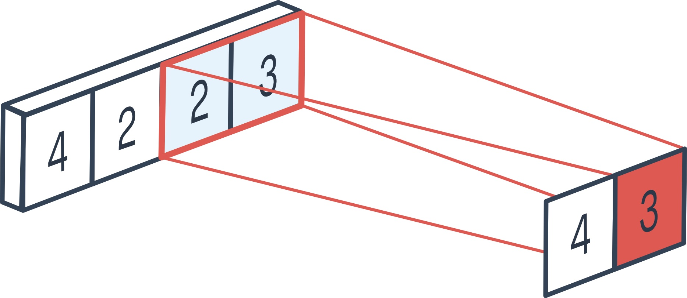

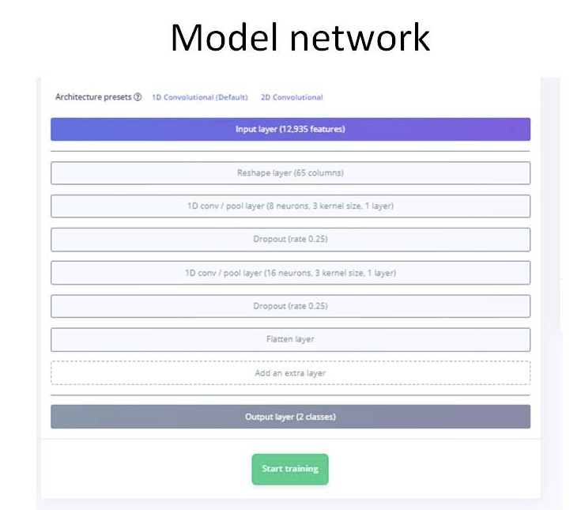

I have configured the training cycles as 100 with a learning rate of 0.005, and achieved good accuracy.

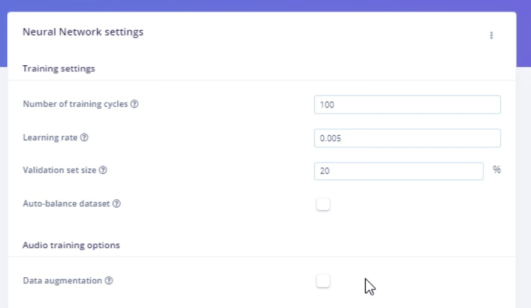

## Results

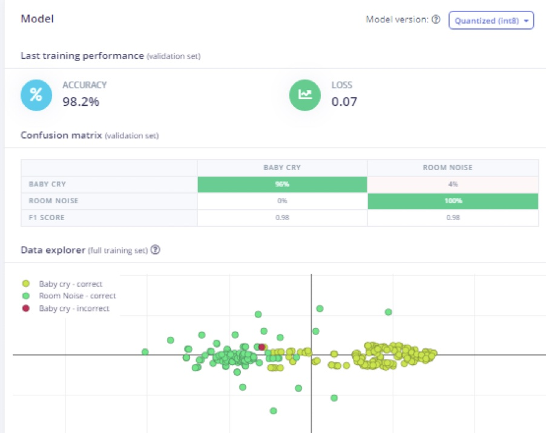

Upon completion of training, we can see that we have achieved 98.2% accuracy.

## Model Testing

After the model is trained with good accuracy, I have tested with new data. I have used two datasets for each category (baby cry and room noise) for testing. In testing with unseen data, the model achieved 100% accuracy.

Then next step is deployment to the hardware.

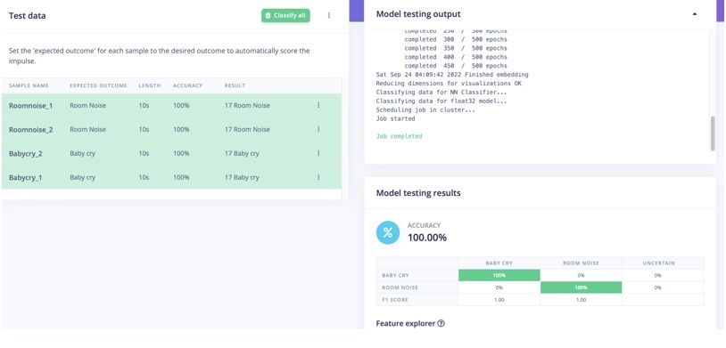

## Deployment

Once the testing is complete, go to the "Deployment" option and select *Build firmware* -> *Arduino Portenta H7* to create a downloadable firmware to flash to the board. I have chosen Quantized (Int8). In Edge Impulse, there is also an option to use the EON compiler for reducing resources and improving accuracy, as well as lower latency.

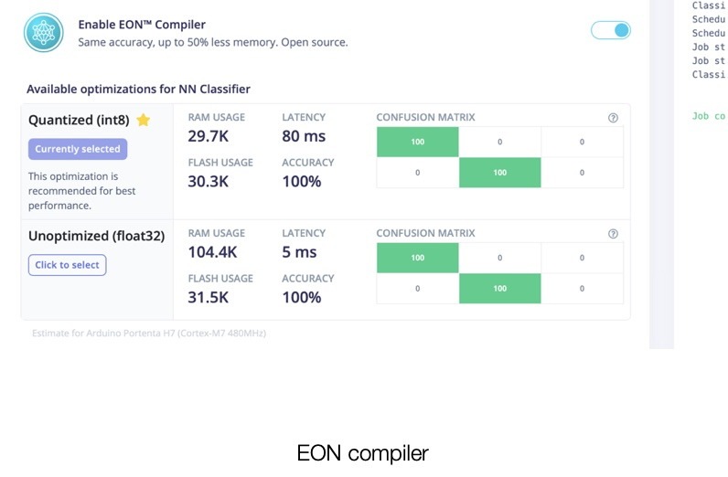

Once the build process is completed, the firmware will be packaged in a Zip file and downloaded.

Press the Reset button on the Portenta H7 twice to set it to "Flash mode" and then open the .bat file (if your are using Windows) or run the Mac version if that is your platform, to flash the firmware.

Once the flash is completed, open a new terminal window and run the below command to start inference on the device:
`edge-impulse-run-impulse`

The above step will tell us whether the model is able to run smoothly on real hardware. After this step, now comes the real challenge!  We need to integrate the Portenta H7 into the baby swing rocker!

For this, we need to deploy this model as source code and add our application on top of it.

So, we click the *Create Library* section in the Studio and select *Arduino*, then download the source code.

Open the Arduino IDE and select *Sketch -> Include library* and *Add .Zip Library*. Then select the downloaded Zip file on your machine.

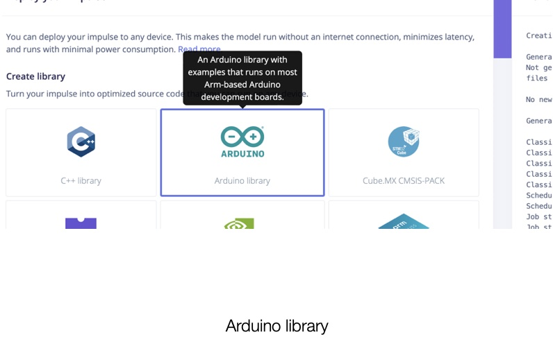

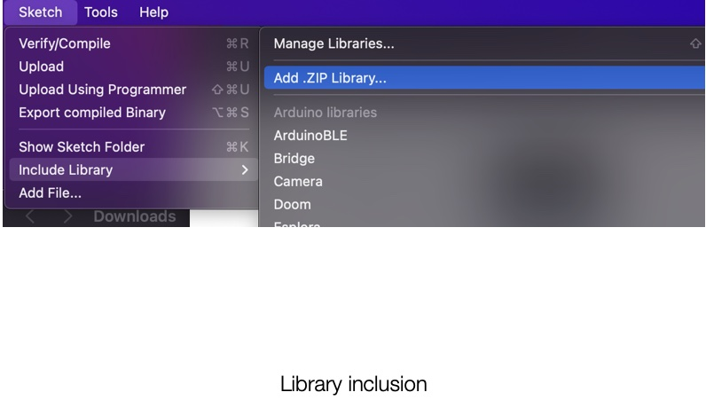

After including the Library, go to *Examples* and select `portent_h7_microphone_continuous` I have written the application code on top of the default code in the example.

## Application Layer Integration

In the application code, I wrote the logic to activate a relay which is connected to the motor in the baby swing rocker. The below flowchart explains the logic of the application code.

Also, I have added my application code in below GitHub link, which you can directly copy and paste into your Arduino IDE.

> `https://github.com/Manivannan-maker/smartbabyswingrocker`

The application code will activate the baby swing rocker for 20 seconds, whenever it detects the baby crying sound.

## Hardware Integration

The Arduino Portenta is connected to the 5v DC Relay module. The Common pin in the relay is connected to the Gnd of the battery and NO pin in the relay is connected to the Gnd of the motor in the baby swing rocker whereas the Vcc of the motor is connected directly to the Battery positve terminal.

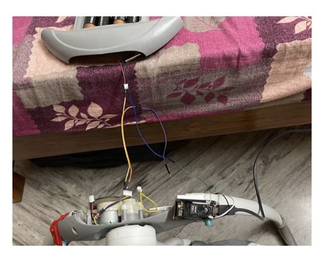

## Summary

After the wiring is complete, you can test it in real time. I have played the baby crying sound on my phone and after few seconds, the baby swing rocker started to swing. The YouTube video embedded above demonstrates the working demo of this prototype.

