# Snoring Detection on a Smart Phone 

Created By:
Wamiq Raza 

Public Project Link:
[https://studio.edgeimpulse.com/public/109559/latest](https://studio.edgeimpulse.com/public/109559/latest)

## Story

Snoring, a type of sleep disordered breathing, disrupts sleep quality and quantity for both the snorer and, frequently, the person who sleeps with the snorer. Snoring-related sleep deprivation can cause serious physical, emotional, and financial difficulties. Snoring not only disrupts the snorer's sleep, but it can also causes anger between spouses! About 40% of adult males and 24% of adult women snore on a regular basis. Snoring begins when the muscles around the throat relax during sleeping. This narrows the airway, causing vibrations that result in snoring. Snoring is more common when a person sleeps on their back. Sleeping on your side is a natural remedy for snoring. Sleeping on your side rather than your back is a simple and natural treatment for snoring. In this project, a deep learning model for snoring detection is designed to be implemented on a smart phone using the edge Impulse API, and the model may be put on other embedded systems to detect snoring automatically. A smart phone is linked to the listener module by home Wi-Fi or mobile data to log snoring incidents with timestamps, and the data may be shared to a physician for treatment and monitoring of disorders such as sleep apnea.

### Getting started

This tutorial has the following requirements:

* Basic understanding of software development
* Edge Impulse account 
* Android or iOS mobile phone

We will use Edge Impulse, an online development platform for machine learning on edge devices. [Create a free account by signing up here](https://studio.edgeimpulse.com/). Log into your account and give your new project a name by clicking on the title. To run current project, you can directly clone it make your own copy and start executing.

## Data Acquisition

This project used a dataset of 1000 sound samples which is divided into two categories: snoring noises and non-snoring sounds. There are 500 examples in each class, the snoring noises were gathered from several web sources and non-snoring sound were gathered from similar web sources. The files were then separated into equal sized one second duration files after silences were removed from them. As a result, each sample lasts one second. Among the snoring samples, 363 samples consist of snoring sounds of children, adult men and adult women without any background sound [1]. The remaining samples having a background of non-snoring sounds. The 500 non-snoring samples consist of background sounds that are ten categories such as baby crying, the clock ticking, the door opened and closed, total silence and the minor sound of the vibration motor of the gadget, toilet flashing, siren of emergency vehicle, rain and thunderstorm, streetcar sounds, people talking, and background television news. Figure 1 and Figure 2 illustrate the frequency of snoring and non-snoring sound respectively. The dataset can be downloaded from [2].

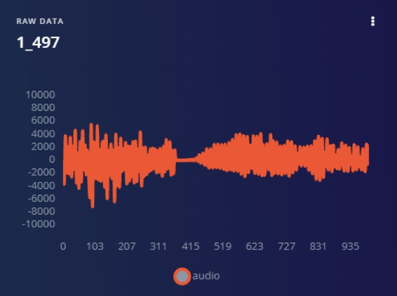

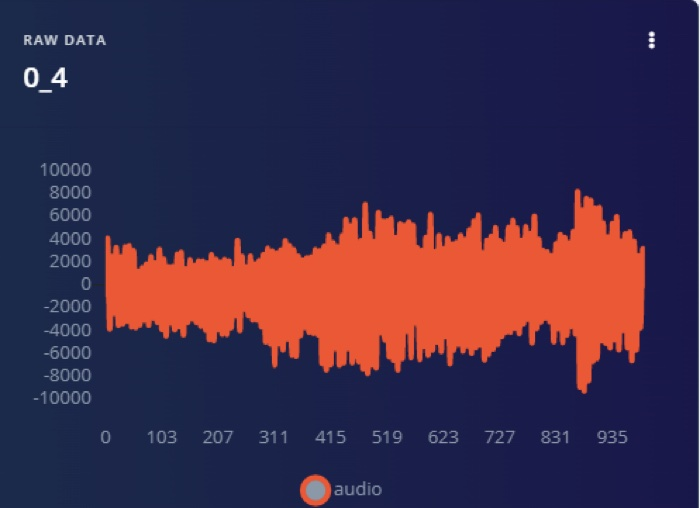

Once the dataset is ready you can upload it into Edge Impulse. Figure 3, represent the Edge Impulse platform how to upload the data if you don’t want to download or uploading refer to section **Getting started** for cloning current project.

## Creating Your Impulse

Next, we will select signal processing and machine learning blocks, on the **Create impulse** page. The impulse will start out blank, with Raw data and Output feature blocks. Leave the default settings of a 1000 ms Window size and 1000 ms Window increase as shown in Figure 4. This means our audio data will be processed 1 s at a time, starting each 1 s. Using a small window saves memory on the embedded device.

Click on ‘Add a processing block’ and select the **Audio (MFE)** block. Next click on ‘Add a learning block’ and select the **Neural Network (Keras)** block. Click on ‘Save Impulse’ illustrated in Figure 5. The audio block will extract a spectrogram for each window of audio, and the neural network block will be trained to classify the spectrogram as either a ‘snoring or ‘no snoring based on our training dataset. Your resulting impulse will look like this:

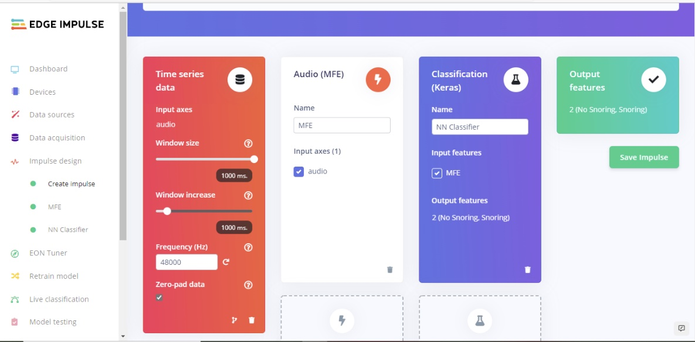

Next step will generate features from the training dataset on the MFE page shown in Figure 6. This page shows what the extracted spectrogram looks like for each 1 second window from any of the dataset samples. We can leave the parameters to their defaults.

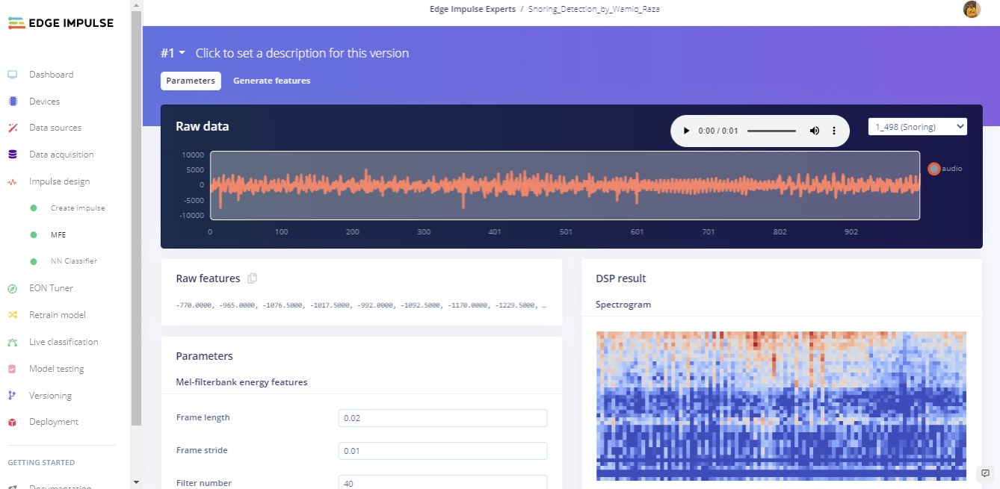

Next click on the ‘Generate features’ button, which then processes the entire training dataset with this processing block. This creates the complete set of features that will be used to train our Neural Network in the next step. Press the ‘Generate features’ button to start the processing, this will take a couple minutes to complete, and the result of the generated features can be seen in Figure 7.

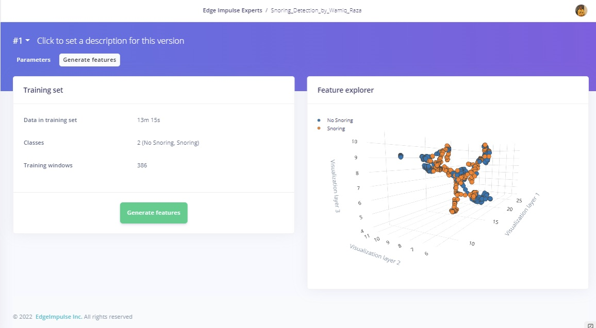

We can now proceed to setup and train our neural network on the NN Classifier page. The default neural network works well for continuous sound. Snoring detection is more complicated, so we will configure a richer network using 2D convolution across the spectrogram of each window. 2D convolution processes the audio spectrogram in a similar way to image classification. Refer to NN classifier section in my project for the architecture structure.

## Model Training and Results

To train the model the number of epochs was set to 100, the leaning rate assigned after serval trail is 0.005 the overall dataset was split into 80% training and 20% validation set. The number of epochs is the number of times the entire dataset is passed through the neural network during training. There is no ideal number for this, and it depends on the data. In Figure 8 we can see the feature explorer for correct and incorrect classification of both classes.

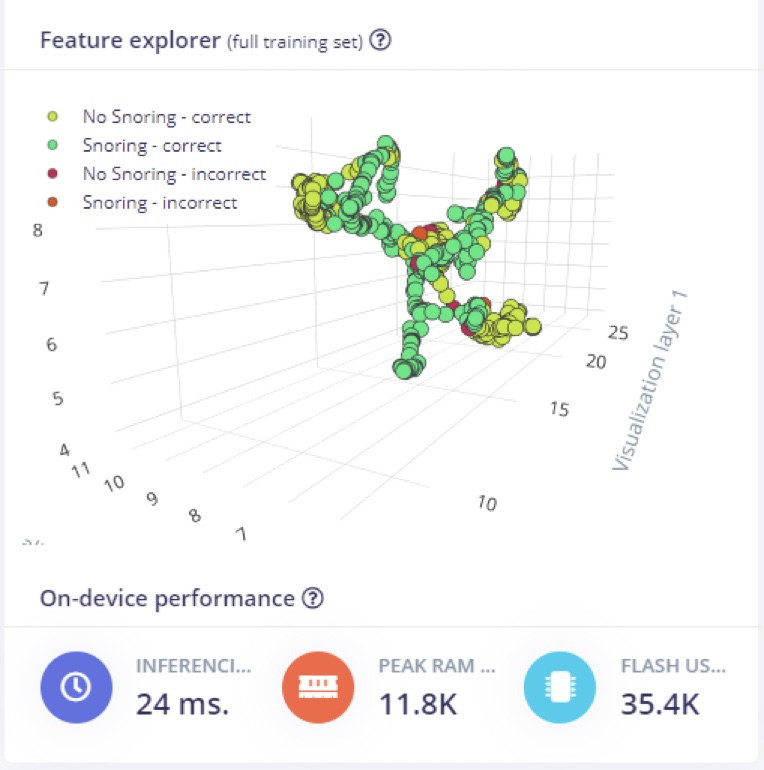

The model confusion matrix and on mobile device performance can be seen in Figure 9. The overall accuracy of quantized int8 model is 94.3% with 93.5% no snoring and 95.1% snoring correct classification and the rest are misclassified.

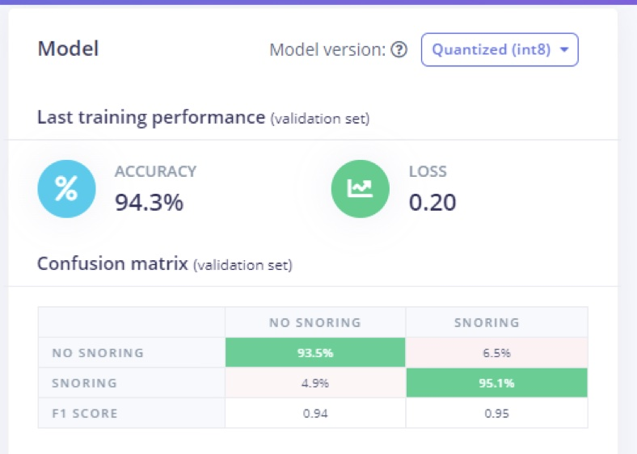

After the training model we run the model for testing purpose it gives the accuracy of 97.42% on test data as presented in Figure 10 along with feature exploration.

## Live Classification

The Live classification page allows us to test the algorithm both with the existing testing data that came with the dataset, or by streaming audio data from your mobile phone or on any microcontroller with having audio data processing compatibility. We can start with a simple test by choosing any of the test samples and pressing ‘Load sample’. This will classify the test sample and show the results: in Figure 11 and 12 respectively for both class with their probability score. We can also test the algorithm with live data. Start with your mobile phone by refreshing the browser page on your phone. Then select your device in the ‘Classify new data’ section and press ‘Start sampling’ as shown in Figure 15.

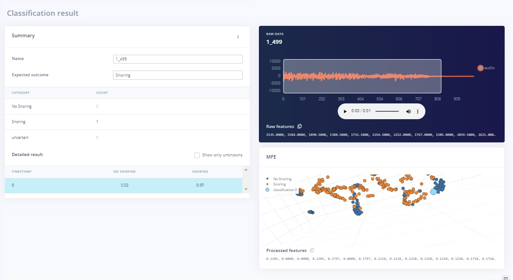

## Deployment

In order to deploy model on smartphone go to the browser window on your phone and refresh, then press the ‘Switch to classification mode’ button as shown in Figure13. This will automatically build the project into a Web Assembly package and execute it on your phone continuously (no cloud required after that, even go to airplane mode!). Once you scan the QR code on you mobile it will ask you to access the microphone as in this project we are using audio data Figure 14 represent it. After the access we can do see the classification results.

Furthermore, if you would like to extent the project you can run on different microcontrollers for this project aim was to provide the insight of TinyML development on smartphone.

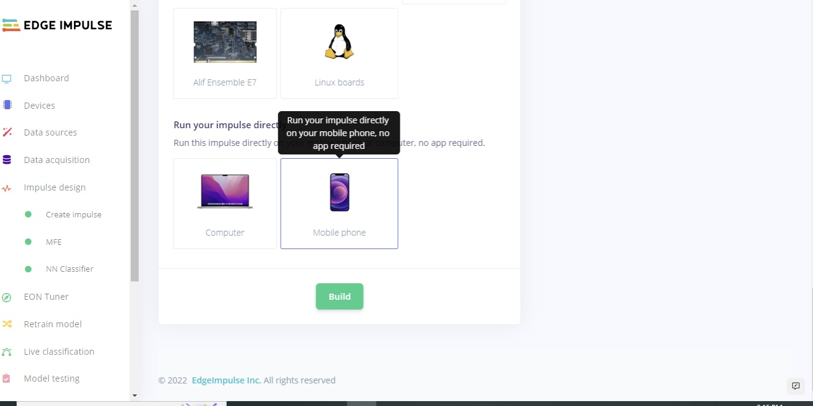

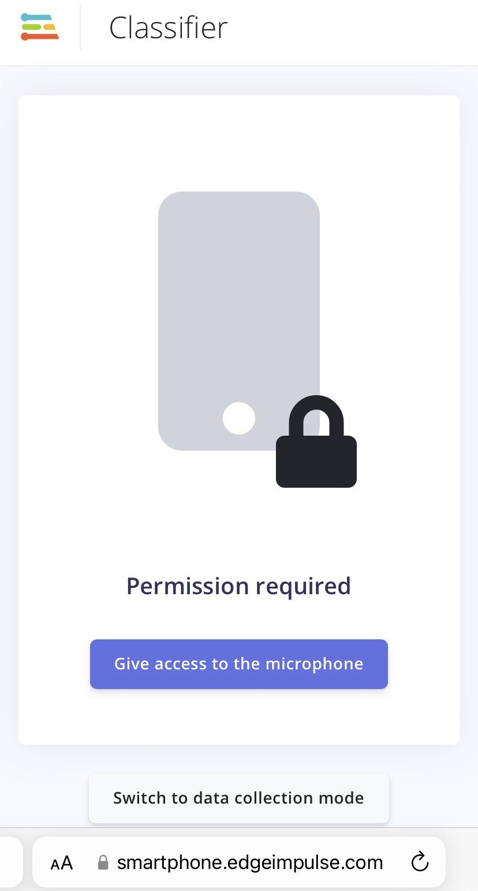

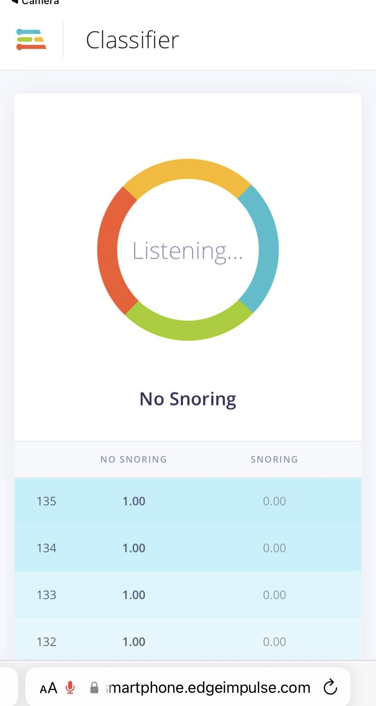

## Conclusion

This project provides the insight of TinyML deployment on smartphone. In this project, a deep learning model for snoring detection is trained, validated, and tested. A prototype system comprising of a listener module for snoring detection, a low power was demonstrated. For the future work extend the default dataset with your own data and background sounds, remember to retrain periodically and test. You can set up unit tests under the Testing page to ensure that the model is still working as it is extended.

## References

1. T. H. Khan, "A deep learning model for snoring detection and vibration notification using a smart wearable gadget," Electronics, vol. 8, no. 9, article. 987, ISSN 2079-9292, 2019
1. Khan, T. A Deep Learning Model for Snoring Detection and Vibration Notification Using a Smart Wearable Gadget. Electronics 2019, 8, 987. https://doi.org/10.3390/electronics8090987

