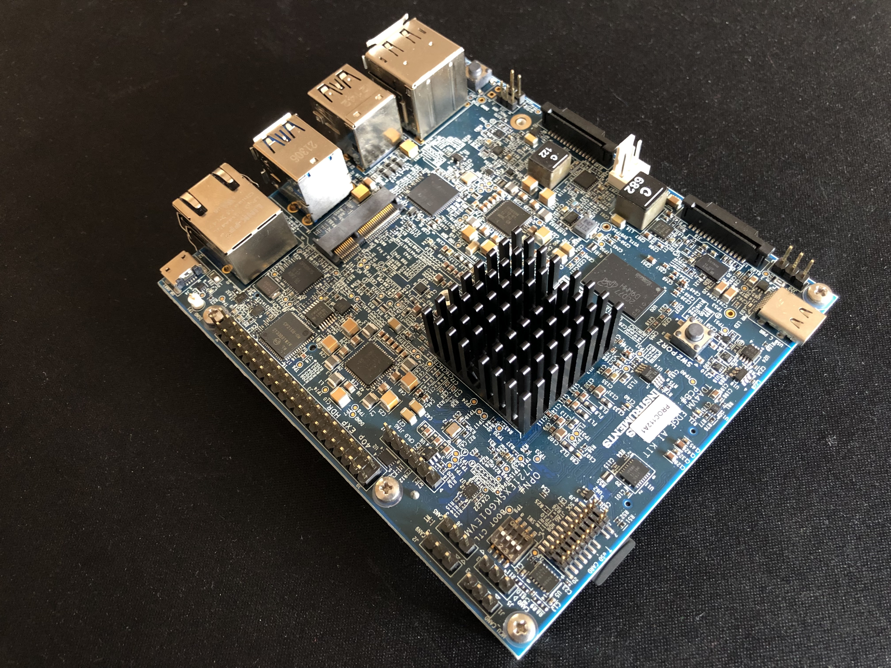
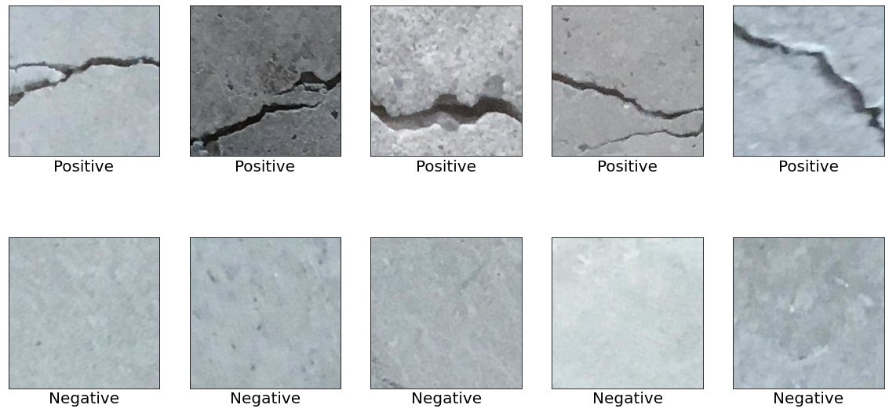
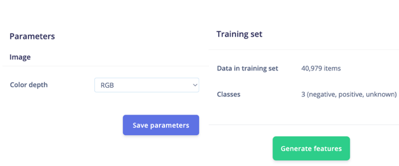
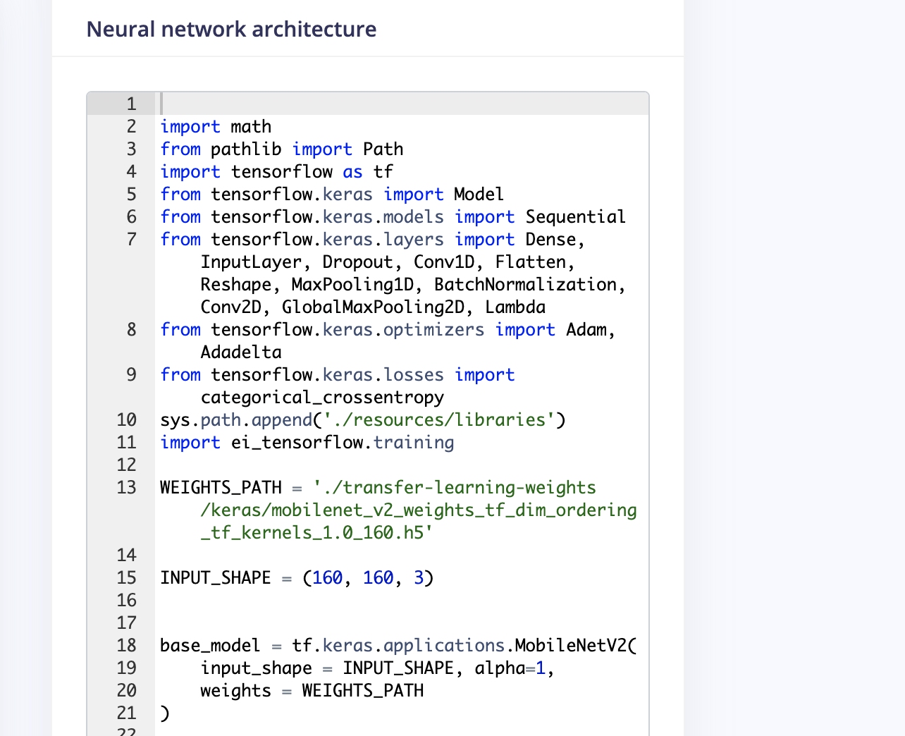
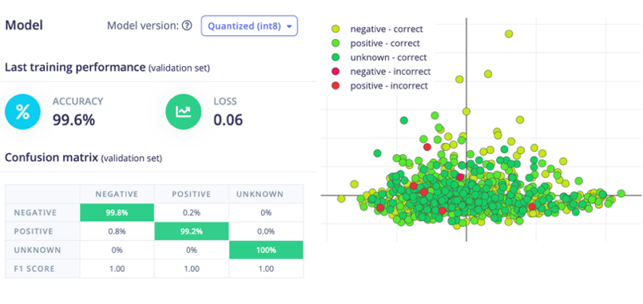
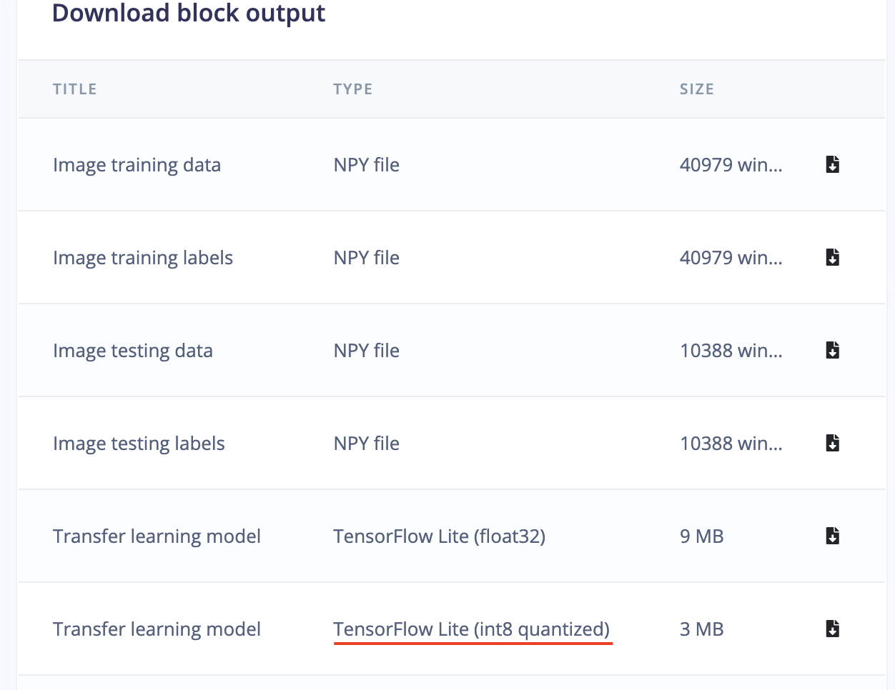

# Surface Crack Detection and Localization using Texas Instruments TDA4VM

Created By:
Naveen Kumar 

Public Project Link:
[https://studio.edgeimpulse.com/public/119583/latest](https://studio.edgeimpulse.com/public/119583/latest)

## Project Demo



## Overview


A 50-year-old bridge collapsed in Pittsburgh (Pennsylvania) on January 28, 2022. There is only one reason why a sturdy structure such as a concrete bridge could suddenly collapse: wear and tear.


Concrete structures generally start deteriorating after about 40 to 50 years. For this reason, overlooking signs of wear can result in severe accidents, which is why the inspection and repair of concrete structures are crucial for safeguarding our way of life. Cracks are one of the important criteria used for diagnosing the deterioration of concrete structures. Typically, a specialist would inspect such structures by checking for cracks visually, sketching the results of the inspection, and then preparing inspection data based on their findings. An inspection method like this is not only very time-consuming and costly but it also cannot accurately detect cracks. I built a surface crack detection application using machine learning in this project. A pre-trained image classification model is fine-tuned using the Transfer Learning with the [Edge Impulse Studio](https://studio.edgeimpulse.com/) and deployed to the [Texas Instruments SK-TDA4VM Evaluation board](https://www.ti.com/tool/SK-TDA4VM) which detects surface cracks in real-time and also localizes them.

## Why localization?

Why do we want to localize the detection using an image classification model? Can't we use the object detection model? Yes, we can use the object detection model but we would need to add bounding boxes to thousands of samples manually. Existing object detection models may not be a good choice to auto-annotate these cracks since they are trained on definite shape objects. Repurposing the classification model for localizing the detection saves a lot of effort and still would be able to identify the regions of interest.

## How does it work?

The **CNN** (convolutional neural networks) with **GAP** (Global Average Pooling) layers that have been trained for a classification task can also be used for object localization. **GAP** is a pooling operation designed to replace fully connected layers in classical CNNs. The idea is to generate one feature map for each corresponding category of the classification task in the last MLP conv layer. A GAP-CNN not only tells us what object is contained in the image - it also tells us where the object is in the image, and through no additional work on our part! The localization is expressed as a heat map (class activation map) where the color-coding scheme identifies regions that are relatively important for the **GAP-CNN** to perform the object identification task.

## Hardware Setup

Since we wanted to use compact and portable yet powerful hardware, we will be using a Texas Instruments SK-TDA4VM starter kit for edge AI vision systems. It is powered by a TDA4VM processor that enables 8 TOPS of deep learning performance and hardware-accelerated edge AI processing. Also, we would need a USB web camera and a monitor (for displaying inferencing results).



## Setup Development Environment

To install an Operating System, download the latest [ti-processor-sdk-linux-sk-tda4vm-etcher-image.zip](https://www.ti.com/tool/download/PROCESSOR-SDK-LINUX-SK-TDA4VM) image and flash it to the SD card using the [Balena etcher](https://www.balena.io/etcher/) tool. After flashing, insert the SD card into the SD slot on the development board and turn on the power. We can view the boot log by connecting the UART cable to the computer and using a serial port communications program (CoolTerm or minicom) at a 115200 baud rate. We can use the same UART console to execute shell commands or we can connect an Ethernet cable to set up a remote ssh session. Since we will be using a custom TFLite model trained using the Edge Impulse Studio, we need to set up model compilation tools on a Linux machine. We are using a Ubuntu 18.04 Virtualbox guest on a macOS host. Please execute the commands below to set up the compilation environment.

```
$ git clone https://github.com/TexasInstruments/edgeai-tidl-tools.git
$ cd edgeai-tidl-tools
$ git checkout 08_05_00_11
$ source ./setup.sh
$ export DEVICE=j7
$ source ./setup.sh
```

## Data collection
The datasets were downloaded from Mendeley Data (Concrete Crack Images for Classification). The dataset contains various concrete surfaces with and without cracks. The data is collected from multiple METU Campus Buildings. The dataset is divided into negative and positive crack images for image classification. Each class has 20,000 images with a total of 40,000 images with 227 x 227 pixels with RGB channels.



To differentiate crack and non-crack surface images from the other natural world scenes, 25,000 randomly sampled images for 80 object categories from the COCO-Minitrain, a subset of the COCO train2017 dataset, were downloaded. The data can be accessed from the links below.

- **Surface Crack Dataset:** https://data.mendeley.com/datasets/5y9wdsg2zt/2
- **COCO-Minitrain dataset**: https://github.com/giddyyupp/coco-minitrain

## Uploading data to Edge Impulse Studio
We need to create a new project to upload data to Edge Impulse Studio.


The data is uploaded using the Edge Impulse CLI. Please follow the instructions to install the CLI here: https://docs.edgeimpulse.com/docs/cli-installation.

The downloaded images are labeled into 3 classes and saved into the directories with the label name.

- **Positive** - surface with crack
- **Negative** - surface without crack
- **Unknown** - images from the 80 objects

Execute the following commands to upload the images to the Edge Impulse Studio. 
The datasets are automatically split into training and testing datasets.

```
$ edge-impulse-uploader --category split  --label positive positive/*.jpg
$ edge-impulse-uploader --category split  --label negative negative/*.jpg
$ edge-impulse-uploader --category split  --label unknown  unknown/*.jpg
```

We can see the uploaded datasets on the Edge Impulse Studio's **Data Acquisition** page.


## Training

Go to the **Impulse Design** > **Create Impulse** page, click **Add a processing block**, and then choose **Image**, which preprocesses and normalizes image data, and optionally reduces the color depth. Also, on the same page, click **Add a learning block**, and choose **Transfer Learning (Images)**, which fine-tunes a pre-trained image classification model on the data. We are using a **160x160** image size. Now click on the **Save Impulse** button.


Next, go to the **Impulse Design** > **Image** page and set the *Color depth* parameter as RGB, and click the **Save parameters** button which redirects to another page where we should click on the **Generate Feature** button. It usually takes a couple of minutes to complete feature generation.



We can see the 2D visualization of the generated features in Feature Explorer.


Now go to the **Impulse Design** > **Transfer Learning** page and choose the Neural Network architecture. We are using the **MobileNetV2 160x160 1.0** transfer learning model with the pre-trained weight provided by the Edge Impulse Studio.


The pre-trained model outputs the class prediction probabilities. To get the class activation map, we need to modify the model and make it a multi-output model. To customize the model, we need to switch to **Keras (expert) mode**.


We can modify the generated code in the text editor as shown below.



We will connect the 2nd last layer which is a **GAP** layer to the **Dense** layer (a layer that is deeply connected with its preceding layer) with 3 neurons ( 3 classes in our case). We will be using this **Dense** layer's weights for generating a class activation map later.

```
base_model = tf.keras.applications.MobileNetV2(
    input_shape = INPUT_SHAPE, alpha=1,
    weights = WEIGHTS_PATH
)
last_layer  = base_model.layers[-2].output
dense_layer = Dense(classes)
output_pred = Softmax(name="prediction")(dense_layer(last_layer))
```

For the class activation map, we need to calculate the dot product of the last convolutional block output and the final dense layers' weight. The Keras **Dot** layer does not broadcast the multiplier vector with the dynamic batch size so we can not use it. But we can take advantage of the **Dense** layer which internally does the dot product of the kernel weight with the input. There is a side effect in this approach, the **Dense** layer adds up bias weight to each dot product. But this bias weight is very small and does not change the final normalized values of the class activation map so we can use it without any problems.

```
conv_layer  = base_model.layers[-4].output
reshape_layer = Reshape((conv_layer.shape[1] * conv_layer.shape[2] , -1))(conv_layer)
dot_output = dense_layer(reshape_layer)
```

We need to resample the dot product output to the same size as the input image (160x160) so that we can overlay the heat map. We use the **UpSampling2D** layer for this purpose.

```
transpose = Permute((2, 1))(dot_output)
reshape_2_layer = Reshape((-1, conv_layer.shape[1] , conv_layer.shape[2]))(transpose)
SIZE = (int(INPUT_SHAPE[1] / conv_layer.shape[2]), 
 int(INPUT_SHAPE[0] / conv_layer.shape[1]))
output_act_map = UpSampling2D(size=SIZE, interpolation="bilinear", data_format="channels_first", name="activation_map")(reshape_2_layer)
model = Model(inputs=base_model.inputs, outputs=[output_pred, output_act_map])
```

Also, we will be training the model from the last two convolutional blocks and freezing all layers before that.

```
TRAINABLE_START_IDX = -12
for layer in model.layers[:TRAINABLE_START_IDX]:
    layer.trainable = False
```

The modified network architecture after the last convolutional block is given below. This is a multi-output model where the first output provides the prediction class probabilities and the second output provides the class activation map.


The full modified training code is as follows.

```
import math
from pathlib import Path
import tensorflow as tf
from tensorflow.keras import Model
from tensorflow.keras.layers import Dense, UpSampling2D, Permute, Reshape, Softmax
from tensorflow.keras.optimizers import Adam
from tensorflow.keras.losses import categorical_crossentropy

sys.path.append('./resources/libraries')
import ei_tensorflow.training

WEIGHTS_PATH = './transfer-learning-weights/keras/mobilenet_v2_weights_tf_dim_ordering_tf_kernels_1.0_160.h5'

INPUT_SHAPE = (160, 160, 3)

base_model = tf.keras.applications.MobileNetV2(
    input_shape = INPUT_SHAPE, alpha=1,
    weights = WEIGHTS_PATH
)

last_layer  = base_model.layers[-2].output
dense_layer = Dense(classes)
output_pred = Softmax(name="prediction")(dense_layer(last_layer))


conv_layer  = base_model.layers[-4].output
reshape_layer = Reshape((conv_layer.shape[1] * conv_layer.shape[2] , -1))(conv_layer)

dot_output = dense_layer(reshape_layer)
transpose = Permute((2, 1))(dot_output)
reshape_2_layer = Reshape((-1, conv_layer.shape[1] , conv_layer.shape[2]))(transpose)

SIZE = (int(INPUT_SHAPE[1] / conv_layer.shape[2]), 
 int(INPUT_SHAPE[0] / conv_layer.shape[1]))

output_act_map = UpSampling2D(size=SIZE, interpolation="bilinear", data_format="channels_first", name="activation_map")(reshape_2_layer)

model = Model(inputs=base_model.inputs, outputs=[output_pred, output_act_map])

TRAINABLE_START_IDX = -12
for layer in model.layers[:TRAINABLE_START_IDX]:
    layer.trainable = False

model.compile(optimizer=tf.keras.optimizers.Adam(learning_rate=0.0005),
      loss={'prediction': 'categorical_crossentropy', 'activation_map': None},
      metrics={'prediction': ['accuracy'], 'activation_map': [None]})
                
BATCH_SIZE = 32
EPOCHS=5

train_dataset = train_dataset.batch(BATCH_SIZE, drop_remainder=False)

validation_dataset = validation_dataset.batch(BATCH_SIZE, drop_remainder=False)

callbacks.append(BatchLoggerCallback(BATCH_SIZE, train_sample_count, epochs=EPOCHS))

model.fit(train_dataset, validation_data=validation_dataset, epochs=EPOCHS, verbose=2, callbacks=callbacks)
```

Now click the **Start Training** button and wait until the training is completed. We can see the Training output below. The quantized (int8) model has 99.6% accuracy which is pretty good.



## Model Deployment

Now We can download the quantized model from the Edge Impulse Studio Dashboard.



We will be using the **Processor SDK Linux for Edge AI** for compilation and inferencing which is already installed at Ubuntu 18.04 Virtualbox and the development board OS. The SDK makes use of pre-compiled Deep Neural Network (DNN) models and performs inference using various OSRT (Open Source RunTime) such as TFLite runtime, ONNX runtime, and Neo AI-DLR. We will be using the TFLite runtime workflow as shown in the image below. 


To infer a DNN, SDK expects the DNN (TFLite model) and associated artifacts generated during the compilation process. Now execute the compilation script (compile.py) given below. The script uses a few calibration images borrowed from the training datasets.

```Pyt
import os
import tqdm
import cv2
import numpy as np
import tflite_runtime.interpreter as tflite

calib_images = [
  'images/negative_1.jpg',
  'images/negative_2.jpg',
  'images/negative_3.jpg',
  'images/negative_4.jpg',
  'images/negative_5.jpg',
  'images/positive_1.jpg',
  'images/positive_2.jpg',
  'images/positive_3.jpg',
  'images/positive_4.jpg',
  'images/positive_5.jpg',
  'images/unknown_1.jpg',
  'images/unknown_2.jpg',
  'images/unknown_3.jpg',
  'images/unknown_4.jpg',
  'images/unknown_5.jpg'
]

output_dir = './custom-artifacts/tflite'
tflite_model_path = './tflite_model/quantized-model.lite'

#compilation options 
num_bits = 8
accuracy = 1

compile_options = {
    'tidl_tools_path' : os.environ['TIDL_TOOLS_PATH'],
    'artifacts_folder' : output_dir,
    'tensor_bits' : num_bits,
    'accuracy_level' : accuracy,
    'advanced_options:calibration_frames' : len(calib_images),
    'advanced_options:calibration_iterations' : 20,
    'debug_level' : 3,
    'deny_list' : "9" 
}

os.makedirs(output_dir, exist_ok=True)

for root, dirs, files in os.walk(output_dir, topdown=False):
    [os.remove(os.path.join(root, f)) for f in files]
    [os.rmdir(os.path.join(root, d)) for d in dirs]

shared_lib_path = os.path.join(os.environ['TIDL_TOOLS_PATH'], 'tidl_model_import_tflite.so')
tidl_delegate = [ tflite.load_delegate(shared_lib_path, compile_options) ]

interpreter = tflite.Interpreter(model_path=tflite_model_path, experimental_delegates=tidl_delegate)
interpreter.allocate_tensors()

input_details = interpreter.get_input_details()
output_details = interpreter.get_output_details()
input_scale, input_zero_point = input_details[0]['quantization']

def preprocess(image_path):
    img = cv2.imread(image_path)
    img = cv2.cvtColor(img, cv2.COLOR_BGR2RGB)
    img = cv2.resize(img, (160, 160))
    img = img / 255.0
    img = img.astype(np.float32)
    img_scaled = (img / input_scale) + input_zero_point
    input_data = np.expand_dims(img_scaled, axis=0).astype(input_details[0]["dtype"])
    return input_data

for num in tqdm.trange(len(calib_images)):
    interpreter.set_tensor(input_details[0]['index'], preprocess(calib_images[num]))
    interpreter.invoke()
```

The model we trained was not completely convertible so we had to add one of the unsupported TFLite operations in the deny list in the compilation script. The converted model graph is divided into subgraphs for the heterogeneous execution. The Processor SDK implements TIDL offload support using the TFLite Delegates runtime heterogeneous execution which enables:

1. TFLite runtime as the top-level inference API for user applications
2. Offloading subgraphs to C7x/MMA accelerator for accelerated execution with TIDL
3. Runs optimized code on ARM core for layers that are not supported by TIDL

In the graph below, we can see that the gray nodes are executed at the ARM core and all other nodes are executed at the accelerator.


## Run Inference

The TFLite model file and the artifacts are copied to the target (SK-TDA4VM Evaluation board). The inferencing application is a multithreaded Python script that offloads the display task to a dedicated thread. The heatmap is overlaid with the input images whenever a crack is detected. Some test run results' images are given below.


The Python script for inferencing (see below) uses OpenCV to capture images from the USB webcam and the inferencing results are displayed to a connected monitor using a GStreamer pipeline with processor-specific drivers.

```
import sys
import time
import cv2
import numpy as np
import threading
import queue
import logging
import matplotlib.pyplot as plt
import tflite_runtime.interpreter as tflite
from matplotlib import cm
from timeit import default_timer as timer 

def display(queueOut):
    logging.info("display thread")
    pipeline = 'appsrc ! video/x-raw,width=480,height=480  ! queue ! kmssink sync=False max-lateness=5000000 qos=True processing-deadline=15000000 driver-name=tidss connector-id=48 plane-id=49'
    videoWriter = cv2.VideoWriter(pipeline, cv2.CAP_GSTREAMER, 0, 30, (480, 480), True)
    
    if not videoWriter.isOpened():
        logging.error("Cannot open video writer")
        sys.exit(-1)

    while True:
        if queueOut.empty():
            time.sleep(0.1)
            continue

        img = queueOut.get()
        videoWriter.write(img)

if __name__ == '__main__':
    log_fmt = "%(asctime)s: %(message)s"
    logging.basicConfig(format=log_fmt, level=logging.INFO, datefmt="%H:%M:%S")

    tflite_model_path = './tflite_model/quantized-model.lite'
    artifacts_path = './custom-artifacts/tflite'

    tidl_delegate = [tflite.load_delegate('libtidl_tfl_delegate.so', {'artifacts_folder': artifacts_path})]
    interpreter = tflite.Interpreter(model_path=tflite_model_path, experimental_delegates=tidl_delegate)
    interpreter.allocate_tensors()

    input_details  = interpreter.get_input_details()
    output_details = interpreter.get_output_details()

    # NxHxWxC, H:1, W:2
    height = input_details[0]['shape'][1]
    width  = input_details[0]['shape'][2]
    input_scale, input_zero_point = input_details[0]['quantization']
    output_0_scale, output_0_zero_point = output_details[0]['quantization']
    output_1_scale, output_1_zero_point = output_details[1]['quantization']

    videoCapture = cv2.VideoCapture(2)
    videoCapture.set(cv2.CAP_PROP_FRAME_WIDTH, 640)
    videoCapture.set(cv2.CAP_PROP_FRAME_HEIGHT, 480)

    if not videoCapture.isOpened():
        logging.error("Cannot open camera")
        sys.exit(-1)

    queueOut = queue.Queue(maxsize=2)
    thread = threading.Thread(target=display, args=(queueOut,), daemon=True)
    thread.start()

    while True:
        try:
            success, frame = videoCapture.read(2)
            if not success:
                raise RuntimeError('Failed to get frame!')

            start_time = timer()

            img = cv2.cvtColor(frame, cv2.COLOR_BGR2RGB)
            img = img[0:0+480, 80:80+480]
            img = cv2.resize(img, (width, height))
            img = img / 255.0
            img = img.astype(np.float32)
            img_scaled = (img / input_scale) + input_zero_point
            input_data = np.expand_dims(img_scaled, axis=0).astype(input_details[0]["dtype"])
            
            interpreter.set_tensor(input_details[0]['index'], input_data)                                          
            interpreter.invoke()                                                                                   
                                                                                                       
            output_0_tensor = interpreter.tensor(output_details[0]['index'])                                    
            output_1_tensor = interpreter.tensor(output_details[1]['index'])                 
            output_1 = output_1_scale * ((output_1_tensor()).astype(np.float32) - output_1_zero_point)
                                                                                          
            pred_class = np.argmax(np.squeeze(output_1))                                              
            pred_score = np.squeeze(output_1)[pred_class]                                             
            label = 'Unknown'
            if pred_score > 0.9 and  pred_class == 1:
                label = 'Crack'
            elif pred_class == 0:
                label = 'No Crack'
 
            logging.info(label)                                                   
                                                                                          
            if pred_class == 1:                                                                       
                dp_out = output_0_scale * (np.squeeze(output_0_tensor())[pred_class].astype(np.float32) - output_0_zero_point)
                heatmap  = None                                                                                               
                heatmap = cv2.normalize(dp_out, heatmap, alpha=0, beta=255, norm_type=cv2.NORM_MINMAX, dtype=cv2.CV_8U)       
                colormap = plt.get_cmap('jet')                                                                                
                img = cv2.addWeighted(img, 1.0, colormap(heatmap).astype(np.float32)[:,:,:3], 0.4, 0)                     

     
            final_img = img * 255.0
            final_img = final_img.astype(np.uint8)
            final_img = cv2.resize(final_img, (480,  480), interpolation=cv2.INTER_CUBIC)             
            font  = cv2.FONT_HERSHEY_SIMPLEX 
            color = (0, 255, 0)
            final_img = cv2.putText(final_img, f'{label} ({pred_score*100:0.1f}%)', (10, 40), font, 1, color, 3, cv2.LINE_AA)

            final_img = cv2.cvtColor(final_img, cv2.COLOR_RGB2BGR)
            logging.info(f'{((timer() - start_time) * 1000):0.1f} ms.') 

            if not queueOut.full():
                queueOut.put(final_img)
             
        except Exception as inst:
            logging.error("Exception", inst)
            videoCapture.release()
            break

    thread.join() 
```

## Live Demo

For the live demonstration in the field, we used a portable monitor with a built-in battery and a 5000mAh power bank which can supply a maximum of 3A current at 5V. The demo script (`inference.py`) is executed using a Laptop over a UART console.

[](https://youtu.be/FtAiK3YMt-k)

## Conclusion

This project showcases an industrial use case for surface crack detection which can be used for predictive maintenance. The project has the following key characteristics.

- Customize the pre-trained transfer learning model in the Edge Impulse Studio expert mode
- Demonstrate the use of a multi-output model trained using Edge Impulse
- Runtime heat-map visualization to localize the detected cracks.
- A scalable and portable solution

The Edge Impulse Studio project is available publicly at: [https://studio.edgeimpulse.com/public/119583/latest](https://studio.edgeimpulse.com/public/119583/latest)

